Agility 2017 Hands-on Lab Guide

Presented by:

What’s inside

`Introduction 1 <#_Toc485739283>`__

`Overview of the BIG-IP Application Security Manager
1 <#overview-of-the-big-ip-application-security-manager>`__

`Summary of the Application Security Manager features
2 <#summary-of-the-application-security-manager-features>`__

`Lab 1 – ASM Logging, Rapid Deployment, and Policy Tuning with CPM
3 <#_Toc485739286>`__

`Objective: 3 <#objective>`__

`Lab Requirements: 3 <#lab-requirements>`__

`Task 1 - Create an ASM Logging Profile
3 <#task-1---create-an-asm-logging-profile>`__

`Task 2 - Create a security policy using Rapid Deployment
6 <#task-2---create-a-security-policy-using-rapid-deployment>`__

`Task 3 - Mitigating SQL-Injection
13 <#task-3---mitigating-sql-injection>`__

`Task 4 - Granular Policy Application with CPM
16 <#task-4---granular-policy-application-with-cpm>`__

`Task 5 - Reset for the next Lab
21 <#task-5---reset-for-the-next-lab>`__

`Lab 2 – ASM Layered Policies 22 <#lab-2-asm-layered-policies>`__

`Task 1 – Create an ASM Parent Policy
22 <#task-1-create-an-asm-parent-policy>`__

`Task 2 - Create an ASM Child Policy
27 <#task-2---create-an-asm-child-policy>`__

`Task 3 - Replicate a Zero-Day exploit to child policies
33 <#task-3---replicate-a-zero-day-exploit-to-child-policies>`__

`Task 4 – Lab Cleanup 41 <#task-4-lab-cleanup>`__

`Lab 3 – DAST Report Policy 45 <#lab-3-dast-report-policy>`__

`Task 1 - Demonstrate vulnerability
45 <#task-1---demonstrate-vulnerability>`__

`Task 2 - Create a security policy based on an AppScan policy
48 <#task-2---create-a-security-policy-based-on-an-appscan-policy>`__

`Task 3 - Demonstrate vulnerability mitigation
56 <#task-3---demonstrate-vulnerability-mitigation>`__

`Lab 4 – ASM Reporting 61 <#lab-4-asm-reporting>`__

`Task 1 – Make Some Noise 62 <#task-1-make-some-noise>`__

`Task 2 – Review the Violations 64 <#task-2-review-the-violations>`__

`Learn More 67 <#learn-more>`__

Introduction
============

Overview of the BIG-IP Application Security Manager
---------------------------------------------------

The BIG-IP® Application Security Manager™ protects mission-critical
enterprise web infrastructure against application-layer attacks, and
monitors the protected web applications. The Application Security
Manager can prevent a variety of web application attacks, such as:

-  Manipulation of cookies or hidden fields

-  SQL injection attacks intended to expose confidential information or
   to corrupt content

-  Malicious exploitations of the application memory buffer to stop
   services, to get shell access, and to propagate worms

-  Unauthorized user access to authenticated accounts using cross-site
   request forgery (CSRF)

-  Unauthorized changes to server content using HTTP DELETE and PUT
   methods

-  Attempts aimed at causing the web application to be unavailable or to
   respond slowly to legitimate users

-  Layer 7 denial-of-service, brute force, and web scraping attacks

-  Unknown threats, also known as zero-day threats

The system can automatically develop a security policy to protect
against security threats, and you can configure additional protections
and customize the system response to threats.

Summary of the Application Security Manager features
----------------------------------------------------

The Application Security Manager includes the following features.

Integrated platform guaranteeing the delivery of secure application traffic
~~~~~~~~~~~~~~~~~~~~~~~~~~~~~~~~~~~~~~~~~~~~~~~~~~~~~~~~~~~~~~~~~~~~~~~~~~~

Built on F5 Networks’ TMOS® architecture, the ICSA-certified,
positive-security Application Security Manager is fully integrated with
the BIG-IP Local Traffic Manager™.

Automated security policy building
~~~~~~~~~~~~~~~~~~~~~~~~~~~~~~~~~~

Application Security Manager uses an auto-adaptive approach to
application delivery security, where the security policy is
automatically built and updated based on observed traffic patterns. A
deployment wizard helps you create a security policy for your
environment. Then the automated policy building feature, called the Real
Traffic Policy Builder®, examines requests and responses, and populates
the security policy with legitimate security policy elements, based on
what it finds in the traffic.

Positive security model
~~~~~~~~~~~~~~~~~~~~~~~

The Application Security Manager creates a robust positive security
policy to completely protect web applications from targeted web
application layer threats, such as buffer overflows, SQL injection,
cross-site scripting, parameter tampering, cookie poisoning, and others.

Lab 1 – ASM Logging, Rapid Deployment, and Policy Tuning with CPM
=================================================================

Objective:
----------

-  Create logging profile for ASM to log all HTTP events

-  Attach a logging policy to the virtual server

-  Create security policy using Rapid Deployment Template

-  Demonstrate logging, detection and mitigation.

-  Use CPM to customize ASM Policy Application

-  Estimated time for completion: 45 minutes

Lab Requirements:
-----------------

-  RDP into Jumphost (login/password : student/401elliottW!)

-  Access to BIG-IP GUI (https://10.0.0.4/ or
   https://bigip1.agility.f5.com/ ) via Google Chrome

-  (login/password : admin/401elliottW!)

Task 1 - Create an ASM Logging Profile
--------------------------------------

Navigate to **Security** >> **Event Logs** >> **Logging Profiles** page
and then click **Create**.

+----------------------------------------------------------------------+------------------------+------------------------+
| **Configuration utility**                                            |
+======================================================================+========================+========================+
| **Security » Event Logs : Logging Profiles** then click **Create**   |
+----------------------------------------------------------------------+------------------------+------------------------+
| Logging Profile Properties                                           |
+----------------------------------------------------------------------+------------------------+------------------------+
|                                                                      | Profile Name           | **log-all**            |
+----------------------------------------------------------------------+------------------------+------------------------+
|                                                                      | Application Security   | **checked**            |
+----------------------------------------------------------------------+------------------------+------------------------+
|                                                                      | Configuration          | **Advanced**           |
+----------------------------------------------------------------------+------------------------+------------------------+
|                                                                      | Response Logging       | **For all Requests**   |
+----------------------------------------------------------------------+------------------------+------------------------+
|                                                                      | Request Type           | **All Requests**       |
+----------------------------------------------------------------------+------------------------+------------------------+
| When finished, click…                                                | **Finished**           |
+----------------------------------------------------------------------+------------------------+------------------------+

|image0|

Navigate to **Local Traffic** >> **Virtual Servers.** Click on
**dvwa\_vs** >> **Security** >> **Policies**. Change the **Log Profile**
from **Disabled** to **Enabled.** From the available list, choose
**log-all** and click the **<<** box to enable it. Then click
**Update.**

|image1|

Task 2 - Create a security policy using Rapid Deployment
--------------------------------------------------------

Navigate to **Security >> Application Security >> Security Policies**
page and then click **Create**.

On the **Policy Creation** screen click **Advanced** and configure as
follows:

+----------------------------------------------------------------------------+-----------------------+-------------------------------+
| **Configuration utility**                                                  |
+============================================================================+=======================+===============================+
| **Security ›› Application Security : Security Policies : Policies List**   |
+----------------------------------------------------------------------------+-----------------------+-------------------------------+
| Logging Profile Properties                                                 |
+----------------------------------------------------------------------------+-----------------------+-------------------------------+
|                                                                            | Mode                  | **Advanced**                  |
+----------------------------------------------------------------------------+-----------------------+-------------------------------+
|                                                                            | Policy Name           | **lab-rapid-deployment**      |
+----------------------------------------------------------------------------+-----------------------+-------------------------------+
|                                                                            | Policy Template       | **Rapid Deployment Policy**   |
+----------------------------------------------------------------------------+-----------------------+-------------------------------+
|                                                                            | Virtual Server        | **dvwa\_vs**                  |
+----------------------------------------------------------------------------+-----------------------+-------------------------------+
|                                                                            | Server Technologies   | **Apache/NCSA HTTP Server**   |
+----------------------------------------------------------------------------+-----------------------+-------------------------------+
|                                                                            |                       | **MySQL**                     |
+----------------------------------------------------------------------------+-----------------------+-------------------------------+
|                                                                            |                       | **PHP**                       |
+----------------------------------------------------------------------------+-----------------------+-------------------------------+
|                                                                            |                       | **Unix/Linux**                |
+----------------------------------------------------------------------------+-----------------------+-------------------------------+
|                                                                            | Signature Staging     | **Disabled**                  |
+----------------------------------------------------------------------------+-----------------------+-------------------------------+
| When finished, click…                                                      | **Create Policy**     |
+----------------------------------------------------------------------------+-----------------------+-------------------------------+

|image2|

|image3|

Click **Create Policy**\ …

|image4|

Congratulations, the rapid deployment security policy has been deployed
in transparent enforcement mode.

Next, we will verify that the policy is observing the application
traffic. Open Firefox and click the **Damn Vunerable Web App (DVWA)**
shortcut, or browse to
`**https://10.128.10.20/login.php** <https://10.128.10.20/login.php>`__

|image5|

**Login** with the username **admin** and the password **password**.

Switch back the **Chrome** to administer the BIG-IP. Navigate to
**Security** >> **Event Logs** >> **Application** >> **Requests.** Click
the **X** next to **Illegal Requests** to view all requests\ **.** You
should have some events from the previous login.

|image6|

Now that we are certain that traffic is passing through the policy,
we’ll generate some malicious traffic and observe the effect.

We’ll first start with a basic SQL injection attack. Return to Firefox
and click the SQL Injection link along the left side of the page. You
should see a field that looks like this:

|image7|

Enter **‘or 1=1**\ # into the text box and click **Submit.**

If the attack was successful, you should be presented with a list of
usernames from the database like the one below:

|image8|

Switch back to Chrome and navigate to **Security** >> **Event Logs** >>
**Application** >> **Requests.** You will see one or more Illegal
Requests associated with the attack:

|image9|

Click on the first event associated with **/vulnerabilities/sqli/** and
click **All Details**. Notice that the violation was identified as
**Attack signature detected.** Clicking on this header will provide
detailed information about the signature or signatures and why they’ve
tripped:

|image10|

Scroll down to view details about the attack, the content of the decoded
request, the original request, and the response it generated from the
application:

|image11|

|image12|

Task 3 - Mitigating SQL-Injection
---------------------------------

Navigate to **Security >> Application Security >> Active Security
Polices** page and ensure **lab-rapid-deployment** is selected.

Scroll down and click **View Learning and Blocking Settings**:

|image13|

On the next screen, change the enforcement mode to **Blocking** and
click **save**, then click **Apply Policy**:

|image14|

Now, run the SQL injection attack again. The request should now be
blocked:

|image15|

This blocking page can be customized to fit your organization’s needs.
In practice, this would often include contact information for a helpdesk
or perhaps a form to open a ticket to review the event. The support ID
uniquely identifies the offending request in the ASM database so it can
be used to lookup all of data associated with the request as well as
ASM’s response to it.

To lookup the event by the support ID, copy the support ID to your
clipboard and go back to **Security > Event Logs > Application >
Requests. Click the Magnifying Glass** in the upper left corner, **paste
the Support ID** in the **Support ID box**, and click **Apply Filter:**

|image16|

You should have been taken to the alert tied directly to the SQL
injection attack you just launched:

|image17|

This is a useful way to get policy tuning feedback from the users of
your application.

Task 4 - Granular Policy Application with CPM
---------------------------------------------

Centralized Policy Matching, sometimes referred to as Local Traffic
Policies, allow for granular traffic routing and policy application
based on a user-defined ruleset. In this section, we’ll explore some
common use cases as they relate to ASM.

Return to DVWA and click **Command Injection**, type 8.8.8.8, and click
**submit**.

|image18|

Now attempt a command injection attack by typing **;uname -a && whoami
&& cat /etc/passwd** and clicking **submit**. The request should be
blocked.

Now suppose for a moment that the URI /vulnerabilities/exec/ represented
a honeypot that you didn’t want to apply ASM protections to, but wanted
to ensure that the rest of the URIs in the application were protected.
We can use a local traffic policy to make this adjustment.

Return to your BIG-IP management interface in **Chrome**. Go to **Local
Traffic > Policies > Create**. Name the policy dvwa\_cpm and click
**create policy**.

|image19|

Click **create** to add a rule.

Name the new rule **disable\_asm**

Click the **+** next to “Match all of the following conditions:” and
select “\ **HTTP URI**\ ” from the first dropdown, “\ **path**\ ” from
the second, “\ **begins with**\ ” from the third “\ **any of**\ ” from
the fourth, and add “\ **/vulnerabilities/exec**\ ” to the list.

Click the + next to “Do the following when traffic is matched:” and
select “\ **Disable**\ ” from the first dropdown, then **asm** from the
second.

The result should look like the following:

|image20|

Click **save** then click **create**.

Name the new rule **enable\_asm**

Click the plus next to “Do the following when traffic is matched:” and
select “\ **Enable**\ ” then “\ **ASM”**, then
“\ **lab-rapid-deployment**\ ”.

The result should look like the following:

|image21|

Click **save** then select the new policy and click **Publish** on the
next screen.

We’ve just created a policy that will disable ASM for the URLs we’ve
listed but enable it for all other traffic.

You should now have 2 published policies like below:

|image22|

The **asm\_auto\_l7\_policy\_\_dvwa\_vs** policy was built automatically
by the policy creation dialog when you created the
“\ **lab-rapid-deployment**\ ” policy. It contains one rule that simply
applies that policy to all traffic. Feel free to examine it in detail if
you wish.

To apply the policy, go to **Local Traffic >> Virtual Servers >> Virtual
Server** List then click **dvwa\_vs**.

Click the resources tab then manage next to Policies.

Remove the automatically created policy and add the dvwa\_cpm policy as
follows:

|image23|

Click **Finished**.

Return to Firefox and click on **Command Injection** in DVWA.

Launch the command injection attack again by typing **;uname -a &&
whoami && cat /etc/passwd** and clicking **submit**.

The request should be allowed:

|image24|

Return to the SQL Injection page in DVWA and ensure that the attack is
still blocked by typing” **‘ OR 1=1#**

You should see another block page:

|image25|

We’ve just created a basic local traffic policy to control the
application of ASM policies, but this is just a small sampling of the
capabilities provided by this feature. You can apply policies based on
various other criteria including (but not limited to) Geolocation, CPU
load, HTTP header contents, and HTTP Referrers.

Task 5 - Reset for the next Lab
-------------------------------

Return to **Local Traffic > Virtual Servers > Virtual Server List >
dvwa\_vs > Resources** **tab** then click **Manage** to the right of
Policies.

Remove all policies from the virtual server like below:

|image26|

Click **Finished**.

This concludes **Lab 1**.

Lab 2 – ASM Layered Policies
============================

Objective:

• Create an ASM parent policy

• Create an ASM child policy

• Replicate Zero-Day Exploit to child policies

• Estimated time for completion: 40 minutes

Lab Requirements:

-  RDP into Jumphost (login/password : student/401elliottW!)

-  Access to BIG-IP GUI (https://10.0.0.4/ or
   https://bigip1.agility.f5.com) via Google Chrome (login/password :
   admin/401elliottW!)

Task 1 – Create an ASM Parent Policy
------------------------------------

Create a Parent Policy
~~~~~~~~~~~~~~~~~~~~~~

1. On the BIG-IP, navigate to Security >> Application Security >>
   Security Policies and click on the plus sign to create a new security
   policy.

|image27|

1. Click on advanced mode in the upper right corner of the screen.

2. Enter the following (leave the rest with the default settings):

   a. Policy Name: parent\_policy

   b. Policy Type: Parent

   c. Policy Template: Fundamental

|image28|

1. Click on **Create Policy**.

2. Click on the policy **‘parent\_policy’** that just created.

3. Click on **Inheritance Settings.**

4. Set the following inheritance options:

   a. Attack Signatures Sets – Optional

   b. Server Technology – Optional

   c. Data Guard – Mandatory

   d. HTTP Protocol Compliance – Mandatory

5. Click on **Save Changes** to update the parent policy.

|image29|

Examine the *Parent* Policy
~~~~~~~~~~~~~~~~~~~~~~~~~~~

1. On the BIG-IP, navigate to **Security >> Application Security >>
   Policy Building >> Learning and Blocking Settings**.

2. Ensure your current edited parent policy is set to ‘parent\_policy’.

3. Change general settings from basic to advanced view.

4. Expand the **HTP protocol compliance failed** section. Are the
   violations related to it enabled or disabled?

|image30|

1. Collapse the **HTTP protocol compliance** failed section.

2. Expand the **Attack Signature** section. Is the generic detection
   signature enabled or disabled?

|image31|

1. Navigate to **Security >> Application Security >> Data Guard**.

2. Can you enable Data Guard?

|image32|

Task 2 - Create an ASM Child Policy
-----------------------------------

Create a *Child* Policy for the DVWA site
~~~~~~~~~~~~~~~~~~~~~~~~~~~~~~~~~~~~~~~~~

1. On the BIG-IP, navigate to **Security >> Application Security >>
   Security Policies** and click on the plus sign to create a new
   security policy.

|image33|

1. Click on advanced mode in the upper right corner of the screen.

2. Enter the following (leave the rest with the default settings):

   a. Policy Name: dvwa\_child

   b. Policy Type: Security

   c. Policy Template: Fundamental

   d. Parent Policy: select **‘parent policy’**

   e. Virtual Server: dvwa\_vs

   f. Application Language: Unicode (utf-8)

      i.  Can you change the application language and encoding?

      ii. Why is this the case?

   g. Server Technologies: MySQL and PHP

|image34|

1. Click on **Create Policy**.

Create a *Child* Policy for the F5 Demo Site
~~~~~~~~~~~~~~~~~~~~~~~~~~~~~~~~~~~~~~~~~~~~

1. On the BIG-IP, navigate to **Security >> Application Security >>
   Security Policies** and click on the plus sign to create a new
   security policy.

|image35|

1. Click on advanced mode in the upper right corner of the screen.

2. Enter the following (leave the rest with the default settings):

   a. Policy Name: f5demo\_child

   b. Policy Type: Security

   c. Policy Template: Fundamental

   d. Parent Policy: select **‘parent policy’**

   e. Virtual Server: http\_vs

|image36|

1. Click on **Create Policy**.

Examine Both *Child* Policies
~~~~~~~~~~~~~~~~~~~~~~~~~~~~~

1. On the BIG-IP, navigate to **Security >> Application Security >>
   Policy Building >> Learning and Blocking Settings**.

2. Ensure your current edited parent policy is set to one of the child
   policies ‘dvwa\_child’ or ‘f5demo\_child’.

3. Ensure general settings are set to advanced view.

4. Expand the **HTP protocol compliance failed** section. Are the
   violations related to it enabled or disabled?

|image37|

1. Collapse the **HTTP protocol compliance** failed section.

2. Expand the **Attack Signature** section. Is the generic detection
   signature enabled or disabled?

|image38|

1. Navigate to **Security >> Application Security >> Data Guard**.

2. Can you enable Data Guard?

|image39|

Task 3 - Replicate a Zero-Day exploit to child policies
-------------------------------------------------------

Create a new signature to represent a Zero-Day exploit
~~~~~~~~~~~~~~~~~~~~~~~~~~~~~~~~~~~~~~~~~~~~~~~~~~~~~~

1. On the BIG-IP, navigate to **Security >> Options >> Application
   Security >> Attack Signatures >>Attack Signature List**.

|image40|

1. Click on **Create** to create a new signature

2. Enter the following:

   a. Name: Zero-Day

   b. Rule: content:”zero\_day\_sig”;

|image41|

1. Click on **Create**

2. Navigate to **Security >> Options >> Application Security >> Attack
   Signatures >>Attack Signature Sets**.

3. Click on **Create** to create a new signature set

4. Create and select the following:

   a. Name: Zero-Day-Set

   b. From the User-defined option select ‘Yes’

   c. Choose the signature we just created ‘Zero-Day’

|image42|

1. Click on **Create**.

Add the new signature set to the parent policy
~~~~~~~~~~~~~~~~~~~~~~~~~~~~~~~~~~~~~~~~~~~~~~

1. On the BIG-IP, navigate to **Security >> Application Security >>
   Policy Building >> Learning and Blocking Settings**.

2. Ensure your current edited parent policy is set to the parent policy
   ‘parent\_policy’.

3. Expand the Attack Signatures section.

|image43|

1. Click the **Change** button in the attack signatures section.

2. Select the new signature set we created named ‘Zero-Day-Set’ and
   select **Change**.

|image44|

1. Click **Save** and **Apply Policy**.

|image45|

Examine Both *Child* Policies
~~~~~~~~~~~~~~~~~~~~~~~~~~~~~

1. On the BIG-IP, navigate to **Security >> Application Security >>
   Policy Building >> Learning and Blocking Settings**.

2. Ensure your current edited parent policy is set to one of the child
   policies ‘dvwa\_child’ or ‘f5demo\_child’.

3. |image46|\ Expand the Attack Signatures section.

    |image47|

1. Do you see the new signature set and signature applied?

2. Can you remove or modify the settings of the ‘Zero-Day-Set’?

3. What would be the steps to add this signature to both policies
   manually?

4. What if there were 10 policies that required this signature, how many
   actions would have been needed?

Task 4 – Lab Cleanup
--------------------

Remove Existing Security Policies from VS for future Labs
~~~~~~~~~~~~~~~~~~~~~~~~~~~~~~~~~~~~~~~~~~~~~~~~~~~~~~~~~

1. On the BIG-IP, navigate to **Local Traffic >> Virtual Servers >>
   Virtual Server List.**

|image48|

1. Select the VS **dvwa\_vs** and select **Security >> Security
   Policies.**

|image49|

1. In the Application Security Policy section change Enabled to
   **Disabled** and then click the **Update** button to apply the
   change. Notice the Policy name is now gone.

|image50|

1. Using the same procedure, select the VS **http\_vs** and disable the
   application security policy as well.

|image51|

Lab 3 – DAST Report Policy
==========================

Objective:

• Demonstrate vulnerability

• Create a security policy based on an imported AppScan policy

• Demonstrate vulnerability mitigation

• Estimated time for completion: 60 minutes

Lab Requirements:

• RDP into Jumphost (login/password : student/401elliottW!)

• Access to BIG-IP GUI (https://10.0.0.4/ or
https://bigip1.agility.f5.com) via Google Chrome (login/password :
admin/401elliottW!)

• Access to DVWA GUI (https://10.128.10.20/login.php) via Firefox

(login/password : admin/password)

• Exported AppScan vulnerability scan against DVWA

(filename is: appscan-dvwa.xml located on the Desktop in the Lab 3
folder)

• Removal of existing application security policies from each VS.

(See Lab 2 Task 4 for details)

Task 1 - Demonstrate vulnerability
----------------------------------

1. Via **Firefox**, navigate to https://10.128.10.20/login.php and login
   (login/password : admin/password)

|image52|

1. Navigate to the **SQL Injection** tab from the left side menu

2. Enter **%' or 1='1** into the User ID: field and click **Submit**

|image53|

As you can see you have dumped the whole user table.

1. To see another vulnerability, enter the below into the User ID field
   and hit **Submit**:

**%' or 1=1 union select null, concat ( 0x0a, user\_id, 0x0a,
first\_name, 0x0a, last\_name, 0x0a, user, 0x0a, password) from users
#**

|image54|

With this query, you have now dumped out the entire user table, but this
time with first/last names, user IDs, along with their hashed passwords.

Task 2 - Create a security policy based on an AppScan policy
------------------------------------------------------------

Create the ASM Policy
~~~~~~~~~~~~~~~~~~~~~

1. Via **Chrome**, navigate to to the BIG-IP GUI
   `**https://10.0.0.4** <https://10.0.0.4>`__ **or**
   `**https://bigip1.agility.f5.com** <https://bigip1.agility.f5.com>`__

2. Navigate to **Security** >> **Application Security** >> **Security
   Policies**

3. Click the **Create New Policy..** button:

|image55|

1. Toggle the Policy from Basic to **Advanced**

2. Enter the following (leave the rest with the default settings):

   a. Policy Name: appscan-dvwa

   b. Policy Template: Vulnerability Assessment Baseline

   c. Virtual Server: dvwa\_vs

   d. Enforcement Mode: Blocking

3. Click **Create Policy**

|image56|

The system creates a baseline security policy for your web application
with the enforcement mode set to blocking, and the learning mode set to
manual. The policy already protects against malformed HTTP protocol,
evasion techniques, and CSRF attacks. But it does not yet protect
against the vulnerabilities found by the scanner.

|image57|

Import the Vulnerability Scan
~~~~~~~~~~~~~~~~~~~~~~~~~~~~~

1. Navigate to **Security** >> **Application Security** >>
   **Vulnerability Assessments >> Settings**

2. Ensure the current edited policy selected is **appscan-dvwa**

3. Change the Vulnerability Assessment Tool to **IBM®AppScan®,** Hit OK
   on the dialog box

|image58|

1. Click on **Apply Policy**, followed by **OK** on the dialog box

|image59|

1. Navigate to **Security** >> **Application Security** >>
   **Vulnerability Assessments >> Vulnerabilities**

|image60|

1. Select **Import** and choose the vulnerability file
   **appscan-dvwa.xml**

    (Located on the Desktop in the Lab 3 folder)

|image61|

1. Select **Import** to verify the validity of the vulnerability file

|image62|

1. Select **Import** again to import the vulnerabilities into the system
   for the selected domain

|image63|

1. Click on **Close** to be brought back to the scan results

|image64|

Resolve the Vulnerabilities
~~~~~~~~~~~~~~~~~~~~~~~~~~~

1. Highlight SQL Injection

2. Click the checkbox in the SQL Injection Vulnerability List and click
   **Resolve**

|image65|

1. Click **Resolve** again to resolve the vulnerabilities

|image66|

1. Hit **Close**

|image67|

1. Click the **Apply Policy** button to save your changes to the policy
   and apply them to the virtual server

|image68|

Once completed, you will see the following screen indicating the
operation completed successfully

|image69|

Task 3 - Demonstrate vulnerability mitigation
---------------------------------------------

1. Via **Firefox**, navigate to https://10.128.10.20/login.php and login
   (login/password : admin/password)

|image70|

1. Navigate to the **SQL Injection** tab from the left side menu

2. Enter **%' or 1='1** into the User ID: field and click **Submit**

    Instead of executing the SQLi, you are presented with the block
    page:

|image71|

1. You can also check using the other SQLi attack that dumped out user
   IDs and hashed passwords by entering the below into the User ID field
   and hitting **Submit**

**%' or 1=1 union select null, concat ( 0x0a, user\_id, 0x0a,
first\_name, 0x0a, last\_name, 0x0a, user, 0x0a, password) from users
#**

You are presented with the block page again:

|image72|

1. Via **Chrome**, navigate to to the BIG-IP GUI
   `**https://10.0.0.4** <https://10.0.0.4>`__ **or**
   `**https://bigip1.agility.f5.com** <https://bigip1.agility.f5.com>`__

2. Navigate to **Security** >> **Event Logs** >> **Applications >>
   Requests**

3. Highlight the row for one of the requests made to
   /vulnerabilities/sqli/ to view details on the request that was
   blocked including attack type of SQL-Injection

|image73|

1. Click on the box **All Details** to see the full details of the
   blocked request including the Support ID displayed in the rejected
   request page displayed in the browser

|image74|

Supplemental Lab 3 Info:
~~~~~~~~~~~~~~~~~~~~~~~~

In the Desktop\\Lab3\\Additional Resources folder we exported a few
reports from AppScan against the DVWA site should you be interested in
reviewing. These reports are:

-  OWASP Top 10

-  Regulatory Compliance Report for HIPAA

-  Detailed Security Report

Lab 4 – ASM Reporting
=====================

We’ll now explore some of the reporting features of ASM.

Objectives:

-  Apply the policy from Lab 1

-  Use a vulnerability scanner to generate violations

-  Observe the violations using the reporting engine

Estimated time for completion: 40 minutes

Lab Requirements:

-  Rapid Deployment Policy From Lab 1

-  RDP into Jumphost (login/password : student/401elliottW!)

-  Access to BIG-IP GUI (https://10.0.0.4/ or
   https://bigip1.agility.f5.com) via Google Chrome (login/password :
   admin/401elliottW!)

Task 1 – Make Some Noise
------------------------

To begin, re-enable the “lab-rapid-deployment” policy you created in lab
1. Go to **Local Traffic > Virtual Servers > Virtual Server List >
dvwa\_vs**, click on the **security tab**, and select **policies**.
Select **Enabled** from the dropdown next to **Application Security
Policy**, and ensure **lab-rapid-deployment** is selected like below:

|image75|

Click **Update**.

Go to **Security > Application Security > Security Policies** and select
**lab-rapid-deployment**.

Scroll down to Enforcement Mode and click “\ **View Learning and
Blocking Settings**\ ”:

|image76|

Select “Transparent” from the dropdown list, click **save**, then click
**Apply Policy**.

|image77|

This will make it easier for us to generate numerous ASM violations to
populate the reports.

Open putty and login to the DoSServer with the username **root** and the
same password we’ve used throughout the lab.

Type the command **w3af\_console -s ./dvwa\_script.w3af** and hit enter:

|image78|

You’ve just used **w3af** (a web app vulnerability scanner) to launch
multiple preconfigured vulnerability scans against DVWA which will
produce a number of violations to examine in Part 2.

Task 2 – Review the Violations
------------------------------

Ensure that you’ve allowed the command to run for at least 10 minutes
(more time will yield more interesting graphs), before starting this
section.

Goto **Security > Reporting > Application > Charts** and click “Top
attacks in last hour” from the dropdown in the upper left corner of the
graph.

|image79|

Notice that you can wave the cursor over different parts of the graph to
get a breakdown of the events in a given time period.

Now go to “\ **Top Attackers for Alarmed Requests**\ ” and set the time
period to “\ **Last Hour**\ ”:

|image80|

Explore some of the other charts. If no data is displayed check that the
time period is set to “\ **Last Hour**\ ”.

Now go to **Security > Overview > Application > Traffic** and set
“\ **Override Time range**\ ” to **Last Hour**

|image81|

This page is fully customizable so take some time to add, remove, and
re-arrange some of the widgets to see what’s possible.

This concludes **Lab 4.**

Learn More
==========

Notes:

+----------------------------------------------------------------------------------------------------------------------------------------------------------------------------------------------------------------------------------------------------------------------------------------------------------------------------------------------------------------------------------------------------------------------------------------------------------------------------------------------------------------------------------------------------------------------------------------------------------------------------------------------------------------------+
| F5 Networks, Inc. \| f5.com                                                                                                                                                                                                                                                                                                                                                                                                                                                                                                                                                                                                                                          |
+======================================================================================================================================================================================================================================================================================================================================================================================================================================================================================================================================================================================================================================================================+
| US Headquarters: 401 Elliott Ave W, Seattle, WA 98119 \| 888-882-4447 // Americas: info@f5.com // Asia-Pacific: apacinfo@f5.com // Europe/Middle East/Africa: emeainfo@f5.com // Japan: f5j-info@f5.com                                                                                                                                                                                                                                                                                                                                                                                                                                                              |
| ©2017 F5 Networks, Inc. All rights reserved. F5, F5 Networks, and the F5 logo are trademarks of F5 Networks, Inc. in the U.S. and in certain other countries. Other F5 trademarks are identified at f5.com. Any other products, services, or company names referenced herein may be trademarks of their respective owners with no endorsement or affiliation, express or implied, claimed by F5. These training materials and documentation are F5 Confidential Information and are subject to the F5 Networks Reseller Agreement. You may not share these training materials and documentation with any third party without the express written permission of F5.   |
+----------------------------------------------------------------------------------------------------------------------------------------------------------------------------------------------------------------------------------------------------------------------------------------------------------------------------------------------------------------------------------------------------------------------------------------------------------------------------------------------------------------------------------------------------------------------------------------------------------------------------------------------------------------------+

.. |image0| image:: media/image2.tiff
   :width: 5.30000in
   :height: 4.18000in
.. |image1| image:: media/image3.tiff
   :width: 5.30000in
   :height: 3.28000in
.. |image2| image:: media/image4.tiff
   :width: 5.30000in
   :height: 2.45000in
.. |image3| image:: media/image5.tiff
   :width: 5.30000in
   :height: 2.38000in
.. |image4| image:: media/image6.tiff
   :width: 5.30000in
   :height: 2.43000in
.. |image5| image:: media/image7.tiff
   :width: 5.30000in
   :height: 4.38000in
.. |image6| image:: media/image8.tiff
   :width: 5.30000in
   :height: 2.60000in
.. |image7| image:: media/image9.tiff
   :width: 5.30000in
   :height: 1.60000in
.. |image8| image:: media/image10.tiff
   :width: 5.30000in
   :height: 3.29000in
.. |image9| image:: media/image11.tiff
   :width: 5.30000in
   :height: 2.60000in
.. |image10| image:: media/image12.tiff
   :width: 5.30000in
   :height: 3.39000in
.. |image11| image:: media/image13.tiff
   :width: 5.30000in
   :height: 3.41000in
.. |image12| image:: media/image14.tiff
   :width: 5.30000in
   :height: 3.18000in
.. |image13| image:: media/image15.tiff
   :width: 5.30000in
   :height: 0.41000in
.. |image14| image:: media/image16.tiff
   :width: 5.30000in
   :height: 0.91000in
.. |image15| image:: media/image17.tiff
   :width: 5.30000in
   :height: 2.21000in
.. |image16| image:: media/image18.tiff
   :width: 5.30000in
   :height: 4.94000in
.. |image17| image:: media/image19.tiff
   :width: 5.30000in
   :height: 2.61000in
.. |image18| image:: media/image20.tiff
   :width: 5.30000in
   :height: 2.28000in
.. |image19| image:: media/image21.tiff
   :width: 5.30000in
   :height: 1.81000in
.. |image20| image:: media/image22.tiff
   :width: 5.30000in
   :height: 1.51000in
.. |image21| image:: media/image23.tiff
   :width: 5.30000in
   :height: 1.35000in
.. |image22| image:: media/image24.tiff
   :width: 5.30000in
   :height: 1.40000in
.. |image23| image:: media/image25.tiff
   :width: 5.30000in
   :height: 1.49000in
.. |image24| image:: media/image26.tiff
   :width: 5.30000in
   :height: 4.69000in
.. |image25| image:: media/image27.tiff
   :width: 5.30000in
   :height: 2.20000in
.. |image26| image:: media/image28.tiff
   :width: 5.30000in
   :height: 0.87000in
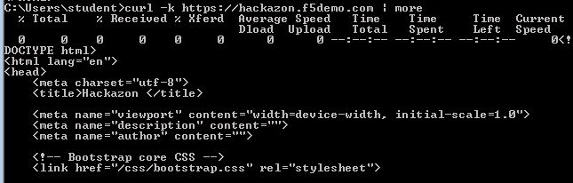
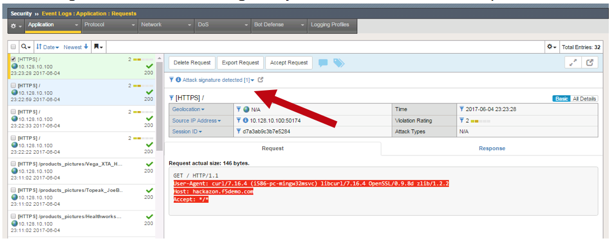
.. |image29| image:: media/image31.png
   :width: 5.30000in
   :height: 2.87000in
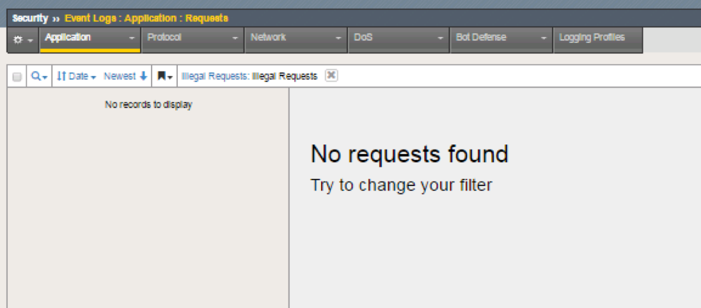
.. |image31| image:: media/image33.png
   :width: 5.30000in
   :height: 2.04000in
.. |image32| image:: media/image34.png
   :width: 5.30000in
   :height: 1.62000in

.. |image34| image:: media/image35.png
   :width: 5.30000in
   :height: 2.91000in

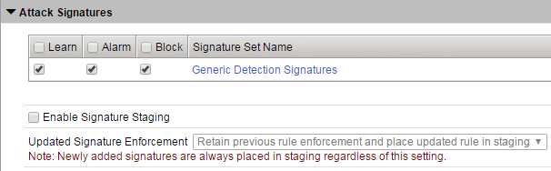
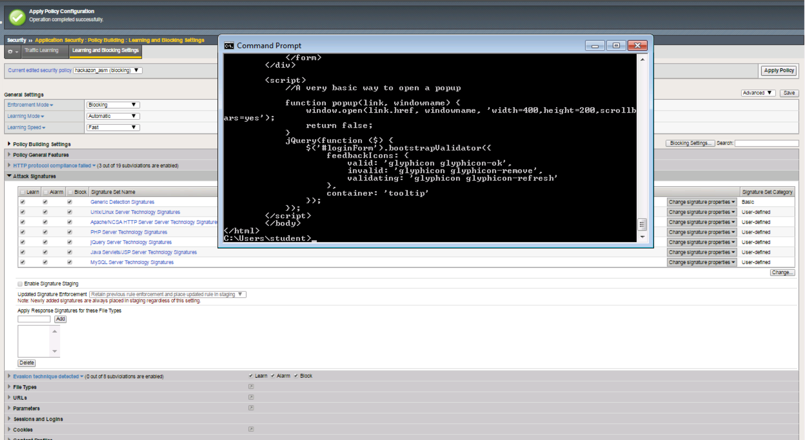
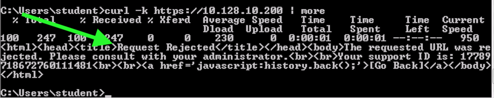
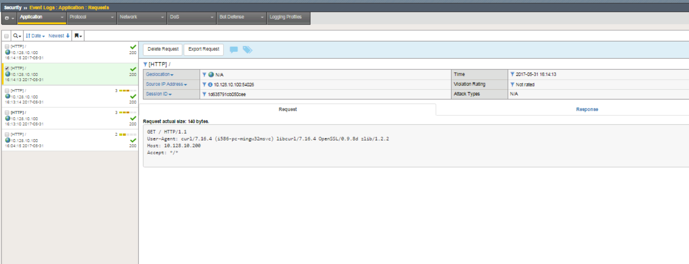
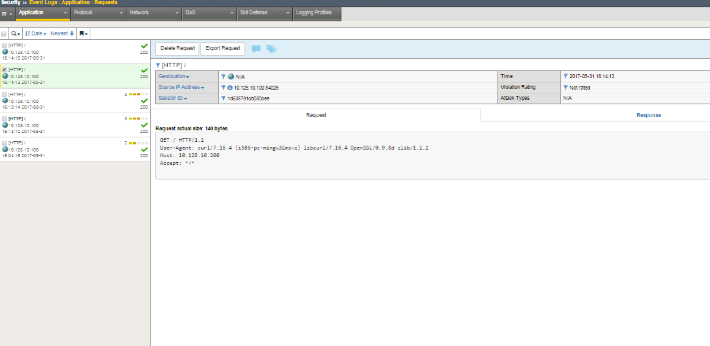
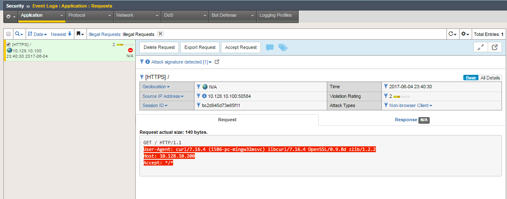
.. |image42| image:: media/image42.png
   :width: 5.30000in
   :height: 2.81000in
.. |image43| image:: media/image43.png
   :width: 5.30000in
   :height: 1.80000in
.. |image44| image:: media/image44.png
   :width: 5.30000in
   :height: 5.88000in
.. |image45| image:: media/image45.png
   :width: 5.30000in
   :height: 2.02000in
.. |image46| image:: media/image46.png
   :width: 5.30000in
   :height: 3.06000in
.. |image47| image:: media/image47.png
   :width: 5.30000in
   :height: 5.91000in
.. |image48| image:: media/image48.png
   :width: 5.30000in
   :height: 1.30000in
.. |image49| image:: media/image49.png
   :width: 5.30000in
   :height: 3.32000in
.. |image50| image:: media/image50.png
   :width: 5.30000in
   :height: 3.53000in
.. |image51| image:: media/image51.png
   :width: 5.30000in
   :height: 3.22000in
.. |image52| image:: media/image52.png
   :width: 5.30000in
   :height: 3.96000in
.. |image53| image:: media/image53.png
   :width: 5.30000in
   :height: 4.46000in
.. |image54| image:: media/image54.png
   :width: 5.30000in
   :height: 2.95000in
.. |image55| image:: media/image55.png
   :width: 5.30000in
   :height: 1.86000in
.. |image56| image:: media/image56.png
   :width: 5.30000in
   :height: 2.97000in
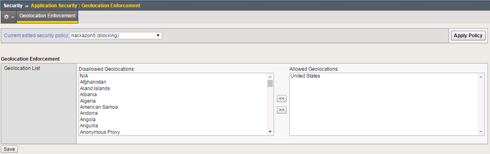
.. |image58| image:: media/image58.png
   :width: 5.30000in
   :height: 1.10000in
.. |image59| image:: media/image59.png
   :width: 5.30000in
   :height: 0.95000in
.. |image60| image:: media/image60.png
   :width: 5.30000in
   :height: 1.33000in
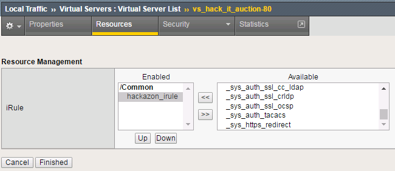
.. |image62| image:: media/image62.png
   :width: 5.30000in
   :height: 1.68000in
.. |image63| image:: media/image63.png
   :width: 5.30000in
   :height: 1.34000in
.. |image64| image:: media/image64.png
   :width: 5.30000in
   :height: 2.16000in
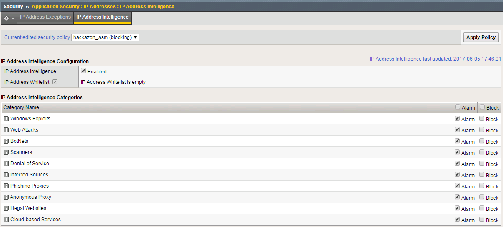
.. |image66| image:: media/image66.png
   :width: 5.30000in
   :height: 2.76000in
.. |image67| image:: media/image67.png
   :width: 5.30000in
   :height: 2.79000in
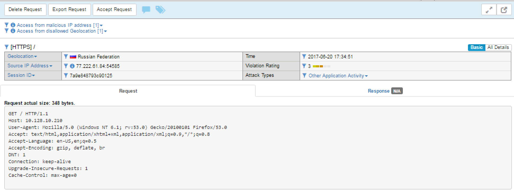
.. |image69| image:: media/image69.png
   :width: 5.30000in
   :height: 2.84000in
.. |image70| image:: media/image70.png
   :width: 5.30000in
   :height: 3.92000in
.. |image71| image:: media/image71.png
   :width: 5.30000in
   :height: 2.27000in
.. |image72| image:: media/image72.png
   :width: 5.30000in
   :height: 2.10000in
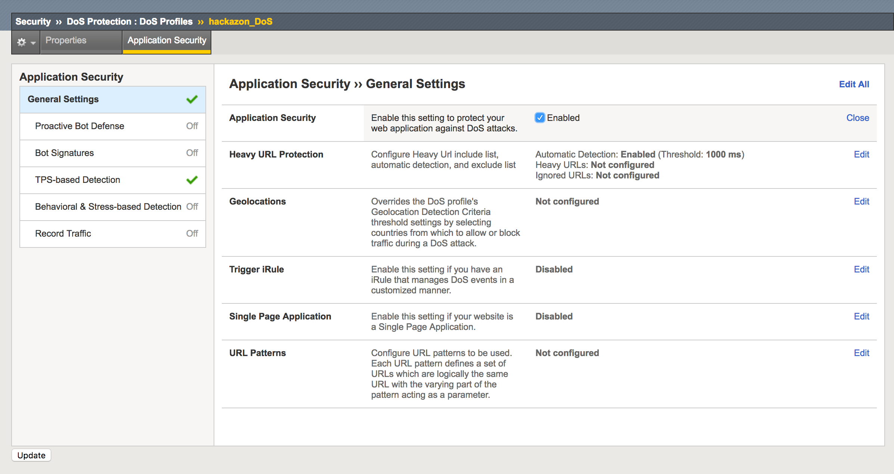
.. |image74| image:: media/image74.png
   :width: 5.30000in
   :height: 3.00000in
.. |image75| image:: media/image75.tiff
   :width: 5.30000in
   :height: 3.43000in
.. |image76| image:: media/image76.tiff
   :width: 5.30000in
   :height: 0.42000in
.. |image77| image:: media/image77.tiff
   :width: 5.30000in
   :height: 0.94000in
.. |image78| image:: media/image78.tiff
   :width: 5.30000in
   :height: 3.68000in
.. |image79| image:: media/image79.tiff
   :width: 5.30000in
   :height: 3.68000in
.. |image80| image:: media/image80.tiff
   :width: 5.30000in
   :height: 3.20000in
.. |image81| image:: media/image81.tiff
   :width: 5.30000in
   :height: 3.35000in
