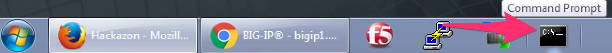
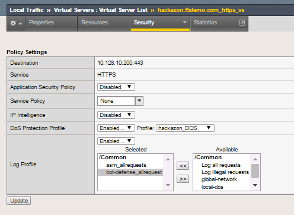
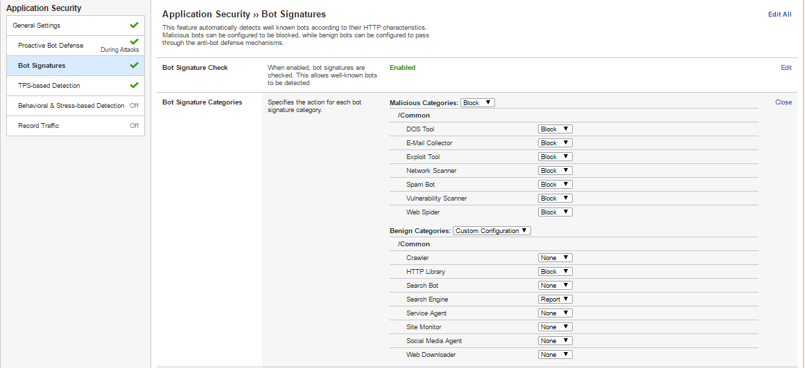
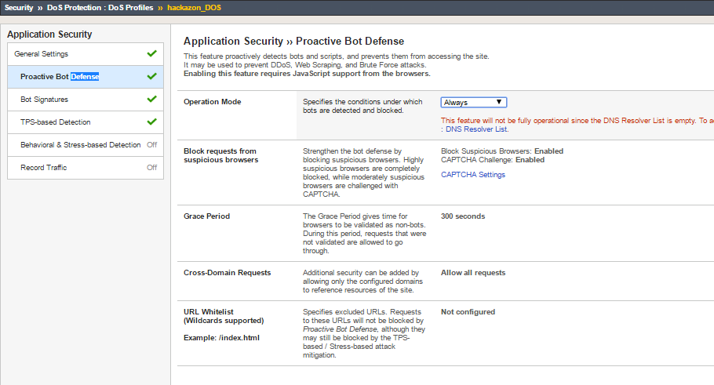

F5 WAF; Practical Intro to L7 Security – F5 Agility 2017

Participant Hands-on Lab Guide

|image0|

Last Updated: Monday, June 6, 2017

©2017 F5 Networks, Inc. All rights reserved. F5, F5 Networks, and the F5
logo are trademarks of F5 Networks, Inc. in the U.S. and in certain
other countries. Other F5 trademarks are identified at f5.com.

Any other products, services, or company names referenced herein may be
trademarks of their respective owners with no endorsement or
affiliation, express or implied, claimed by F5.

+----+
+----+

\ **Table of Contents**

Objective: 4

Create Policy 4

Configure Policy 5

Accept Remaining Default Policy Settings 6

Verify ASM Profile is Applied 7

Create Application Security Logging Profile 7

Apply ASM Logging Profile 8

Test ASM Policy 9

Review Server Technologies 11

Objective: 12

Demonstrate a False Positive 12

Objective: 21

Parameter Enforcement 21

Geolocation 22

IP Reputation 26

Objective: 29

Create Policy 29

Configure Policy 30

Apply Proactive Bot Defense Policy 32

Create Bot Defense Logging Profile 33

Apply Bot Defense Logging Profile 33

Test the Proactive Bot Defense Policy 34

Validate that the Proactive Bot Defense Policy is Working 35

BOT Signatures 36

*
*\ *Lab Network Overview*
=========================

Each student will have access to a Windows 7 “Jumpbox”. Information
required to gain RDP access to the Jumpbox will be provided in each
session.

Each student will have a BIG-IP VE environment with IP addressing as
below:

    10.0.0.0/24 – Management Subnet

    10.0.0.4/24 – BIGIP mgmt IP

    10.0.0.100/24 – Win7 “Jumpbox” mgmt IP

    10.128.10.0/24 – External Subnet

    10.128.10.200 – auction.f5demo.com virtual server

    10.128.20.0/24 – Internal Subnet

    10.128.20.245 – BIGIP self IP

    10.128.20.210 – Hackazon.f5demo.com webserver

All operations in this lab will be performed from within a Windows 7
“Jumpbox” running in the cloud, which you’ll reach using a Microsoft
Remote Desktop Connection client running on your personal workstation.
Lab instructors will provide a hostname for you to use to access your
personal lab environment.

**Important: If you are using a *VPN client* inform your instructors. We
are using an IP filter on the cloud environment that restricts access**
**to known IP’s.**

+---------------------+--------------+----------------+
| *Device*            | *Username*   | *Password*     |
+=====================+==============+================+
| Windows 7 Jumpbox   | student      | 401elliottW!   |
+---------------------+--------------+----------------+
| BIG-IP (HTTPS)      | admin        | 401elliottW!   |
+---------------------+--------------+----------------+
| BIG-IP (SSH)        | root         | 401elliottW!   |
+---------------------+--------------+----------------+

Please use the **Chrome web browser** to access the BIG-IP Configuration
Utility (WebUI) which is accessible at: https://10.128.1.245.

Exercise 1 – Base Policy Creation

Objective:
----------

-  Create a security policy using manual policy building

-  Enable application security logging profile

-  Validate that both the policy and logging profile are working

-  Review the auto-detection of web server capabilities (i.e. Apache,
   jQuery, etc)

-  Estimated time for completion: **30 minutes**

   This lab will demonstrate how to create and build a security policy
   using manual policy building.

   Before we begin, ensure that you have three virtual servers,
   \ **hackazon.f5demo.com\_https\_vs**,
   **hackazon.f5demo.com\_http\_vs**, and
   **ip\_rep\_target\_https\_vs**. You will be working primarily with
   **hackazon.f5demo.com\_https\_vs**. Screenshot below:

   |image1|

Create Policy
-------------

1. On the Main tab, click \ **Security** > **Application
   Security** > **Security Policies**. The Active Policies screen opens.

2. Click on **“Policies List”**

   |image2|

3. Click the \ **Create New Policy** button. The policy creation wizard
   opens.

|image3|

Configure Policy
----------------

1. Click the **Advanced** button (Top-Right) to ensure that all the
   available policy creation options are displayed.

2. Name the security policy “\ **hackazon\_asm**\ ” and ensure that
   the \ **Policy Type** is **Security**.

3. Verify the **Policy Template** is set to Fundamental.

4. Assign this policy to the “\ **hackazon.f5demo.com\_https\_vs**\ ”
   from the \ **Virtual Server** drop down.

5. (This is required to set the Learning Mode, why might this be
   necessary?)

6. Go back up two settings to \ **Learning Mode** and set it
   to \ **Manual**.

7. Set the **Enforcement Mode** to Transparent

1. 
2. 

1. 

Accept Remaining Default Policy Settings
----------------------------------------

**Your settings should reflect this figure:**\ |image4|

1. Click \ **Create Policy** to complete the policy creation process.

2. After policy creation is complete, the properties will be displayed
   for review within the Policies List menu.

3. Click **Apply** while the **hackazon\_asm** policy is selected.

    **NOTE:** ASM behaves differently than LTM regarding changes. When
    editing BIG-IP LTM Configurations in the Configuration Utility (Web
    UI) changes are saved and applied immediately. In BIG-IP ASM,
    changes **must be saved first** and then at the time of the
    Administrator's choosing, they can be Applied (or activated) to
    BIG-IP ASM. This can be viewed as a "Deferred Commit" behavior. ASM
    allows for rollbacks of configuration.

|image5|

Verify ASM Profile is Applied
-----------------------------

1. Under \ **Local Traffic** > **Virtual Servers**, click
   on \ **hackazon.f5demo.com\_https\_vs**.

2. Click on \ **Policies** under the \ **Security** tab at the top of
   the \ **hackazon.f5demo.com\_https\_vs** details menu.

3. In the \ **Application Security Policy** drop down menu, ensure
   Application Security Policy is **Enabled...** and the **Policy:**
   drop-down selection shows the hackazon\_asm policy.

4. 
5. Notice Log Profile is set to **Disabled**

6. 

Create Application Security Logging Profile
-------------------------------------------

1. In the Configuration Utility, navigate to:  **Security** > **Event
   Logs** > **Logging Profiles** then **click the plus icon**.

2. Enter a Profile Name \ **asm\_allrequests**, select the checkbox
   for \ **Application Security**.

3. Change the \ **Configuration** dropdown to \ **Advanced** under
   the \ **Application Security** logging section, and then set
   the \ **Response Logging** dropdown to: “\ **For All Requests”**.

4. Change the \ **Request Type** under **Storage Filter** to **All
   Requests**. Click \ **Finished**.

    |image6|

**Question:** Would logging all requests and responses in a production
environment be a best practice?

Apply ASM Logging Profile
-------------------------

1. Under \ **Local Traffic** > **Virtual Servers**, click
   on \ **hackazon.f5demo.com\_https\_vs**.

2. Click on \ **Policies** under the \ **Security** tab at the top of
   the \ **hackazon.f5demo.com\_https\_vs** details menu.

3. In the \ **Log Profile** drop down menu, select \ **Enabled...**.

4. Within the Available logging profiles menu,
   select \ **asm\_allrequests** and then click the \ **<<** arrows to
   move the logging policy to the \ **Selected** profile.

5. Click on the \ **Update** button to apply the policy.

   |image7|

Test ASM Policy
---------------

1. Open Firefox and navigate to https://hackazon.f5demo.com

2. *(You'll find a toolbar shortcut for the Hackazon link and this can
   be used.)*

   |image8|

3. Interact with the application by clicking the Hackazon logo and any
   of the items under the Special Selection title that appear on the
   front page. **Please** refrain from experimenting with the site using
   any "exploit" techniques that you might be familiar with.

4. 
5. On the BIG-IP, navigate to **Security > Event Logs > Application >
   Requests** and verify that requests are being observed.

6. **Tip:** You will need to clear the “Illegal Requests” only filter:

   |image9|

   You should be able to see both the raw client request and server
   response for the event that you selected.

   **For** **example:**

   |image10|

Review Server Technologies
~~~~~~~~~~~~~~~~~~~~~~~~~~

1. On the BIG-IP, navigate to **Security > Application Security > Policy
   Building > Traffic Learning**

2. You will see that ASM has detected 4 or more Server Technologies just
   from the site browsing you did in the previous section.

   |image11|

3. Select all the **Add Server Technology recommendations** and click
   **Accept Suggestions**.

4. Be sure to click “Apply Policy at the top right:

   |image12|

   **Question:** What about the other suggestion regarding “Add Valid
   Host Name”? Should this be accepted, why or why not?

   **Question:** How does accepting Server Technologies affect
   Signatures?

Exercise 2 – False Positive Scenarios

Objective:
----------

-  
-  
-  Demonstrate False Positive (FP) meta violation

-  Signature and Parameter staging behavior

-  Identify FP in event viewer, review learning suggestions, modify,
   test

-  
-  Estimated time for completion: **30 minutes**

Demonstrate a False Positive
----------------------------

**Transition to Blocking**

1. Navigate to **Security** **>** **Application Security** **>**
   **Policy Building** **>** **Learning and Blocking Settings**

2. Under General Settings change the Enforcement Mode to Blocking.

   |image13|

3. Click **Save**

4. 
5. and then click **Apply** **Policy**

   **Use cURL to retrieve the web content**

6. On the jump host, you'll find a toolbar shortcut as shown for the
   Windows Command Prompt. Please click that shortcut to open a Windows
   Command Shell:\ |image14|

   From the command line execute the command:

   **curl** **-k** **https://hackazon.f5demo.com** **\| more**

7. 

|image15|

You may need to scroll back/forward to see all the output.

**Question**: cURL is an awesome tool with dozens of options. Try: curl
--help for a full listing.

What is the purpose of the “-k” option?

1. Review the log at **Security** **>** **Event Logs** **>**
   **Application** **>** **Requests** and find the “Attack Signature
   Detected” event for your request.

2. Don’t forget to **remove**

3. **the “illegal requests filter”** to view “all requests”.

   |image16|

4. In the log click the “down arrow” next to the “Attack Signature
   Detected” title:

   |image17|

   **Questions:** Based on the output answer the following:

    What aspect of the request triggered ASM?

    Why did you not receive the block page?

1. Navigate to **Security** **>** **Application Security** **>**
   **Policy Building** **>** **Learning and Blocking Settings** and in
   the Attack Signatures section (Click the triangle to expand) uncheck
   “Signature Staging.” Be certain to click both save and apply policy.

    |image18|

1. Return to your command prompt and execute the command using the ip
   address instead: **curl -k** **https://10.128.10.200** **\| more**

   **Question:** What is different about this request from the previous?
   Is an IP address treated differently from a FQDN? Why did removing
   the signatures from staging cause the block page to now appear?

    |image19|

1. Make a note of the last four digits of the Support ID returned to
   cURL in the blocking response page.

2. Go to **Security** **>** **Event Logs** **>** **Application** **>**
   **Requests. You should now see an Illegal Request. **

    |image20|

NOTE: In a production environment you may have thousands of blocked
events and you will need to respond to issues quickly. Searching via the
support ID is the fastest way to achieve this.

1. Click the magnifying glass. In the pop out box enter the last four
   digits of the Support ID you noted previously and click “Apply
   Filter.”

    |image21|

1. Review the log entry after clicking “All Details.”

   |image22|

   **SQL Injection**

1. From your Firefox window, open a New Private Window as shown in the
   screenshot and then open URL: **https://hackazon.f5.demo.com** using
   the Hackazon shortcut in the toolbar.

   |image23|

2. In the top right click “Sign In” and type in the following string in
   the username field: “\ **or 1=1#**\ ” Enter “a” in the password
   field, and click Sign In. (Without quotes)

|image24|

**Question:** Did you receive the block page? If not, why do you think
you were not blocked? (*Answer: At this point, we do not expect the
traffic to be blocked. This will be clarified later in the lab*)

1. In the Configuration Utility, open the **Security** **>**
   **Application Security** **>** **Policy Building** **>** **Traffic
   Learning.**

   There may be several Suggestions listed. The Username field in the
   login pop up, uses the parameter name “username”. Please review the
   related suggestions, there are two related to the SQL injection, and
   note the signature ID’s.

    |image25|

    Select the request and then click the down arrow to the right of the
    “Attack Signature Detected”

    |image26|

    This will expand the view to include information about why the
    signature triggered. You can see the Applied Blocking Setting is
    “Staged.”

    |image27|

+----+
+----+

    **Question:** This alert is triggered by the signature but in what
    context per the above screen shot? How is a parameter treated
    differently from a signature?

Exercise 3 – Adding Context

Objective:
----------

-  Enforce Parameter

-  Review Geolocation

-  Review IP Intelligence

-  Estimated time for completion: **30 minutes**

Parameter Enforcement
---------------------

1. Open **Security** **>** **Application Security** **>** **Parameters**
   **>** **Parameters List.** You will see that the wildcard parameter
   “\*” is still in staging:

   |image28|

2. Check the box next to **\*** and then click **Enforce**, Accept the
   browser popup confirmation, and then **Apply Policy**.

   |image29|

1. Open a new private browsing window in Firefox and go to
   https://hackazon.f5demo.com Click **Sign-In** on the top right and
   use the same information from step 15 in Lab 2 to login. You should
   receive the block page at this point. Close the Firefox window and
   return to the BIG-IP Administrative Interface.

2. Go to **Local Traffic** **>** **Profiles** **> Services** **>**
   **HTTP** and click **Create**.

|image30|

1. In the new profile complete the following:

-  Name: hackazon\_http\_profile

-  Check **Accept XFF**

    Click **Finished**.

1. Go to **Local Traffic** **>** **Virtual Servers** and click on
   **hackazon.f5demo.com\_https\_vs** and change the HTTP Profile to
   **hackazon\_http\_profile** and click Update.

|image31|

1. In your Security Policy, **“Security** **>** **Application Security >
   Policy > PolicyProperties“** adjust the view from **Basic to
   Advanced**

2. check the box next to **Trust XFF Header** (Navigate to Security ->
   Application Security -> Policy -> Policy Properties.

3. 

|image32|

|image33|

NOTE: Keep in mind that for XFF to work correctly it must be set in both
the ASM policy and the HTTP profile. This may seem redundant however the
HTTP profile occurs earlier in the order of operations than the ASM
policy. The HTTP profile is simply adding the header whereas the setting
in ASM is to trust that header. What would be an example of a situation
where you might need to trust a 3\ :sup:`rd` part XFF header (set before
the BIG-IP)?

+----+
+----+

Geolocation
-----------

1. Open **Security** **>** **Application Security** **>** **Geolocation
   Enforcement**

2. Select all geolocations **except the United States and N/A** and move
   them to Disallowed Geolocations. **Save** and then **Apply Policy**.

    NOTE: N/A covers all RFC1918 addresses. If you aren’t dropping them
    at your border router (layer 3), you may decide to geo-enforce at
    ASM (Layer 7) if no private IP’s will be accessing the site.

|image34|

1. Open **Local Traffic** **>** **iRules** and open the iRule titled
   hackazon\_irule and review the code.

2. 

NOTE: The above iRule is essentially scanning the HTTP headers and when
it finds the X-Forwarded-For header it will replace the original source
IP address with a randomized IP address. Since we are only manipulating
the header this has no discernable affect on traffic flow. This iRule
event, when HTTP\_REQUEST, also fires before the ASM policy allowing
this “trick” to work to demonstrate a global range of source IP
addresses.

|image35|

1. Open **Local Traffic** **>** **Virtual Servers** and click on
   **hackazon.f5demo.com\_https\_vs**. Go to the **Resources**
   horizontal tab and click on **Manage** in the iRules section.

|image36|

1. Select the hackazon\_irule, move it to the **Enabled** assignment and
   click **Finished**.

|image37|

1. In a **new Firefox Private Browsing window** connect to
   **https://hackazon.f5demo.com.** You may need to connect more than
   once to receive the block page, make a note of the last four digits
   of the Support ID. Why did you receive the block page?

2. In the BIG-IP Administrative Interface go to **Security** **>**
   **Event Logs** **>** **Application** **>** **Requests** and click on
   the magnifying glass to expand the search filter. Enter the Support
   ID and click **Apply Filter**.

|image38|

Notice the geolocation detected and the presence of the X-Forwarded-For
(XFF) in the Request details. Your actual client IP is still
10.128.10.100 however, because we trusted the XFF header and the iRule
is randomizing the IP address placed in that header.

ASM believes the request is from an external location to provide a more
realistic example. Depending on your network you may be leveraging a
technology that creates a source NAT ahead of ASM so by leveraging the
XFF you can work around this and get contextual information about the
client.

|image39|

**IMPORTANT – Please remove the** **iRule hackazon\_irule** **from the
Virtual Server before proceeding to the next step. (Virtual Server >
Resources)**

IP Reputation
-------------

1. Navigate to **Security > Application Security > IP Addresses > IP
   Address Intelligence** and click **Enabled**. For all categories
   **select Alarm**. Click on **Save** and then on **Apply Policy**.

   NOTE: On the top right you should see that your IP Intelligence
   database has been updated at some point.

|image40|

NOTE: In order to create traffic with malicious sources for purposes of
this lab we have created some additional configuration for you.

There is a Virtual Server (VS) called ip\_rep\_target\_https\_vs which
has a SNAT pool predefined with 5 known malicious IP addresses.

There is an iRule applied to that VS which then points the traffic to
the VS you have been working on hackazon.f5demo.com\_https\_vs which has
your ASM policy applied. This configuration will cause ASM to see the
inbound traffic as having the malicious sources.

+----+
+----+

1. Please review the Virtual Server configuration for
   ip\_rep\_target\_https\_vs. No changes are needed. Also, please
   review the iRule assigned under the VS Resource tab.

2. Open a new private browsing window in Firefox and use the bookmark
   for **IP Rep Lab** to browse the site. Click on one or two items
   until you get the block page.

   |image41|

3. Navigate to **Security > Event Logs > Application > Requests** and
   review the log entries. Since you configured IP Intelligence
   violations to alarm you will not need change the filter. Select the
   most recent entry and examine why the request is illegal. What IP
   address did the request come from?

|image42|

+-----------------------------------------------------------------------------------------------------------------------------------------------------------------------------------------------------------------------------------+
| **Bonus:** You can browse to http://www.brightcloud.com/tools/url-ip-lookup.php and look up the IP address in question for further information. There is also a tool to report IP addresses that have been incorrectly flagged.   |
|                                                                                                                                                                                                                                   |
| Further, you can use Putty on the Win7 box to access the BIG-IP via SSH (bookmarked as F5-WAF) and login with root / 401elliottW! to run the iprep\_lookup command, similar to:                                                   |
|                                                                                                                                                                                                                                   |
| [root@bigip1:Active:Standalone] config # iprep\_lookup 77.222.40.121                                                                                                                                                              |
|                                                                                                                                                                                                                                   |
| opening database in /var/IpRep/F5IpRep.dat                                                                                                                                                                                        |
|                                                                                                                                                                                                                                   |
| size of IP reputation database = 39492859                                                                                                                                                                                         |
|                                                                                                                                                                                                                                   |
| iprep threats list for ip = 77.222.40.121 is:                                                                                                                                                                                     |
|                                                                                                                                                                                                                                   |
| bit 7 - Phishing                                                                                                                                                                                                                  |
|                                                                                                                                                                                                                                   |
| bit 8 - Proxy                                                                                                                                                                                                                     |
+===================================================================================================================================================================================================================================+
+-----------------------------------------------------------------------------------------------------------------------------------------------------------------------------------------------------------------------------------+

1. Close the Firefox Private Browsing window.

Exercise 4 – Proactive Bot Defense

Objective:
----------

-  Create a DoS profile

-  Enable proactive bot defense

-  Apply the policy to the appropriate virtual server

-  Validate that the policy is working as expected

-  Estimated time for completion: **20** **minutes**

Create Policy
-------------

1. IMPORTANT – To clearly demonstrate just the Bot Defense profile,
   please **disable** **the Application Security Policy from the**
   **hackazon.f5demo.com\_https\_vs virtual server!**

2. Run the following curl command to verify the site is loading without
   issue from this headless browser. If the curl command is not
   successful (you are getting a “request rejected” error page), please
   let an instructor know.

    curl –k https://hackazon.f5demo.com \| more

    |image43|

1. On the Main tab, click \ **Security** > **DoS Protection** > **DoS
   Profiles**. The DoS Profiles screen opens.

    |image44|

1. Click on the **“Create”** button.

2. Name the policy “hackazon\_DoS” and click “\ **Finished**\ ” to
   complete the creation of this DoS profile.

    |image45|

Configure Policy
----------------

1. **Click** the newly created “hackazon\_DoS” profile listed under the
   **“Security > Dos Protection > DoS Profiles”** list.

2. The profile’s properties menu will be displayed initially. **Click**
   on the **“Application Security”** tab at the top of this menu to
   begin configuring the policy.

   |image46|

3. Under the **“Application Security** **tab** **>> General Settings,”**
   click the **“Edit”** link on the right-hand side of General Settings
   box and then check the “Enabled” check box for **“Application
   Security”** to enable the DoS profile and allow additional settings
   to be configured.

   |image47|

4. Select **“Proactive Bot Defense”** under the list of **“Application
   Security”** options for this DoS profile.

5. Click the “\ **Edit**\ ” link on the right for the **“Application
   Security >> Proactive Bot Defense”** menu and select **“Always”**
   from the drop-down menu for **“Operation Mode”**.

   |image48|

6. Notice that for **“Block requests from suspicious browsers”** the
   **“Block Suspicious Browsers”** setting is enabled by default.

7. Click the “\ **Update**\ ” button to complete the Proactive Bot
   Defense hackazon\_DoS profile.

Apply Proactive Bot Defense Policy
----------------------------------

1. Under \ **Local Traffic** > **Virtual Servers**, click
   on \ **hackazon.f5demo.com\_https\_vs**.

2. Click on \ **Policies** under the \ **Security** tab at the top of
   the \ **hackazon.f5demo.com\_https\_vs** details menu.

3. In the \ **DoS Protection Profile** drop down menu,
   select \ **Enabled...** and then select the **“hackazon\_DoS”** for
   the profile.

4. Click on the \ **Update** button to apply the policy.

   |image49|

Create Bot Defense Logging Profile
----------------------------------

1. Open a new tab for the Configuration Utility and navigate to:
    **Security** > **Event Logs** > **Logging Profiles** then **click
   the plus icon**.

2. Enter a Profile Name \ **bot-defense\_allrequests**, select the
   checkbox for \ **Bot Defense**.

3. Under the \ **Bot Defense** logging section, select the checkboxes
   for the following: **Local Publisher**, **Log Illegal Requests**, and
   **Log Challenged Requests**.

4. Click \ **Finished**.

    NOTE: You could have also modified the existing asm\_allrequests
    logging profile and added DoS logging definitions.

|image50|

Apply Bot Defense Logging Profile
---------------------------------

1. Under \ **Local Traffic** > **Virtual Servers**, click
   on \ **hackazon.f5demo.com\_https\_vs**.

2. Click on \ **Policies** under the \ **Security** tab at the top

3. 
4. Within the Available logging profiles menu,
   select \ **bot-defense\_allrequests** and then click
   the \ **<<** arrows to move the logging policy to
   the \ **Selected** profile.

5. Click on the \ **Update** button to apply the policy.

+----+
+----+

    NOTE: You can associate multiple logging profiles with a given
    virtual server. F5 allows for an incredible amount of logging
    flexibility. Most commonly you would have DoS, Bot Defense and ASM
    Security Policy events logged to a centralized SIEM platform, but
    there may be additional logging requirements such as a web team that
    would be interested in Bot Defense logs solely, while the SIEM
    continues to receive the union of DoS, Bot Defense and ASM Security
    Policy events.

    |image51|

Test the Proactive Bot Defense Policy
-------------------------------------

1. 
2. From the command line execute the following command several times:

    curl –k https://hackazon.f5demo.com

    NOTE: This can take a few minutes and you may get several empty
    responses as shown.

    After a few moments the PBD will initialize and you will Because
    Proactive BOT Defense is always on, this tool will always be
    blocked.

    |image52|

Validate that the Proactive Bot Defense Policy is Working
---------------------------------------------------------

1. Navigate to **Security** > **Event Logs** > **Bot Defense** >
   **Requests**.

    |image53|

1. Notice that the detected bot activity has been logged and is now
   being displayed for review.

    |image54|

1. Note the stated reason for the request being blocked. You may have to
   scroll to the right to see this reason. What was the stated reason?

2. 

BOT Signatures 
---------------

1. **Navigate to Security >** **DoS Protection >** **DoS Profiles.**

   |image55|

2. **Click** on the **“hackazon\_DoS”** profile and then the
   **“Application Security”** tab to configure the policy.

    |image56|

1. **Select “Proactive Bot Defense**\ ” under the list of **“Application
   Security” options.**

2. In the **“Application Security >>** **Proactive Bot Defense”**
   section, click the **“Edit”** link for **“Operation** **Mode”** and
   then change the setting from **“Always”** to **“During Attack”** and
   click **“Update”** to complete the policy change.

   NOTE: Ignore the DNS Resolver warning

   |image57|

3. Run cURL again. :curl –k https://hackazon.f5demo.com.

   **The site should respond normally now every time.**

4. cURL is considered an **HTTP Library tool** and falls in **the Benign
   Category**.

+----+
+----+

NOTE: Just how benign are HTTP library tools? cURL can easily be
scripted in a variety of ways and can be used as a downloader to siphon
off data. Remember the famous media defined “hacking tool” that Snowden
used? wget? There are many use-cases where you simply do not want a tool
interacting with your site.

Selectively Blocking BOT Categories
-----------------------------------

1. 
2. Under your hackazon DoS profile in **“Application Security >> Bot
   Signatures”** click on the **“Edit”** link for the **“Bot Signature
   Categories”** section.

   |image58|

3. Change the HTTP Library action from **“None”** to **“Block”** under
   the **“Benign Categories”** section and click **“Update”** to apply
   the policy changes.

   |image59|\ 6. Run the curl command against the site.

4. 8. Run cURL again: curl –k https://hackazon.f5demo.com

   |image60|

5. Whammo!!!…as soon as the BOT is revealed…the connection is dropped.
   TLS doesn’t even establish.

6. 
7. Let’s say we actually DO want to allow cURL or another automated
   tool. We may have developers that rely on curl so let’s whitelist
   just that.

8. 
9. To Whitelist cURL:

1. 1. **Go to the Bot Signatures** **list** **and find curl**. Move it
   to disabled signatures and **click update. **

   u now receive an error. The connection is getting dropped as soon as
   curl is identified as the

   policy changes.

|image61|

Run the curl command again against the site.

1. 2. Run cURL again: curl –k https://hackazon.f5demo.com and you should
   be back in business. By now you should know the expected output.

2. | 3. Change HTTP Library to: **Report**
   | Remove CURL from the whitelist and set http libraries category to
     just report

3. |image62|

    4. Change Operation Mode to: **Normal**

    ot defense back to always and click update

|image63|

We are going to leverage the IPRep virtual server from the earlier lab
to get some randomness.

1. Run the cURL command several times: **curl –k https://10.128.10.210**

2. 

|image64|

1. 6. Review the event logs at **“Event Logs>>Bot Defense”** You will
   now see geo-data for the BOT connection attempts.

|image65|

1. Navigate to **“Security** **> Overview”** and review the default
   report elements.

2. Click **“Overview** **>** **Application** **>** **Traffic**\ ”:

|image66|

1. Take some time reviewing this screen and practice adding a new widget
   to see additional reporting elements:

|image67|

1. 
2. 
3. 
4. Click the **DoS tab** at the top. The DOS Visibility Screen loads.

5. 

    |image68|

NOTE: You may need to change your time in the Windows system tray for
accurate results.

Although there have not been any L7 DoS attacks some of the widgets
along the right contain statistics from the BOT mitigations.

1. Click the **“Analysis”** tab at the top and review the graphs
   available to you.

|image69|

1. Click the **“URL Latencies”** tab at the top and review the graphs
   available to you.

|image70|

1. Click the **“Custom Page”** tab at the top and review the graphs
   available to you.

   Please feel free to add widgets and/or explore the ASM interface
   further.

   This concludes this lab guide!

.. |image0| image:: media/image1.png
   :width: 1.93667in
   :height: 0.61667in
.. |image1| image:: media/image4.png
   :width: 6.40625in
   :height: 1.60156in
.. |image2| image:: media/image5.png
   :width: 5.81875in
   :height: 1.52742in
.. |image3| image:: media/image6.png
   :width: 5.87937in
   :height: 3.13315in
.. |image4| image:: media/image11.png
   :width: 6.50000in
   :height: 3.54931in
.. |image5| image:: media/image12.png
   :width: 6.50000in
   :height: 2.35833in
.. |image6| image:: media/image14.png
   :width: 6.50000in
   :height: 5.44653in
.. |image7| image:: media/image17.png
   :width: 6.50000in
   :height: 5.24444in
.. |image8| image:: media/image19.png
   :width: 5.00000in
   :height: 2.53125in
.. |image9| image:: media/image20.png
   :width: 6.50000in
   :height: 3.10278in
.. |image10| image:: media/image21.png
   :width: 6.50000in
   :height: 2.88681in
.. |image11| image:: media/image22.png
   :width: 6.50000in
   :height: 2.36458in
.. |image12| image:: media/image23.png
   :width: 5.63131in
   :height: 2.39391in
.. |image13| image:: media/image24.png
   :width: 4.61111in
   :height: 0.72222in

.. |image15| image:: media/image29.png
   :width: 6.50000in
   :height: 2.07569in
.. |image16| image:: media/image30.png
   :width: 6.50000in
   :height: 2.59236in
.. |image17| image:: media/image35.png
   :width: 6.43056in
   :height: 4.00000in
.. |image18| image:: media/image36.png
   :width: 5.19375in
   :height: 1.61139in
.. |image19| image:: media/image38.png
   :width: 6.50000in
   :height: 1.29792in
.. |image20| image:: media/image41.png
   :width: 6.50000in
   :height: 2.56319in
.. |image21| image:: media/image43.png
   :width: 6.50000in
   :height: 3.81458in
.. |image22| image:: media/image44.png
   :width: 6.50000in
   :height: 2.30625in
.. |image23| image:: media/image46.png
   :width: 2.93750in
   :height: 2.33164in
.. |image24| image:: media/image47.png
   :width: 2.71905in
   :height: 2.02593in
.. |image25| image:: media/image48.png
   :width: 6.19106in
   :height: 1.49419in
.. |image26| image:: media/image49.png
   :width: 6.50000in
   :height: 3.16667in
.. |image27| image:: media/image50.png
   :width: 5.61643in
   :height: 3.71882in
.. |image28| image:: media/image51.png
   :width: 6.50000in
   :height: 1.65972in
.. |image29| image:: media/image52.png
   :width: 6.50000in
   :height: 1.64514in
.. |image30| image:: media/image53.png
   :width: 6.50000in
   :height: 1.30347in
.. |image31| image:: media/image54.png
   :width: 2.80625in
   :height: 1.10505in
.. |image32| image:: media/image55.png
   :width: 3.05625in
   :height: 0.24174in
.. |image33| image:: media/image56.png
   :width: 6.50000in
   :height: 0.32847in
.. |image34| image:: media/image58.png
   :width: 6.50000in
   :height: 2.20208in
.. |image35| image:: media/image59.png
   :width: 6.50000in
   :height: 3.81250in
.. |image36| image:: media/image60.png
   :width: 6.50000in
   :height: 1.80833in
.. |image37| image:: media/image61.png
   :width: 6.50000in
   :height: 2.82014in
.. |image38| image:: media/image62.png
   :width: 4.30625in
   :height: 4.36998in
.. |image39| image:: media/image64.png
   :width: 6.50000in
   :height: 2.98403in
.. |image40| image:: media/image65.png
   :width: 6.50000in
   :height: 2.94306in
.. |image41| image:: media/image66.png
   :width: 2.77339in
   :height: 1.28638in
.. |image42| image:: media/image68.png
   :width: 6.50000in
   :height: 2.41667in
.. |image43| image:: media/image69.png
   :width: 6.50000in
   :height: 5.44375in
.. |image44| image:: media/image70.png
   :width: 4.30087in
   :height: 2.39266in
.. |image45| image:: media/image71.png
   :width: 5.55894in
   :height: 1.41598in
.. |image46| image:: media/image72.png
   :width: 6.33194in
   :height: 2.42980in
.. |image47| image:: media/image73.png
   :width: 6.41806in
   :height: 3.30032in
.. |image48| image:: media/image74.png
   :width: 6.35347in
   :height: 3.84931in
.. |image49| image:: media/image75.png
   :width: 6.31944in
   :height: 4.51389in
.. |image50| image:: media/image77.png
   :width: 6.50000in
   :height: 5.05278in

.. |image52| image:: media/image80.png
   :width: 6.49444in
   :height: 3.24722in
.. |image53| image:: media/image82.png
   :width: 5.00000in
   :height: 3.12500in
.. |image54| image:: media/image83.png
   :width: 6.49444in
   :height: 1.69861in
.. |image55| image:: media/image84.png
   :width: 5.58056in
   :height: 2.81736in
.. |image56| image:: media/image85.png
   :width: 6.49444in
   :height: 2.86042in
.. |image57| image:: media/image86.png
   :width: 6.50000in
   :height: 3.09514in
.. |image58| image:: media/image88.png
   :width: 6.50000in
   :height: 3.47708in

.. |image60| image:: media/image90.png
   :width: 6.50000in
   :height: 0.55833in
.. |image61| image:: media/image91.png
   :width: 4.17587in
   :height: 2.28736in
.. |image62| image:: media/image92.png
   :width: 6.50000in
   :height: 4.03125in

.. |image64| image:: media/image94.png
   :width: 6.50000in
   :height: 5.09583in
.. |image65| image:: media/image95.png
   :width: 6.50000in
   :height: 4.29306in
.. |image66| image:: media/image96.png
   :width: 6.50000in
   :height: 3.08889in
.. |image67| image:: media/image97.png
   :width: 6.50000in
   :height: 2.75833in
.. |image68| image:: media/image98.png
   :width: 6.50000in
   :height: 1.72361in
.. |image69| image:: media/image99.png
   :width: 6.50000in
   :height: 3.64722in
.. |image70| image:: media/image100.png
   :width: 6.50000in
   :height: 3.68750in
