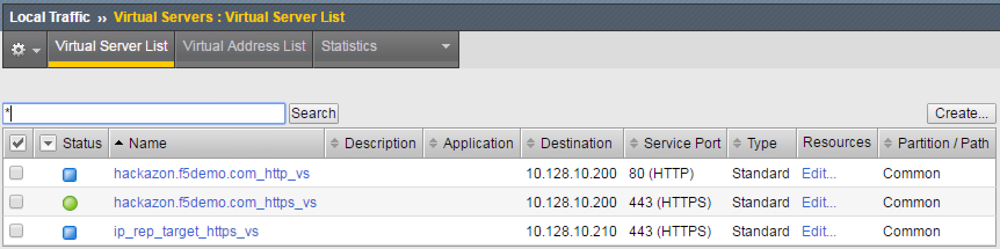
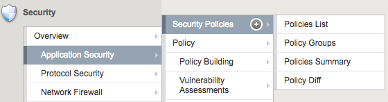
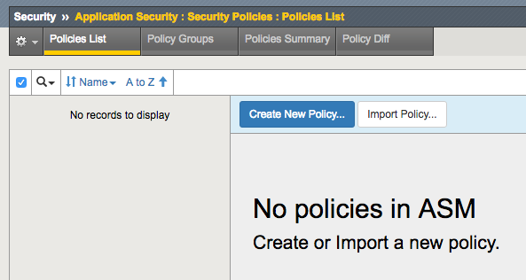
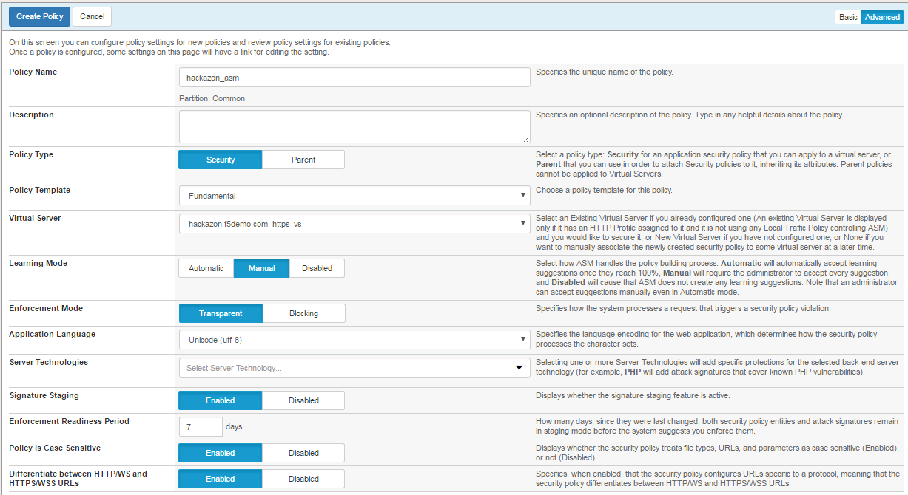
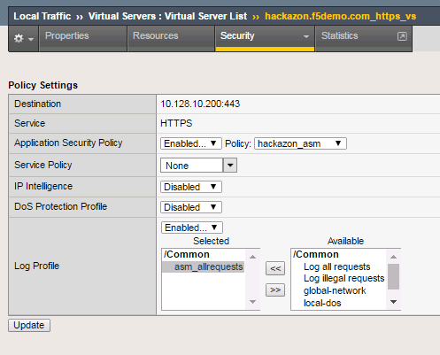
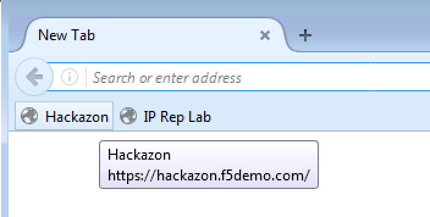
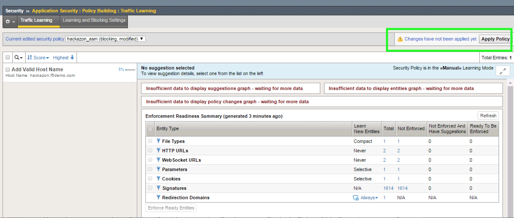

Module – Base Policy Creation
=============================

Objective:
----------

-  Create a security policy using manual policy building

-  Enable application security logging profile

-  Validate that both the policy and logging profile are working

-  Review the auto-detection of web server capabilities (i.e. Apache,
   jQuery, etc)

-  Estimated time for completion: **30 minutes**

   This lab will demonstrate how to create and build a security policy
   using manual policy building.

   Before we begin, ensure that you have three virtual servers,
   \ **hackazon.f5demo.com\_https\_vs**,
   **hackazon.f5demo.com\_http\_vs**, and
   **ip\_rep\_target\_https\_vs**. You will be working primarily with
   **hackazon.f5demo.com\_https\_vs**. Screenshot below:

   |image1|

Create Policy
-------------

1. On the Main tab, click \ **Security** > **Application
   Security** > **Security Policies**. The Active Policies screen opens.

2. Click on **“Policies List”**

   |image2|

3. Click the \ **Create New Policy** button. The policy creation wizard
   opens.

|image3|

Configure Policy
----------------

1. Click the **Advanced** button (Top-Right) to ensure that all the
   available policy creation options are displayed.

2. Name the security policy “\ **hackazon\_asm**\ ” and ensure that
   the \ **Policy Type** is **Security**.

3. Verify the **Policy Template** is set to Fundamental.

4. Assign this policy to the “\ **hackazon.f5demo.com\_https\_vs**\ ”
   from the \ **Virtual Server** drop down.

5. Set the Application Language to UTF-8 (This is required to set the Learning Mode, why might this be
   necessary?)

6. Go back up two settings to \ **Learning Mode** and set it
   to \ **Manual**.

7. Set the **Enforcement Mode** to Transparent

Accept Remaining Default Policy Settings
----------------------------------------

**Your settings should reflect this figure:** 

|image4|

1. Click \ **Create Policy** to complete the policy creation process.

2. After policy creation is complete, the properties will be displayed
   for review within the Policies List menu.

3. Click **Apply** while the **hackazon\_asm** policy is selected.

    **NOTE:** ASM behaves differently than LTM regarding changes. When
    editing BIG-IP LTM Configurations in the Configuration Utility (Web
    UI) changes are saved and applied immediately. In BIG-IP ASM,
    changes **must be saved first** and then at the time of the
    Administrator's choosing, they can be Applied (or activated) to
    BIG-IP ASM. This can be viewed as a "Deferred Commit" behavior. ASM
    allows for rollbacks of configuration.

|image5|

Verify ASM Profile is Applied
-----------------------------

1. Under \ **Local Traffic** > **Virtual Servers**, click
   on \ **hackazon.f5demo.com\_https\_vs**.

2. Click on \ **Policies** under the \ **Security** tab at the top of
   the \ **hackazon.f5demo.com\_https\_vs** details menu.

3. In the \ **Application Security Policy** drop down menu, ensure
   Application Security Policy is **Enabled...** and the **Policy:**
   drop-down selection shows the hackazon\_asm policy.

5. Notice Log Profile is set to **Disabled**

Create Application Security Logging Profile
-------------------------------------------

1. In the Configuration Utility, navigate to:  **Security** > **Event
   Logs** > **Logging Profiles** then **click the plus icon**.

2. Enter a Profile Name \ **asm\_allrequests**, select the checkbox
   for \ **Application Security**.

3. Change the \ **Configuration** dropdown to \ **Advanced** under
   the \ **Application Security** logging section, and then set
   the \ **Response Logging** dropdown to: “\ **For All Requests”**.

4. Change the \ **Request Type** under **Storage Filter** to **All
   Requests**. Click \ **Finished**.

    |image6|

**Question:** Would logging all requests and responses in a production
environment be a best practice?

Apply ASM Logging Profile
-------------------------

1. Under \ **Local Traffic** > **Virtual Servers**, click
   on \ **hackazon.f5demo.com\_https\_vs**.

2. Click on \ **Policies** under the \ **Security** tab at the top of
   the \ **hackazon.f5demo.com\_https\_vs** details menu.

3. In the \ **Log Profile** drop down menu, select \ **Enabled...**.

4. Within the Available logging profiles menu,
   select \ **asm\_allrequests** and then click the \ **<<** arrows to
   move the logging policy to the \ **Selected** profile.

5. Click on the \ **Update** button to apply the policy.

   |image7|

Test ASM Policy
---------------

1. Open Firefox and navigate to https://hackazon.f5demo.com

2. *(You'll find a toolbar shortcut for the Hackazon link and this can
   be used.)*

   |image8|

3. Interact with the application by clicking the Hackazon logo and any
   of the items under the Special Selection title that appear on the
   front page. **Please** refrain from experimenting with the site using
   any "exploit" techniques that you might be familiar with.

4. On the BIG-IP, navigate to **Security > Event Logs > Application >
   Requests** and verify that requests are being observed.

5. **Tip:** You will need to clear the “Illegal Requests” only filter:

   |image9|

   You should be able to see both the raw client request and server
   response for the event that you selected.

   **For** **example:**

   |image10|

Review Server Technologies
~~~~~~~~~~~~~~~~~~~~~~~~~~

1. On the BIG-IP, navigate to **Security > Application Security > Policy
   Building > Traffic Learning**

2. You will see that ASM has detected 4 or more Server Technologies just
   from the site browsing you did in the previous section.

   |image11|

3. Select all the **Add Server Technology recommendations** and click
   **Accept Suggestions**.

4. Be sure to click “Apply Policy at the top right:

   |image12|

   **Question:** What about the other suggestion regarding “Add Valid
   Host Name”? Should this be accepted, why or why not?

   **Question:** How does accepting Server Technologies affect
   Signatures?

.. |image0| image:: ../../_static/class1/image1.png

.. |image5| image:: ../../_static/class1/image12.png
   :width: 6.50000in
   :height: 2.35833in
.. |image6| image:: ../../_static/class1/image14.png
   :width: 6.50000in
   :height: 5.44653in

.. |image9| image:: ../../_static/class1/image20.png
   :width: 6.50000in
   :height: 3.10278in
.. |image10| image:: ../../_static/class1/image21.png
   :width: 6.50000in
   :height: 2.88681in
.. |image11| image:: ../../_static/class1/image22.png
   :width: 6.50000in
   :height: 2.36458in

.. toctree::
   :maxdepth: 1
   :glob:

