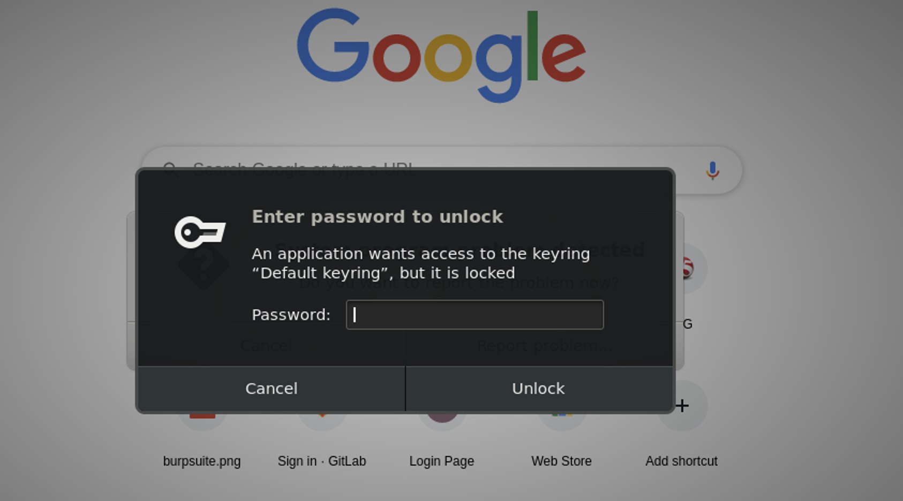
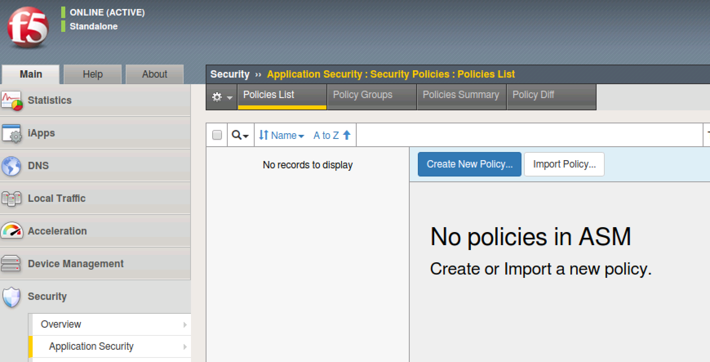
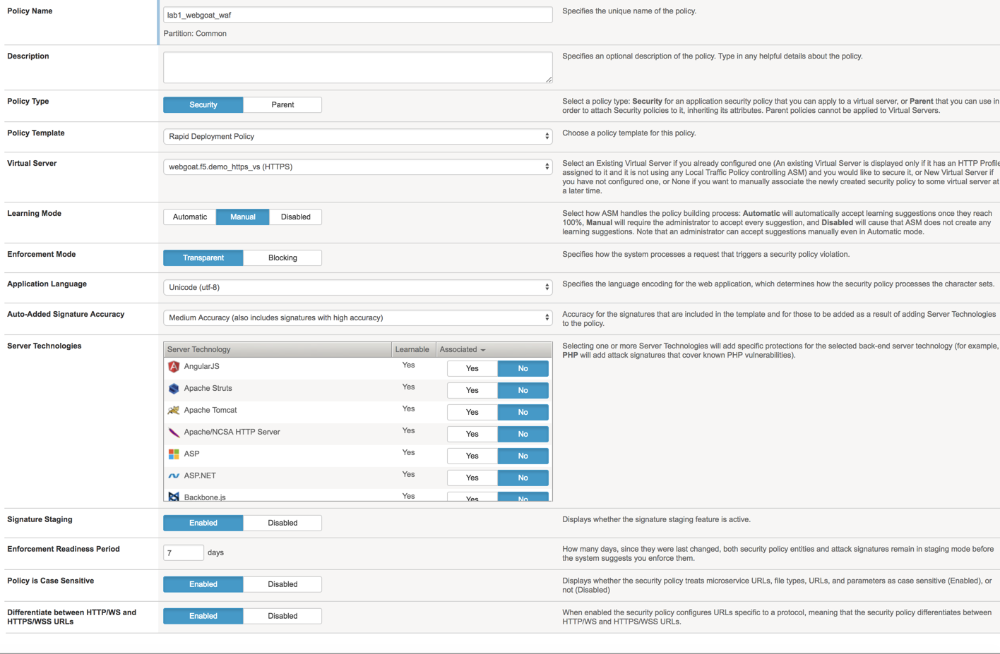
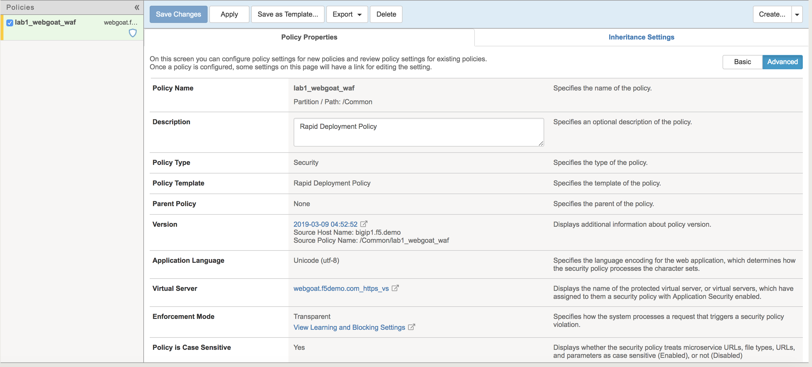
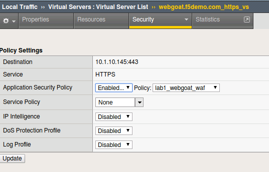
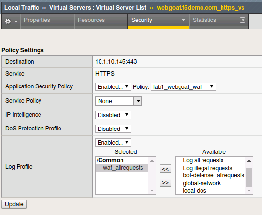

Exercise 1.1: IP Intelligence Policy
---------------------------------------
Objective
~~~~~~~~~

- Create an IPI policy.

- Enable application security logging profile.

- Validate that both the policy and logging profile are working.

- Configure Geolocation and review logs

- Configure IP Intelligence and review logs

- Estimated time for completion: **30** **minutes**.

#. RDP to client01, launch Chrome (please be patient and don't click the icon multiple times)

.. NOTE:: If the Operating system prompts you enter your password for keychain access, please enter the "f5student" password provided by your lab instructor. 

Chrome can take a few seconds to launch), click the BIG-IP bookmark and login to TMUI. admin/<password>. You may have to click Proceed to bypass a untrusted certicate.

Create Your 1st IPI Policy
~~~~~~~~~~~~~~~~~~~~~~~~~~~~~
An IPI policy can be created and applied globally, at the virtual server (VS) level or within the WAF policy itself. 
Often questions arise around what is the best way to implement. As always, the answer is; it depends. Implementing globally or at the VS level will provide the best 
performance and will use a seperate log file for violations but your security admins may not have this level of access to the BIG-IP. 
Often, a WAF admin can only modify WAF policies and not make changes to the VS and therefor would need to manage IPI inside of the WAF policy. 
When implementing within the WAF policy the blocking happens at layer 7 rather than layer 3 and any IPI violations will be in the WAF event logs with all the other alerts. 

In this lab we will configure and test the policy at the VS level and just explore the configuration options within the WAF policy. 

#. On the Main tab, click **Security > Application Security > Security Policies**. The Active Policies screen opens.
#. Click on the **Polices List**

#. Click on the **Create New Policy** button. The policy creation wizard opens.

#. Click on the **Advanced** button (Top-Right) to ensure that all the available policy creation options are displayed.

#. Name the security policy ``lab1_webgoat_waf`` and notice that the **Policy Type** is security.

#. Verify the **Policy Template** is set to ``Rapid Deployment Policy`` and notice it is a transparent security policy by default

#. Assign this policy to the ``webgoat.f5.demo_https_vs`` from the Virtual Server drop down.

#. Confirm that the Application Language is set to **UTF-8**.

#. Accept the remaining default policy settings and click **Create Policy** to complete the policy creation process.

.. Note:: After policy creation is complete, the properties will be displayed for review within the Policies List menu.

**Your settings should reflect the figures below:**

|
|

The resulting policy

|

Verify WAF Profile is Applied to Virtual Server
~~~~~~~~~~~~~~~~~~~~~~~~~~~~~~~~~~~~~~~~~~~~~~~~~~~~~
#. In the configuration utility navigate to **Local Traffic > Virtual Servers**, click on ``webgoat.f5.demo_https_vs``.

#. Click on **Policies** under the **Security** tab at the top of the ``webgoat.f5.demo_https_vs`` details menu.

#. In the **Application Security Policy** drop down menu, ensure **Application Security Policy** is ``Enabled...`` and the **Policy:** drop-down selection shows the ``lab1_webgoat_waf`` policy.

#. Notice Log Profile is set to ``Disabled``.

Create Application Security Logging Profile
~~~~~~~~~~~~~~~~~~~~~~~~~~~~~~~~~~~~~~~~~~~~~~~~~
#. In the configuration utility navigate to **Security > Event Logs > Logging Profiles** then click on the **plus** icon.

#. Under the **Logging Profile Properties** section enter a **Profile Name** ``waf_allrequests``, select the checkbox for ``Application Security``.

#. Change the **Configuration** dropdown to ``Advanced`` under the **Application Security** section.

#. Select the ``Local Storage`` value for the **Storage Destination** configuration option.

#. Select the ``For all Requests`` value for the **Response Logging** configuration option.

#. Select the ``All requests`` value for the **Request Type** configuration option.

#. Click **Create.**

  .. image:: images/module1Lab1Excercise1-image7.png
      :width: 600 px

**Question:** Would logging all requests and responses in a production environment be a best practice?

**Answer:** This adds 50% or more to the overhead on the log engine and would not typically be used outside of troubleshooting or high security environments that are appropriately sized.

Apply WAF Logging Profile
~~~~~~~~~~~~~~~~~~~~~~~~~~~~~~~
#. Under **Local Traffic > Virtual Servers**, click on ``webgoat.f5.demo_https_vs``.
#. Click on **Policies** under the **Security** tab at the top of the ``webgoat.f5.demo_https_vs`` details menu.
#. In the **Log Profile** drop down menu, select ``Enabled...``
#. Within the **Available** logging profiles menu, select ``waf_allrequests`` and then click the **<<** arrows to move the logging policy to the **Selected** profile.
#. Click on the Update button to apply the policy.

Test WAF Policy
~~~~~~~~~~~~~~~~~~~~~
#. Open the Google Chrome browser and navigate to ``https://webgoat.f5.demo/WebGoat/login`` You'll find a toolbar shortcut for the webgoat link.

.. image:: images/image7.PNG
    :width: 600 px

2. Login using **f5student/password** credentials and interact with the webgoat application by browsing. Please refrain from experimenting with the site using any familiar "exploit" techniques.

#. On the BIG-IP, navigate to **Security > Event Logs > Application > Requests**.

#. Verify that requests are being logged by the WAF. You should be able to see both the raw client requests and server responses.

|

        .. image:: images/image9.PNG
          :width: 600 px

|

