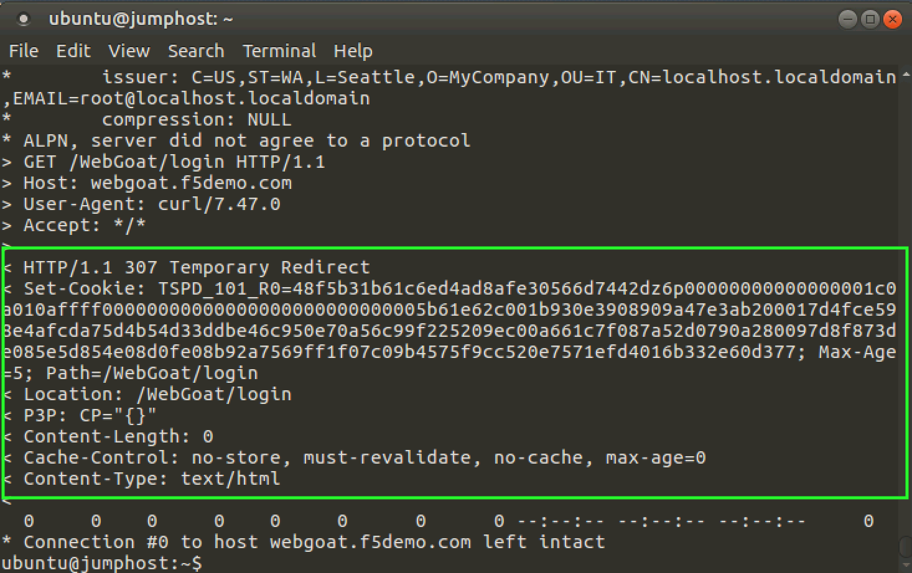
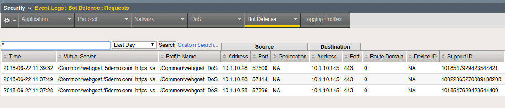
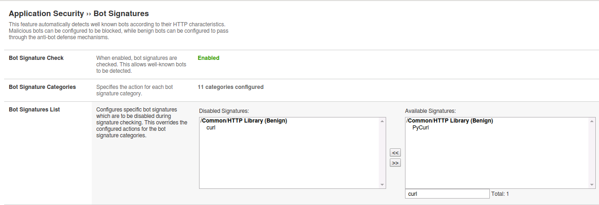

Exercise 1.3: Proactive Bot Defense
----------------------------------------

Objective

-  Create a DoS profile

-  Enable proactive bot defense

-  Apply the policy to the appropriate virtual server

-  Validate that the policy is working as expected

-  Estimated time for completion: **20** **minutes**

Create Policy
~~~~~~~~~~~~~

.. IMPORTANT:: To clearly demonstrate just the Bot Defense profile,
   please **disable the Application Security Policy and iRule from the prior lab** from the
   ``webgoat.f5demo.com_https_vs`` virtual server!

.. image:: images/image1.PNG
  :width: 600 px
.. image:: images/image2.PNG
  :width: 600 px

#. Open the **Terminal** application.

#. Run the following curl command to verify the site is loading without issue from this command line http utility. If the curl command is not successful (you are getting a “request rejected” error page), please let an instructor know.

   ``curl https://webgoat.f5demo.com/WebGoat/login -k -v | more``

Input
   .. image:: images/image36.PNG
    :width: 600 px

Output
  .. image:: images/image30.PNG
    :width: 600 px

#. On the Main tab, click **Security > DoS Protection > DoS Profiles**.
   The DoS Profiles screen opens.

   .. image:: images/image1_3_2.PNG
    :width: 600 px

#. Click on the **Create** button.

#. Name the policy ``webgoat_DoS`` and click **Finished** to
   complete the creation of this DoS profile.

   .. image:: images/image1_3_3.PNG
    :width: 600 px

Configure Policy
~~~~~~~~~~~~~~~~

#. **Click** the newly created ``webgoat_DoS`` profile listed under the
   **Security > Dos Protection > DoS Profiles** list.

#. The profile’s properties menu will be displayed initially. **Click**
   on the **Application Security** tab at the top of this menu to
   begin configuring the policy.

   .. image:: images/image1_3_4.PNG
    :width: 600 px

#. Under the **Application Security** tab > General Settings
   click the **Edit** link on the right-hand side of General Settings
   box and then check the ``Enabled`` check box for **Application
   Security** to enable the DoS profile and allow additional settings
   to be configured.

   .. image:: images/image1_3_5.PNG
    :width: 600 px

#. Select **Proactive Bot Defense** under the list of **Application
   Security** options for this DoS profile.

#. Click the **Edit** link on the right for the **Application
   Security > Proactive Bot Defense** menu and select **Always**
   from the drop-down menu for **Operation Mode**.

#. Set the Grace Period to 20 seconds. We will observe this in action shortly.

   .. image:: images/image37.PNG
    :width: 600 px

#. Notice that for **Block requests from suspicious browsers** the
   **Block Suspicious Browsers** setting is enabled by default.

#. At this point, you may want to take a moment and explore the other defaults that were turned on such as TPS based detection and BOT Signatures. Please don't modify the defaults.

#. Click the **Update** button to complete the Proactive Bot
   Defense ``webgoat_DoS`` profile.

   .. image:: images/image1_3_7.PNG
    :width: 600 px

Apply Proactive Bot Defense Policy
~~~~~~~~~~~~~~~~~~~~~~~~~~~~~~~~~~

#. Under **Local Traffic > Virtual Servers**, click
   on ``webgoat.f5demo.com_https_vs``.

#. Click on **Policies** under the **Security** tab at the top of
   the ``webgoat.f5demo.com_https_vs`` details menu.

#. In the **DoS Protection Profile** drop down menu,
   select ``Enabled...`` and then select the ``webgoat_DoS`` for
   the profile.

#. Click on the **Update** button to apply the policy.

   .. image:: images/image1_3_8.PNG
    :width: 600 px

Create Bot Defense Logging Profile
~~~~~~~~~~~~~~~~~~~~~~~~~~~~~~~~~~

#. Open a new tab for the Configuration Utility and navigate to:
    **Security > Event Logs > Logging Profiles** then **click
   the plus icon**.

#. Enter a Profile Name ``bot-defense``, select the
   checkbox for ``Bot Defense``.

#. Under the **Bot Defense** logging section, select the checkboxes
   for the following: ``Local Publisher``, ``Log Illegal Requests``, ``Log Bot Signature Matched Requests`` and
   ``Log Challenged Requests``.

#. Click **Finished**.

   .. NOTE:: You could have also modified the existing ``waf_allrequests``
      logging profile and added BOT logging definitions.

   .. image:: images/image33.PNG
    :width: 600 px

Apply Bot Defense Logging Profile
~~~~~~~~~~~~~~~~~~~~~~~~~~~~~~~~~

#. Under **Local Traffic > Virtual Servers**, click
   on ``webgoat.f5demo.com_https_vs``.

#. Click on **Policies** under the **Security** tab at the top

#. Within the Available logging profiles menu,
   select ``bot-defense`` and then click
   the ``<<`` arrows to move the logging policy to
   the ``Selected`` profile.

#. Click on the **Update** button to apply the policy.

   .. NOTE:: You can associate multiple logging profiles with a given
      virtual server. F5 allows for an incredible amount of logging
      flexibility. Most commonly you would have DoS, Bot Defense and ASM
      Security Policy events logged to a centralized SIEM platform, but
      there may be additional logging requirements such as a web team that
      would be interested in Bot Defense logs solely, while the SIEM
      continues to receive the union of DoS, Bot Defense and ASM Security
      Policy events.

   .. image:: images/image34.PNG
    :width: 600 px

Test the Proactive Bot Defense Policy
~~~~~~~~~~~~~~~~~~~~~~~~~~~~~~~~~~~~~

#. From the command line execute the following command several times:

   ``curl https://webgoat.f5demo.com/WebGoat/login -k -v | more``

.. NOTE:: This can take a few seconds to kick in and then you will see ASM start issuing a redirect challenge and try to set a TS cookie. **307 Temporary Redirect**

2. Once the Grace Period of 20 seconds has expired you will see ASM start escalating the defense and start to return a javascript challenge.

.. image::  images/image39.PNG
  :width: 600 px

This bot is getting shot down in flames!

Validate that the Proactive Bot Defense Policy is Working
~~~~~~~~~~~~~~~~~~~~~~~~~~~~~~~~~~~~~~~~~~~~~~~~~~~~~~~~~

#. Navigate to **Security > Event Logs > Bot Defense > Requests**.

#. Notice that the detected bot activity has been logged and is now
   being displayed for review.

.. Important:: This is very important to understand that we are logging bots in an entirely different internal logging system than the ASM events. Implementing Bot Defense keeps the ASM logs clean and actionable when there are millions of malicious attempts per day from bots.

#. Note the stated reason for the request being blocked. You may have to
   scroll to the right to see this reason. What was the stated reason?

BOT Signatures
~~~~~~~~~~~~~~

#. Navigate to **Security > DoS Protection > DoS Profiles**

#. **Click** on the ``webgoat_DoS`` profile and then the
   **Application Security** tab to configure the policy.

#. Select **Proactive Bot Defense** under the list of **Application
   Security** options.

#. In the **Application Security > Proactive Bot Defense**
   section, click the **Edit** link for **Operation Mode** and
   then change the setting from **Always** to **During Attack** and
   click **Update** to complete the policy change.

   .. image:: images/image1_3_12.PNG
    :width: 600 px

#. Run cURL again: ``curl https://webgoat.f5demo.com/WebGoat/login -k -v | more``

.. NOTE:: The site should respond normally now every time because we are not "under attack" ASM uses TPS based detection (client-side) and Behavioral Stress detection (server-side) to determine when the system is under attack. Without the Advanced WAF license, Behavioral DoS Detection is limited to two virtual servers.

cURL is considered an **HTTP Library tool** and falls in **the Benign Category**.

.. IMPORTANT:: Just how benign are HTTP library tools? cURL can easily be
   scripted in a variety of ways and can be used as a downloader to siphon
   off data. Remember the famous media defined “hacking tool” that Snowden
   used? wget? There are many use-cases where you simply do not want a tool
   interacting with your site.

Selectively Blocking BOT Categories
~~~~~~~~~~~~~~~~~~~~~~~~~~~~~~~~~~~

#. Under your ``webgoat_DoS`` profile in **Application Security > Bot
   Signatures** click on the **Edit** link for the **Bot Signature
   Categories** section.

   .. image:: images/image1_3_13.PNG
    :width: 600 px

#. Change the HTTP Library action from **None** to **Block** under
   the **Benign Categories** section and click **Update** to apply
   the policy changes.

   .. image:: images/image1_3_14.PNG
    :width: 600 px

#. Run cURL again: ``curl  https://webgoat.f5demo.com/WebGoat/login -k -v | more``

   .. image:: images/image35.PNG
    :width: 600 px

   Whammo!!!... as soon as the BOT is revealed... the connection is dropped.
   The TLS doesn’t get established.

   Let’s say we actually DO want to allow cURL or another automated
   tool. We may have developers that rely on curl so let’s whitelist
   just that.

**To Whitelist cURL:**

#. Edit the **Bot Signatures** list and find **curl**. Move it to disabled signatures and click **Update**.

#. Run cURL again: ``curl https://webgoat.f5demo.com/WebGoat/login -k -v | more`` and you should be back in business. By now you should know the expected output.

#. Change HTTP Library to: **Report** and remove **CURL** from the whitelist.

.. image:: images/image1_3_17.PNG
  :width: 600 px

#. Modify the ``webgoat_DOS`` Dos Profile operation Operation Mode to: ``Always`` and click **Update**.

.. image:: images/image1_3_18.PNG
  :width: 600 px

cURL from Different Geolocations
~~~~~~~~~~~~~~~~~~~~~~~~~~~~~~~~

.. NOTE:: We are going to leverage an overlay virtual server to randomize source IP addresses similar to the earlier lab concept of randomizing XFF.

1. Open **Local Traffic > Virtual Servers** and click on ``webgoat.f5demo.com_https_overlay_vs``.
Go to the **Resources** horizontal tab and verify that the iRule **webgoat_overlay** is applied. Freel free to check out the code in the iRule. This code and BIG-IP flexibility makes lab testing and simulations a breeze.

.. image:: images/image1_3_19.PNG
  :width: 600 px

2. Modify the cURL command to point at the overlay virtual server and run several times: ``curl https://10.1.10.146/WebGoat/login -k -v | more``

3. Review the event logs at **Event Logs > Bot Defense** You will
   now see geo-data for the BOT connection attempts.

.. image:: images/image1_3_20.PNG
  :width: 600 px

4. Navigate to **Security > Overview > Application > Traffic** and review the default
   report elements. You can change the widget time frames to see more historical data.

5. Click **Overview > Application > Traffic** and override the timeframe to **past year**:

.. image:: images/image1_3_21.PNG
  :width: 600 px

6. Take some time reviewing this screen and practice adding a new widget
   to see additional reporting elements:

7. Click the **DoS tab** at the top. In some time...The DOS Visibility Screen loads.

.. image:: images/image1_3_22.PNG
  :width: 600 px

.. NOTE:: You may need to change your time in the system tray for accurate results.

Although there have not been any L7 DoS attacks some of the widgets along the right contain statistics from the BOT mitigations.
Change the time window (top left) from 5 minutes to **"All Time"** so see more data.

.. image:: images/image4.PNG
  :width: 600 px

8. Click the **Analysis** tab at the top and review the graphs available to you.

.. image:: images/image1_3_23.PNG
  :width: 600 px

9. Click the **Custom Page** tab at the top and review the graphs available to you.

Please feel free to add widgets and/or explore the ASM interface further.

**This concludes the BOT Protection section of this lab guide!**
