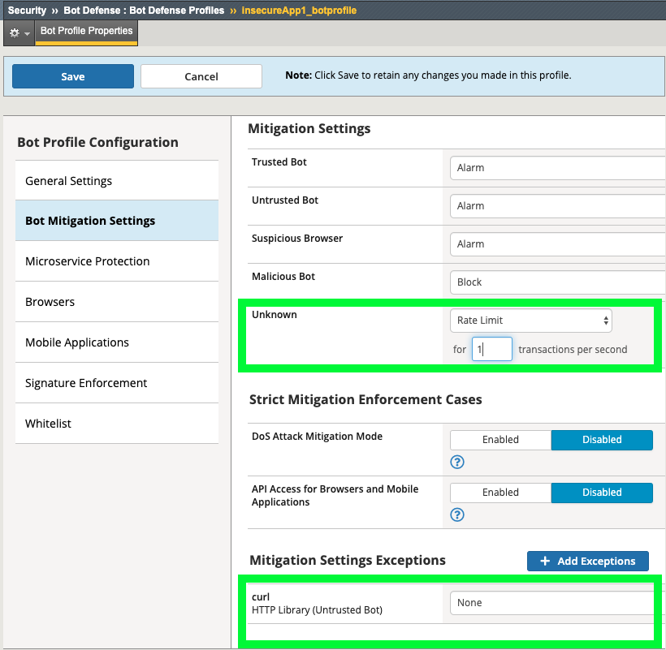
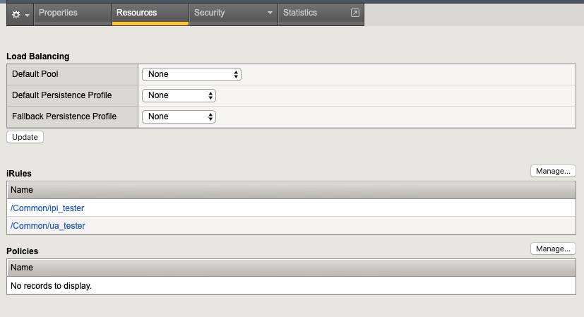
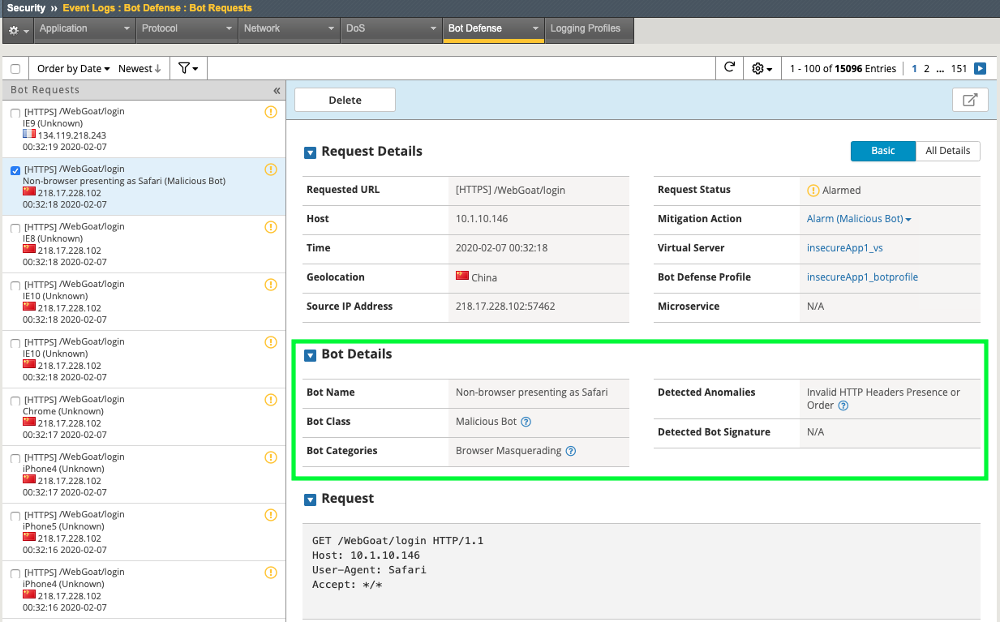

Exercise 1.3: Bot Defense with Signatures
-------------------------------------------

Objective
~~~~~~~~~

- Create a Bot Defense logging profile
- Create and apply a transparent Bot Defense Profile with Signatures
- Test and verify logs 
- Add a signature to the whitelist

-  Estimated time for completion: **20** **minutes**

.. IMPORTANT:: To clearly demonstrate just the Bot Defense profile, please **disable all security policy on the virtual server**. The ipi_tester script should still be running!

.. image:: images/blank_vs.png
  :width: 600 px

Create Logging Profile 
~~~~~~~~~~~~~~~~~~~~~~

#. Navigate to **Security > Event Logs > Logging Profiles** and create a new Logging Profile with the settings shown in the screenshot below and click **create**. 

.. image:: images/log_profile.png
  :width: 600 px

#. Navigate to **Security > Bot Defense > Bot Defense Profiles** and click **Create**.
#. Name: **insecureApp1_botprofile**
#. Profile Template: **Relaxed**
#. Click the **Learn more** link to see an explanation of the options. These will be explored further in the 241 lab. 

.. image:: images/bot_profile.png
  :width: 600 px

#. Click on the **Bot Mitigation Settings** tab and review the default configuration.
#. Click on the **Signature Enforcement** tab and review the default configuration.
#. Click **Save**.
#. Navigate to **Local Traffic > Virtual Servers > Virtual Server List > insecureApp1_vs > Security > Policies**
#. Enable the  Bot Defense Profile: **insecureApp1_botprofile** and the **Bot_Log** profile. 
#. Click **Update**

.. image:: images/bot_vs.png
  :width: 600 px

#. Navigate to **Security > Event Logs > Bot Defense > Bot Requests** and review the event logs. 

.. image:: images/bot_log.png
  :width: 600 px

Whitelisting a Bot 
~~~~~~~~~~~~~~~~~~~~~~

#. Navigate to **Security > Bot Defense > Bot Defense Profiles > insecureApp1_botprofile > Bot Mitigation Settings**
#. Under **Mitigation Settings** change Unknown Bots to **Rate Limit** with a setting of **1** TPS. 
#. Under **Mitigation Settings Exceptions** click **Add Exceptions** and search for **curl** and click **Add**.
#. Change the Mitigation Setting to **None** and then **Save** the profile. 

#. Navigate to **Security > Event Logs > Bot Defense > Bot Requests** and review the event logs. 
#. Notice the whitelisted bot's class was changed to **unknown** but the requests are still being alarmed. 

.. image:: images/bot-whitelist.png
  :width: 600 px

#. Click the down arrow under **Mitigation Action** and note the reason for the alarm. Even though we have whitelisted this bot we can still ensure that it is rate-limited to prevent stress on the application and this bot is currently violating the rate-limit. 

.. image:: images/bot-rate-limit.png
  :width: 600 px

Testing additional User Agents
~~~~~~~~~~~~~~~~~~~~~~~~~~~~~~~~~~~~~~~~~~~~
#. Navigate to **Local Traffic  > Virtual Servers > Virtual Server List > security-testing-overlay-vs > Resources** and add the **ua_tester** iRule and click **Finished**. 

#. These are all poorly spoofed User-Agents and implementing just bot signatures is the bare minimum for bot mitigation and not a comprehensive security strategy. Some requests will get detected as anomolies such as the spoofed Safari UA but others will still cruise right through if they don't match an existing signatures. Since we are not blocking the **unknown** category, we can at least rate limit them. Consider blocking or rate-limiting **unknowns** in production. A **Balanced** Bot profile will also include active challenges which will greatly enhance bot mitigation capabilities. Check out ASM241 for more information.  

**This completes Lab 2**