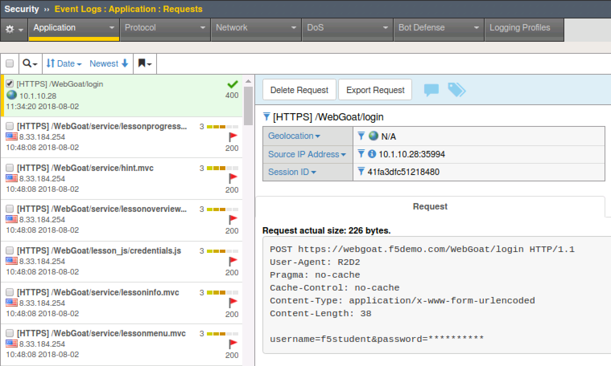
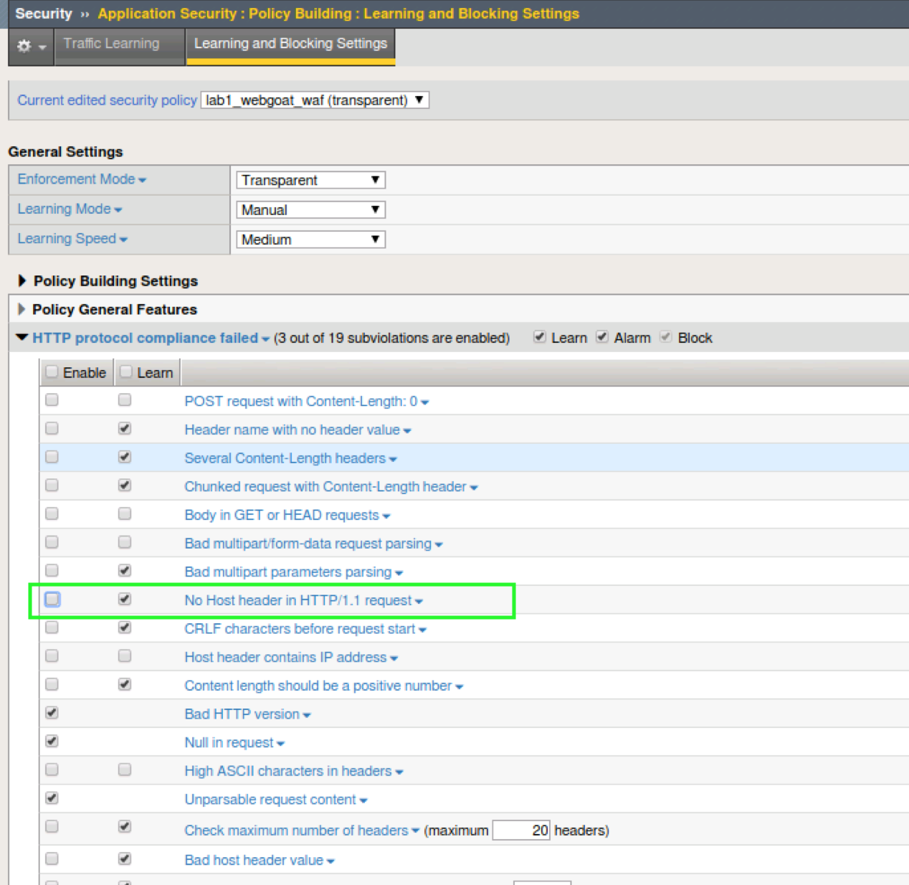
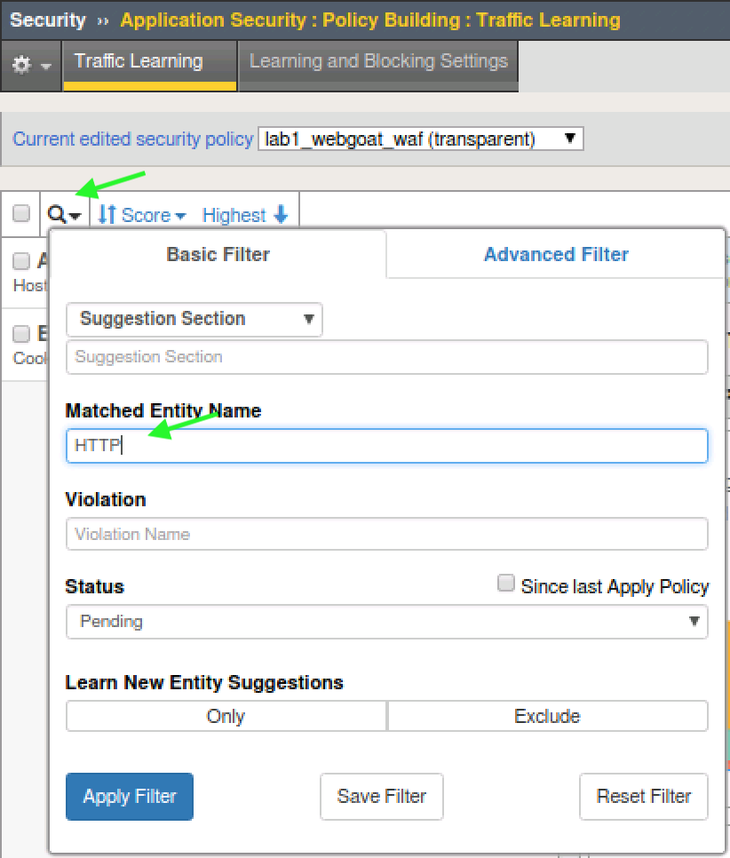
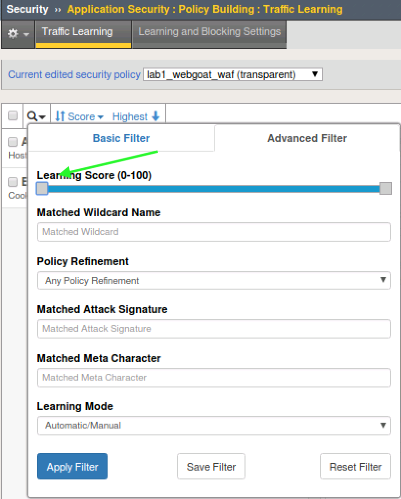
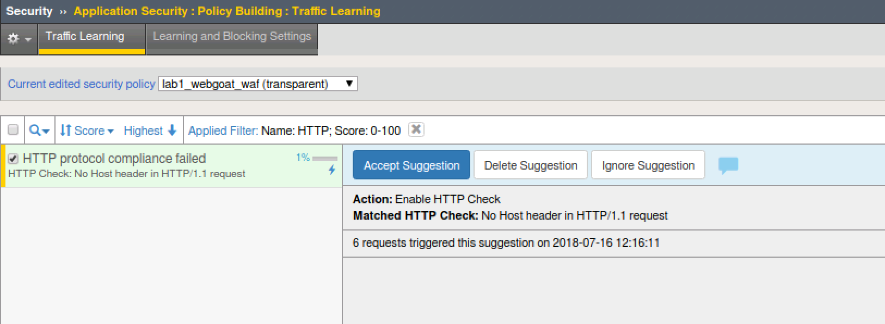
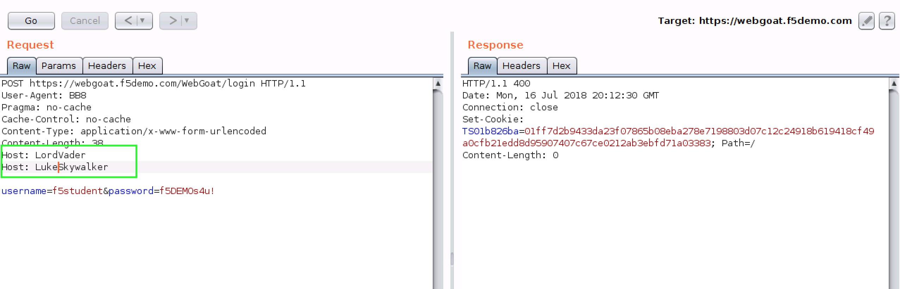
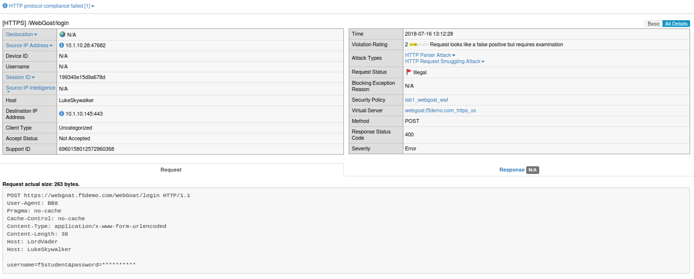

Exercise 2.1: Protocol Compliance
----------------------------------------

Objective
~~~~~~~~~

- Attach the security policy to the appropriate virtual server.

- Validate that the security policy is working correctly.

- Implement HTTP Protocol Compliancy checks

- Explore Learning and Blocking

- Get familiar with ASM Event Logs

- Estimated time for completion **45** **minutes**.

Apply Security Policy
~~~~~~~~~~~~~~~~~~~~~

.. IMPORTANT:: To clearly demonstrate just the protocol compliance protection, on the ``webgoat.f5demo.com_https_vs`` virtual server; PLEASE PERFORM THE FOLLOWING TWO STEPS:

1. **Remove** the previously created DoS profile and bot logging profile.
2. **Enable** the ``lab1_webgoat_waf`` Security Policy

Your virtual should look like this

.. image:: images/image1.PNG
    :width: 600 px

Burp'ing the App
~~~~~~~~~~~~~~~~

In this section we are going to use the free/community version of an excellent DAST tool; Burp. Unfortunately, the free version does not actually allow DAST but it is still an excellent tool for packet crafting and that's exactly how we are going to use it.
We will be manually sending two different attack types to demonstrate the protocol compliance features of ASM.

HTTP Compliancy Check - Enforce Host Header
~~~~~~~~~~~~~~~~~~~~~~~~~~~~~~~~~~~~~~~~~~~~

.. NOTE:: By way of RFC; HTTP/1.1 requires a host header. Many servers will still process the request without one. We want to enforce RFC compliant HTTP.

1. Open Burp by clicking the icon in the system tray at the top of the screen. (If it offers an update, please decline)

2. This will be a temporary project so click **next** to proceed and choose "Use Burp Defaults" on the next screen.

3. Click **Start Burp** and navigate to the **Repeater** tab once opened.

4. Under the **Request** tab paste in the following http request, remove any whitespace, or use the text version on the desktop, and click **Go**.

Attack 1: No Host Header - **Run this 10 times.**

::

  POST https://webgoat.f5demo.com/WebGoat/login HTTP/1.1
  User-Agent: R2D2
  Pragma: no-cache
  Cache-Control: no-cache
  Content-Type: application/x-www-form-urlencoded
  Content-Length: 38

  username=f5student&password=f5DEMOs4u!

.. IMPORTANT:: When you copy and paste there may be whitespace in front of the headers. You will need to remove this manually or the request will not be sent. The requests can also be found in txt docs on the client desktop. If you copy and paste from there rather than this site, the whitespace will not be a problem.

5. A popup will appear asking for target details. Fill out the form as shown below.

.. image:: images/image10.PNG
    :width: 600 px

Request and Response should look like this

.. image:: images/image5.PNG
    :width: 600 px

6. Navigate to **Security > Event Logs > Application > Requests** and clear the illegal request filter. You should see these requests being logged as legal but you may want to implement policy per the "Good WAF Protection recommendations", to not allow this since it is not RFC compliant HTTP/1.1

Learning and Blocking
~~~~~~~~~~~~~~~~~~~~~~
The first place we always take a look when we want to implement a new control is under learning and blocking settings.

1. Navigate to **Security > Application Security > Policy Building > Learning and Blocking Settings** and look for **HTTP Protocol Compliance failed**

2. Notice the violation is set to learn only and is not enabled by default in a Rapid Deployment Policy. That is why the request was seen as legal and there was no alert in the event logs.

3. Since learning **was** on by default there must be a learning suggestion ready for us. Let's go take a look.

4. We want to specifically find the learning suggestion for **HTTP protocol compliance failed - HTTP Check: No Host header in HTTP/1.1 request**

5. Navigate to **Security > Application Security > Policy Building > Traffic Learning** and click on the Magnifying Glass.

6. Under the Advanced Tab move the slider to the left so you can see alerts with a learning score of less than 5 and click **Apply Filter**

7. Note the action ASM is suggesting that you take - **"Enable HTTP Check"**

8. Click **Accept Suggestion** and then browse back to **Security > Application Security > Policy Building > Learning and Blocking Settings > HTTP Protocol Compliance failed** and notice that by accepting the learning suggestion ASM has now enabled the protection but it is still in learning mode so **uncheck** that manually.

.. image:: images/image7.PNG
    :width: 600 px

9. **Be sure you have clicked "Save" and Applied the Policy prior to proceeding.**

10. Go back to **Burp** and run the attack again one or more times.

11. Browse to **Security > Event Logs > Application > Requests** on the BIG-IP GUI. Clear the **Illegal Request** option to view all requests received by the security policy.
You should now see the alerts since we have enabled this compliancy check and turned off learning.

.. image:: images/image9.PNG
    :width: 600 px

HTTP Compliancy Check - Bad Host Header Value
~~~~~~~~~~~~~~~~~~~~~~~~~~~~~~~~~~~~~~~~~~~~~~~~

The **Bad Host Header Value** check is an HTTP Parser Attack and definitely something that should be implemented as part of **Good WAF Security**.

**Risk:**
If we allow bad host header values they can be used to Fuzz web servers and gather system information. Successful exploitation of this attack could allow for the execution of XSS arbitrary code.

1. Navigate to **Security > Application Security > Policy Building > Learning and Blocking Settings > HTTP Protocol Compliance failed** and find **Bad host header value**
Notice that by default this is also in learning mode but disabled by default in a Rapid Deployment Policy.

.. image:: images/image14.PNG
    :width: 600 px

2. **Uncheck** the Learn box and **Check** the Enable box. Scroll up, click **Save** and **Apply Policy**.

3. Go back to **Burp** and under the **Request** tab paste in the following http request, remove any whitespace, or use the text version on the desktop, and click **Go**.

Attack 2: XSS in HOST Header

::

  POST https://webgoat.f5demo.com/WebGoat/login HTTP/1.1
  User-Agent: BB8
  Pragma: no-cache
  Cache-Control: no-cache
  Content-Type: application/x-www-form-urlencoded
  Content-Length: 38
  Host: 

  username=f5student&password=f5DEMOs4u!

.. image:: images/image15.PNG
    :width: 600 px

4. Browse to **Security > Event Logs > Application > Requests** and review the alert for this attempted attack. Note the alert severity is much higher (4) for this attack type due to the risk it presents.

.. image:: images/image16.PNG
    :width: 600 px

5. Click **Export Request** and review the detailed report. Notice the XSS alerts and how they are currently still in staging. We will cover this in the next module.

HTTP Compliancy Check - Multiple Host Headers
~~~~~~~~~~~~~~~~~~~~~~~~~~~~~~~~~~~~~~~~~~~~~~~
Description - Examines requests to ensure that they contain only a single "Host" header.
This is an example of an HTTP Request Smuggling Attack

Risk - An attacker may try to evade security checks by confusing ASM and/or application servers as to which hostname is being accessed.

Example - The website may be accessed by non-browser clients attempting to bypass security gateways.

.. NOTE:: There will be little guidance on this section. Use what you have learned above to complete this lab. Please ask an instructor if you need help.

**Order of Operations**

1. Disable learning and Enable the Compliancy Check for **Multiple Host Headers** in learning and blocking settings.
2. Use **BURP** to perform the Attack

::

  POST https://webgoat.f5demo.com/WebGoat/login HTTP/1.1
  User-Agent: BB8
  Pragma: no-cache
  Cache-Control: no-cache
  Content-Type: application/x-www-form-urlencoded
  Content-Length: 38
  Host: LordVader
  Host: LukeSkywalker

  username=f5student&password=f5DEMOs4u!

3. Review Event Logs to ensure the attack is being mitigated. Notice the alert level is lower for this attack type due to less risk than a potential XSS as seen in the previous exercise.

**This concludes module 2**
