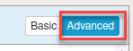
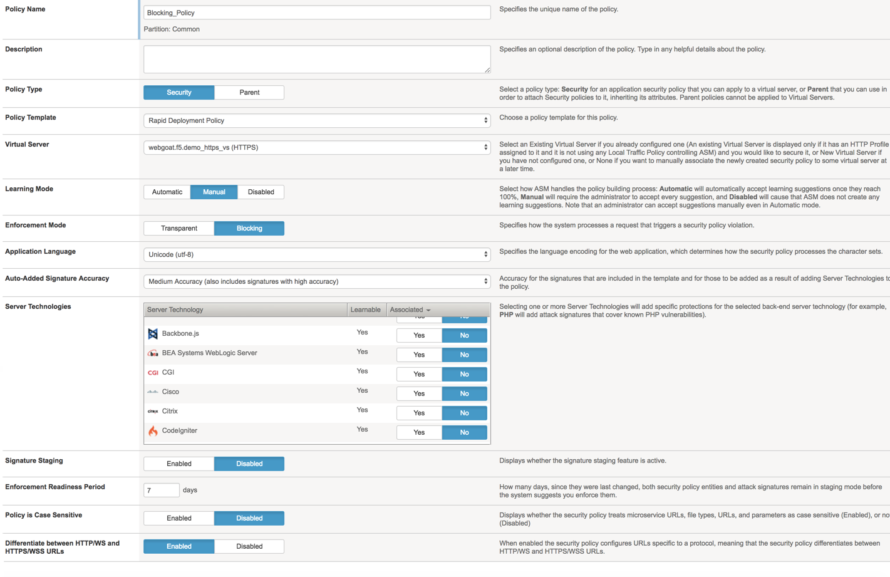
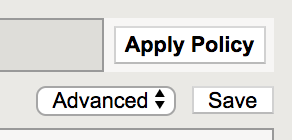
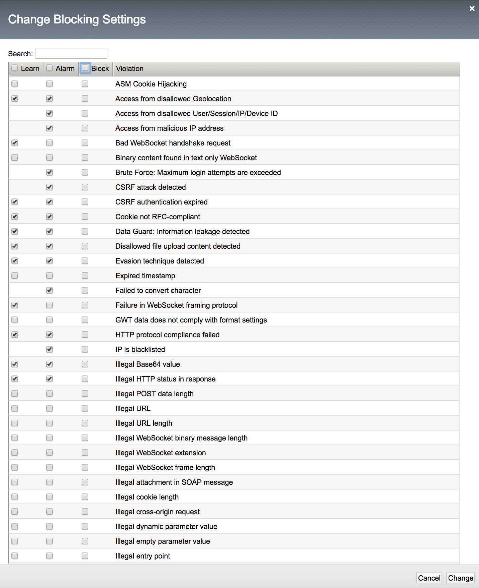
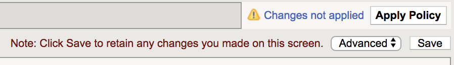

Exercise 3.1: Blocking Policy
----------------------------------------

Objective
~~~~~~~~~~~~~~~~~~~~~~~~~~~~~~~~~~~~~~~~~~~~~~~~~~~~~

You will explore the blocking policy and settings.  The blocking policy used for this lab will focus on negative security using attack signatures.

.. IMPORTANT:: Remove the existing transparent policy from the webgoat.f5.demo_https_vs  virtual before proceeding. Your virtual should look like this

.. image:: images/module3Lab1Excercise1-image1.png
    :width: 600 px

Task 1 - Creating Blocking policy
~~~~~~~~~~~~~~~~~~~~~~~~~~~~~~~~~~~~~~~~~~~~~~~~~~~~~

1.  Go to **Security > Application Security > Security Policies** and click the Plus sign.

2.  At the far right change the setting to Advanced

Fill out the following -
  - Policy name - ``Blocking_Policy``
  - Description - ``leave blank``
  - Policy type -  ``Security``
  - Policy Template -  ``Rapid Deployment Policy``
  - Virtual Server -  ``webgoat.f5.demo_https_vs (HTTPS)``
  - Learning Mode -  ``Manual``
  - Enforcement Mode -  ``Blocking``
  - Application Language -  ``Unicode (utf-8)``
  - Auto-Added Signature Accuracy - ``Medium``
  - Server Technologies - ``(leave blank)`` (we will cover this option in a later exercise)
  - Signature Staging -  ``Disable``  (in a production environment consider leaving this set at 7 days)
  - Policy is Case Sensitive -  ``Disabled``
  - Differentiate between HTTP/WS and HTTPS/WSS URLs -  ``Enabled``

3.  Click **Create Policy**

4.  Go to **Security > Application Security > Policy Building > Learning and Blocking settings**

5.  Make sure ``Blocking_Policy`` is selected in the Current edited security policy.

6.  At the far right across from General Settings ensure Advanced is selected.

7.  Click on **Blocking Settings**

.. image:: images/image1_3_1.png
    :width: 600 px

8.  Click the **Block** Check box at the top of to select all then click it again to clear Block from all entries.  Then click **Change**.

|

9.  Under Policy Building Settings  expand the Attack Signatures options

.. image:: images/module3Lab1Excercise1-image7.png
    :width: 600 px

|
 
10.  Click on the **Change** button at the far right to bring up the **Select Policy Attack Signature sets**.

.. image:: images/module3Lab1Excercise1-image8.png
    :width: 600 px

|

11. Choose to add both **High Accuracy signature sets and SQL Injection Signatures** then click **Change**.

.. image:: images/module3Lab1Excercise1-image9.png
    :width: 600 px

|

.. NOTE:: For this lab Signature Staging has been disbaled.  In a production environment you should consider using staging to allow yourself mitigation time before new signatures are implemented.

12.  Ensure that the blocking checkbox has been unchecked for all signatures.

.. image:: images/module3Lab1Excercise1-image10.png
    :width: 600 px

13.  You will click Save and Apply Policy at this point.

|

.. note::

        You will see that the policy will apply with errors. This is because the Policy is set to blocking but we do not have any settings currently in blocking since we unchecked the blocking options. At this point you will think this is counter intuitive. Why would you set a policy in blocking and then not block anything? This is to illustrate that you can begin building your policy in blocking mode from the start. The policy will operate as if it were in transparent mode. When you are ready to begin blocking traffic check the block option for that function(s). At this point we will test the blocking policy, which is in blocking mode, but no functions are currently in blocking.

|

.. image:: images/module3Lab1Excercise1-image12.png
        :width: 600px

|

Task 2 - Tuning policy
~~~~~~~~~~~~~~~~~~~~~~~~~~~~~~~~~~~~~~~~~~~~~~~~~~~~~

.. ATTENTION::  For this lab we will explore the settings for tuning the policy but will not change the settings.

1.  Go to **Security > Application Security > Policy Building > Learning and Blocking Settings**

2.  Under the **General Settings** you will see various settings for Enforcement, Learning Mode and Learning Speed.  For this lab the policy should be set to **Blocking with Manual Learning and a learning speed of fast.**

.. image:: images/module3Lab1Excercise2-image1.png
    :width: 600 px

3.  Under Policy Building Process you will find there are settings for Loosen Policy and Tighten Policy.

Loosen Policy would be used when there have been changes to the application.  Policy Builder will identify legitmate traffic based on repeated behavior from a sufficient number of sources that you set.
Tighten Policy only applies when you are using automatic learning.  The policy builder will refine the policy until the number of security policy changes has been reached.
Track Site Changes only applies to automatic learning.  If enabled this setting allows Policy Builder to discover changes to a web application.  Policy builder logs the changes and temporarily loosens the policy to make suggestions and adjustments.

.. image:: images/image6_3_1.png
    :width: 600 px

4.  When you have made changes to this page make sure to always **Save and Apply the policy.**

.. image:: images/image7_3_1.png
    :width: 600 px

|

.. image:: images/module3Lab1Excercise2-image4.png
    :width: 600 px
