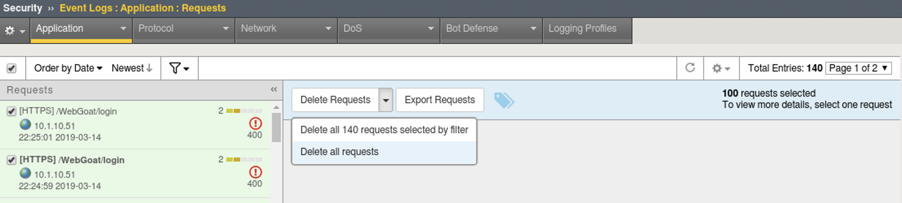
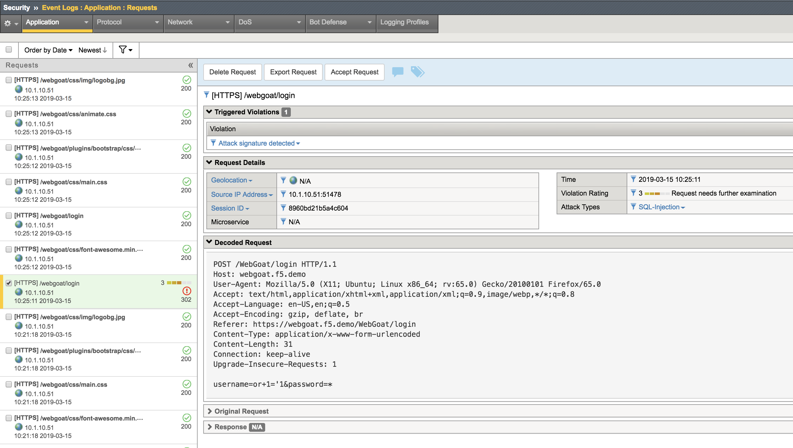
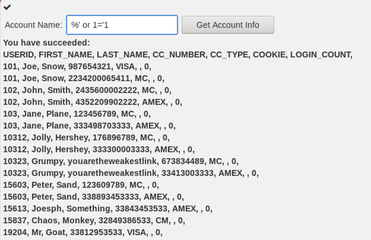
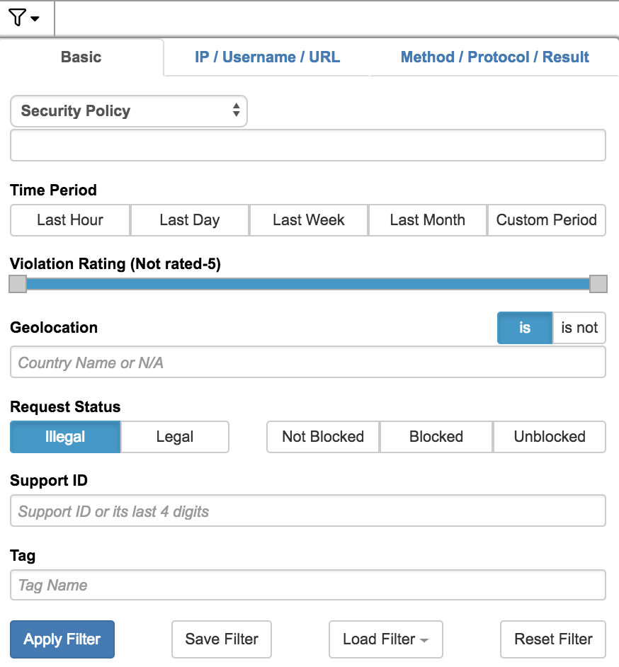
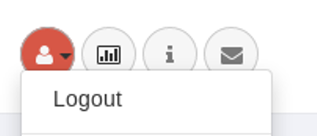
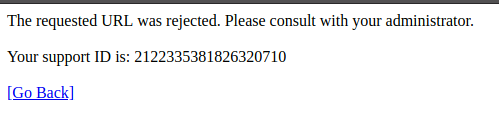
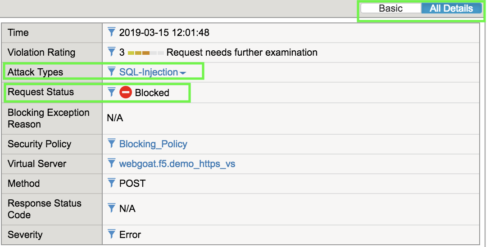
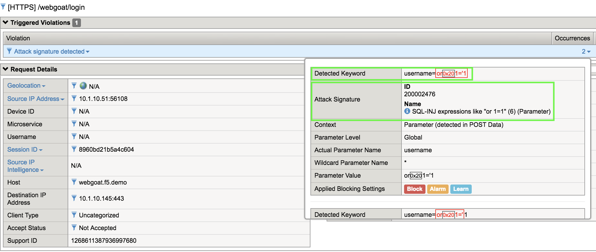
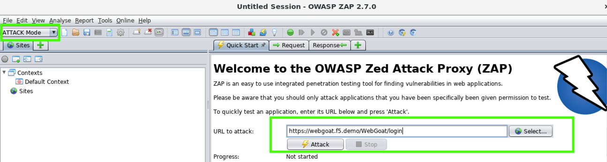
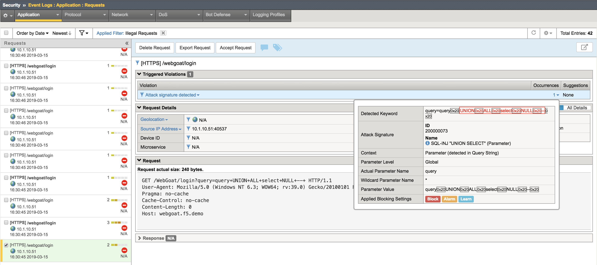

Exercise 3.2: Protection from common exploit vectors
------------------------------------------------------

Overview
~~~~~~~~~~~~~~~~~~~~~~~~~~~~~~~~~~~~~~~~~~~~~~~~~~~~~

In this exercise you will attack the vulnerable application.  Then apply the blocking policy and observe the results.

~~~~~~~~~~~~~~~~~~~~~~~~~~~~~~~~~~~~~~~~~~~~~~~~~~~~~

Task 1 - Exploring an attack
~~~~~~~~~~~~~~~~~~~~~~~~~~~~~~~~~~~~~~~~~~~~~~~~~~~~~

1.  Before we begin clear all previous logs by going to **Security > Event Logs > Application > Requests**.  Click the checkbox to select all.  From the drop down that appears to the right click the down arrow and select Delete all requests.

2.  Launch Firefox and navigate to **https://webgoat.f5.demo/WebGoat/login** 

3.  Click on the Webgoat bookmark from the bookmark bar to get to the WebGoat application

4.  At the username prompt try entering a SQL query for the username and the letter a for the password

::

    or 1='1

|

.. image:: images/module3Lab2Excercise1-image2.png
        :width: 600 px

|

5.  Return to the BIG-IP Go to **Security > Event Logs > Application > Requests**.

|

6.  You will find an entry there for the login page login attempt.

|

|

7.  Return to the WebGoat application and login with credentials f5student and password 

8.  From the left menu go to Injection Flaws --> SQL Injection and select exercise 7

|

.. image:: images/module3Lab2Excercise1-image4.png
    :width: 600 px

|

9.  In the account name field try an injection attack

::

    %' or 1='1

10.  You will be able to see a wealth of information

11. Return to the BIG-IP Go to **Security > Event Logs > Application > Requests**, click on the filter icon and change the **Request Status** to **Illegal** in order to find the sql injection alert easier. Click **Apply Filter**.

|

.. image:: images/module3Lab2Excercise1-image7.png
        :width: 600 px

|

12.  Time to Block! Go to **Security > Application Security > Policy Building > Learning and Blocking settings**

13.  Click on the carrot next to Attack Signatures and click on the Block check box at the top (this will turn on blocking for all the signatures).  Make sure signature staging is still set to diabled then click Save and Apply Policy.
Your policy should now look like this.

.. image:: images/module3Lab2Excercise1-image8.png
    :width: 600 px

14.  Make sure to save and apply policy.

.. NOTE::  Now you have enabled blocking for just the signatures.  Note that all other functions are still in only alarm and learn mode.  What attacks do you think will be blocked at this point?

15.  On the BIG-IP navigate to **Security > Event Logs > Application > Requests**

16.  Go back to Firefox and logout of WebGoat (upper right-hand corner). 

|

18.  At the username prompt try entering a SQL query for the username and the letter a for the password

::

    or 1='1

.. NOTE:: You should see that you are blocked and received a message with a support ID.

19.  Repeat steps 7-9

.. NOTE:: Did the query work?  Why not?  Did you receive a blocking response? Why not?  (hint - we will look at this in the troubleshooting section)

19.  Return to the ASM Event Logs and you should see both attacks as shown here

.. NOTE:: You may need to refresh the screen by clicking on the refresh icon top left of the event screen.

.. image:: images/module3Lab2Excercise1-image10.png
    :width: 600 px

20.  Click on the log entry for ``/webgoat/login`` and examine the request.

21.  Change from Basic to All Details and will see more details regarding the request

    

22.  Click on the occurences for Attack signature detected

Task 2 - ZAP THE APP!
~~~~~~~~~~~~~~~~~~~~~~~~~~~~~~~~~~~~~~~~~~~~~~~~~~~~~

1. Launch ZAP Proxy by running /opt/zaproxy/zap.sh 
This will take several seconds to launch so please do not multi-click.

.. NOTE:: If burp is still running ZAP will throw a warning stating that it can't start on port 8080. This a non-issue since we are not operating ZAP in proxy mode for this lab.

2.  Select No, I do not want to persist this session at this moment in time. Click **Start**.

3.  In the upper left corner of ZAP, change the mode to ATTACK and accept the popup.
Enter the following URL in to the URL to Attack field and click **Attack**:
::

    https://webgoat.f5.demo/WebGoat/login

4.  Return to the BIG-IP and examine the Event Logs.

5.  Take a look at the various attacks conducted by ZAP and blocked by ASM.  Examine the log entries and what signature prevented the attack from occurring. The more interesting attackes will be the illegal requests, filter on just the illegal requests.  You can explore the documentation on the signature as well.

What additional functions can you turn on to prevent some of the other attacks?  How would you turn these on?
Would this tool have even worked if Proactive Bot Defense was enabled? Answer: Absolutely not and your ASM even logs wouldn't be littered by these automated attempts that can quickly grow into the millions per day.

Bonus
~~~~~~

Go to **Security > Application Security > Policy Building > Traffic learning**

Explore the Learning suggestions and Traffic Summary page.

Locate the Enforcement Readiness section.

.. image:: images/module3Lab2Excercise2-image3.png
    :width: 600 px

.. |zap_proxy| image:: images/zap_proxy.png
    :width: 50 px

Click on the numbers.  This will take you to the learning and blocking settings page.  This shows you the settings that could be turned on to better protect your application.

To the left you will find a number of learning suggestions.  As traffic traverses your application these learning suggestions will eventually reach higher percentages.

Click on a learning suggestion to explore.  You will learn how many events have been triggered and give you the option to accept the suggestion, delete the suggestion or ignore.

.. NOTE:: The higher the percentage on the learning score the higher the chance you should accept this suggestion.
