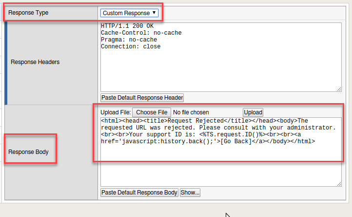
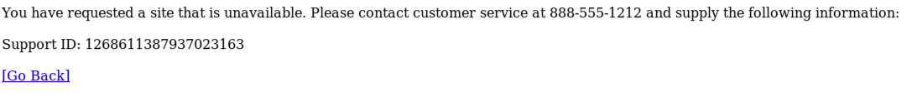
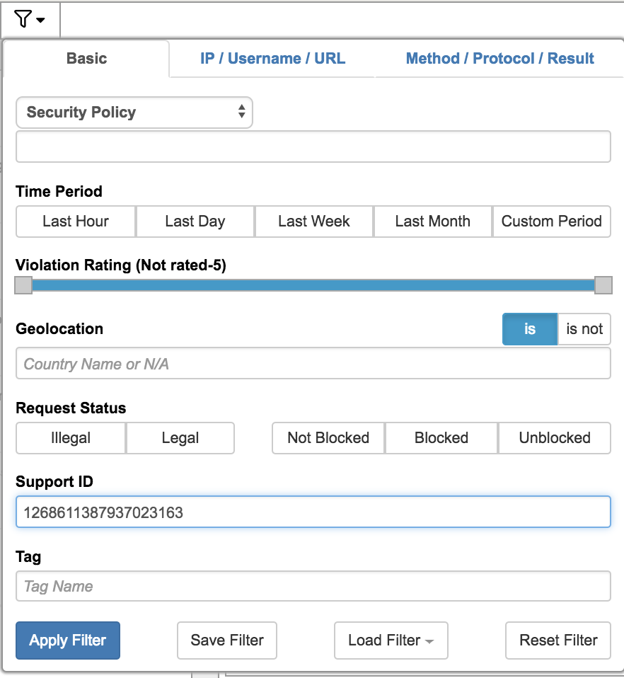
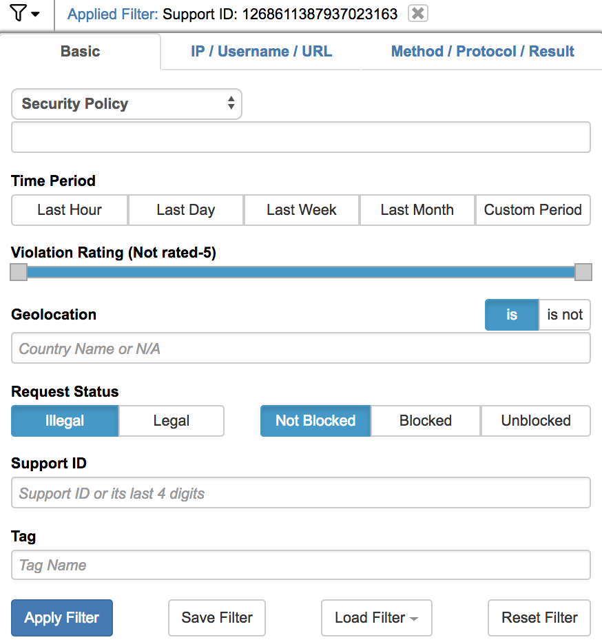
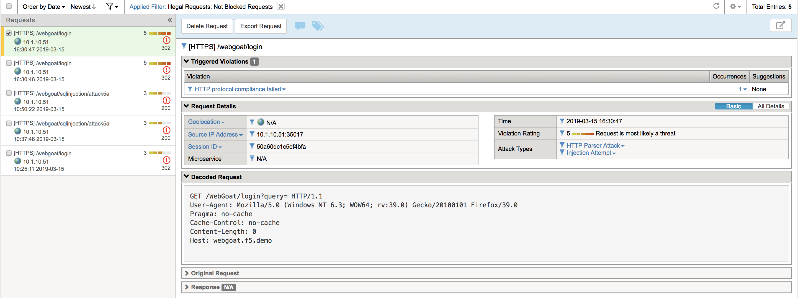
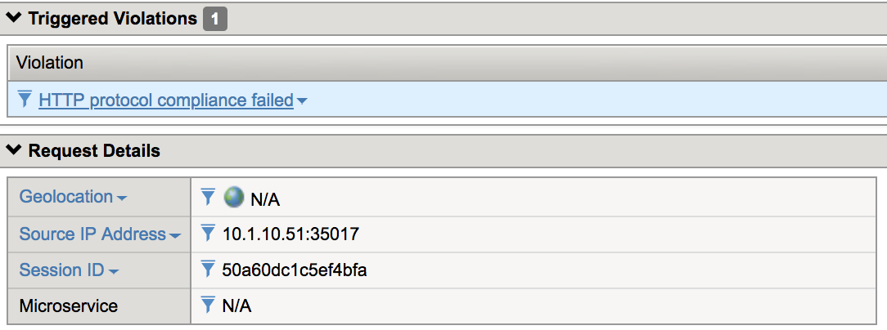
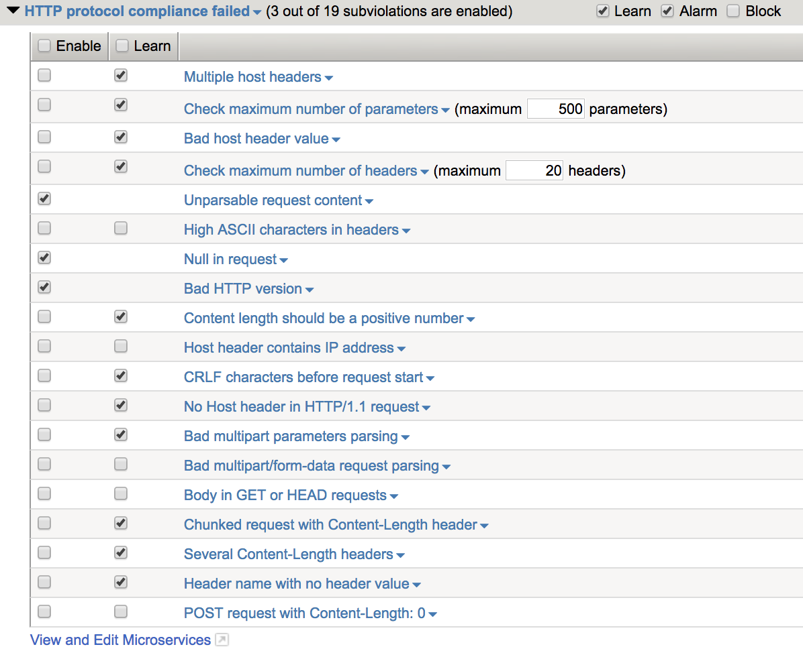

Exercise 3.4: Troubleshooting
----------------------------------------

Objective
~~~~~~~~~~~~~~~~~~~~~~~~~~~~~~~~~~~~~~~~~~~~~~~~~~~~~

In this exercise we will examine the response pages, event logs and briefly look at utilizing HTTP capture tools

Task 1 - Response Pages
~~~~~~~~~~~~~~~~~~~~~~~~~~~~~~~~~~~~~~~~~~~~~~~~~~~~~

1.  Go to **Security > Application Security > Policy > Response pages**

|

.. image:: images/module3Lab4Excercise1-image1.png
    :width: 600 px

|

2.  Within this area you can add various response pages for different request.  These pages can be modified by editing the response body. On the Default change the Response Type to "Custome Response".  This will open up the Response Body to editing.

|

|

3.  Edit the Response as follows:

::

    <html><head><title>Request Rejected</title></head><body>You have requested a site that is unavailable. Please contact customer service at 888-555-1212 and supply the following information:  Support ID: <%TS.request.ID()%>  <a href='javascript:history.back();'>[Go Back]</a></body></html>

4.  Click on the Show button

|

.. image:: images/module3Lab4Excercise1-image3.png
    :width: 600 px

|

5.  Click Save and Apply Policy.  And click OK.

|

.. NOTE:: Explore the other response pages.  Observe that AJAX reponse pages are disabled by default.

|

6.  Open a new Private Window in Firefox and navigate to the WebGoat login page (https://webgoat.f5.demo/WebGoat/login).

7.  Try entering a sql injection.

::

    or 1='1

You should have received a reponse page that you customized.  Make note of the Support ID before moving on to the next task.

.. NOTE:: If you were to login to the web application again and try the SQL Injection do you think you will see a response page?  What can you do to show a response?

.. HINT:: Try enabling the AJAX reponse pages.

Task 2 - Event logs
~~~~~~~~~~~~~~~~~~~~~~~~~~~~~~~~~~~~~~~~~~~~~~~~~~~~~

1.  On the BIG-IP return to the **Security > Event Log > Application > Requests**

2.  Click on the filter, from there you can enter the Support ID you received from the preceeding task and select Apply Filter.

|

2.  Select the alert and at the upper right-hand corner you will find a button to open the request in a separate tab

|

.. image:: images/module3Lab4Excercise2-image2.png
    :width: 600 px

|

3.  Click on Attack signature detected **Occurrences**.

|

.. image:: images/module3Lab4Excercise2-image3.png
    :width: 600 px

|

Observe the detected attack, the expected parameter, and what the applied blocking settings were.  Also note that the signature used to block this attack has been identified.  By clicking on the "i" next to the name you can get further information on the signature as well as a link to other documentation.

|

.. image:: images/module3Lab4Excercise2-image4.png
    :width: 600 px

|

4.  Examine the http body information.  Do you see your attack?

|

.. image:: images/module3Lab4Excercise2-image5.png
    :width: 600 px

|

5.  Observe the Source IP, Accept Status and Support ID.

|

.. image:: images/module3Lab4Excercise2-image6.png
    :width: 600 px

|

6.  Close this tab and return to the BIG-IP Event Logs.  Open the filter again, remove the support ID, and click on Illegal and Not Blocked.  Apply Filter

|

|

7.  Locate an entry and observe the Attack Type and Violation Rating

|

|

8.  Observe in the top left of the log you will find the Blocking Setting that could be enabled to block this request.

|

|

9.  Where would you find this setting to enable?  What happens when you click on the occurrences link?

10.  Observe that the link will give you more information on which piece of HTTP Protocol Compliance will prevent this attack.

|

.. image:: images/image14_3_3.png
    :width: 600 px

|

11.  Navigate to **Security > Application Security > Policy Building > Learning and Blocking Settings** and expand **HTTP Protocol Compliance failed**

|

|

12.  Do you see the setting that would prevent this attack?  How would you enable blocking for HTTP protocol compliance?

