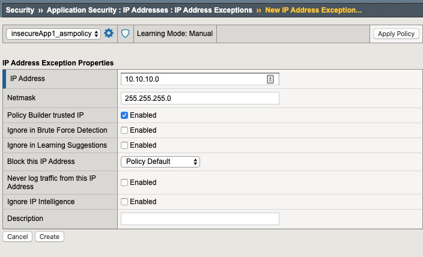
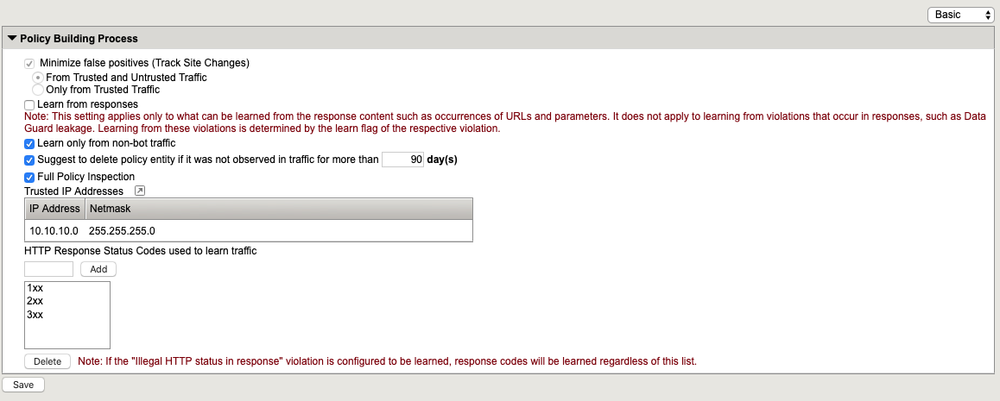
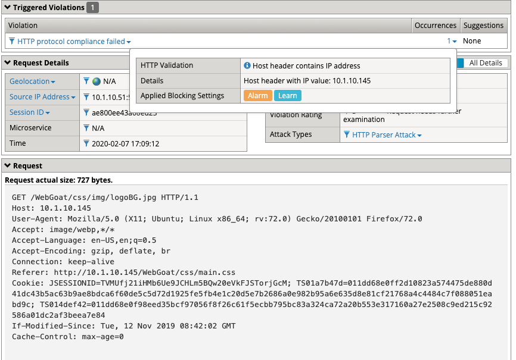
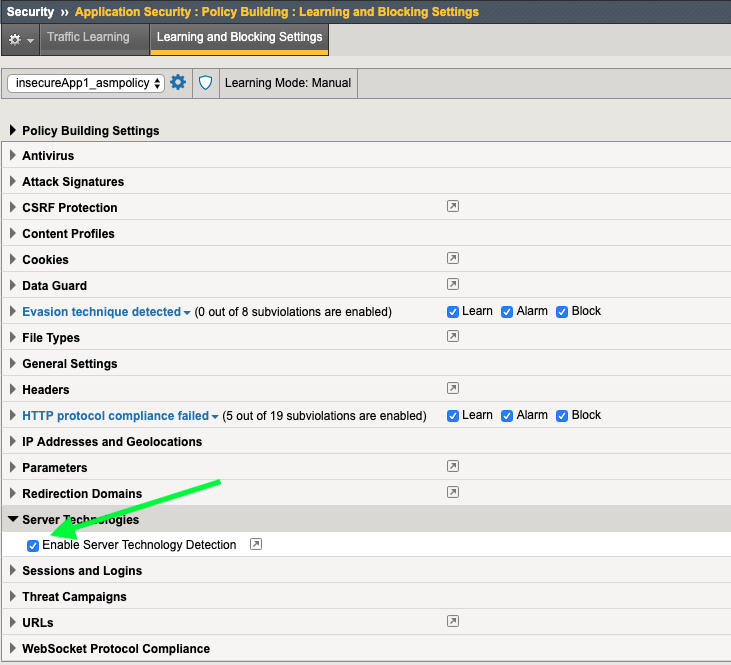
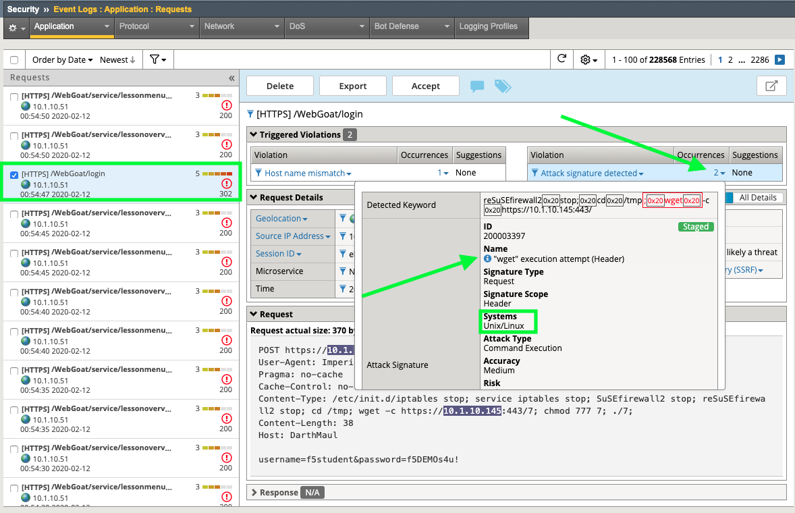
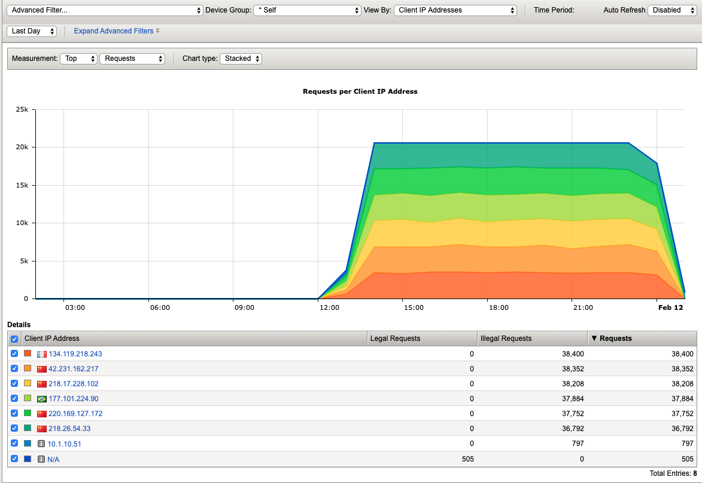
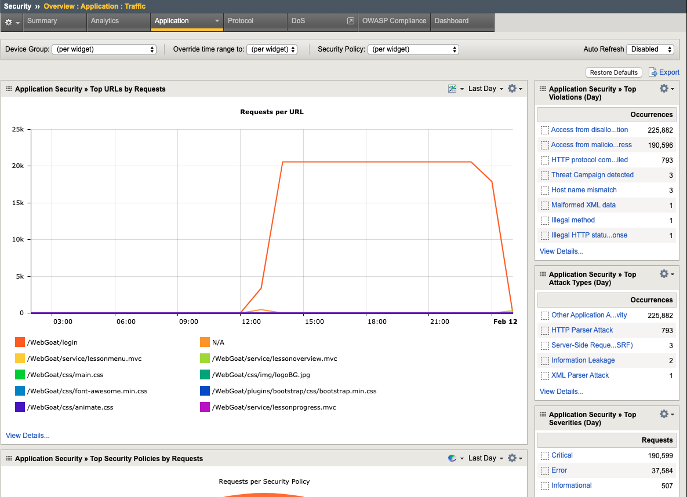
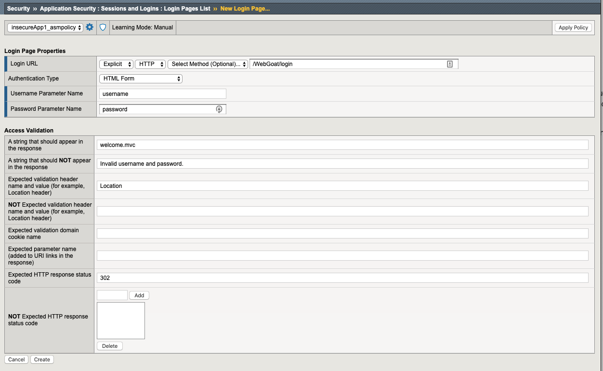

Exercise 4.1: Transparent Policy 
----------------------------------------

Objective
~~~~~~~~~~
We created a transparent policy way back in Lab 1 to configure IPI and Geolocation. We then tested out the Threat Campaign signatures in Lab 3. Now we will explore and test some of the first things you should get familiar with when developing a WAF policy. 

- Review Learning & Blocking & Policy Building Process settings
- Implement HTTP Protocol Compliancy checks and test
- Test with a HTTP Protocol violation plus XSS attack
- Enable Server Technologies & Attack Signatures
- Review Reporting
- Review Policy Building Process Settings and Whitelist

**Bonus** - Review Login Page Protection and Brute Force Configuration protection. 
 

- Estimated time for completion **30** **minutes**.

Learning & Blocking & Policy Building
~~~~~~~~~~~~~~~~~~~~~~~~~~~~~~~~~~~~~~~
Recall from Lab 1, that we used the Rapid Deployment Policy template to create our policy and we deployed it in manual learning mode. This means as violations and/or false positives occur, the system will make suggeestions to modify the policy. The admin will manually evaluate the suggestions and Approve, Ignore or Delete them.  

#. Navigate to **Security > Application Security >  Policy Building > Traffic Learning** and explore each of the sections under **Traffic Learning Summary**. 
#. You will see many Suggestions and a **learning score** that the system assigns based on how many times it has seen an occurence and from what source. You can **Accept**, **Delete**, **Ignore** or **Export**  the suggestion. Always look very carefully at the suggested action before deciding on which action to take. It is also helpful to define a whitelist so that the policy can learn quicker and from known trusted sources. You generally do not want the system learning from random and/or hostile Internet traffic and making suggestions to relax the policy.   

.. image:: images/learning.png
  :width: 600 px

Policy Building Process
~~~~~~~~~~~~~~~~~~~~~~~~~~~

#. Click on the **Learning and Blocking Settings** tab at the top os the screen and expand the **Policy Building Process** section. Here you can see settings that this particular policy is using for is learning processes. Notice that **Trusted IP Addresses List** is empty. 
#. Click the little window icon next to **Trusted IP Addresses List** is empty.
#. This takes you to: **Security > Application Security > IP Addresses > IP Address Exceptions** Click **Create**. 
#. For IP Address: **10.10.10.0** and for Netmask: **255.255.255.0**. Check the box for **Policy Builder trusted IP** and click **Create** and **Apply Policy**.

#. Navigate back to **Security > Application Security >  Policy Building > Learning and Blocking Settings** and expand the **Policy Building Process** section. Notice that our newly defined network is now a **Trusted IP**. This will greatly enhance the speed and quality of learning suggestions. 
#. Change the view from Basic to Advanced and review all the fine-grained configurations for the **Policy Building Process**.

**You now know how to define a trusted ip and configure the policy building process settings**

Enforcing HTTP Protocol Conpliance
~~~~~~~~~~~~~~~~~~~~~~~~~~~~~~~~~~~~~~

#. Under **Learning and Blocking Settings** expand the **HTTP protocol compliance failed** section. Enforcing HTTP protocol compliance is a good practice and should not cause administrative burden. Notice we are already set to learn for most of the violations in case a webapp is poorly written or configured. By learning we will have the opportunity to weed out any false positives caused by HTTP Protocol Compliance violations prior to enabling blocking. 
#. Uncheck the box for learning under **Bad Host header Value** and check the **Enable** box.  
#. Check the box to enable learning for **Host header contains IP address**.
#. Hit **Save** at the bottom of the screen and then **Apply Policy** at the top of the screen. 

.. image:: images/http.png
  :width: 600 px

We have now told the system to not making any learning sugestions on bad host header values and we enabled the default action as definied for **HTTP protocol compliance failed**. If we receive a match we will **Alarm** and **Block** if the policy was in Blocking Mode. 
We also told the sytem to start generating learning suggestions if we see any attempts to access the site via IP address instead of hostname.  

#. From Firefox on client01, load the insecureApp1 bookmark and refresh several times. 
#. Navigate to **Security > Application Security >  Policy Building > Traffic Learning** then scroll down to the bottom under **Suggestions** and notice the new learning suggestion for **Host header contains IP address** since we are browsing the site by IP and not hostname. 
#. If we accept this suggestion it will actually enable the HTTP Check for **Host header contains IP address**. Click **Accept** and **Apply Policy**
#. Return to the **Learning and Blocking Settings** tab at the top of the GUI to review the effect of your action. 
#. Notice that the **Enable** box is now checked for **Host header contains IP address**.

.. image:: images/enabled.png
  :width: 600 px

This means as violations occur you will now see them in the event logs. 

#. From Firefox on client01, load the insecureApp1 bookmark and refresh several times. 
#. Navigate to **Security > Event Logs > Application > Requests** and review the latest Sev3 alert. Notice the Violation type and then click on the **1** under Occurrences to see more information. 

#. Close the Firefox browser. 

Burp'ing the App
~~~~~~~~~~~~~~~~

In this section we are going to use the free/community version of an excellent DAST tool; Burp. Unfortunately, the free version does not actually allow DAST but it is still an excellent tool for packet crafting and that's exactly how we are going to use it.
We will be manually sending two different attack types to demonstrate the protocol compliance features of ASM.

HTTP Compliancy Check - Bad Host Header Value
~~~~~~~~~~~~~~~~~~~~~~~~~~~~~~~~~~~~~~~~~~~~~~~~

The **Bad Host Header Value** check is an HTTP Parser Attack and definitely something that should be implemented as part of **Good WAF Security**.

**Risk:**
If we allow bad host header values they can be used to Fuzz web servers and gather system information. Successful exploitation of this attack could allow for the execution of XSS arbitrary code.

#. Launch **Burp** from the dock and ignore the java warning. 

**DO NOT update**. 

#. Choose **Temporary Project** and click **Next** and then click **Start Burp**. 

#. Click the **Repeater** tab and paste in the following http request (**Replace password with the password provided by the instructor.**) and click **Send**.
#. A popup window will appear to Configure the target details. For host use: **10.1.10.145**. For port use: **443**. Check the **Use HTTPS** box. 
#. Click **Send**

|

XSS in HOST Header

::

  POST https://10.1.10.145/WebGoat/login HTTP/1.1
  User-Agent: BabyYoda
  Pragma: no-cache
  Cache-Control: no-cache
  Content-Type: application/x-www-form-urlencoded
  Content-Length: 38
  Host: 

  username=f5student&password=password

.. image:: images/burpreq.png
  :width: 600 px

#. Browse to **Security > Event Logs > Application > Requests** and review the alert for this Sev5 attack. Note the alert severity is much higher (5) for this attack type due to several violations occuring.
#. Review all the details and then click the **3** under the **Attack Signature Detected** violation to see all of the staged XSS Attack Signatures that were triggered. 

Server Technologies & Attack Signatures
~~~~~~~~~~~~~~~~~~~~~~~~~~~~~~~~~~~~~~~~~~~

In this exercise we will examine server technologies which allow you to automatically discover server-side frameworks, web servers and operating systems. This feature helps when the backend technologies are not well known. The feature can be enabled to auto detect. You can also add the technologies that you know. Creating custom signature sets allows you to define what signature groupings work best for your needs. In this exercise we will explore both.

#. Go to **Security > Application Security > Policy Building > Learning and Blocking Settings > Attack Signatures**
#. Review the Attack Signatures that were applied during policy creation from back in Lab 1. Notice that they are set to **Learn/Alarm/Block and Staging is enabled**. 
#. Locate Server Technologies and expand the option. Click **Enable Server Technology Detection**, click **Save** and then click the **New Window Icon** next to Server Technologies. 

#. Scroll down to **Advanced Settings > Server Technologies** and click in the box. Search for Linux since we know the server is running Linux. The system will dispaly a box describing which new signature sets will be applied. Click **Confirm**. 

.. image:: images/ast.png
  :width: 600 px

**Make sure to Save and Apply Policy.**

#. On Client01 load the bookmark for **Webgoat** and Login.
#. On BIG-IP  Go to **Security > Application Security > Policy Building > Traffic Learning** and notice the three new 100% alerts for Server Technologies. 
#. Select all three suggestions and click **Accept**. 

**Make sure to Apply Policy**

#. Go to **Security > Application Security > Policy Building > Learning and Blocking Settings > Attack Signatures** and notice the new Unix/Linux Server Technology signature sets that were added to the policy. 
#. Click **Change** and review all of the additional Signature Sets that you can add manually add to a policy. Click **Cancel**

Framework Attacks
~~~~~~~~~~~~~~~~~~~

Back in BURP navigate to the repeater tab and adjust the payload to the following and hit go. **Use the password provided by the instructor**

|

Framework Attack

::

  POST https://10.1.10.145/WebGoat/login HTTP/1.1
  User-Agent: ImperialProbeDroid
  Pragma: no-cache
  Cache-Control: no-cache
  Content-Type: /etc/init.d/iptables stop; service iptables stop; SuSEfirewall2 stop; reSuSEfirewall2 stop; cd /tmp; wget -c https://10.1.10.145:443/7; chmod 777 7; ./7;
  Content-Length: 38
  Host: DarthMaul

  username=f5student&password=password

#. Browse to **Security > Event Logs > Application > Requests** and look for the most recent Sev5 Event. Select the event, review the violations and click the **2** under Occurrences for the Attack signature detected violation.  
#. Click the little blue **i** and review the Attack Signature Details. We can see that this was a Systems based Unix/Linux Signature in staging mode. 

We are now alerting on attacks aimed at Server Technologies. 

Review Reporting
~~~~~~~~~~~~~~~~~~
#. Navigate to **Security > Reporting > Application > Charts** and change the View By: to **Ip Intelligence** and review the chart. 
#. Change the chart type from Absolute to **Stacked**
#. Change the View By: to **Client IP Addresses**

#. Change the Advanced Filter to: **Top Alarmed URLs**. 
#. Change the Advanced Filter to: **Top attacks in the last day** and View By: to **Client Countries**. 
#. Explore addtional charts that you can generate and export. 

.. image:: images/charts.png
  :width: 600 px

#. Navigate to **Security > Overview > Application > Traffic**

Bonus
~~~~~~~~~~
Protecting a login page is a very important role for a WAF. While Brute Force attacks are on the decline, Credential Stuffing attacks have increased several times over in the past 5 years. In this lab we wil lgo through the exercise of defining login page parameters and observe the configuration options. 
#. Navigate to **Security > Application Security > Sessions and Logins > Login Pages List**.
#. Configure the Login Page as show below and click **Create** and **Apply Policy**.
#. You would normally get these settings by interating with the application while using the Browser Developer tools to observe the various status codes and headers present in a valid vs invalid login. 

#. Navigate to **Security > Application Security > Brute Force Attack Prevention** and click **Create**. 
#. Review all of the configuration options available for protecting a Login Page from Brute Force and Credential Stuffing Attacks. 

.. image:: images/bf.png
  :width: 600 px

.. NOTE:: The security policy's enforcement mode is Transparent. Requests will not be blocked unless the enforcement mode is changed to Blocking on the Learning and Blocking Settings screen

**This completes Lab 4**

