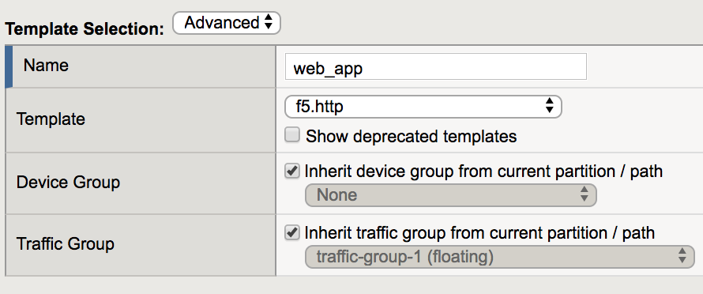
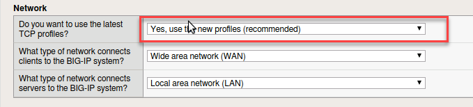

Exercise 4.0: HTTPS iApp with Policy
----------------------------------------

Overview
~~~~~~~~~~~~~~~~~~~~~~~~~~~~~~~~~~~~~~~~~~~~~~~~~~~~~

F5 offers a number of templated installations for various applications.  For generic web based applications you can find the https iapp template.  As an update to this template we have added security functions such as firewall and web application firewall policies that can be deployed with the application.  In this lab we will focus on using the basic http iApp template.  If you are interested in integrating similiar templates in to your automation and orchestration strategies please follow this training with the Application Services Lab located here:

::

  http://clouddocs.f5.com/products/extensions/f5-appsvcs-extension/3/

Task 1 - Deploy iApp with Security
~~~~~~~~~~~~~~~~~~~~~~~~~~~~~~~~~~~~~~~~~~~~~~~~~~~~~

1.  Go to **iApps > Application Services** then click on Create

.. image:: images/image1_4_4.png
    :width: 600 px

2.  Give the application a name

3.  In the drop down box for template choose f5.http (also choose Advanced just above)

.. NOTE::  This template has been imported for this lab.  You will find this template at F5 Downloads.  Follow this article on how to download: https://support.f5.com/csp/article/K98001873  The deployment guide can be found here:  https://www.f5.com/pdf/deployment-guides/iapp-http-dg.pdf

4.  New information appears below that will allow you to configure an application with web application security.  In the network section answer Yes, use the new profiles.

5.  In the SSL Encryption section select Terminate SSL from clients, plaintext to servers (SSL Offload)

.. image:: images/image5_4_4.png
    :width: 600 px

6.  In the Application Security Manager section select Yes, use ASM and create a new ASM policy.  Also select the waf_allrequests logging profiles

.. image:: images/image1.png
    :width: 600 px

7.  In the Virtual Server and Pool section give the IP Address, an FQDN and select the webgoat_pool, as shown in the example.

.. image:: images/module4Lab1Excercise1-image6.png
    :width: 600 px

8.  Click finished and have patience while the application objects are built

.. image:: images/image8_4_4.png
    :width: 600 px

9.  Open a New Private Window in Firefox and enter **https://10.1.10.147/WebGoat/login** in url box. When you get the SSL warning click Advanced and Add Exception

10.  Login with f5student and password 

11.  You can try surfing around the application.  Try an injection attack.

12.  Return to the BIG-IP.  Go to **Security > Application Security > Policy Building > Traffic Learning** Select the new policy built by the iApp **web_app_policy**

Do you see learning suggestions? (Hint - there are none yet)

13.  Go to **Security > Application Security > Policy Building > Learning and Blocking Settings**

14.  Click the carrot by Attack Signatures then Change at the far right to add more signatures.

15.  Choose the High Accuracy Signature sets and SQL injection.

.. image:: images/image11_4_4.png
    :width: 600 px

16.  Click Save and Apply Policy

Task 2 - Attack Application
~~~~~~~~~~~~~~~~~~~~~~~~~~~~~~~~~~~~~~~~~~~~~~~~~~~~~

1.  Open a New Private Window in Firefox and enter **https://10.1.10.147/WebGoat/login** in url box.

2.  At the username prompt try entering a sequel query for the username and the letter a for the password

::

    or 1='1

.. NOTE:: Did you see anything?  Why do you think you were not blocked?

4.  Return to the BIG-IP Go to **Security > Event Logs > Application > Requests** and clear the **illegal requests** filter.

5.  You will find an level 3 alert there for the login page.

6.  Return to the WebGoat application and login with credentials f5student and password 

7.  From the left menu go to Injection Flaws --> SQL Injection and select exercise 7

.. image:: images/image5_3_2.png
    :width: 600 px

8.  In the account name field try an injection attack

::

    %' or 1='1

.. NOTE::  Were you blocked?  Why or why not?

.. image:: images/image4.png
    :width: 600 px

9.  Return to the BIG-IP **Security > Event Logs > Application > Requests**

10.  You will need to refresh.  Locate the attacks.  Is the policy in transparent or blocking?  How can you change the policy to mitigate against this attack?

We hope you enjoyed this session! Please leave us a great review and come again next year!! The End!
~~~~~~~~~~~~~~~~~~~~~~~~~~~~~~~~~~~~~~~~~~~~~~~~~~~~~~~~~~~~~~~~~~~~~~~~~~~~~~~~~~~~~~~~~~~~~~~~~~~~~~
