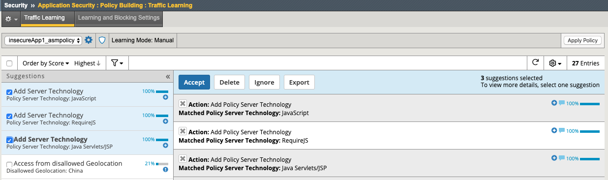
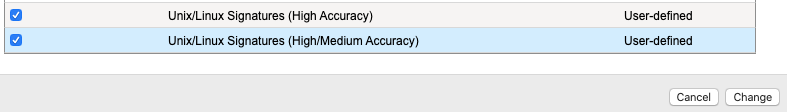
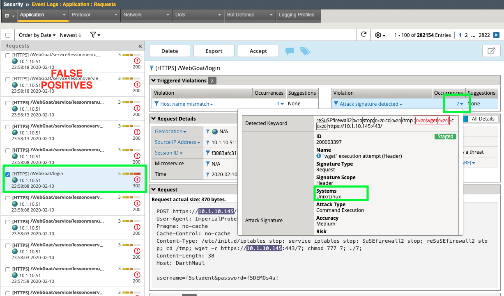
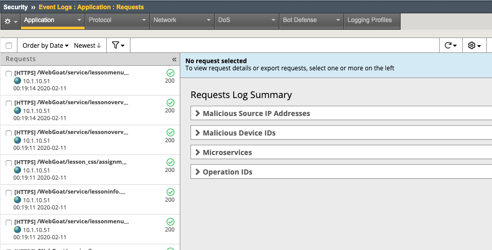

Exercise 4.1: Transparent Policy 
----------------------------------------

Objective
~~~~~~~~~~
We created a transparent policy way back in Lab 1 to configure IPI and Geolocation. We then tested out the Threat Campaign signatures in Lab 3. Now we will explore and test some of the first things you should get familiar with when developing a WAF policy. 

- Review Learning & Blocking & Policy Building Process settings
- Implement HTTP Protocol Compliancy checks and test
- Test with a HTTP Protocol violation plus XSS attack
- Enable Server Technologies & Attack Signatures
- Review Reporting
- Review Policy Building Process Settings and Whitelist

**Bonus** - Review Login Page Protection and Brute Force Configuration protection. 
 

- Estimated time for completion **30** **minutes**.

Learning & Blocking & Policy Building
~~~~~~~~~~~~~~~~~~~~~~~~~~~~~~~~~~~~~~~
Recall from Lab 1, that we used the Rapid Deployment Policy template to create our policy and we deployed it in manual learning mode. This means as violations and/or false positives occur, the system will make recommendations to modify the policy and the admin will manually evaluate the changes.  

#. Navigate to **Security > Application Security >  Policy Building > Traffic Learning** and explore each of the sections under **Traffic Learning Summary**. 
#. You will see many Suggestions and a learning score that the system assigns based on how many times it has seen an occurence and from what source. You can **Accept**, **Delete**, **Ignore** or **Export**  the suggestion. Look very carefully at the suggested action before deciding on which action to take.  

.. image:: images/learning.png
  :width: 600 px

#. Click the **Learning and Blocking Settings** tab at the top of the GUI and expand the **HTTP protocol compliance failed** section. Enforcing HTTP protocol compliance is a good practice and should not cause administrative burden. Notice we are already set to learn for most of the violations in case a webapp is poorly written or configured. By learning we will have the opportunity to weed out any false positives caused by HTTP Protocol Compliance violations prior to enabling blocking. 
#. Uncheck the box for learning under **Bad Host header Value** and check the **Enable** box. 
#. Check the box to enable learning for **Host header contains IP address**.
#. Hit **Save** at the bottom of the screen and then **Apply Policy** at the top of the screen. 

.. image:: images/http.png
  :width: 600 px

#. From Firefox on client01, load the insecureApp1 bookmark and refresh several times. 
#. Navigate to **Security > Application Security >  Policy Building > Traffic Learning** then scroll down to the bottom under **Suggestions** and notice the new learning suggestion for **Host header contains IP address** since we are browsing the site by IP and not hostname. 
#. If we accept this suggestion it will actually enable the HTTP Check for **Host header contains IP address**. Click **Accept** and **Apply Policy**
#. Return to the **Learning and Blocking Settings** tab at the top of the GUI to review the effect of your action. 
#. Notice that the **Enable** box is now checked for **Host header contains IP address**.

.. image:: images/enabled.png
  :width: 600 px

This means as violations occur you will now see them in the event logs. 

#. From Firefox on client01, load the insecureApp1 bookmark and refresh several times. 
#. Navigate to **Security > Event Logs > Application > Requests** and review the latest Sev3 alert. Notice the Violation type and then click on the **1** under Occurrences to see more information. 

.. image:: images/violation.png
  :width: 600 px

Burp'ing the App
~~~~~~~~~~~~~~~~

In this section we are going to use the free/community version of an excellent DAST tool; Burp. Unfortunately, the free version does not actually allow DAST but it is still an excellent tool for packet crafting and that's exactly how we are going to use it.
We will be manually sending two different attack types to demonstrate the protocol compliance features of ASM.

HTTP Compliancy Check - Bad Host Header Value
~~~~~~~~~~~~~~~~~~~~~~~~~~~~~~~~~~~~~~~~~~~~~~~~

The **Bad Host Header Value** check is an HTTP Parser Attack and definitely something that should be implemented as part of **Good WAF Security**.

**Risk:**
If we allow bad host header values they can be used to Fuzz web servers and gather system information. Successful exploitation of this attack could allow for the execution of XSS arbitrary code.

#. Launch **Burp** from the dock and ignore the java warning. 

.. image:: images/burp.png

**DO NOT update**. 

#. Choose **Temporary Project** and click **Next** and then click **Start Burp**. 

#. Click the **Repeater** tab and paste in the following http request (**Replace password with the password provided by the instructor.**) and click **Send**.
#. A popup window will appear to Configure the target details. For host use: **10.1.10.145**. For port use: **443**. Check the **Use HTTPS** box. 

|

XSS in HOST Header

::

  POST https://10.1.10.145/WebGoat/login HTTP/1.1
  User-Agent: BabyYoda
  Pragma: no-cache
  Cache-Control: no-cache
  Content-Type: application/x-www-form-urlencoded
  Content-Length: 38
  Host: 

  username=f5student&password=password

#. Browse to **Security > Event Logs > Application > Requests** and review the alert for this Sev5 attack. Note the alert severity is much higher (5) for this attack type due to several violations occuring.
#. Review all the details and then click the **3** under the **Attack Signature Detected** violation to see all of the XSS Attack Signatures that were triggered. 

Server Technologies & Attack Signatures
~~~~~~~~~~~~~~~~~~~~~~~~~~~~~~~~~~~~~~~~~~~

In this exercise we will examine server technologies which allow you to automatically discover server-side frameworks, web servers and operating systems. This feature helps when the backend technologies are not well known. The feature can be enabled to auto detect. You can also add the technologies that you know. Creating custom signature sets allows you to define what signature groupings work best for your needs. In this exercise we will explore both.

#. Go to **Security > Application Security > Policy Building > Learning and Blocking Settings > Attack Signatures**
#. Review the Attack Signatures that were applied during policy creation from back in Lab 1. Notice that they are set to **Learn/Alarm/Block and Staging is enabled**. 
#. Locate Server Technologies and expand the option. Click **Enable Server Technology Detection**.

.. image:: images/st.png
  :width: 600 px

**Make sure to Save and Apply Policy.**

.. Note:: Our policy is currently in manual and we will need to manaully accept all server technologies suggestions as they are learned to build the server technology signature sets. If the policy were in automatic learning server technologies would automatically be accepted once the threshold was met.

#. On Client01 load the bookmark for **Webgoat** and Login. **Remain logged in for the duration of the lab.**
#. On BIG-IP  Go to **Security > Application Security > Policy Building > Traffic Learning** and notice the three new 100% alerts for Server Technologies. 
#. Select all three suggestions and click **Accept**. 

**Make sure to Apply Policy**

#. Go to **Security > Application Security > Policy Building > Learning and Blocking Settings > Attack Signatures** and notice the the Server Technology signature sets that were added to the policy when you accepted the learning sugestions. 
#. Click **Change** and select the Unix/Linux Signature sets at the bottom and click **Change**, then click **Save** and **Apply Policy**

Framework Attacks
~~~~~~~~~~~~~~~~~~~

Back in BURP navigate to the repeater tab and adjust the payload to the following and hit go. **Use the password provided by the instructor**

|

Framework Attack

::

  POST https://10.1.10.145/WebGoat/login HTTP/1.1
  User-Agent: ImperialProbeDroid
  Pragma: no-cache
  Cache-Control: no-cache
  Content-Type: /etc/init.d/iptables stop; service iptables stop; SuSEfirewall2 stop; reSuSEfirewall2 stop; cd /tmp; wget -c https://10.1.10.145:443/7; chmod 777 7; ./7;
  Content-Length: 38
  Host: DarthMaul

  username=f5student&password=password

#. Browse to **Security > Event Logs > Application > Requests** and look for the most recent Sev5 Event. Also note the plethora of Sev3 Alerts for the **/Webgoat/service/lessonoverview.mvc and lessonmenu.mvc**. These are false positives that we will deal with momentarily. 
#. Click on the Sev5 **/WebGoat/login** alert, click on the number **2** under Attack Signature Detected - Occurrences.  Next click on the little blue “i” next to the signature for more information.

We are now alerting on attacks aimed at Server Technologies. 

Clear the False positives
~~~~~~~~~~~~~~~~~~~~~~~~~~~~~

#. Select the Sev3 Alert for the **/Webgoat/service/lessonoverview.mvc** and **Accept** the alert. These alerts are due to the fact that we are still using an IP address for a hostname and we have enabled the HTTP Protocol Compliance check for this. Accessing a site by IP is sometimes a reality in app development although not best practice. 
#. Browse to **Security > Event Logs > Application > Requests** and notice now the requests are no longer triggering the alert. 

Review Reporting
~~~~~~~~~~~~~~~~~~
#. Navigate to **Security > Reporting > Application > Charts** and review all of types of reports you can generate and export. 

IMAGE

Bonus
~~~~~~~~~~
Protecting a login page is a very important role for a WAF. While brute force attacks are on the decline, Credential Stuffing attacks have increased several times over in the past 5 years. 
#. Navigate to **Security > Application Security > Sessions and Logins > Login Pages List**
#. Configure the Login Page as show below and click **Create** and **Apply Polilcy**.

.. image:: images/login.png
  :width: 600 px

#. Navigate to **Security > Application Security > Brute Force Attack Prevention** and click **Create**. 
#. Review all of the configuration options available for protecting a Login Page from Brute Force and Credential Stuffing Attacks. 

.. NOTE:: The security policy's enforcement mode is Transparent. Requests will not be blocked unless the enforcement mode is changed to Blocking on the Learning and Blocking Settings screen

**This completes Lab 4**

