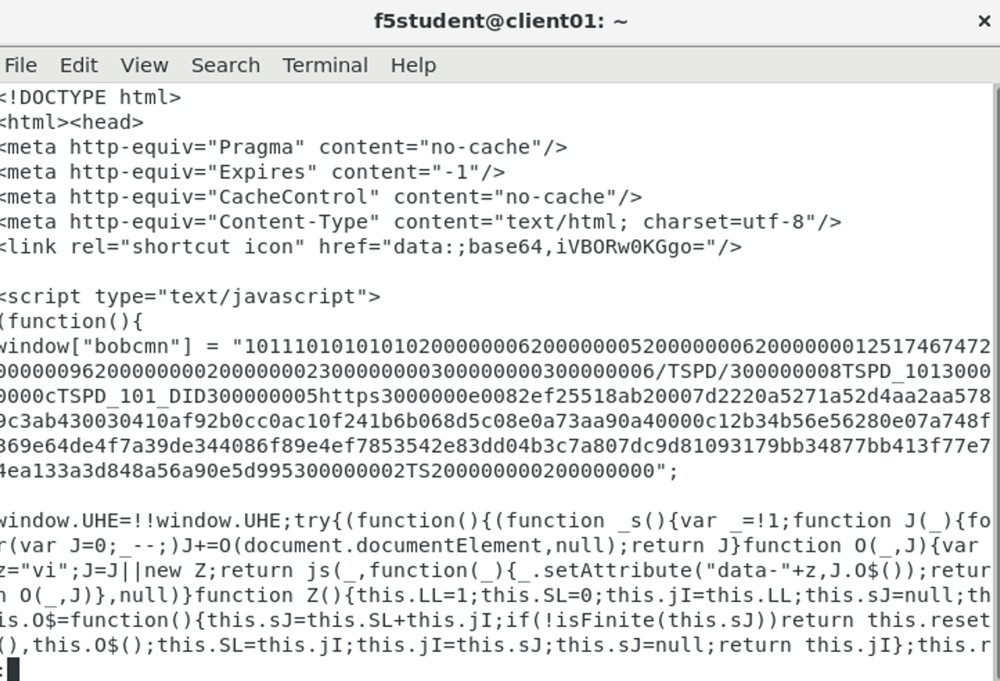
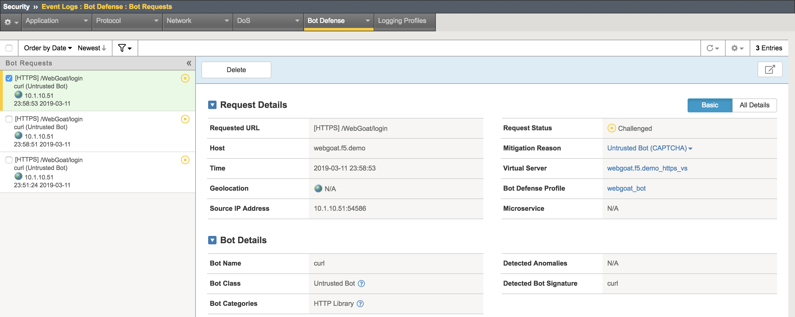

Exercise 1.3: Bot Defense
-------------------------

Objective

-  Create a Bot Defense profile

-  Test different mechanisms to detect and mitigate suspicious and untrusted clients

-  Apply the profile to the appropriate virtual server

-  Validate that the profile is working as expected

-  Estimated time for completion: **20** **minutes**

Create Profile 
~~~~~~~~~~~~~~

.. IMPORTANT:: To clearly demonstrate just the Bot Defense profile,
   please **disable the Application Security Policy and iRule from the prior lab** from the
   ``webgoat.f5.demo_https_vs`` virtual server!

.. image:: images/image1.PNG
  :width: 600 px
.. image:: images/image2.PNG
  :width: 600 px

#. Open the **Terminal** application.

#. Run the following curl command to verify the site is loading without issue from this command line http utility. If the curl command is not successful (you are getting a “request rejected” error page), please let an instructor know.

.. code-block:: bash

        curl https://webgoat.f5.demo/WebGoat/login -k -v | less 

|

Output
  .. image:: images/image30.PNG
    :width: 600 px

|

#. On the Main tab, click **Security > Bot Defense > Bot Defense Profiles**.
   The DoS Profiles screen opens.

   .. image:: images/image1_3_2.PNG
    :width: 600 px

#. Click on the **Create** button.

#. Name the policy ``webgoat_bot``, leaving the defaults and click **Save** to
   complete the creation of this Bot profile.

   .. image:: images/image1_3_3.PNG
    :width: 600 px

Configure Policy
~~~~~~~~~~~~~~~~

#. **Click** the newly created ``webgoat_bot`` profile listed under the
   **Security > Bot Defense > Bot Defense Profiles** list.

#. The profile’s properties menu will be displayed initially. **Click**
   on the **Enforcement Mode** and select **Blocking**. 

   .. image:: images/image1_3_4.PNG
    :width: 600 px

#. Notice that for **Untrusted Bot**  the default setting is **Alarm**, change this to **CAPTCHA**.

   .. image:: images/untrustedBot.png
    :width: 600 px

#. Click the **Save** button to complete the Bot
   Defense ``webgoat_bot`` profile.

Apply Proactive Bot Defense Policy
~~~~~~~~~~~~~~~~~~~~~~~~~~~~~~~~~~

#. Under **Local Traffic > Virtual Servers**, click
   on ``webgoat.f5.demo_https_vs``.

#. Click on **Policies** under the **Security** tab at the top of
   the ``webgoat.f5.demo_https_vs`` details menu.

#. In the **Bot Defense Profile** drop down menu,
   select ``Enabled...`` and then select the ``webgoat_bot`` for
   the profile.

#. Click on the **Update** button to apply the policy.

   .. image:: images/image1_3_8.PNG
    :width: 600 px

Create Bot Defense Logging Profile
~~~~~~~~~~~~~~~~~~~~~~~~~~~~~~~~~~

#. Open a new tab for the Configuration Utility and navigate to:
    **Security > Event Logs > Logging Profiles** then **click
   the plus icon**.

#. Enter a Profile Name ``bot-defense``, select the
   checkbox for ``Bot Defense``.

#. Under the **Bot Defense** logging section, select the checkboxes
   for the following: ``Local Publisher``, all checkboxes in the ``Log Requests by Classification`` section, all checkboxes in the ``Log Requests by Mitigation Action`` section, ``Log Requests by Browser Verification Action`` and ``Log Device ID Collection Request``.

#. Click **Create**.

   .. image:: images/image33.PNG
    :width: 600 px
    :height: 700 px

Apply Bot Defense Logging Profile
~~~~~~~~~~~~~~~~~~~~~~~~~~~~~~~~~

#. Under **Local Traffic > Virtual Servers**, click
   on ``webgoat.f5.demo_https_vs``.

#. Click on **Policies** under the **Security** tab at the top

#. Within the Available logging profiles menu,
   select ``bot-defense`` and then click
   the ``<<`` arrows to move the logging policy to
   the ``Selected`` profile.

#. Click on the **Update** button to apply the policy.

   .. NOTE:: You can associate multiple logging profiles with a given
      virtual server. F5 allows for an incredible amount of logging
      flexibility. Most commonly you would have DoS, Bot Defense and ASM
      Security Policy events logged to a centralized SIEM platform, but
      there may be additional logging requirements such as a web team that
      would be interested in Bot Defense logs solely, while the SIEM
      continues to receive the union of DoS, Bot Defense and ASM Security
      Policy events.

   .. image:: images/image34.PNG
    :width: 600 px

Test the Bot Defense Policy
~~~~~~~~~~~~~~~~~~~~~~~~~~~~~~~~~~~~~

#. From the command line execute the following command several times:

   ``curl https://webgoat.f5.demo/WebGoat/login -k -v | less``

This bot is getting shot down in flames!

Validate that the Bot Defense Policy is Working
~~~~~~~~~~~~~~~~~~~~~~~~~~~~~~~~~~~~~~~~~~~~~~~~~~~~~~~~~

#. Navigate to **Security > Event Logs > Bot Defense > Bot Requests**.

#. Notice that the detected bot activity has been logged and is now
   being displayed for review.

.. Important:: This is very important to understand that we are logging bots in an entirely different internal logging system than the ASM events. Implementing Bot Defense keeps the ASM logs clean and actionable when there are millions of malicious attempts per day from bots.

Note the stated reason for the request being blocked.
   What was the stated reason?

Selectively Blocking BOT Categories
~~~~~~~~~~~~~~~~~~~~~~~~~~~~~~~~~~~

cURL is considered an **HTTP Library tool**.

.. IMPORTANT:: Just how benign are HTTP library tools? cURL can easily be
   scripted in a variety of ways and can be used as a downloader to siphon
   off data. Remember the famous media defined “hacking tool” that Snowden
   used? wget? There are many use-cases where you simply do not want a tool
   interacting with your site.

#. Navigate to **Security > Bot Defense > Bot Defense Profiles**

#. **Click** on the ``webgoat_bot`` profile and then **Mitigation Settings**. 

#. Click on **Add Exceptions**, then navigate to **Untrusted Bot - CAPTCHA > HTTP Library** and select **curl - CAPTCHA** 

   .. image:: images/image1_3_13.png
    :width: 600 px

#. Click **Add**

#. Change the curl HTTP Library action from **CAPTCHA** to **TCP Reset** under

|

   .. image:: images/image1_3_14.png
    :width: 600 px

|

#. Click **Save**.

#. Run cURL again: ``curl  https://webgoat.f5.demo/WebGoat/login -k -v | less``

   .. image:: images/image35.png
    :width: 600 px

   Whammo!!!... as soon as the BOT is revealed... the connection is dropped.
   The TLS doesn’t get established.

   Let’s say we actually DO want to allow cURL or another automated
   tool. We may have developers that rely on curl so let’s whitelist
   just that.

#. Navigate back **Bot Requests** and view the log entries. 

**Whitelist and Report on cURL:**

1. Edit the **Mitigation Settings Exceptions** once again under the **webgoat_bot** profile and change **curl** to **None**  and click **Save**.

.. image:: images/image1_3_16.png
  :width: 600 px

|

2. Run cURL again: ``curl https://webgoat.f5.demo/WebGoat/login -k -v | less`` and you should be back in business. By now you should know the expected output.

3. Edit the **Mitigation Settings Exceptions** once again and change **curl** to **Report**  and click **Save**.

.. image:: images/image1_3_17.png
  :width: 600 px

cURL from Different Geolocations
~~~~~~~~~~~~~~~~~~~~~~~~~~~~~~~~

.. NOTE:: We are going to leverage an overlay virtual server to randomize source IP addresses similar to the earlier lab concept of randomizing XFF.

1. Go back to the Geolocation Enforcement settings and move all countries back to allowed and click **Save**.

.. image:: images/module1Lab2Excercise1-image16.png
        :width: 600 px
   
   
2.   Open **Local Traffic > Virtual Servers** and click on ``webgoat.f5.demo_https_overlay_vs``.
Go to the **Resources** horizontal tab and verify that the iRule **webgoat_overlay** is applied. Freel free to check out the code in the iRule. This iRule radomizes source ip to cause traffic to appear as if it has originated from another country.

.. image:: images/image1_3_19.PNG
  :width: 600 px

|

3. Modify the cURL command to point at the overlay virtual server and run several times: ``curl https://10.1.10.146/WebGoat/login -k -v | less``

4. Review the event logs at **Event Logs > Bot Defense > Bot Requests** You will
   now see geo-data for the BOT connection attempts.

.. image:: images/image1_3_20.png
  :width: 600 px

|

5. Navigate to **Security > Reporting > Application** and review the default
   report elements. You can change the widget time frames to see more historical data.

6. Click **Overview > Application > Charts** and override the time period to **Last Year**:

.. note:: Not all charts will have data. Here some that will, change the View By to the following, **Client Countries**, **Requests per Virtual Server**, **Violation Ratings**, **URLs**. Feel free to click around the charts and/or use curl to generate more traffic in them. 

|

.. image:: images/image1_3_21.png
  :width: 600 px

|

.. note:: AVR (Application Visibility Reporting) must be provisioned for these charts to work.

7. Take some time reviewing this screen and practice adding a new widget
   to see additional reporting elements:

**This concludes the BOT Protection section of this lab guide!**
