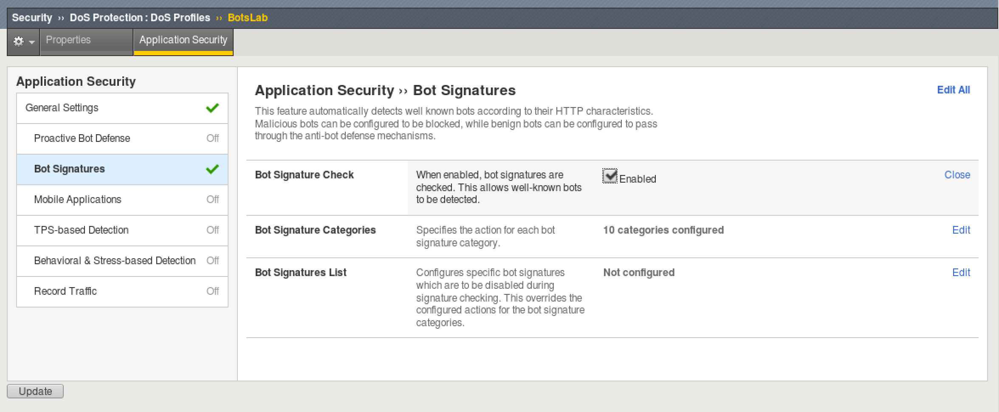
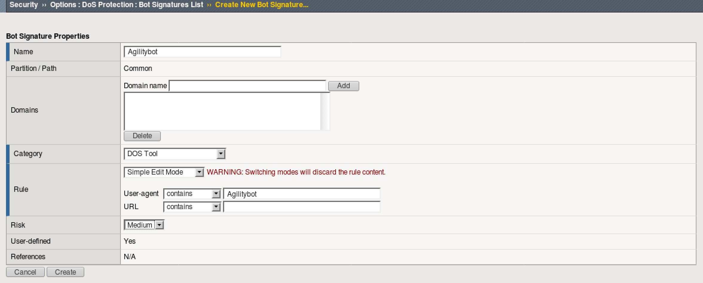

Lab 1: Bot Protection
------------------------------

This lab will simulate botnet activity against the Webgoat virtual server and show how to protect yourself from these types of threats.

Connect to the lab environment
~~~~~~~~~~~~~~~~~~~~~~~~~~~~~~

#. From the jumphost (client01), launch Chrome or firefox, click the BIG-IP bookmark and login to TMUI. admin/password

Configure a DOS Profile
~~~~~~~~~~~~~~~~~~~~~~~

#. From the F5 UI go to Security > Dos Protection > DoS Profiles and click Create

#. Name the profile BotsLab and click Finished

#. Click on the BotsLab profile and select the Application Security tab at top.

#. Click where it says Disabled and select the checkbox to Enable Application Security

#. Disable TPS-Based Detection on the left column by setting Blocking to Off.

#. Enable Bot Signatures on the left column by clicking Disabled and check the Enabled box.

#. Click Update to save the profile changes.

Create a Bot Logging Profile
~~~~~~~~~~~~~~~~~~~~~~~~~~~~

#. Go to Security > Event Logs > Logging Profiles and click Create

#. Name the profile BotsLogger and check Bot Defense

#. Check all the boxes under "Request Log" and leave remote publisher to None 

#. Click Finished to save the profile

.. image:: images/doslog.png

Assign DoS and Logging Profile to Virtual Server
~~~~~~~~~~~~~~~~~~~~~~~~~~~~~~~~~~~~~~~~~~~~~~~~

#. Go to Local Traffic > Virtual Servers > click on asm_vs Virtual

#. At the top, click on the Security Tab > Policies 

#. For DoS Protection Profile, select BotsLab

#. For Log Profile, select "BotsLogger" to add it to list of selected logging profiles, leaving "Log Illegal Requests"

#. Click Update to save changes

.. image:: images/assign.png

Simulate Bot Activity and Review Logs
~~~~~~~~~~~~~~~~~~~~~~~~~~~~~~~~~~~~~

1. On the client01 jumphost, open a terminal app to get a cli prompt

2. Run the following apache bench command:  

|

.. code-block:: bash

        ab -c 10 -n 10 -r http://10.1.10.145/

|

3. Review the Security Logs at Security > Event Logs > Bot Defense > Requests

4. Did requests succeed or fail? Why or why not?

5. Run the attack using a custom user-agent (if you copy and paste the command below, be careful of the double-quote conversion):

|

.. code-block:: bash

        ab -c 10 -n 10 -r -H "User-Agent: Agilitybot" http://10.1.10.145/

|

6. Review the Bot Defense request logs again to determine if the attack was mitigated. Why did the attack succeed?

Add a custom bot signature to your BotsLab profile
~~~~~~~~~~~~~~~~~~~~~~~~~~~~~~~~~~~~~~~~~~~~~~~~~~

1. Go to Security > Options > DoS Protection > Bot Signatures List and click Create
     
2. Name the signature Agilitybot and populate the following: 

- ``Category: Dos Tool``
- ``Rule:  User-agent > contains > Agilitybot``
- ``Risk: Medium``

3. Click Create

4. Rerun the attack from step 5 of "Simulate Bot Activity and Review Logs" and review the request logs. Was the attack mitigated?

|

.. code-block:: bash

        ab -c 10 -n 10 -r -H "User-Agent: Agilitybot" http://10.1.10.145/

|

5. Remove the DoS Protection Profile and the BotsLogger profile from the asm_vs, as shown below, before moving on.

|

.. image:: images/botdeflogrequests.png
        :width: 400px
