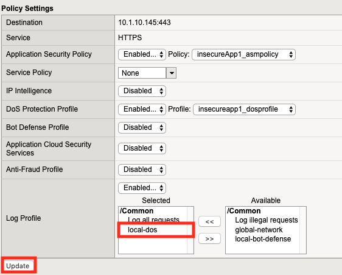
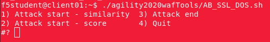
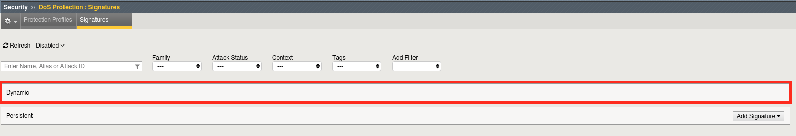
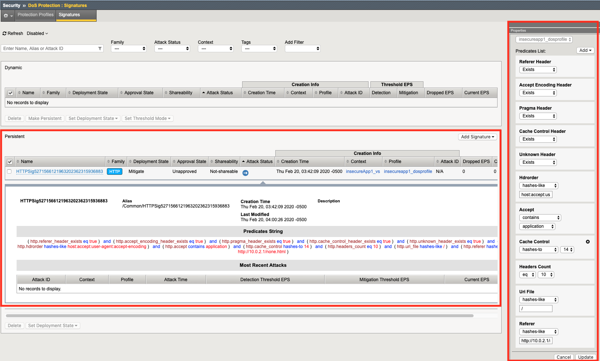
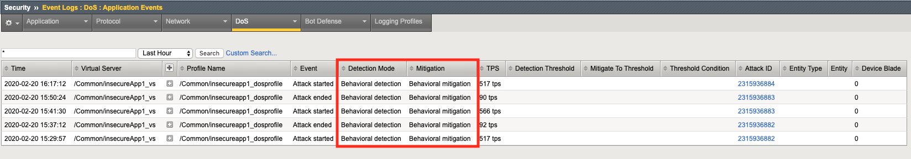
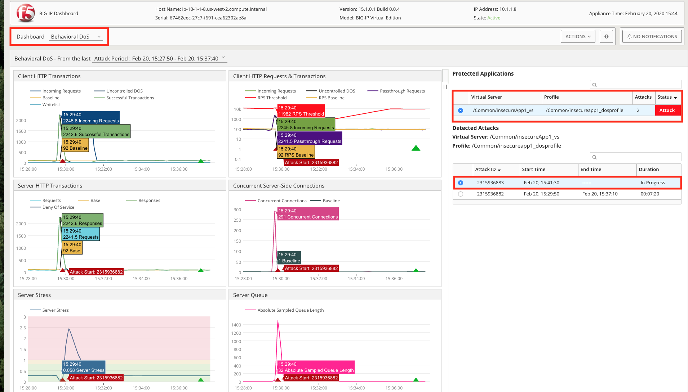

Lab 2.1: Behavioral DOS Protection
----------------------------------

..  |lab21-01| image:: images/lab21-01.png
        :width: 800px
..  |lab21-02| image:: images/lab21-02.png
        :width: 800px
..  |lab21-03| image:: images/lab21-03.png
        :width: 800px

..  |lab21-05| image:: images/lab21-05.png
        :width: 800px
..  |lab21-06| image:: images/lab21-06.png
        :width: 800px
..  |lab21-07| image:: images/lab21-07.png
        :width: 800px
..  |lab21-08| image:: images/lab21-08.png
        :width: 800px

..  |lab21-10| image:: images/lab21-10.png
        :width: 800px

..  |lab21-12| image:: images/lab21-12.png
        :width: 800px
..  |lab21-13| image:: images/lab21-13.png
        :width: 800px

..  |lab21-17| image:: images/lab21-17.png
        :width: 800px

In this lab you will run traffic generation scripts as well as attacks against a Virtual Server in order to trigger Behavioral DoS Protection.

Create the DoS Profile
~~~~~~~~~~~~~~~~~~~~~~~

#.  Open Chrome and use the **bigip01** shortcut to login to the BIG-IP.

#.  Navigate to **Security -> DoS Protection -> Protection Profiles** and click **create**.

#.  Name the profile **insecureapp1_dosprofile** like below, then click **Behavioral & Stress-based Detection** to the left:

    |lab21-01|

#.  Configure the **Behavioral & Stress-based Detection** settings like below:

    |lab21-02|

#.  Navigate to **Local Traffic -> Virtual Servers -> insecureApp1_vs** then clicking  **Security Tab -> Policies**

#.  Attach the DoS Protection Profile to the virtual server we just created by selecting **Enabled** next to **DoS Protection Profile** and selecting **insecureapp1_dosprofile** from the dropdown.

    |lab21-03|

#.  Enable the **local-dos** logging profile, and click **update**

    |lab21-04|

Train the DoS Profile
~~~~~~~~~~~~~~~~~~~~~

#.  Open a Terminal Session on the BIG-IP and type **bash** followed by **enter**.

#.  Type the following command:

    .. code-block:: bash

            admd -s vs./Common/insecureApp1_vs+/Common/insecureapp1_dosprofile.info.learning
    ..

    It should look like this:

    |lab21-05|

#.  Open another terminal window on your jumphost, examine your home directory and run the **baseline_menu.sh** script.

    .. code-block:: bash

            ./agility2020wafTools/baseline_menu.sh
    ..

#.  Select either **option 1** or **option 2**, but notice that option 3 stops the attack.  You will use this later.

    |lab21-06|

#.  Open one more terminal window and run the script again, but this time select the **other** option.

    |lab21-07|

    .. NOTE:: Due to the use of machine learning, the order in which you execute these traffic generation patterns does not particularly matter.  The BIG-IP will learn regardless. The purpose is really to train the BIG-IP on "normal traffic patterns" for the app.  Obviously, this is a sterile environment designed to demonstrate the capabilities quickly.  Traffic learning in a production environment will likely take significantly longer.

#.  Go back to your BIG-IP terminal window and take a look at the output of your prior **admd** command.  The admd command returns data on the progress of the traffic learning process.  Wait until the first number in the brackets has a value of 90 or above.  This represents the percentage confidence the system has in the accuracy of the baseline traffic.

    |lab21-08|

#.  Once you have reached 90% confidence, you may move on to the next task.  This may take upto **10 minutes or longer** depending on various factors.

Launch an Attack
~~~~~~~~~~~~~~~~

#.  Open yet another terminal window on the jumphost.

#.  In your home directory, you will find another script named **AB_SSL_DOS.sh**.  Run this script.

    .. code-block:: bash

            ./agility2020wafTools/AB_SSL_DOS.sh
    ..
    
    |lab21-09|

#.  Select **1** for "Attack start - similarity" and hit **enter**.  Notice that entering 4 ends the script.  You will use this later to end the attack.  As the attack starts, the output should look similar to this:

    |lab21-10|

    .. NOTE:: At some point, the script may start to generate SSL errors.  This is expected as the BIG-IP adds the offending IP addresses to its shun list while it computes a solution to the attack.

Examine the Mitigation
~~~~~~~~~~~~~~~~~~~~~~

#.  In the TMUI, go to **Security > DoS Protection > Signatures** and click on the bar for **Dynamic**. You should see an entry similar to the on below (this may not show up right away, refresh the page until an entry appears).

    |lab21-11|

    |lab21-12|

    Notice that the **Deployement State** is **Mitigate**. Since **approve signatures** was not enabled in the DoS Protection profile, this signature was automatically deployed once computed.  If desired, enabling the **aprove signatures** option would require user interaction before any mitigations were deployed.

#.  Click on the **signature name** (in blue) to examine the contents of the signature.

    |lab21-13|

    The signature generated here is a product of machine learning.  The BIG-IP is actually able to determine which aspects of the traffic are problematic and create a signature to match them....Thus protecting you from the attack.

#.  Machine generated signatures can also be promoted to persistent.  Select the **checkbox** next to the signature and click **Make Persistent**.

#.  Once persistent, the signature will remain a part of the BIG-IP system and may actually be modified manually if so desired.  To modify the signature open the **flyout** on the right.

    |lab21-14|

Visibility & Reporting
~~~~~~~~~~~~~~~~~~~~~~

#.  Navigate to **Security -> Event Logs -> DoS -> Application Events** 

    |lab21-15|

#.  This gives us a quick view of what has happened from an Application DoS perspective. Notice that the attack Detection and Mitigation were Behavioral.

#.  Now, navigate to **Security -> Overview -> Dashboard**.  Ensure that you've selected a virtual server on the right and that the Behavioral DoS dashboard is selected in the upper left.  Spend some time exploring here.  Notice you can get details from each attack and export the data to CSV for later analysis.

    |lab21-16|

#.  Next, navigate to **Security -> Reporting -> DoS -> URL Latencies**.  The BIG-IP also keeps track of the performance of each URI in order to assess the impact of an attack (stress) on specific parts of an application.

    |lab21-17|

#. In each of your terminal windows type **Ctrl+C** to terminate the scripts. The **AB_SSL_DOS.sh** script will require you to enter **3** stop the attacks, then **4** to quit after pressing **Ctrl+C**.

|

**This concludes module 2.**
