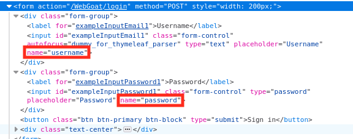
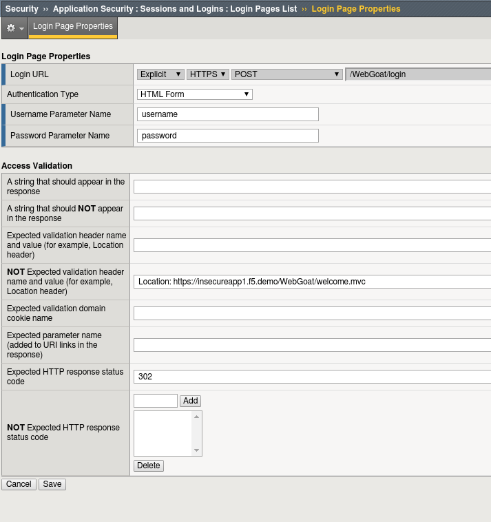
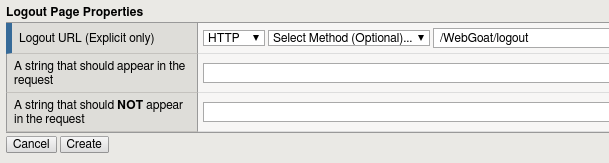
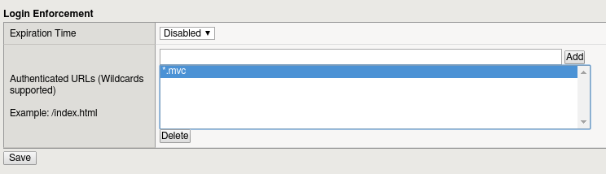
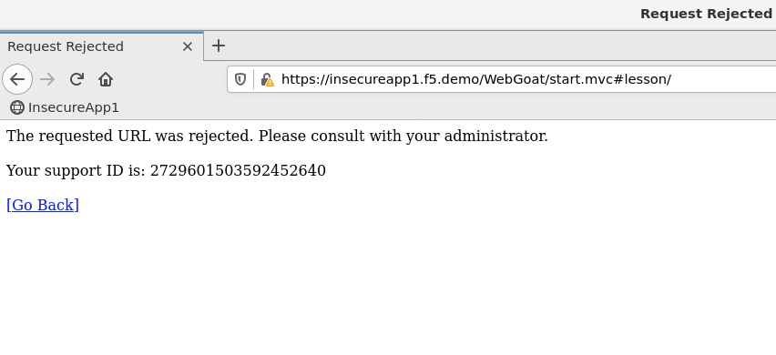
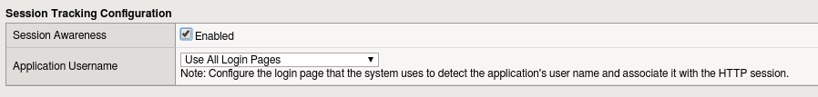
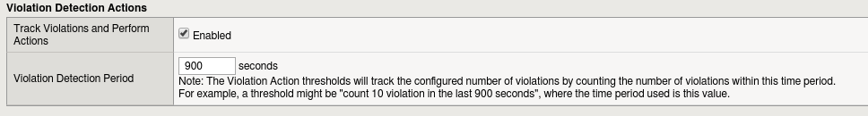
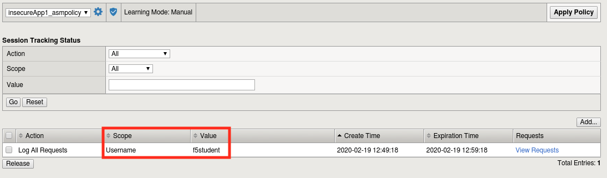
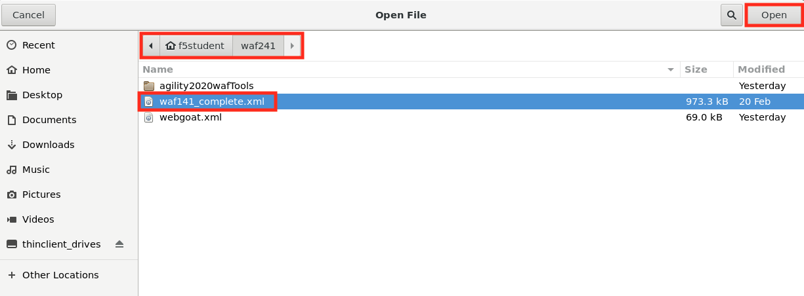

Lab 4.1: Login Page Protection
------------------------------

..  |lab41-01| image:: images/lab41-01.png
        :width: 800px
..  |lab41-02| image:: images/lab41-02.png
        :width: 800px

..  |lab41-07| image:: images/lab41-07.png
        :width: 800px

..  |lab41-09| image:: images/lab41-09.png
        :width: 800px
..  |lab41-10| image:: images/lab41-10.png
        :width: 800px

..  |lab41-13| image:: images/lab41-13.png
        :width: 600px
..  |lab41-14| image:: images/lab41-14.png
        :width: 800px
..  |lab41-15| image:: images/lab41-15.png
        :width: 800px

..  |lab41-17| image:: images/lab41-17.png
        :width: 800px

..  |lab41-19| image:: images/lab41-19.png
        :width: 800px
..  |lab41-20| image:: images/lab41-20.png
        :width: 600px

In this exercise we'll explore some of the login protection and session tracking capabilities present in BIG-IP ASM.  BIG-IP ASM not only has the capability to gather user identity details from login pages and APM, but can also generate a unique device-id for each connected client.  You'll explore this more in WAF341.

Task 0: Level Set
~~~~~~~~~~~~~~~~~

This lab depends on components built in WAF141.  If you're continuing on from WAF141 using the same lab environment, proceed to Task1.  If this is a new environment, follow the directions below to restore a completed policy from WAF141.

#.  Open Chrome and navigate to the BIG-IP management interface.  For the purposes of this lab you can find it at ``https://10.1.10.245/`` or by clicking on the **bigip01** shortcut.

#.  Login to the BIG-IP.

#.  Navigate to **Security -> Application Security -> Security Policies**.

#.  Click the **...** button next to create, then click **import policy**.

    |lab41-17|

#.  Naviagte to the waf241 folder and open the **waf141_complete.xml** file.

    |lab41-18|

#.  Ensure that **New Policy** is selected and click **Import**.

    |lab41-19|

#.  You now have a policy like the one below:

    |lab41-20|

#.  If everything looks correct, continue to **Task 1**.

Task 1: Verify ASM configuration
~~~~~~~~~~~~~~~~~~~~~~~~~~~~~~~~~~~~~~~~~~~~~~~~~~~

#.  Open Chrome and navigate to the BIG-IP management interface.  For the purposes of this lab you can find it at ``https://10.1.10.245/`` or by clicking on the **bigip01** shortcut.

#.  Login to the BIG-IP.

#.  Ensure that the **insecureApp1_asmpolicy** policy and the **Log All requests** log profile are enabled on the **insecureApp1_vs** virtual server as shown below.

        |lab41-01|

#.  Navigate to  **Security -> Application Security -> Security Policies -> Policies List** and place the **insecureApp1_asmpolicy** policy in **blocking** mode.

Task 2: Define Login & Logout Pages
~~~~~~~~~~~~~~~~~~~~~~~~~~~~~~~~~~~

#.  To configure a login page, go to **Security -> Application Security -> Sessions and Logins -> Login Pages List**.  Ensure the **insecureApp1_asmpolicy** is selected at the top of the screen and click **Create**.

#.  We'll now populate the form with data gathered from your favorite browser or reconnaissance tool.  For expedience, we've gathered the appropriate data for you in advance:

        |lab41-03|

#.  Populate the form as shown below and click **Create**:

        |lab41-04|

#.  From the tab bar select **Logout Pages List** or navigate to **Security -> Application Security -> Sessions and Logins -> Logout Pages List**

#.  Populate the form as shown below and click **Create**.

         |lab41-05|

#.  Navigate to **Security -> Application Security -> Sessions and Logins -> Login Enforcement**, populate the list shown

         |lab41-06|

#.  Now, head over to **Security -> Application Security -> Policy Building -> Learning and Blocking Settings**

#.  Expand **Sessions and Logins**

#.  Ensure that the **Login URL bypassed** violation is configured as follows and click **save**:

        |lab41-07|

#.  Click **Apply Policy**

Task 3: Test Login Enforcement
~~~~~~~~~~~~~~~~~~~~~~~~~~~~~~

#.  In Firefox, browse to **https://insecureapp1.f5.demo/WebGoat/start.mvc**

#.  Your attempt should be blocked:

        |lab41-08|

#.  Now, navigate to **Security -> Event Logs -> Application -> Requests** and locate the **start.mvc** request.  It should be near the top.

        |lab41-09|

        ..NOTE:: Note that this is not particularly real world due to the relatively small volume of traffic in this lab environment.  In a production environment, it would likely be more expedient to search on the support id.

#.  Note the reason for the block.  This was the violation we just configured:

        |lab41-10|

Task 4: Enable Session Tracking
~~~~~~~~~~~~~~~~~~~~~~~~~~~~~~~

#.  Navigate to **Security -> Application Security -> Sessions and Logins -> Session Tracking**

#.  Check **Session Awareness** and ensure **Use All Login Pages** is selected in the drop-down below it.

        |lab41-11|

#.  Ensure **Track Violations and perform Actions** is also enabled, then click **Save**.

        |lab41-12|

#.  Click **Apply Policy** in the upper right hand corner of the inner frame, then click **OK**.

Task 5: Test Session Tracking
~~~~~~~~~~~~~~~~~~~~~~~~~~~~~

#.  In Firefox open a private browsing window and browse to **https://insecureapp1.f5.demo/WebGoat/login** then login.

#.  Return to the BIG-IP interface and navigate to **Security -> Event Logs -> Application -> Requests**

#.  Ensure that you're viewing all requests.

#.  Click on the most recent log entry.  You should now see that the username that submitted the request is clearly identified in the log.

        |lab41-14|

#.  Click the drop-down next to the username field and you should be given 3 options.  **Enable** "Log All Requests" and click **change**.

        |lab41-15|

        .. NOTE::  Since we are already logging all requests, this will not affect the logging per say, but will allow us to demonstrate the associated reporting features in ASM without blocking access to our lab client.

#.  Navigate to **Reporting -> Application -> Session Tracking Status**.  You should now see that the user f5student appears in the tracking list.  If you were to click "View Requests" you would be taken to only the requests made by that user.  You may also use this page to release the user from Session Tracking.  These features are useful for forensic purposes as well as blocking access to applications by Device-ID, Username, etc.

        |lab41-16|

#.  Finally, **select** the f5student entry in the list and click **release**, then close the private browsing window.

    **This concludes Section 2.1**

