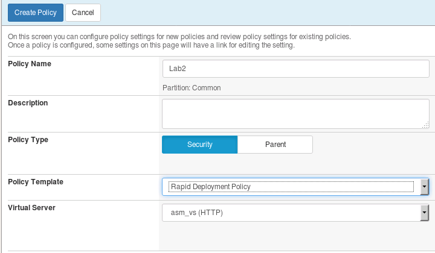
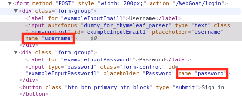
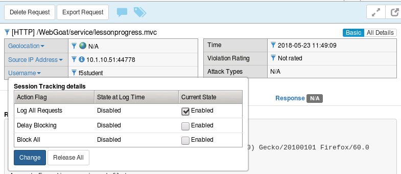

Lab 2.1: User Session Tracking
------------------------------

..  |lab21-2| image:: images/lab21-2.png
        :width: 800px

..  |lab21-4| image:: images/lab21-4.png
        :width: 800px
..  |lab21-5| image:: images/lab21-5.png
        :width: 800px
..  |lab21-ffprivate| image:: images/lab21-ffprivate.png
        :width: 600px
..  |lab21-6| image:: images/lab21-6.png
        :width: 800px

In this exercise we'll explore the session tracking capabilities present in BIG-IP ASM.  BIG-IP ASM not only has the capability to gather user identity details from login pages and APM, but can also generate a unique device-id for each connected client.  We'll explore both below.

Task 1: Create a Security Policy and Enable Logging
~~~~~~~~~~~~~~~~~~~~~~~~~~~~~~~~~~~~~~~~~~~~~~~~~~~

#.  Open your browser of choice and navigate to the BIG-IP management interface.  For the purposes of this lab you can find it at ``https://10.1.1.245/`` or by clicking on the **bigip** shortcut in Firefox.

#.  Login to the BIG-IP with the username: **f5student** and the password **password**

#.  Create a new ASM policy by navigating to **Security -> Application Security -> Security Policies**.

#.  Click **Create New Policy**, fill in the page as follows, and then click **Create Policy** as shown below.
    
        |lab21-1|
        
        .. NOTE:: If the virtual server doesn't appear in the dropdown list, ensure that it has an HTTP profile assigned.

#.  Navigate to **Local Traffic -> Virtual Servers -> asm_vs -> Security -> Policies**.

#.  Ensure the Log Profile is set to  **"Log All Requests"** profile as shown below.

        |lab21-2|

        .. note:: While you're here it's a good idea to confirm that the Lab2 security policy is also enabled.

Task 2: Define Login & Logout Pages
~~~~~~~~~~~~~~~~~~~~~~~~~~~~~~~~~~~

#.  To configure a login page, go to **Security -> Application Security -> Sessions and Logins -> Login Pages List** and click **Create**.

#.  We'll now populate the form with data gathered from your favorite browser or reconnaissance tool.  For expedience, we've gathered the appropriate data for you in advance:

        |lab21-3|

#.  Populate the form as shown below and click **Create**:

        |lab21-4|

#.  From the tab bar select **Logout Pages List** or navigate to **Security -> Application Security -> Sessions and Logins -> Logout Pages List**

#.  Populate the form as shown below and click **Create**.

        |lab21-5| 

Task 3: Enable Session Tracking
~~~~~~~~~~~~~~~~~~~~~~~~~~~~~~~

#.  Navigate to **Security -> Application Security -> Sessions and Logins -> Session Tracking**

#.  Check **Session Awareness** and ensure **Use All Login Pages** is selected in the drop-down below it.
    
#.  Ensure **Track Violations and perform Actions** is also enabled, then click **Save**.

#.  Click **Apply Policy** in the upper right hand corner of the inner frame, then click **OK**.

Task 4: Test Session Tracking
~~~~~~~~~~~~~~~~~~~~~~~~~~~~~

#.  Navigate to **Security -> Event Logs -> Application -> Requests** and click the **X** in the filter bar to clear the **Illegal Requests** filter.

#.  Click on the select all **checkbox** to the far left of the filter bar then **Delete Requests** or if given the option **Delete all Requests**.  This will make it easier to review the logs from the next step.

#.  In Firefox open a private browsing window and navigate to ``http://10.1.10.145/WebGoat/login``, then login to the WebGoat app with the credentials **f5student** / **password** .

        |lab21-ffprivate|

#.  Return to the BIG-IP interface.

#.  Deselect the **checkbox** and click the **refresh** button.

#.  Click on the most recent log entry.  You should now see that the username that submitted the request is clearly identified in the log.

        |lab21-6|

#.  Click the drop-down next to the username field and you should be given 3 options.  **Enable** "Log All Requests" and click **change**.

        |lab21-7|

        .. NOTE::  Since we are already logging all requests, this will not affect the logging per say, but will allow us to demonstrate the associated reporting features in ASM without blocking access to our lab client.

#.  Navigate to **Reporting -> Application -> Session Tracking Status**.  You should now see that the user f5student appears in the tracking list.  If you were to click "View Requests" you would be taken to only the requests made by that user.  You may also use this page to release the user from Session Tracking.  These features are useful for forensic purposes as well as blocking access to applications by Device-ID, Username, etc.

#.  Finally, **select** the f5student entry in the list and click **release**, then close the private browsing window.

    **This concludes Section 2.1**

