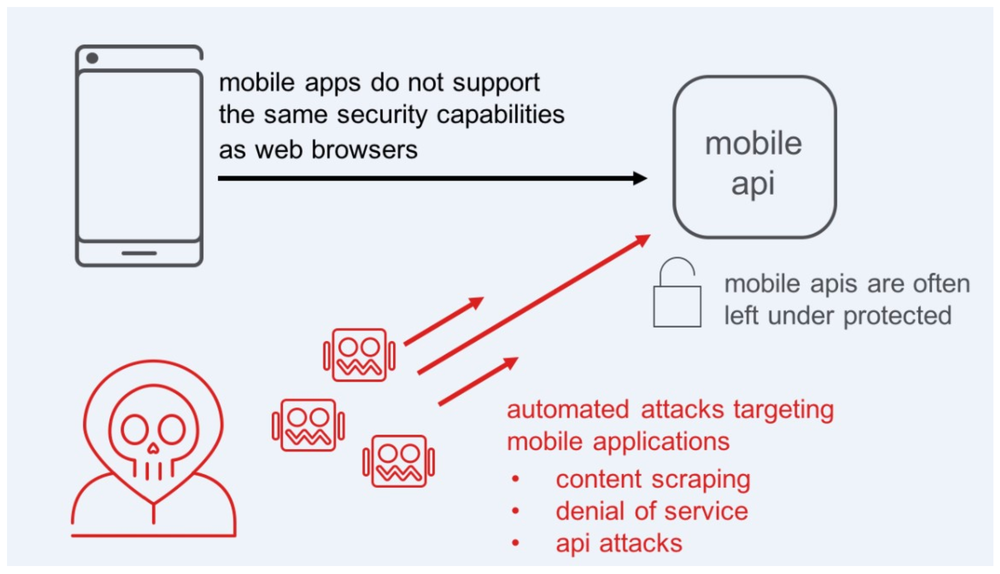

Class 5: WAF 341 – Advanced Protection and Positive Security
============================================================

This lab will focus on how to progress your application security to the limits of what F5 WAF can offer.

This is the 3rd class in a three part lab series based on:

`Succeeding with Application Security <https://support.f5.com/csp/article/K07359270>`_

Here is a complete listing of all F5 WAF classes offered at this years Agility.

* WAF 111 - Protect yourself against the OWASP Top 10

* WAF 141 - Getting started with WAF, Bot Defense and Threat Campaigns

* WAF 241 – Elevated WAF Protection

* WAF 341 – Advanced Protection and Positive Security

* WAF 342 – WAF in a CI/CD pipeline (new 15.1 features)

* WAF/APM API Security and Management

Following the Agility conference you can visit `clouddocs.f5.com <https://clouddocs.f5.com>`_ to continue your education and create your own test lab environment.

WAF 341 Table of Contents:

.. toctree::
   :maxdepth: 1
   :glob:

   labinfo/labinfo
   module*/module*

F5 Anti-Bot Mobile SDK extends bot identification in Advanced Web Application Firewall (Advanced WAF) and BIG-IP ASM protection to allow mobile applications to identify as valid applications, which eliminates bot threats.
To use this enhanced capability, you must integrate the F5 Anti-Bot Mobile SDK with your mobile applications.

F5 Anti-Bot Mobile SDK Integration
https://www.f5.com/pdf/products/integrate_F5_anti-bot_mobile_SDK_with_any_mobile_app.pdf

F5 Bot Management
https://www.f5.com/solutions/application-security/bot-management
