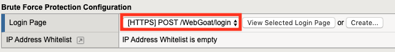
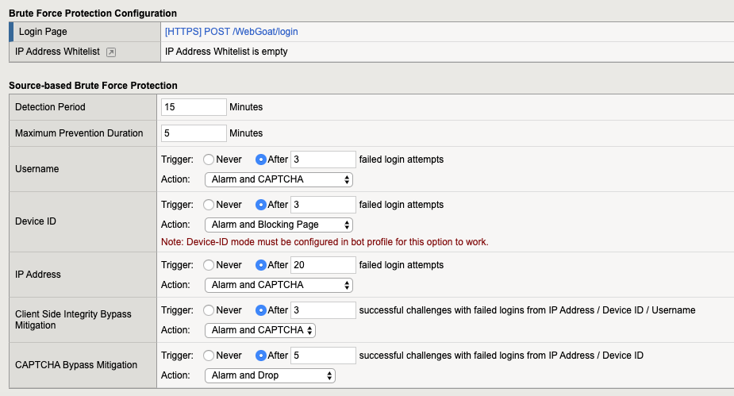
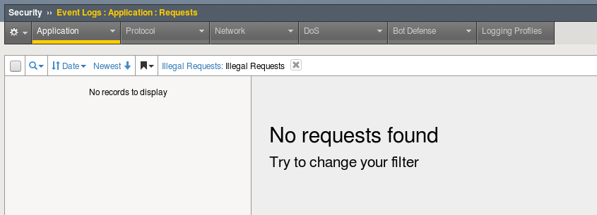
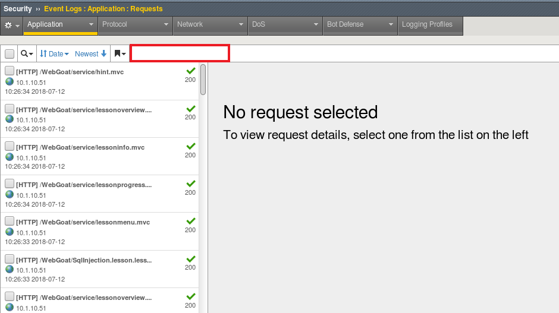
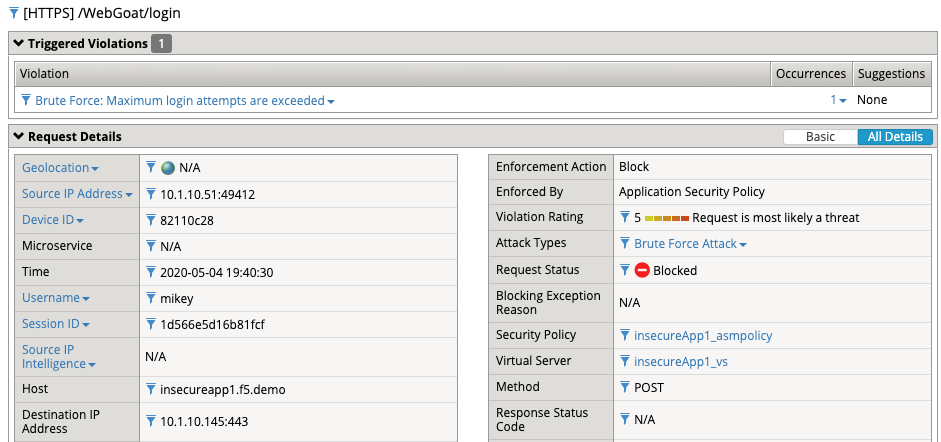
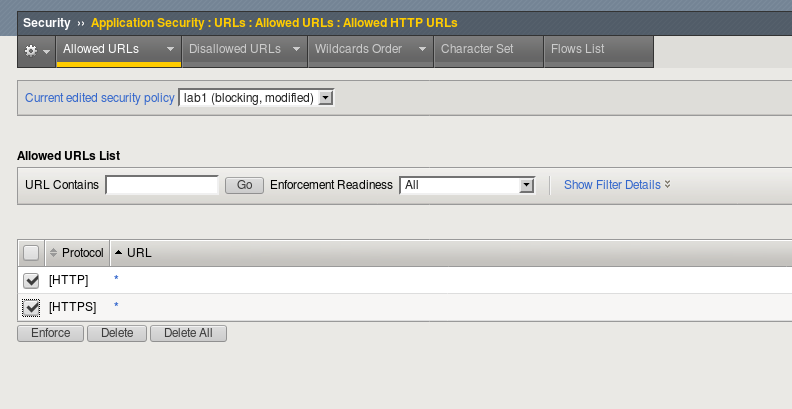
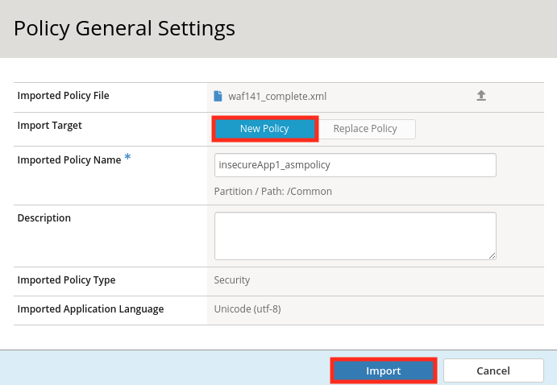
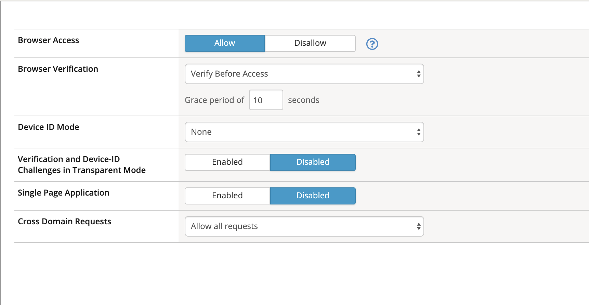

Lab 1.1: Brute Force Attack Prevention
####################################

..  |lab1-2.1| image:: images/lab1-2.1.png
                :width: 800px

..  |lab1-3| image:: images/lab1-3.png
        :width: 800px

..  |lab41-17| image:: images/lab41-17.png
        :width: 800px
..  |lab41-18| image:: images/lab41-18.png
        :width: 800px

..  |lab41-20| image:: images/lab41-20.png
        :width: 800px

..  |lab41-01| image:: images/lab41-01.png
                :width: 800px

..  |log_profile| image:: images/log_profile.png
        :width: 800px
..  |bot_profile| image:: images/bot_profile.png
        :width: 800px
..  |setblock| image:: images/setblock.png
        :width: 800px
..  |bot_vs| image:: images/bot_vs.png
                :width: 800px

#. RDP to client01. Depending on your RDP client, you may get a empty XRDP login screen such as this.

.. image:: images/xrdp.png
  :width: 600 px

Simply click in the username field and backspace. Enter the name: **f5student** and in the password firld use the **password** provided by the instructor.

#. Launch Chrome browser (please be patient and don't click the icon multiple times)

.. NOTE:: If the Operating system prompts you enter your password for keychain access, please enter the "f5student" password provided by your lab instructor.

.. image:: images/keychain.png
  :width: 600 px

Task 0: Level Set
~~~~~~~~~~~~~~~~~

This lab depends on components built in earlier labs.  If you're continuing on from WAF241 using the same lab environment, proceed to Task1.

If this is a new environment follow the directions below starting at step 1 to restore a completed policy.

If you are continuing from WAF 141 please start at step 9 below (setting policy to blocking)

#.  Open Chrome and navigate to the BIG-IP management interface.  For the purposes of this lab you can find it at ``https://10.1.10.245/`` or by clicking on the **bigip01** shortcut.

#.  Login to the BIG-IP.

#.  Navigate to **Security -> Application Security -> Security Policies**.

#.  Click the **...** button next to create, then click **import policy**.

    |lab41-17|

#.  Navigate to the waf241 folder and open the **waf141_complete.xml** file.

    |lab41-18|

#.  Ensure that **New Policy** is selected and click **Import**.

    |lab41-19|

#.  You now have a policy like the one below:

    |lab41-20|

#.  Ensure that the **insecureApp1_asmpolicy** policy and the **Log All requests** log profile are enabled on the **insecureApp1_vs** virtual server as shown below.

    |lab41-01|

#.  Navigate to  **Security -> Application Security -> Security Policies -> Policies List** and place the **insecureApp1_asmpolicy** policy in **blocking** mode.

    |lab41-007|

Enabling Bot Defense
~~~~~~~~~~~~~~~~~~~~

#.  Navigate to **Security > Event Logs > Logging Profiles** and check to see if the Bot_Log Profile is created.  If not, create a new Logging Profile with the settings shown in the screenshot below and click **create**.

        |log_profile|

#.  Navigate to **Security > Bot Defense > Bot Defense Profiles** and check to see if insecureApp1_botprofile has been created.  If not, click **Create**.
#.  Name: **insecureApp1_botprofile**
#.  Profile Template: **Relaxed**
#.  Click the **Learn more** link to see an explanation of the options.

        |bot_profile|

#.  Click on the **Bot Mitigation Settings** tab and review the default configuration.
#.  Click on the **Signature Enforcement** tab and review the default configuration.
#.  Click **Save**.
#.  Navigate to **Local Traffic > Virtual Servers > Virtual Server List > insecureApp1_vs > Security > Policies**
#.  Check to make sure that Bot Defense is enabled and select the  **insecureApp1_botprofile** and the **Bot_Log** profiles.
#.  Click **Update**

        |bot_vs|

A Balanced Approach
~~~~~~~~~~~~~~~~~~~

In WAF141 we viewed logs showing that bots were indeed connecting to our app.  In your environment, there may be some bots that are welcome, while others are unknown or malicious.  Please note that these next steps are to give you an idea on how some bots can be mitigated, but every envrionment is different.

#.  Navigate to **Security > Bot Defense > Bot Defense Profiles** and click on **insecureApp1_botprofile**

    .. NOTE:: The profile we are using was created with a "Relaxed" template.  In order to start with a Balanced Approach, you would need to create a new Profile.  Instead, here we will change individual settings.  Click on **Learn More** if you are interested in the other default options.

#.  Under General Settings, change the Enforcement Mode to Blocking

        |setblock|

#.  Click on the Browsers tab on the left and Change the Browser Verification setting to **Verify Before Access**, then ensure that the grace period is set to **10 Seconds**.

        |pbd|

#.  Save the changes to your Bot Defense profile.

There is more than one kind of brute force attack. In the classic version, hackers attempt to log in to an application by repeatedly guessing users’ account credentials. Because of these attacks, most applications now lock an account when it encounters multiple unsuccessful authentication attempts, at least temporarily. However, this strategy only protects against attack on a single account.
In another version of this attack, commonly called “credential stuffing,” hackers make only one attempt to log in to users’ accounts. They obtain a collection of user name and password combinations from a compromised application and programmatically evaluate them against their target application, looking for accounts where users reused their compromised credentials. When they finish, the hackers know those accounts for which they have valid credentials on the target application.

Task 1 - Configure Brute Force Attack Prevention
~~~~~~~~~~~~~~~~~~~~~~~~~~~~~~~~~~~~~~~~~~~~~~~~

#.  Open the BIG-IP GUI interface .

#.  Navigate to **Security -> Application Security -> Brute Force Attack Prevention** and click **Create**.

    .. note:: F5 WAF has a number of brute force attack detection capabilities that are beyond the scope of this exercise.  Take some time to examine some of the other options as you work through this lab.  For more information see:  ``https://techdocs.f5.com/en-us/bigip-15-0-0/big-ip-asm-implementations/mitigating-brute-force-attacks.html`` .

#.  Select the login page you created earlier or imported as part of lab setup.

    |lab1-1|

#.  Configure **Source-based Brute Force Protection** settings as follows:

    |lab1-2|

#.  Click **Create** .

#.  Click **Apply Policy**, then click **OK** .

#. Ensure WAF and Bot policy are both applied to the Virtual as seen.

    |lab1-2.1|

Task 2 - Test username based Brute Force Protection
~~~~~~~~~~~~~~~~~~~~~~~~~~~~~~~~~~~~~~~~~~~~~~~~~~~

#.  Open a new Private Browsing window in **Firefox** .

#.  Go to the to WebGoat login page at ``https://insecureapp1.f5.demo/WebGoat/login`` but **do not login as f5student** .

#.  Attempt to login using any username (not f5student) and password at least 4 times.

#.  Examine the most recent **illegal** request in the event log:

    |lab1-3|

    Take note of the username field.  The request was blocked as a brute force attack.

#.  Click the **Brute force: Maximum Login Attempts are exceeded** header at the top of the event window:

    |lab1-4|

    The message indicates the number of login attempts by a user exceeded the threshold.

Task 3 - Enable Device ID
~~~~~~~~~~~~~~~~~~~~~~~~~

#. Navigate to **Security -> Bot Defense -> Bot Defense Profiles** and edit the profile **insecureApp1_botprofile** to enable Device ID mode to "Generate Before Access" for browsers.  The Device ID is a unique identifier that F5 WAF creates by sending JavaScript to get information about the client device

#. Click **SAVE**

    |lab1-5|

Task 4 - Test Device ID based Brute Force Protection
~~~~~~~~~~~~~~~~~~~~~~~~~~~~~~~~~~~~~~~~~~~~~~~~~~~~

#.  Open a new Private Browsing window in **Firefox** .

#.  Go to the to WebGoat login page at ``https://insecureapp1.f5.demo/WebGoat/login`` but **do not login as f5student** .

#.  Attempt to login using any username and password at least 4 times.

#. Once Blocked close the browser and re-open a new Private Browsing window in Firefox

#. Attempt to login using a different username as in step 3, your first request should be blocked.

#. Examine the most recent illegal request in the event log:

    |lab1-6|

#. Click on the Occurrences and notice the Device ID for the request.

    |lab1-7|

|
|

**This concludes Lab 1.**
