Lab 1.1: Allowed URL List
----------------------------------------

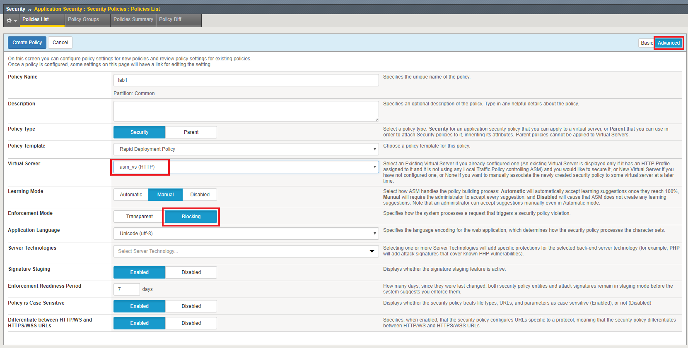
.. |lab1-2| image:: images/lab1-2.png
        :width: 800px
.. |lab1-3| image:: images/lab1-3.png
        :width: 800px
.. |lab1-4| image:: images/lab1-4update.png
        :width: 800px
.. |lab1-5| image:: images/lab1-5.png
        :width: 800px
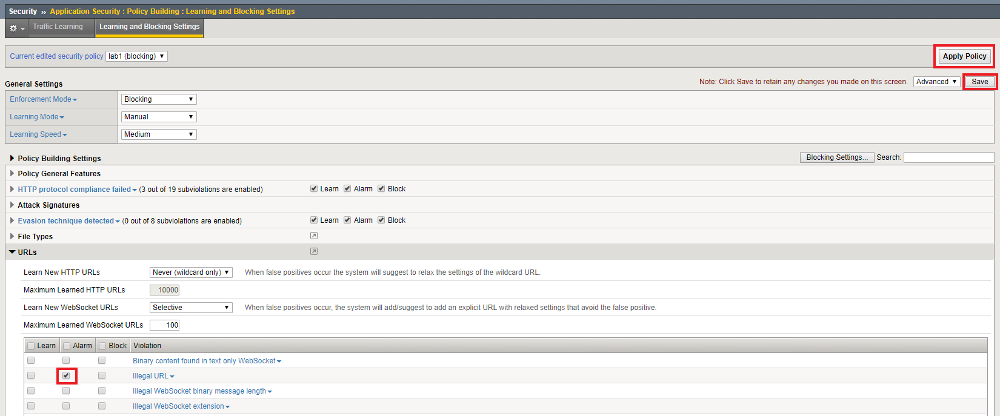
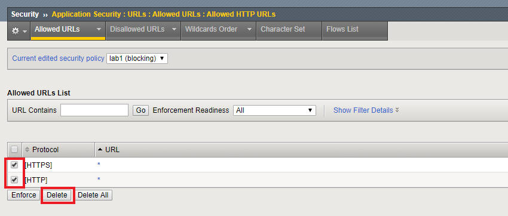
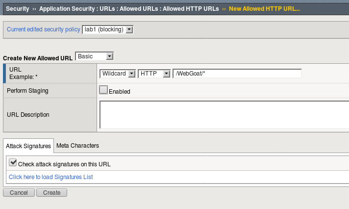
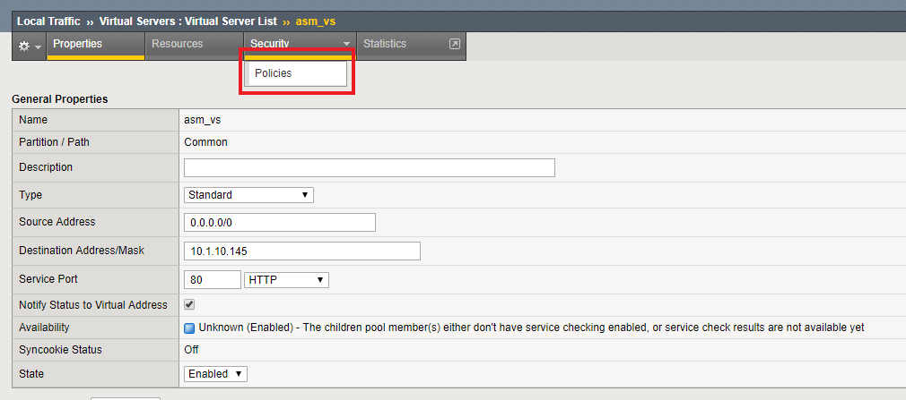
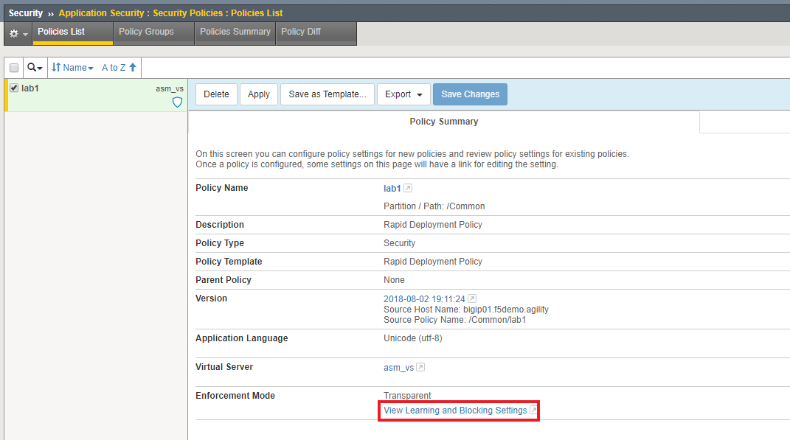
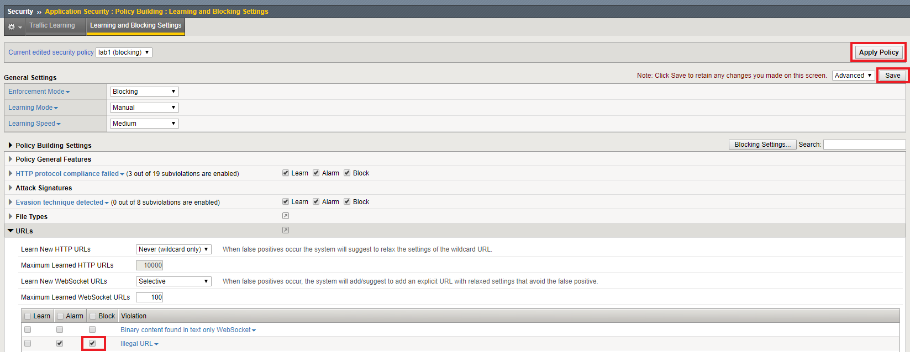
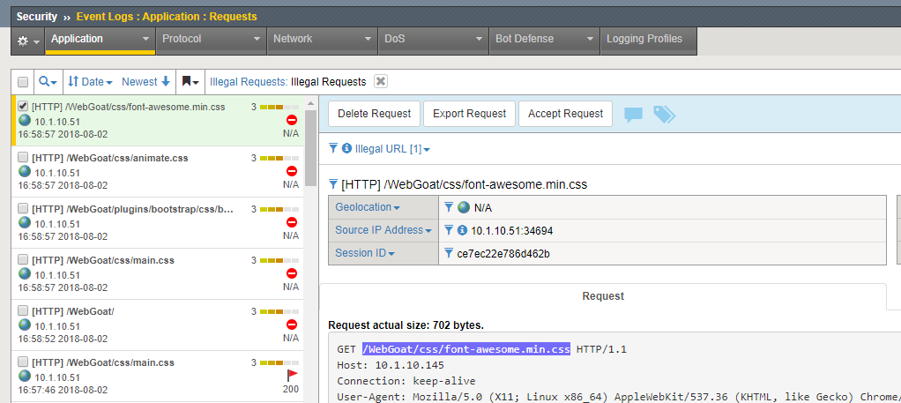
.. |lab1-4-1| image:: images/lab1-4-1.png
        :width: 800px
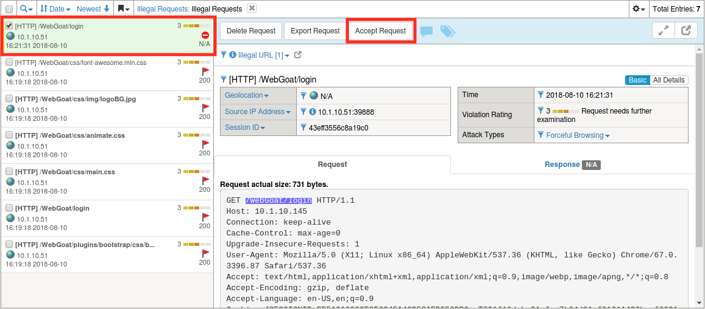
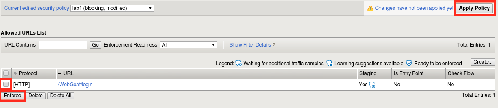
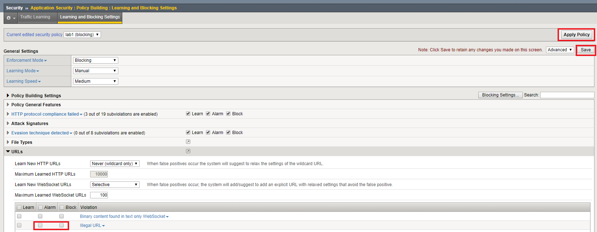

Task 1 - Create a Security Policy and Enable Logging
~~~~~~~~~~~~~~~~~~~~~~~~~~~~~~~~~~~~~~~~~~~~~~~~~~~~~

#. Browse to the BIGIP management console by opening FireFox and clicking on the **bigip01** shortcut.

#. Login with the credentials username: **f5student** and the password: **password**.

#. Create a new ASM policy by navigating to **Security -> Application Security -> Security Policies**.

#. Click **Create New Policy** and fill in the page as follows, using lab1 as the name, then click **Create Policy**.

	.. note:: If you find the images difficult to read, you can click on them to zoom in.

	|lab1-1|

#. Navigate to **Local Traffic -> Virtual Servers** and select the "asm_vs" virtual server.

#. Click the Security tab and select policies to view Policy settings.

    |lab1-update|

#. Enable "Log Profile" then add the "Log All Requests" profile as shown below, and click **Update**.

	|lab1-2|

#. Finally, lets configure this ASM policy to Alarm on "Illegal URLs".  Navigate to **Security -> Application Security -> Security Policies**.

#. Click "View Learning and Blocking Settings".

    |lab1-update2|

#. Expand the "URLs" dropdown and check Alarm for "Illegal URL".

#. Click *Save* and then click *Apply Policy*.

        |lab1-6|

Task 2 - Examine the Allowed URLs list
~~~~~~~~~~~~~~~~~~~~~~~~~~~~~~~~~~~~~~~~~~~~~~~~~~~~~

#.  Open a new firefox tab and login to ``http://10.1.10.145/WebGoat`` (credentials are f5student / password).

#.  Explore around the app.  Notice as you click between (for instance) **Injection Flaws**  and **Authentication Flaws**  that the URL changes to correspond to the page.  We can use this information to build our ASM policy.

#.  Return to the BIG-IP UI and navigate to **Security -> Application Security -> URLs -> Allowed URLs** .

#.  Our WAF is currently set to allow **any** URL as represented by the wildcard entries.

    |lab1-3|

#.  We can verify the WAF is seeing the traffic by navigating to **Security -> Event Logs -> Application -> Requests** and inspecting the entries.

    |lab1-4|

#.  Don't forget to clear the "Illegal Requests" filter, so that legal requests will be displayed!

    |lab1-5|

Task 3 - Modify the Allowed URLs List
~~~~~~~~~~~~~~~~~~~~~~~~~~~~~~~~~~~~~~~

#.  Return to the Allowed URLs list.

#.  Delete the HTTP and HTTPS Wildcard entries.

    |lab1-7|

#.  Click the **Apply Policy** button.

#.  Attempt to browse the test site ``http://10.1.10.145/WebGoat`` , what are your results?  

#.  We are still able to browse because our policy is not configured to block for Illegal URLs.  Return to the "View Learning and Blocking Settings" page.

    |lab1-update2|

#.  Check the Block box for Illegal URLs.  Click **Save** followed by **Apply Policy**.

    |lab1-update3|

#.  Attempt to browse the test site ``http://10.1.10.145/WebGoat`` , what are your results?

#.  Return to the Allowed HTTP URLs and add an Allowed URL. Click the **Create** button and create an allowed URL with the following settings:

    |lab1-8|

#.  Click **Apply Policy**.

#.  Test site again, are you able to browse?

Task 4 - Create Explicit Allowed URLs with Manual Traffic Learning
~~~~~~~~~~~~~~~~~~~~~~~~~~~~~~~~~~~~~~~~~~~~~~~~~~~~~~~~~~~~~~~~~~

#.  Now that we've seen how wildcard URLs work, let's get the site to work with explicit URLs.

#.  Delete the Wildcard URL **/WebGoat/*** .

#.  Click **Apply Policy**.

#.  Due to the number of URLs actually involved in making our application work, we'll see if we can use manual traffic learning to make the Login page render properly.
    
    .. note:: It is much easier to use the automatic policy builder or manaul traffic learning starting with wildcard URL entries.  We're doing it this way so that you'll get a better understanding of how ASM works under the hood.

#.  Return to the learning and blocking settings page once more and configure ASM to always learn URLs:

    |lab1-4-1|    

#.  Click **save** then **Apply Policy**.

#.  Now, attempt to load the login screen again (``http://10.1.10.145/WebGoat/login``) then return to the Requests log at **Security -> Event Logs -> Application -> Requests**.

#.  Find the entry for the login page and click **Accept Request**.

    |lab1-4-2|

#.  Return to **Security -> Application Security -> URLs -> Allowed URLs**.
    |
    There should now be an explicit entry for **/WebGoat/login**.

#.  Select the entry and click **Enforce**, then **OK**, then click **Apply Policy** followed by **OK**

    |lab1-4-3|

#.  Try to load ``http://10.1.10.145/WebGoat/login`` again.  It should now partially load but will not look correct.  This is because the application is actually comprised of many other URLs that are not in our list. 

#.  Repeat these steps a few times and see if you can get the login page to load fully.  Note that you can accept multiple requests at once before returning to the URLs dialog and new requests in the Requests log should be bolded...making it easier to find the issue.

Task 6 - Lab Cleanup
~~~~~~~~~~~~~~~~~~~~~

#.  Let's cleanup and prepare for the next module by deleting the lab1 policy we've been using.

#.  Navigate to **Security -> Application Security -> Security Policies**.

#.  Select lab1 and click **Delete**.
