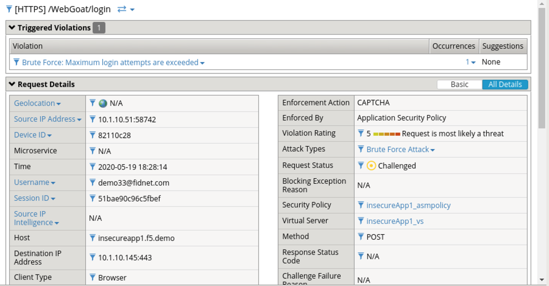
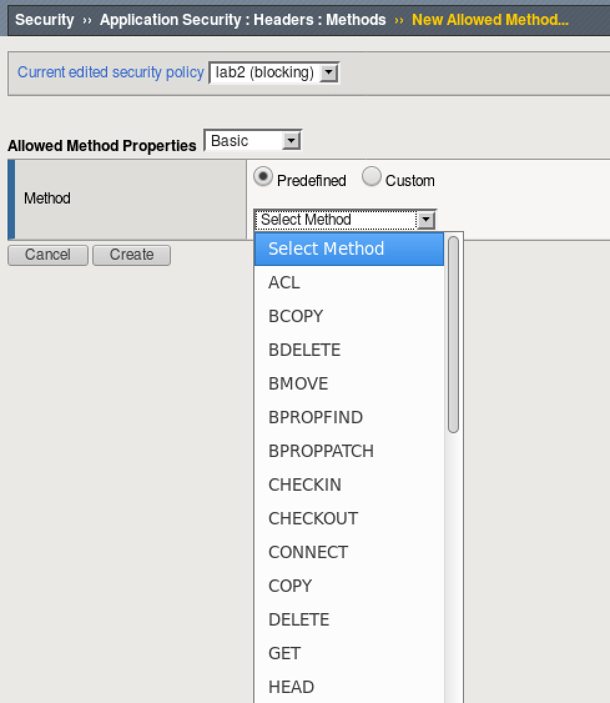
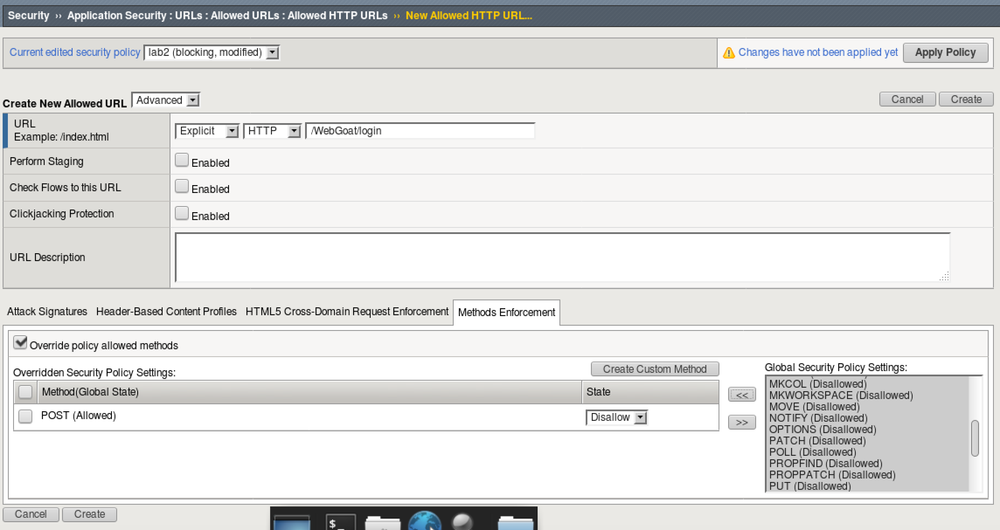

Lab 1.2: Allowed (and disallowed...) HTTP Request Methods
----------------------------------------------------------

Task 1 - Allowed Methods
~~~~~~~~~~~~~~~~~~~~~~~~~~~~~~~~~~~~~~~~~~~~~~~~~~~~~

#. Navigate to **Security -> Application Security -> Security Policies -> Policies List** and click **Create**. 

	|lab2-1|

#. In the BIG-IP WebUI navigate to **Security -> Application Security -> Headers -> Methods**.

#. Policy wide Method permissions are configured here.  If your application requires a method beyond the default three, they can be added by clicking the **Create** button.

    |lab2-2|

Task 2 - Restricting Method on per URL basis
~~~~~~~~~~~~~~~~~~~~~~~~~~~~~~~~~~~~~~~~~~~~~

#. Let's return to our Allowed URLs list **Security -> Application Security -> URLs -> Allowed URLs**.

#. Click **Create** and use the following settings: 

    |lab2-3|

#. Click **Create**.

#. Click **Apply Policy**.

#. Attempt to login to ``http://10.1.10.145/WebGoat/login``.

#. What is the result, and why?

Task 3 - Lab Cleanup
~~~~~~~~~~~~~~~~~~~~

#.  Let's cleanup and prepare for the next module by deleting the lab2 policy we've been using.

#.  Navigate to **Security -> Application Security -> Security Policies**.

#.  Select lab2 and click **Delete**.
