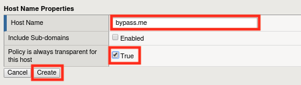
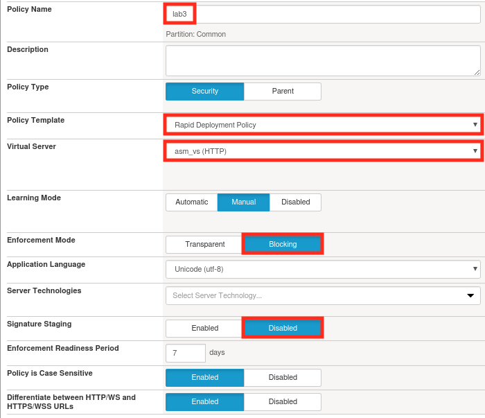
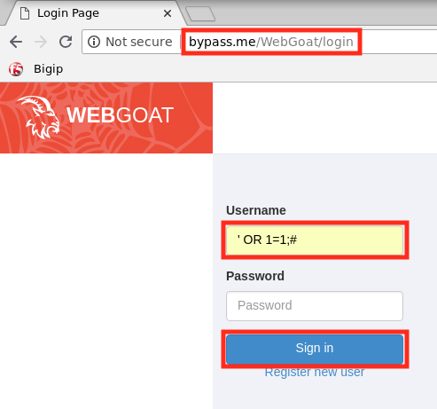
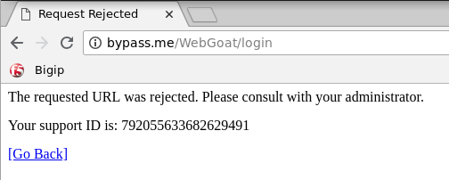
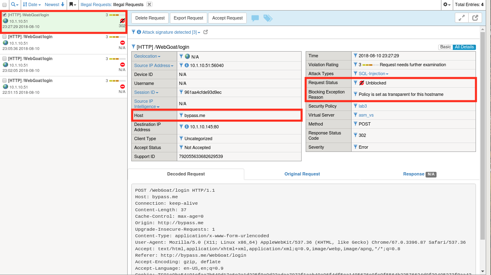

Lab 1.3: Blocking Mode Override
----------------------------------------

.. |lab33-6| image:: images/lab33-6.png
        :width: 800px

Blocking mode override is a capability that allows you to bypass your ASM policy in certain use cases.  We do this by whitelisting specific host header values. Since these hostnames will be able to completely bypass the security policy it's important to protect them like you would a password.  We'll experiment with this in the following lab.  You might be thinking to yourself...if we're going to all this trouble to build a tight WAF policy, why do we now want to override it?  There can be several reasons an organization wants to enforce security policy except for specific users (IPs).  

These reasons include:

        - Testing a new version of the Application
        - Penetration testing
        - Automated Scanning and patching tools
        - Whitelisting Service to Service communication

Task 1 - Create a Clean Secuirty Policy and Verify Blocking Mode
~~~~~~~~~~~~~~~~~~~~~~~~~~~~~~~~~~~~~~~~~~~~~~~~~~~~~~~~~~~~~~~~

#.  Navigate to **Security -> Application Security -> Security policies**.
    
#.  Click **Create** and create a new policy called lab3 with the following settings:

        |lab33-2|
    
    .. note:: Since we used a rapid deployment policy, disabled signature staging, and enabled blocking mode we should have decent protection out of the box, but we'll want to verify that before we continue.  
    
#.  Open a new browser tab and load the Webgoat login page at ``http://bypass.me/WebGoat/login``. 

    .. note:: Previous labs did not require a hostname to access WebGoat.  We're using one in this lab so that we have a header to bypass on later.

#.  Make a SQl injection attempt by entering ``' OR 1=1;#`` in the login box and clicking **Sign In**.
        
        |lab33-3|

#.  If everything is configured properly you should be greeted with an ASM block page similar to the one below:

        |lab33-4|

Task 2 - Enabling Transparent Mode for Certain Hostnames	
~~~~~~~~~~~~~~~~~~~~~~~~~~~~~~~~~~~~~~~~~~~~~~~~~~~~~~~~~~

#.  Navigate to **Security -> Application Security -> Headers -> Host Names** .

#.  Click **Create**.

#.  Use ``bypass.me`` as the hostname and select the **True** checkbox.  Your configuration should look like the one below:

	|lab3-1|

#.  Click **Create** and then **Apply Policy** .

Task 3 - Verify Operation
~~~~~~~~~~~~~~~~~~~~~~~~~

#.  Return to ``http://bypass.me/WebGoat/login`` and try your attack once more (``' OR 1=1;#``).  The request should now be allowed and you should get "Invalid Username or Password".

#.  Go to **Security -> Event Logs -> Application -> Requests** and find the most recent request.  You'll notice that while ASM allowed the attack to reach the application, it still treats it as an illegal request in every *other* way.  Notice also that the request status is "Unblocked" and the log entry provides a reason.

        |lab33-5|

Task 4 - Lab Cleanup
~~~~~~~~~~~~~~~~~~~~

#.  Let's cleanup and prepare for the next module by deleting the lab3 policy we've been using.

#.  Navigate to **Security -> Application Security -> Security Policies**.

#.  Select lab3 and click **Delete**.

