Lab 1.4: Protection from Parameter Exploits
-------------------------------------------

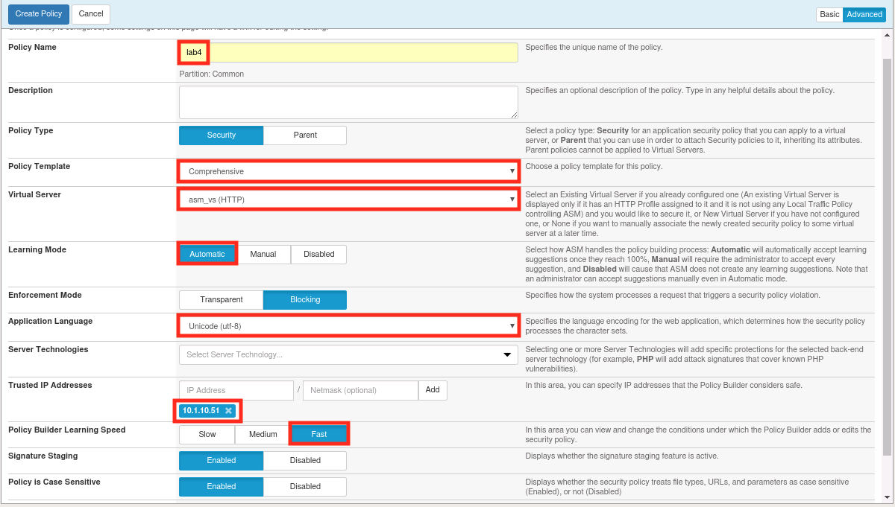
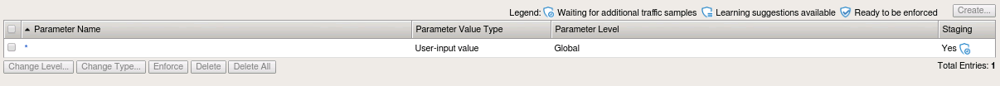
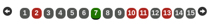
.. |lab14-4| image:: images/lab14-4.png
        :width: 800px
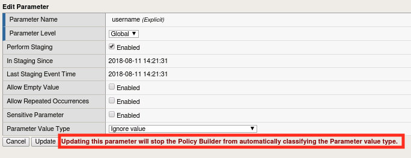
.. |lab14-6| image:: images/lab14-6.png
        :width: 800px
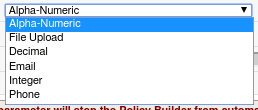
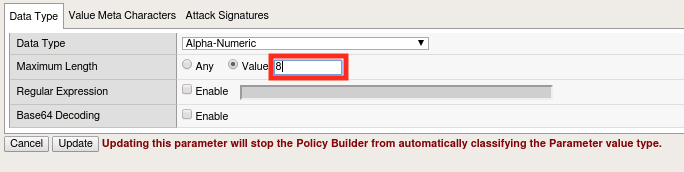
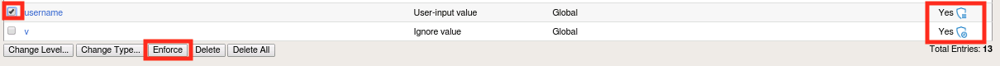
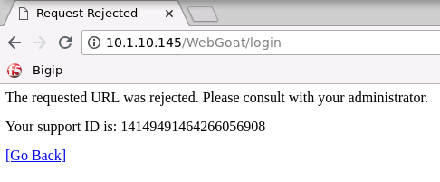
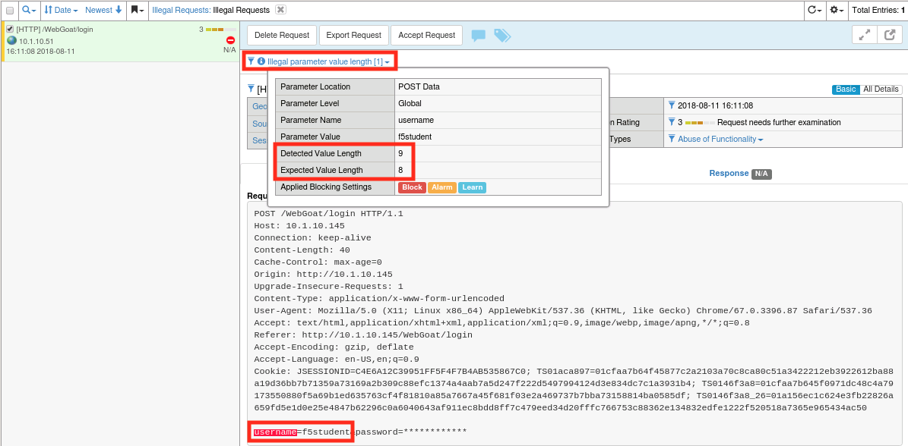
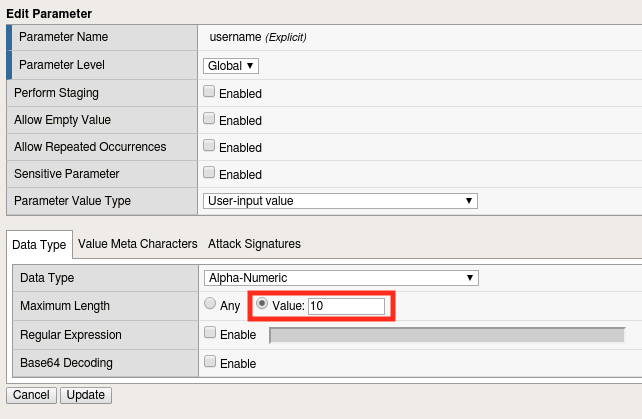
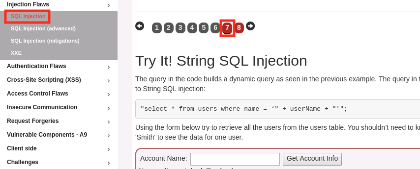
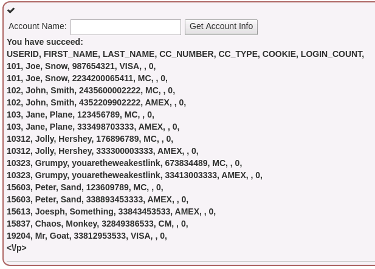
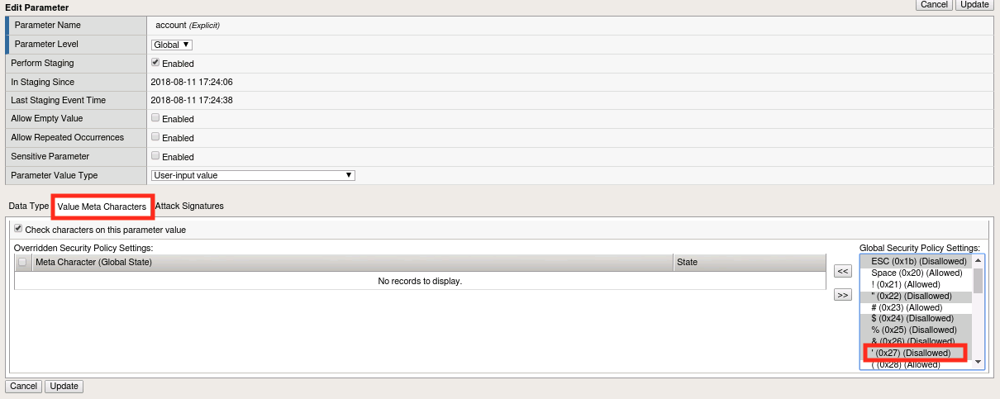
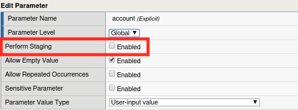
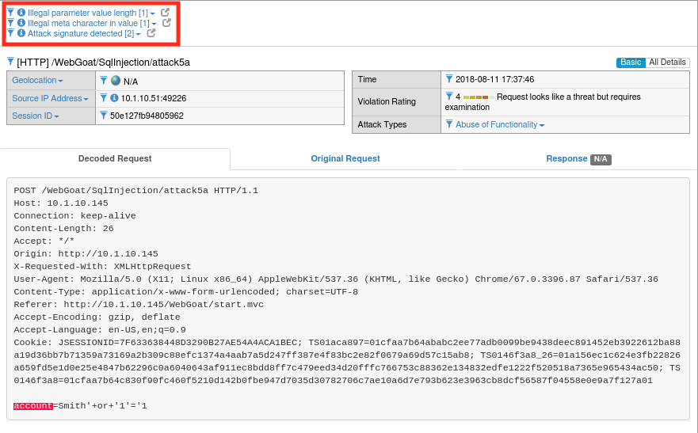
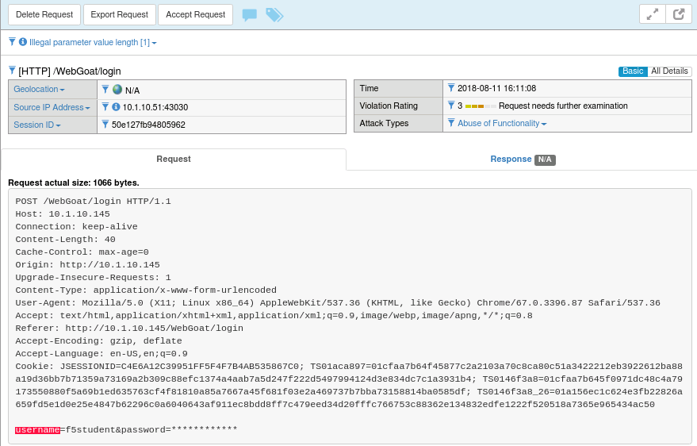
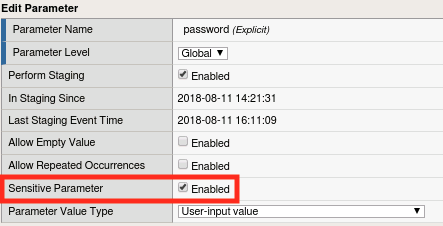

In this lab we'll experiment with the parameter protection capabilities of ASM.  Parameter learning works much like the URL learning you did in lab 1.1 so this time rather than manually adding entities, we'll make use of the automatic policy builder.  You'll find that this will vastly speed up the learning process.  It's worth noting also that you could use the same process to learn URLs and other entities as well.

Task 1 - Create a new Security Policy
~~~~~~~~~~~~~~~~~~~~~~~~~~~~~~~~~~~~~

#.  Navigate to **Security -> Application Security -> Security Policies** and click **Create New Policy**

#.  Chose **Advanced** in the upper right hand corner of the policy configuration pane.

#.  Populate the configuration dialog like the one below, then click **Create Policy**.  Be sure to enter the IP address and click add.  This is the IP address of our lab workstation and will tell ASM to treat traffic originating from there as legitimate. This will help to speed up the learning process.

    |lab14-1|

#.  Navigate to **Security -> Application Security -> Parameters -> Parameters List**.  You should see only the wildcard parameter like below:

    |lab14-2|

Task 2 - Automatically Populate the Security Policy
~~~~~~~~~~~~~~~~~~~~~~~~~~~~~~~~~~~~~~~~~~~~~~~~~~~

#.  Open a new Chrome window and login to WebGoat at ``http://10.1.10.145/WebGoat/login``.

#.  Exercise the application by walking through the menus.  When you get to the Cross Site Scripting exercise, be sure to click through all of the lessons on the horizontal menu at the top (see below).  Feel free to modify values and exercise parameters as well.  Updating the quantities in exercise 7 will produce some good results.

    |lab14-3|

#.  Choose **Injection Flaws -> SQL Injection**  from the menu on the left then chose page 7 from the top.

    |lab14-13|

#.  In the **Account Name** field, enter ``Smith`` and click **Get Account Info** (click 5x to simulate traffic).

#.  Also enter the names ``Plane``, ``Snow``, and ``Hershey``, clicking **Get Account Info** after each.

#.  Now return to **Security -> Application Security -> Parameters -> Parameters List**.  You should see that things have changed significantly since our last visit. 
    

    |lab14-4|

    ASM's automatic policy builder analyzes web application traffic and uses it to automatically tune the policy. In this case, it populated our parameters list for us.

 
    .. note:: Your list may not be exactly the same as the one above depending on where browsed in the application.  Since ASM only analyzes traffic and not the site itself, the policy will only contain explicit objects for areas of the application that have actually been accessed.  This is an important consideration when electing to use the automatic policy builder.

Task 3 - Test Parameter-Based Protections
~~~~~~~~~~~~~~~~~~~~~~~~~~~~~~~~~~~~~~~~~

#.  Click on the username entry in the parameter list.  If you don't have a username parameter, logout of WebGoat and log back in to generate one.

    |lab14-5|

    .. note:: Notice the message highlighted above.  ASM's automatic policy builder actually has the ability to learn more about the parameter including the expected input type, character set, length, etc, but these can also be manually set.  As the message indicates, if we manually modify the parameter, the Automatic Policy Builder will not attempt to automatically classify it.  The policy builder has yet to draw any conclusions about most of these parameters because it requires more traffic to analyze before making any of those determinations.  However, you'll notice that the account parmater has started to be modified due to the traffic we created in the **SQL Injection** exercise.

#.  Select the Parameter Value Type and choose **User-input Value** from the list.

    |lab14-6|

#.  Explore the options under the **Data Type Tab** but ensure that it is set to **Alpha-Numeric** when you're done.

    |lab14-7|

#.  Set the **Maximum Length** value to **8** and click **Update**.

    |lab14-8|

#.  You may have noticed that all of the discovered parameters are currently in staging.  This is by design, to prevent the automatic policy builder from breaking things as it learns.  Since we've manually overridden the parameter's attributes, we're going to take it out of staging in order to experiment with it.  Select the **username** parameter and click **Enforce**.

    |lab14-9|

#.  Return to the BIG-IP and navigate to **Security -> Application Security -> IP Address Exceptions**.

#.  Select the **10.1.10.51** entry and click **Delete**.

#.  Click **Apply Policy** then click **OK**.

    .. note:: We've removed our IP Address Exception from the list because we don't want ASM to learn our bad behavior in the steps to come.

#.  Now, logout of WebGoat and try to log back in.  You should get a block page like the one below.  Why?  
    
    Hint: How many characters is our username?

    |lab14-10|

#.  Navigate to **Security -> Event Logs -> Application -> Requests** and find the most recent illegal request (or search by the support id on the block page).

    |lab14-11|

    The request log indicates that the username value was 9 characters but we only allow 8 characters in that parameter so the request was blocked.

#.  Click **Accept Request** to declare the request legitimate.  This will automatically modify the parameter's attributes to allow values of that length from then on.  You have to be careful with this feature since you could inadvertently loosen the security policy too much.

#.  Return to **Security -> Application Security -> Parameters -> Parameters List** and click on the **username** parameter to see what's been changed.

    |lab14-12|

    You'll notice that the length has been set back to 10 characters automatically.

#.  Click **Apply Policy** if required.
   

Task 4 - Using Parameter-Based Protections to Thwart Attacks
~~~~~~~~~~~~~~~~~~~~~~~~~~~~~~~~~~~~~~~~~~~~~~~~~~~~~~~~~~~~

So you may be wondering why it is that limiting the user's ability to enter data into a given parameter is useful.  The truth is that a good portion of application vulnerabilities (like SQL injection and Cross Site Scripting) stem from the application's failure to properly validate or sanitize input.  In this lab we'll show you how this functionality can help prevent a SQL injection attack.

#.  Log back into WebGoat at ``http://10.1.10.145/WebGoat/login`` 

#.  Choose **Injection Flaws -> SQL Injection**  from the menu on the left then chose page 7 from the top.

#.  In the **Account Name** field, enter ``Smith' or '1'='1`` and click **Get Account Info** (Repeat twice).  The attack should be successful:

    |lab14-14|

    .. note:: The attack was not immediately blocked because we placed Attack Signatures in staging mode when we created the policy.

#.  The parameter name for this field is **account**.  Return to **Security -> Application Security -> Parameters -> Parameters List** and open the parameter.

#.  Click on the **Value Meta Characters** tab.  You should see in the box to the right that ASM has already blocked the single quote (0x27) character globally by default.  You can also manually disallow (or allow) characters that should/should not be relevant to that parameter by using the << button and moving them over from the box on the right.

    |lab14-15|

#.  Uncheck **Perform Staging** and click **Update**, then click **Apply Policy**

    |lab14-16|

    .. note:: The character set defaults can be viewed or changed in **Security -> Application Security-> Parameters -> Character Sets -> Parameter Value** but are generally considered to be sane defaults for most applications.  In the event that an override is necessary, it's best to do so at the parameter level when possible.

#.  Run your attack one more time.  It should now be unsuccessful.

#.  Return to **Security -> Event Logs -> Application -> Requests**.  You should now see that the attack was blocked for both **Illegal Parameter Value Length** and **Illegal Meta Character in Value**.  Click on each of these items for more detail.  You'll also notice that attack signatures were detected, but if you click on that heading you'll note that they are still in staging.  Once all of these items are out of staging we would have been covered by protections at both the parameter and signature level for this field.

    |lab14-17|

Task 5 - Sensitive Parameters
~~~~~~~~~~~~~~~~~~~~~~~~~~~~~

You may have noticed throughout the course of this section that the password field in the ASM Requests log is always obfuscated (like below).  Lets explore why that is.

    |lab14-18|

#.  Navigate to **Security -> Application Security -> Parameters -> Parameters List** and click on the **password** parameter.  You'll note that the **Sensitive Parameter** box is checked.  This feature allows you to ensure that sensitive data (like passwords) are not stored in the logs.  In this case ASM has automatically detected that this is a password field and obfuscated it for us.  This feature can, however, be applied to any parameter in the list.

    |lab14-19|

#.  As a bonus step, try marking the username field as a sensitive parameter.  When you're done, log out of WebGoat and log back in, then review the Requests log to test it.

Task 6 - Lab Cleanup
~~~~~~~~~~~~~~~~~~~~

#.  Let's cleanup and prepare for the next module by deleting the lab4 policy we've been using.

#.  Navigate to **Security -> Application Security -> Security Policies**.

#.  Select lab4 and click **Delete**.

|

**This concludes module 1.**
