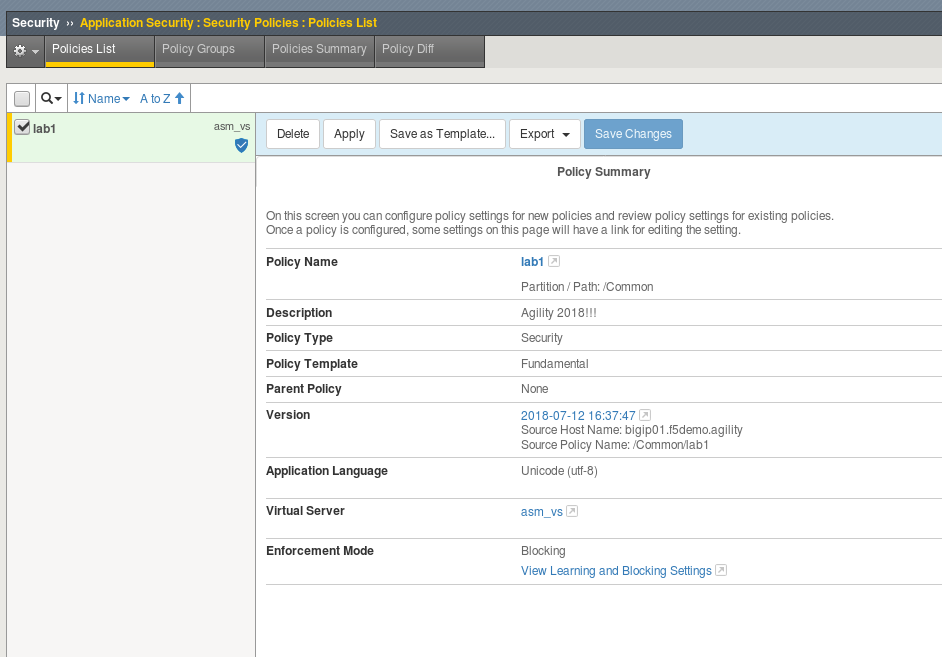
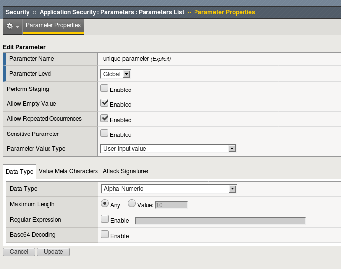
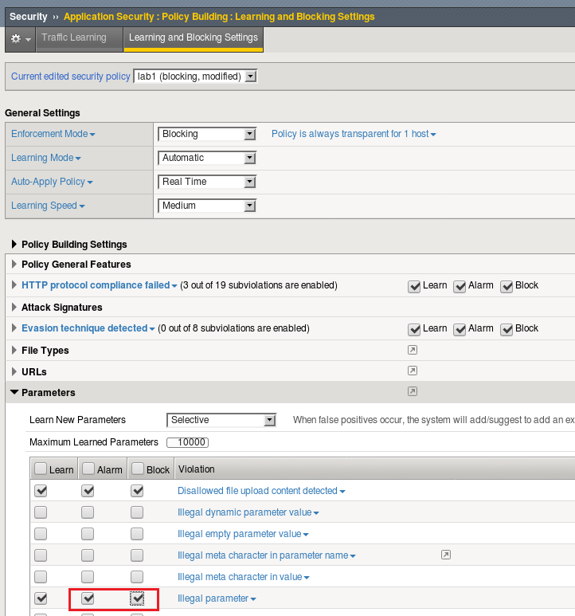

Lab 1.4: Protection from Parameter Exploits
-------------------------------------------

.. |lab4-1| image:: images/lab4-1.png
        :width: 800px

Task 1 - Parameter Learning
~~~~~~~~~~~~~~~~~~~~~~~~~~~~~~~~~~~~~~~~~~~~~~~~~~~~~

#.  Just like we can teach ASM the URLs that are allowed, we can also train it for the parameters it sees. Parameter learning is the most efficient way to inject these attributes.

#.  To configure Parameter learning, navigate to **Security -> Application Security -> Security Policies** and click on "View Learning and Blocking Settings" .

    |lab4-2|

#.  Check the "Learn" box for **Illegal Parameter** .

    |lab4-1|

#.  Click **Apply Policy** .

Task 2 - Parameter Restriction
~~~~~~~~~~~~~~~~~~~~~~~~~~~~~~~~

#.  For any parameter the data type, metachatacters, and attack signatures can be customized at any time.  (These configurations will also change as parameter learning progreses) .

    |lab4-3|

#.  When  you are ready to enforce your white listed paremeters proceed back to the Learning and Blocking Settings page and check the "Alarm" and "Block" boxes.

    |lab4-4|

#.  Click **Save** .

#.  Click **Apply Policy** .

#.  If you are confident the application will not change, and therefore no new parameters will be required, you can remove the wildcard parameter.
