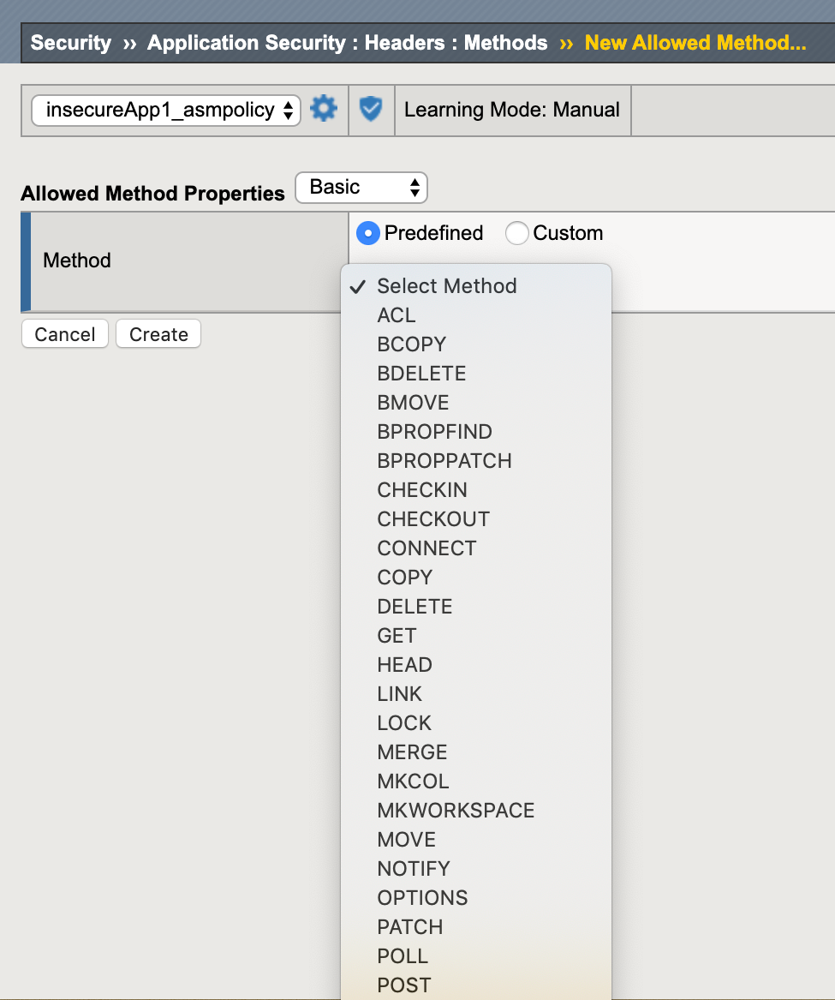
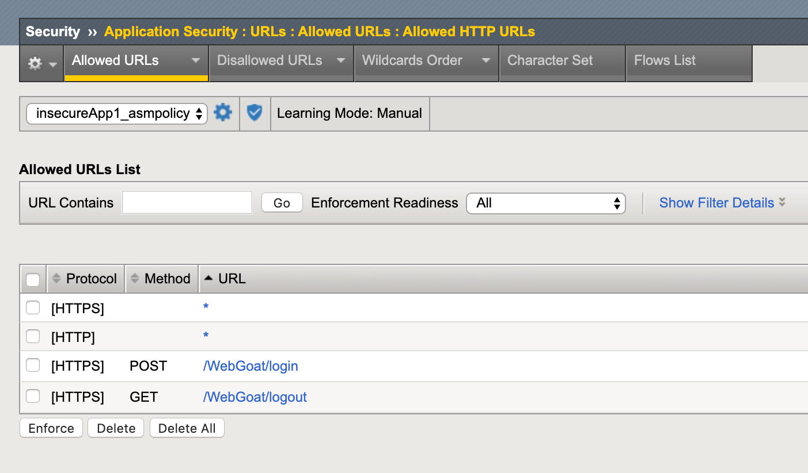

Lab 2.1: Allowed HTTP Request Methods
----------------------------------------------------------

.. |lab2.1-3| image:: images/2.1-3.png
        :width: 800px
.. |lab2.1-4| image:: images/2.1-4.png
        :width: 800px
.. |lab2.1-5| image:: images/2.1-5.png
        :width: 800px
 
Task 1 - Allowed Methods
~~~~~~~~~~~~~~~~~~~~~~~~~~~~~~~~~~~~~~~~~~~~~~~~~~~~~

#. In the BIG-IP WebUI navigate to **Security -> Application Security -> Headers -> Methods**.

#. Policy wide Method permissions are configured here.  If your application requires a method beyond the default three, they can be added by clicking the **Create** button.

    |lab2.1-1|

Task 2 - Restricting Method on per URL basis
~~~~~~~~~~~~~~~~~~~~~~~~~~~~~~~~~~~~~~~~~~~~~

#. Let's go to our Allowed URLs list **Security -> Application Security -> URLs -> Allowed URLs**.

#. View the settings for the URLs, notice the method can optionally be specified for the URL while creating:

    |lab2.1-2|

#. Click the URL for /WebGoat/logout. Switch to the advanced view and select the methods enforcement tab and check override policy allowed methods and slide 'POST" with a state of disallow and click **update** and **Apply policy**

    |lab2.1-3|

#. in the RDP client open a terminal and paste this command ``curl -k -d "param1=value1&param2=value2" -X POST https://insecureapp1.f5.demo/WebGoat/logout``.

#. What is the result, and why?  The result should be the request getting block because a method (POST) has been disabled on the URL /WebGoat/logout

|lab2.1-4|

|lab2.1-5|

**This concludes section 2.1**
