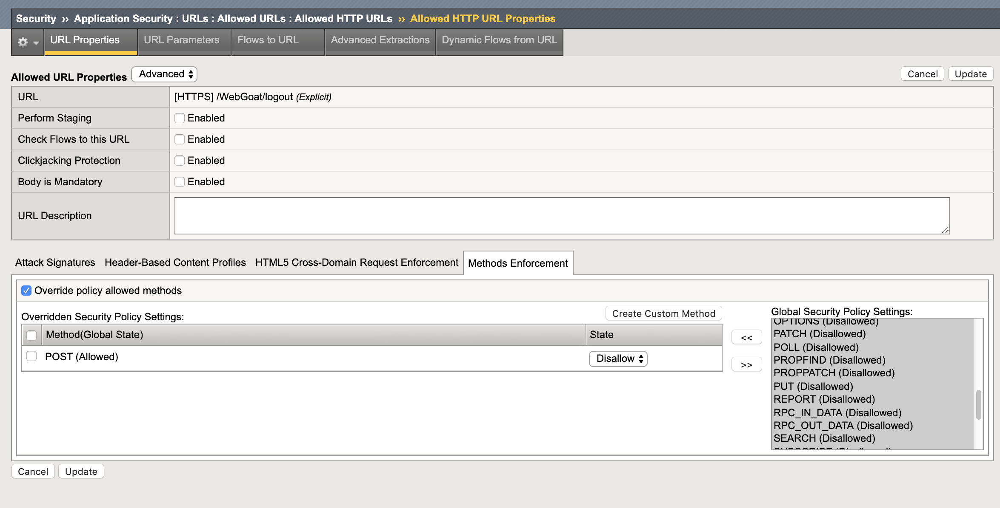

Lab 2.1: Allowed HTTP Request Methods
----------------------------------------------------------
.. |lab2.1-1| image:: /images/2.1-1.png
        :width: 800px
.. |lab2.1-2| image:: 2.1-2.png
        :width: 800px

Task 1 - Allowed Methods
~~~~~~~~~~~~~~~~~~~~~~~~~~~~~~~~~~~~~~~~~~~~~~~~~~~~~

#. In the BIG-IP WebUI navigate to **Security -> Application Security -> Headers -> Methods**.

#. Policy wide Method permissions are configured here.  If your application requires a method beyond the default three, they can be added by clicking the **Create** button.

    |lab2.1-1|

Task 2 - Restricting Method on per URL basis
~~~~~~~~~~~~~~~~~~~~~~~~~~~~~~~~~~~~~~~~~~~~~

#. Let's go to our Allowed URLs list **Security -> Application Security -> URLs -> Allowed URLs**.

#. View the settings for the URLs, notice the method can optionally be specified for the URL while creating:

    |lab2.1-2|

    |lab2.1-3|

#. Attempt to browse to ``https://insecureapp1.f5.demo/WebGoat/login``.

#. What is the result, and why?  The result should be the request getting block because a method (POST) has been enforced on the URL /WebGoat/login

**This concludes section 2.**
