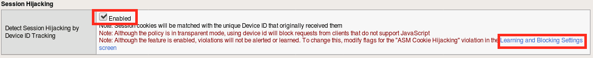
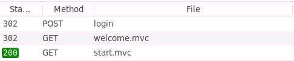
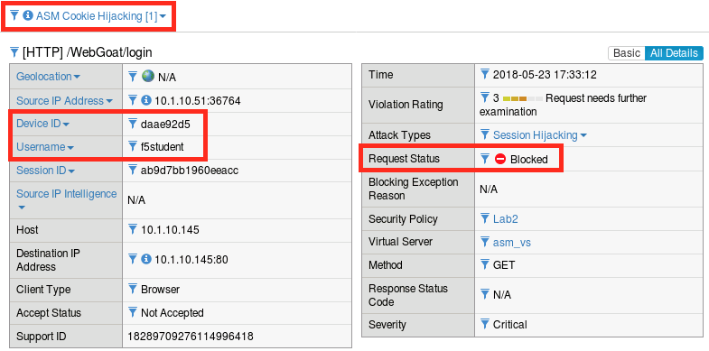
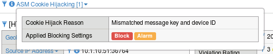
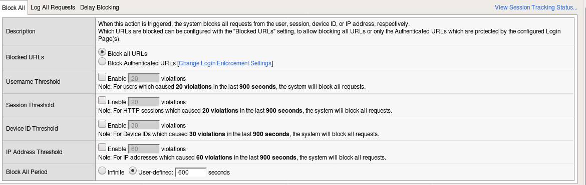
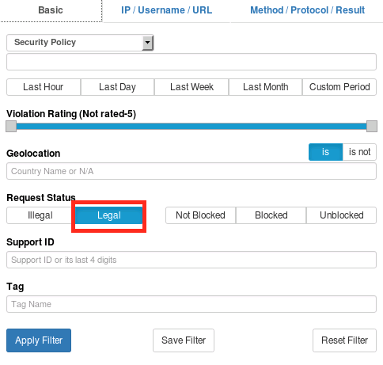
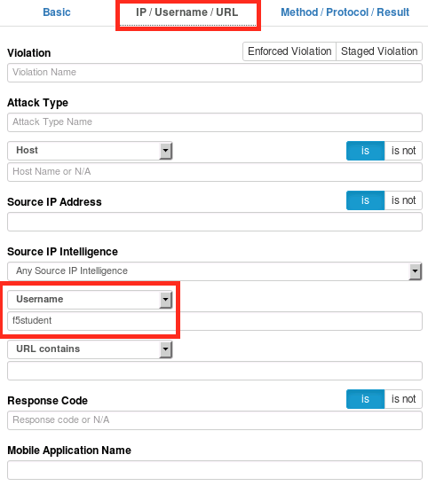
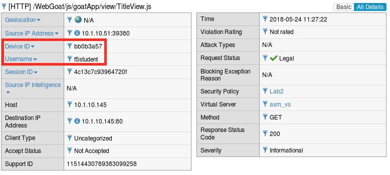
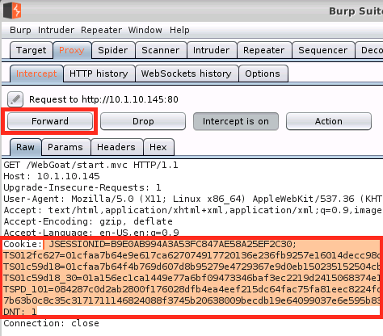
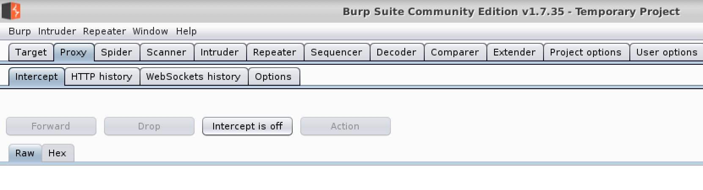

Lab 2.2: Session Hijacking Protection
-------------------------------------

Session hijacking is a class of attacks that allow an illegitimate user to take control of a legitimate session that was initiated by a legitimate user.  Initially this class of attacks was first observed against simple unencrypted protocols like telnet, though this typically required the attacker to have control of a system in the same network segment as the target and strike while the TCP connection was still active.  For the purposes of this lab, we’re actually referring to HTTP session hijacking which is similar in concept but completely different in its execution.  HTTP applications typically use cookies to store session information, so when we say “HTTP Session Hijacking”, we’re *usually* referring to cookie hijacking which actually involves the theft of the cookie and thus the user’s session key.  HTTP based applications often tend to maintain session state long after the TCP connection has been shut down, which actually makes the attack more practical than our telnet example.  In most cases web applications will implicitly trust a session cookie, even a stolen one…which is clearly a problem.  ASM has a number of capabilities that can address these issues and you’ll explore one of the more interesting approaches in this lab.

.. note:: Items in this section depend on steps in prior sections, please ensure you've completed all sections in lab 2 up to this point before beginning this lab.

Task 1 - Configure Session Hijacking Protection
~~~~~~~~~~~~~~~~~~~~~~~~~~~~~~~~~~~~~~~~~~~~~~~

#.  Open the BIG-IP interface in **Firefox** and navigate to **Security -> Application Security -> Sessions and Logins -> Session Tracking**.

#.  **Click** the checkbox to enable **Detect Session Hijacking by Device ID Tracking** and click **Save**. Then, follow the link to **Learning and Blocking Settings**.

    |lab22-1|

#.  Change the enforcement mode to **Blocking**.

#.  Expand the **Sessions and Logins** section and select **Alarm** and **Block** for **ASM Cookie Hijacking**, then click **Save**.

#.  Click **Apply Policy** then click **OK**.

|
|
|
    **Session Hijacking protection is now enabled.**

|
|

Task 2 - Test Session Hijacking Protection
~~~~~~~~~~~~~~~~~~~~~~~~~~~~~~~~~~~~~~~~~~

#.  From the jumphost desktop, launch Burp Suite using the icon on the desktop. If you are prompted to update Burp, ignore this pop-up by clicking "Close". 

#.  Select Temporary Projects and click Next.

#.  Leave Defaults checked and click "Start Burp"

#.  Select the "Proxy" tab and then turn intercept off.

	|proxyoff|

#. Close all running instances of Chrome.

#.  Run ``google-chrome-stable --incognito --proxy-server="http://127.0.0.1:8080"`` in the same or a different terminal.

#.  Open the WebGoat login page (``http://10.1.10.145/WebGoat/login``) in **Chrome** but do not log in.

#.  Open a new private browsing window in **Firefox**, then type ``ctrl+shift+i`` to open inspector, and click the network tab.
    
#.  Navigate to WebGoat (in **Firefox**) at ``http://10.1.10.145/WebGoat/login`` and refresh the page 12 times.

#.  Login to WebGoat (in **Firefox**).

#.  Find the 200 request for ``start.mvc`` in the network debugging window and click on it. It should look like this:

    |lab22-2|

    The request and response headers should then appear to the right.

#.  Click **Raw headers**, highlight the entire ``Cookies:`` and ``DNT:`` sections and copy them to the clipboard.

#.  Go back to Chrome and refresh the WebGoat login page 12 times to generate some traffic.

#.  Go back to burp and re-enable intercept.

#.  Go back to Chrome and go to ``http://10.1.10.145/WebGoat/start.mvc#lesson/WebGoatIntroduction.lesson`` (avoid copying and pasting as you'll loose your cookie data).

#.  Go back to burp and quickly **replace** the **cookie** and **DNT** headers in the dialog with the one in your clipboard, then click **Forward** several times until the button turns grey.

    |lab22-9|

#.  Disable intercept in burp.

#.  Click refresh in **Chrome** if necessary (sometimes more than one is required).  You should get an ASM block page.

#.  Return to the BIG-IP and navigate back to **Security -> Event Logs -> Application -> Requests**.  You should see one or more illegal requests.

#.  Click on the most recent illegal request, click **all details** and make note of the attributes (particularly the DeviceID):

    |lab22-3|

#.  If you click on **ASM Cookie Hijacking** you should also see the following explanation:

    |lab22-4|

#.  Now click the **magnifying glass** in the upper left corner of the log frame and use the **search** feature find a **legal** request from ``f5student``.  ASM's session tracking capabilities extend to search as well.

    |lab22-6| |lab22-7|

#.  Compare the device IDs in this request vs the illegal request we just looked at. They should be different:

    |lab22-8|

    .. note:: The Device ID is essentially a fingerprint computed from a number of different browser and system attributes. They are unique identifiers that do not depend on browser session data. ASM uses these computed values to uniquely identify clients and tie them to user and session data. In this exercise we triggered an ASM Cooking Hijacking violation by replacing the cookies in the HTTP request with those of an existing valid session. ASM was able to detect this because the cookie data did not match the Device ID of the new browser.

#.  If this were a production configuration, we would likely enable the blocking settings back on the **Session Tracking** page so that these attacks would not be allowed to continue, but for the purposes of maintaining access to the lab environment we've elected not to do so.  Feel free to circle back and explore these options at the end of the lab:

    |lab22-5|

#. Please close any instances of Burp and Chrome before continuing.

|
|

**This Concludes Section 2.2.**
