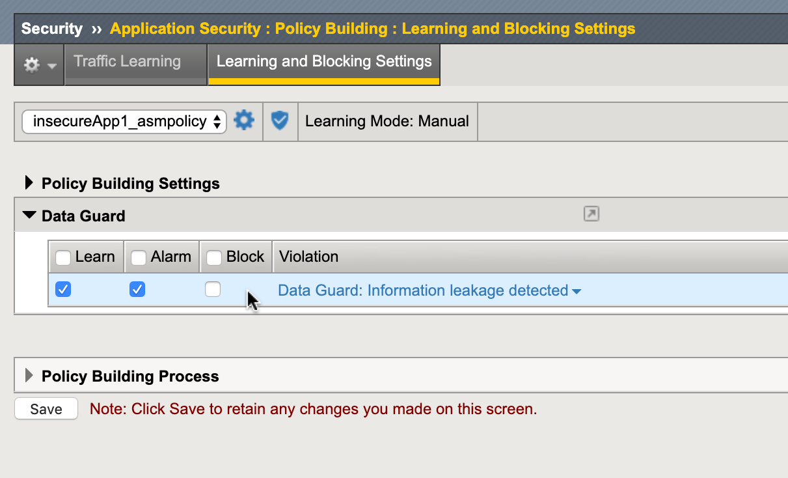
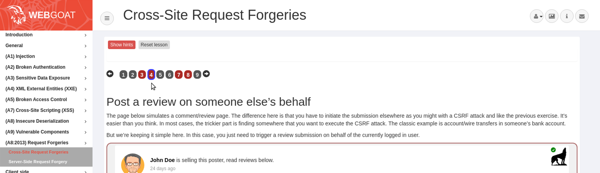
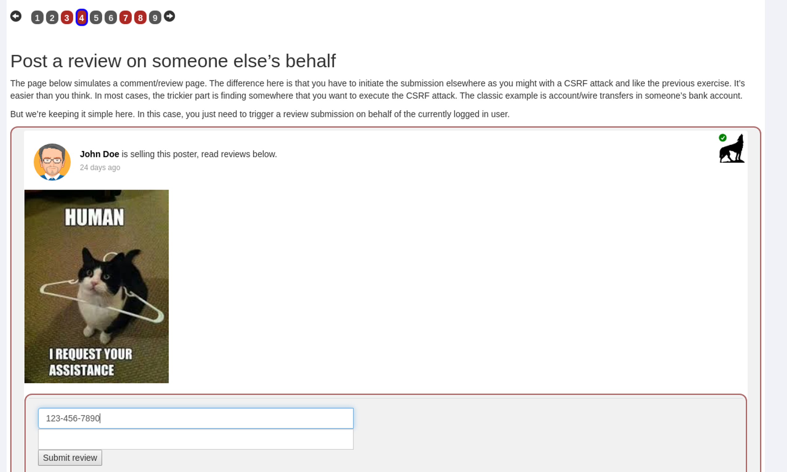
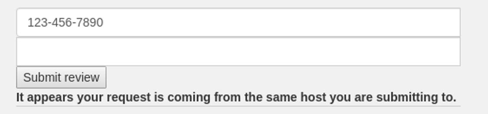
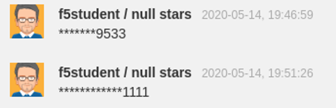

Lab 2.2: Data Guard
-------------------

..  |lab2.2-1| image:: images/lab2.2-1.png
        :width: 800px

DataGuard is a DLP-like feature of ASM that can prevent harmful data leakage from your application in the event of a successful attack.  It can also be used to help prevent users from entering certain types of data that should not be stored in a particular system.  This feature should be deployed with care as it has the potential to break applications if applied too broadly.

Task 1 - Configure DataGuard
~~~~~~~~~~~~~~~~~~~~~~~~~~~~

#.  From within your existing ASM policy, navigate to **Security -> Application Security -> Data Guard**.

#.  Click the **checkbox** to enable DataGuard, then click **Save**.

    |lab2.2-1|

#.  Navigate to **Security -> Application Security -> Policy Building -> Learning and Blocking Settings**.

#.  Use the **search box** to find the ``Data Guard`` section and disable blocking:

    |lab2.2-2|

#.  Click **Save**.

#.  Click **Apply Policy** .

..  note:: Deploying DataGuard too pervasively can have a negative performance impact on your system. In a production environment we typically recommend deploying DataGard against specific URLs where possible.

Task 2 - Test DataGuard
~~~~~~~~~~~~~~~~~~~~~~~

#.  Open a new private browsing window in **Firefox** and login as f5student to WebGoat at ``https://insecureapp1.f5.demo/WebGoat/login``.

#.  Click **A8:2013 Request Forgeries / Cross Site Request Forgeries** in the WebGoat menu then click **4** on the menu.

    |lab2.2-3|

#.  Type in something that looks like a social security number in the first field  like ``135-79-0246`` for example.

    |lab2.2-4|

#. Click submit and you will receive a message. Press F5 or refresh to reload browser

    |lab2.2-4a|

#.  Now try a fake credit card number like ``4111111111111111``.  Refresh your browser and you should see your comments with ** in place of the sensitive data

    |lab2.2-5|

    .. NOTE:: You can also use PCRE to define custom patterns for obfuscation.  Feel free to experiment with this as it can have interesting consequences for the application (intentional or otherwise).

|
|

**This concludes section 2.2**
