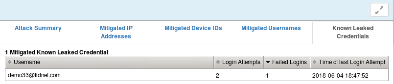

Lab 2.3: Credential Stuffing
----------------------------

..  |lab23-1| image:: images/lab23-1.png
        :width: 800px
..  |lab23-2| image:: images/lab23-2.png
        :width: 800px
..  |lab23-3| image:: images/lab23-3.png
        :width: 800px
..  |lab23-4| image:: images/lab23-4.png
        :width: 800px
..  |lab23-5| image:: images/lab23-5.png
        :width: 800px
..  |lab23-6| image:: images/lab23-6.png
        :width: 800px

Credential stuffing is a type of brute force attack that leverages stolen credentials from another source. This source is most commonly the breach of a widley used online service.  These leaked credentials are then levered in an attempt to compromise higher value targets in instances where users used the same credentials across multiple services. BIG-IP now has the capability to detect these types of attacks by employing a database of credentials that are known to have been compromised in a previous breach. The credentials are stored as one-way hashed usernames and passwords to protect them from further disclosure. Also note that we've chosen CAPTCHA as mitigation for this lab because it provides immediate feedback to the student.  In a production environment, Client Side Integrity Defense (or both), may be a more effective form of mitigation during an actual attack.  Feel free to experiment with this in the lab.

.. note:: Items in this section depend on steps in prior sections, please ensure you've completed all sections in lab 2 up to this point before beginning this lab.

Task 1 - Configure Credential Stuffing Detection
~~~~~~~~~~~~~~~~~~~~~~~~~~~~~~~~~~~~~~~~~~~~~~~~

#.  Open the BIG-IP interface in Firefox. 
    
#.  Navigate to **Security -> Application Security -> Anomaly Detection -> Brute Force** and click **Create**.

    .. note:: ASM has a number of brute force attack detection capabilities that are beyond the scope of this exercise.  Take some time to examine some of the other options as you work through this lab.  For more information see:  ``https://support.f5.com/kb/en-us/products/big-ip_asm/manuals/product/asm-implementations-13-1-0/6.html`` .

#.  Select the login page we created in Lab 2.1.

    |lab23-1|

#.  Configure **Credential Stuffing** detection within the **Distributed Brute Force** Section as follows:

    |lab23-3|

#.  Click **Create** .

    
#.  Click **Apply Policy**, then click **OK** .

Task 2 - Test Credential Stuffing Detection
~~~~~~~~~~~~~~~~~~~~~~~~~~~~~~~~~~~~~~~~~~~
    
#.  Open a new Private Browsing window in **Firefox** .

#.  Go to the to WebGoat login page at ``http://10.1.10.145/WebGoat/login`` but **do not login as f5student** .

#.  Attempt to login using the username ``demo33@fidnet.com`` and password ``mountainman01``.  On the second attempt, you should immediately be challenged via CAPTCHA because this username/password combination is present in the credential stuffing database.

#.  **Solve** the CAPTCHA(s) and continue.

#.  Examine the most recent **illegal** request in the event log:

    |lab23-4|

    Take note of the username field.  The request was blocked as a brute force attack.

#.  Click the **Brute force: Maximum Login Attempts are exceeded** header at the top of the event window:

    |lab23-5|

    The message indicates the number of login attempts that matched the internal database.

#.  Now check out the reporting under **Event Logs -> Application -> Brute Force Attacks**:

    |lab23-6|

#.  Click on one of the attack entries to get some more detail about the attack:

    |lab23-7|

#.  For fun, head over to ``https://haveibeenpwned.com/`` and put in the email address of the account we used in the lab to get some details.  It may also be interesting to put in your own account(s) to see if any of your credentials have been breached.  You could also try some of your old username/password combinations against the credential stuffing database on the F5.  While on the main page explore some of the breach data on the bottom to get a sense of how big this problem is.

    .. note:: The credential stuffing feature is considered Early Access in version 13.1 and the database is not yet being updated regularly.  You are advised to seek guidance from your F5 SE before deploying this capability.

#.  In order to release any blocking that's currently in place, navigate to **Security -> Application Security -> Anomaly Detection -> Brute Force** and **delete** the Brute Force configuration we created previously.

#. Click **Apply Policy** then click **OK**.

|
|

**This concludes section 3.**

