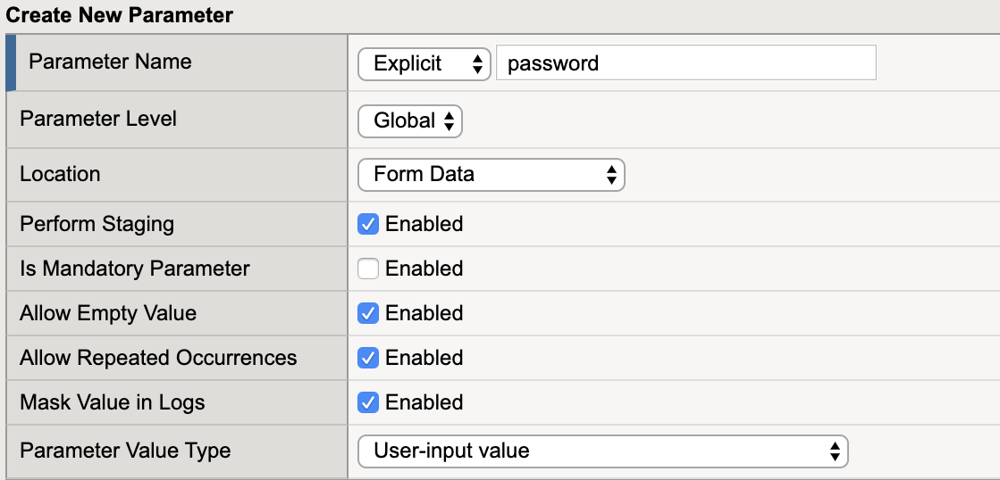
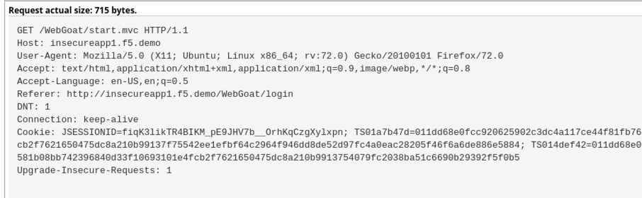

Lab 2.3: Sensitive Data
=======================

.. |lab2.3-0| image:: images/lab2.3-0.png
   :width: 800px

.. |lab2.3-2| image:: images/lab2.3-2.png
   :width: 800px

.. |lab2.3-5| image:: images/lab2.3-5.png
   :width: 800px

.. |lab2.3-9| image:: images/lab2.3-9.png
  :width: 800px

By default, the BIG-IP ASM system logs information about incoming requests to
the request log in plain text. In some cases you may want to mask request
information in the logs as some requests include sensitive information, such as
authorization credentials or credit card information. When you enable Mask
Value in Logs for a policy element, the system replaces the sensitive data with
asterisks (\*\*\*\*\*\*). The masked data cannot be viewed by the administrator.

You can mask data in the logs for the following policy elements.

**Parameters**	Masks the parameter value, including the value for positional parameters. The setting does not mask the parameter name.	GET /profiles/******

**HTTP headers**	Masks the header value. The setting does not mask the header name.	GET / HTTP/1.1
Host: Example.com
Connection: Keep-alive
Authorization: ******
Cookie: TS-Cookie

**Cookies**	Masks the values for allowed and enforced cookies types. The setting does not mask the cookie name and does not apply to BIG-IP ASM cookies.	GET / HTTP/1.1
Host: Example.com
Connection: Keep-alive
Cookie: ******

**JSON Profiles**	Masks elements within the JSON data whose values are should considered sensitive.	secID: ******

**XML Profiles**	Masks sensitive data in an XML document. You can specify the element or attribute whose value contains sensitive data and should be masked by the policy.	<secID>******</secID>

More information can be found here :
https://support.f5.com/csp/article/K52154401

Task 1 - Login Page
~~~~~~~~~~~~~~~~~~~

#.  Open a new Private Browsing window in **Firefox** .
#.  Go to the to WebGoat login page at ``https://insecureapp1.f5.demo/WebGoat/login`` and login as f5student

#. Examine the most recent  request in the event log for /WebGoat/login. Notice that you cannot see the password for f5student in the request.
   The password is masked in the logs due to a sensitive parameter setting.

        |lab2.3-0|

#.  Open the BIG-IP interface.

#.  Navigate to **Security -> Application Security -> Parameters List** and select the Sensitive Parameters tab and view the configuration.

        |lab2.3-9|

#. Next we will obfuscate cookies as they could contain sensitive information we would not want an administrator to have access to.

#. Navigate to **Security -> Application Security -> Headers -> Cookies List.**

#. Click Create and create the JSESSIONID cookie as seen below

        |lab2.3-2|

#. Click **Create and then Apply Policy**

#.  Open a new Private Browsing window in **Firefox** .

#.  Go to the to WebGoat login page at ``https://insecureapp1.f5.demo/WebGoat/login``  and login

#.  Examine the most recent requests and compare to earlier requests in the event log by navigating to **Security -> Event Logs -> Applications -> Requests**.

#. The cookie content is now obfuscated in the Logs when they were visible before.

        |lab2.3-3|

        After applying mask.

        |lab2.3-5|

**This concludes section 2.3**
