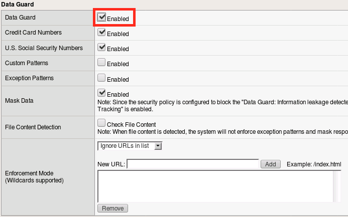
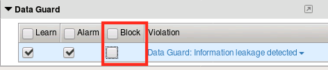
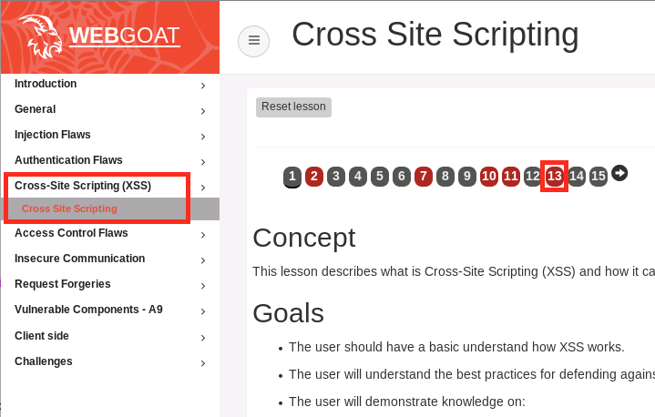
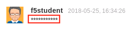

Lab 2.4: Data Guard
-------------------

.. note:: Items in this section depend on steps in prior sections, please ensure you've completed all sections in lab 2 up to this point before beginning this lab.

DataGuard is a DLP-like feature of ASM that can prevent harmful data leakage from your application in the event of a successful attack.  It can also be used to help prevent users from entering certain types of data that should not be stored in a particular system.  This feature should be deployed with care as it has the potential to break applications if applied too broadly.

Task 1 - Configure DataGuard
~~~~~~~~~~~~~~~~~~~~~~~~~~~~

#.  From within your existing ASM policy, navigate to **Security -> Application Security -> Data Guard**.

#.  Click the **checkbox** to enable DataGuard, then click **Save**.

    |lab24-1|

#.  Navigate to **Security -> Application Security -> Policy Building -> Learning and Blocking Settings**.

#.  Use the **search box** to find the ``Data Guard`` section and disable blocking:

    |lab24-2|

#.  Click **Save**.

#.  Click **Apply Policy** then click **OK**.

..  note:: Deploying DataGard too pervasively can have a negative performance impact on your system. In a production environment we typically recommend deploying DataGard against specific URLs where possible.

Task 2 - Test DataGuard
~~~~~~~~~~~~~~~~~~~~~~~

#.  Open a new private browsing window in **Firefox** and login to WebGoat at ``http://10.1.10.145/WebGoat/login``.

#.  Click **Cross Site Scripting** in the WebGoat menu then click **13**.

    |lab24-3|

#.  Scroll down until you see the **Add Comment** field.  Then type in something that looks like a social security number, like ``123-45-6789`` for example.

#.  Note that the value you just entered has been obfuscated:

    |lab24-4|

#.  Try entering something like ``Hello World!`` to see the difference.

    |lab24-5|

#.  Now try a fake credit card number like ``4111111111111111``.  That should also be obfuscated:

    |lab24-6|

    .. NOTE:: You can also use PCRE to define custom patterns for obfuscation.  Feel free to experiment with this as it can have interesting consequences for the application (intentional or otherwise).

#.  When you're finished, return to **Local Traffic -> Virtual Servers -> asm_vs -> Security Tab -> Policies** and **disable** your ASM policy in preparation for the next module.

|
|

**This concludes section 4.**

