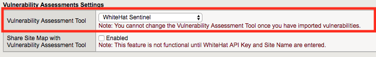
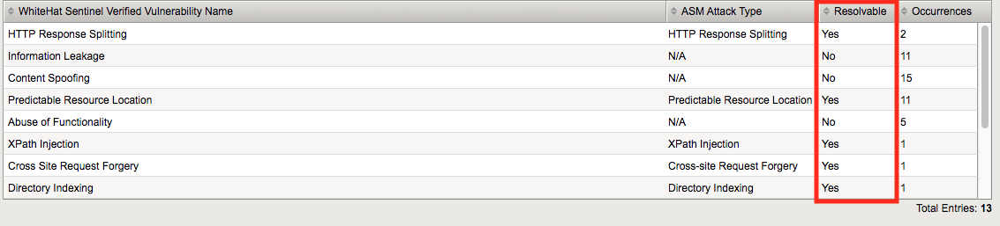
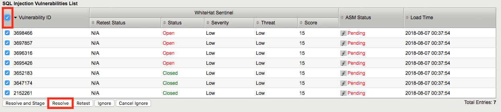
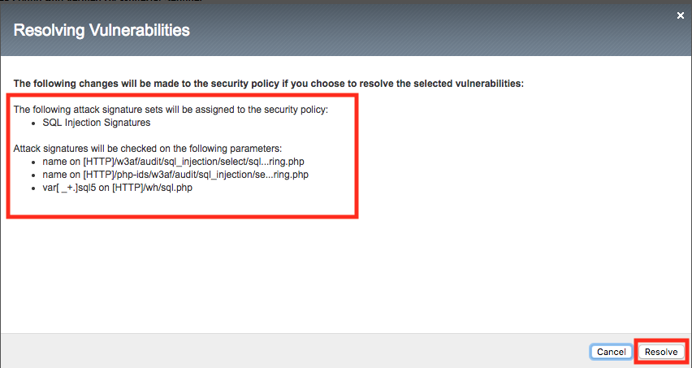
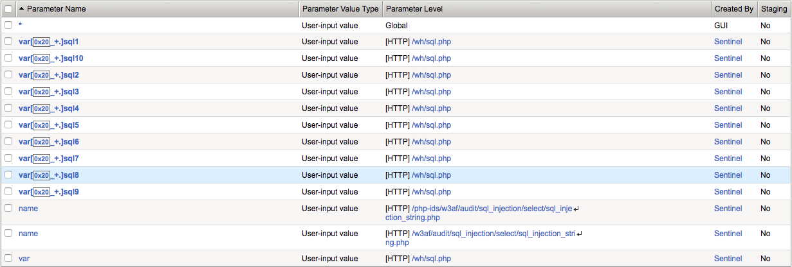

Lab 2.5: DAST Integration
-------------------------

..  |lab25-1| image:: images/lab25-1.png
        :width: 800px

..  |lab25-3| image:: images/lab25-3.png
        :width: 800px
..  |lab25-4| image:: images/lab25-4.png
        :width: 800px
..  |lab25-5| image:: images/lab25-5.png
        :width: 800px
..  |lab25-6| image:: images/lab25-6.png
        :width: 800px

..  |lab25-8| image:: images/lab25-8.png
        :width: 800px

..  |lab25-11| image:: images/lab25-11.png
        :width: 800px

ASM's DAST (Dynamic Application Security Testing) integration allows you to take the programmatic output from a vulnerability scan and use it to seed a security policy.  For this lab, we'll use output from WhiteHat's Sentinel(TM) product to create a security policy based on Sentinel's findings.

Task 1 - Create a Security Policy
~~~~~~~~~~~~~~~~~~~~~~~~~~~~~~~~~

#.  Open your browser of choice and navigate to the BIG-IP management interface.  For the purposes of this lab you can find it at ``https://10.1.1.245/`` or by clicking on the **bigip** shortcut in Firefox.

#.  Login to the BIG-IP.

#.  Create a new ASM policy by navigating to **Security -> Application Security -> Security policies**.

#.  Click **Create New Policy**, fill in the page as follows, and then click **create policy** as shown below.
    
        |lab25-1|

#.  Once the policy is created, go to **Security -> Application Security -> Vulnerability Assessments -> Settings**.

#.  Select **WhiteHat Sentinel** from the dropdown list.

        |lab25-2|

    .. NOTE:: It's worth mentioning that ASM and Sentinel have more advanced integrations that we will not explore here.  This is mostly due to the logistics of procuring Sentinel accounts for all students attending this lab.  It's worth mentioning however, that providing an API key will allow you to pull in scan data directly from Sentinel into ASM as well as share ASM site mapping data back to Sentinel in order to improve scanning capabilities.

Task 2 - Import the Scan Data
~~~~~~~~~~~~~~~~~~~~~~~~~~~~~

#.  Select the **Vulnerabilities** tab at the top:

        |lab25-3|

#.  **Click** the **import** button:

        |lab25-4|

#.  Import the **vuln.xml** file from **/home/f5student/Agility2018/ASM341** .

        |lab25-5|

#.  The next screen would allow you to select findings associated with a specific domain which would be useful in a production environment where the scanner output may contain findings for more than one application.  For the purposes of our lab, ensure all domains are selected and click **import** once more.

        |lab25-6|

#.  You'll then be greeted by a list of vulnerability types and an indication of whether or not they are resolvable by ASM:

        |lab25-7|

#.  Scroll down and select **SQL Injection** from the bottom then click on the first **Vulnerability ID**. You'll be shown more details about the specific vulnerability such as the relevanit URL and Parameter where the vulnerability is present (as in this case).

        |lab25-8|

Task 3 - Remediate some Vulnerabilities
~~~~~~~~~~~~~~~~~~~~~~~~~~~~~~~~~~~~~~~

#.  Select the checkbox at the top to select all of the SQL injection vulnerabilities and click **resolve**.  Note that there are a number of other options including "Resolve and Stage" which would put the changes into staging for further evaluation.

        |lab25-9|

#.  ASM then provides a list of the changes it's about to make.  Review the changes and click **resolve**.

        |lab25-10|

#.  You'll notice that the vulnerabilities you selected are now marked mitigated.

        |lab25-11|

Task 4 - Review the Output
~~~~~~~~~~~~~~~~~~~~~~~~~~

#.  Now navigate to **Security -> Application Security -> Parameters -> Parameters List** and you'll see that the ASM policy has been populated for you.

        |lab25-12|

#.  Now return to the Vulnerabilities dialog and explore some of the other items if you wish.  **Hint:** You can utilize **Tree View** under **Security -> Application Security -> Policy -> Tree View** to get a summary of what's in the policy.  Be sure you've selected the correct security policy in the dropdown.

    .. NOTE::  Data from a vulnerability scan can be a great way to get an ASM policy up and running quickly but you should consider that there may be vulnerabilities in the application beyond the reach of the scanner.  It is therefore a good idea in many instances to enable the Automatic Policy Builder after policy creation to help refine the policy and tighten security over time.

|
|

**This concludes section 5.**
