Lab 3.1: Bot Protection
-----------------------

In this lab we'll work with a feature called Proactive Bot Defense that uses advanced fingerprinting techniques to determine whether or not clients are legitimate browsers and block those that are not.  F5 Labs (``https://www.f5.com/labs``) has identified that a large portion of internet traffic (in some cases more than 50%) is actually generated by bots.  As a result this feature set can not only dramatically improve a web property's security posture, but often its performance as well (by excluding illegitimate traffic). 

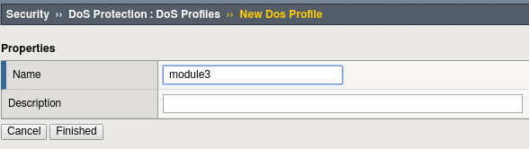
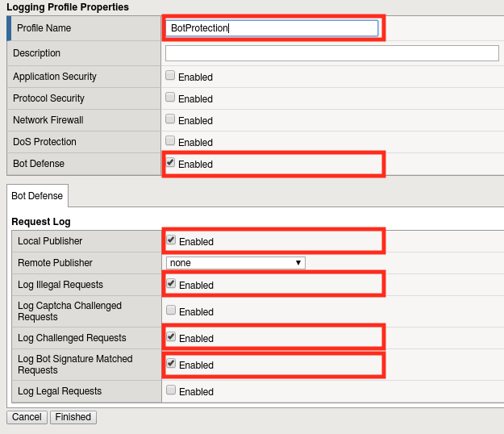
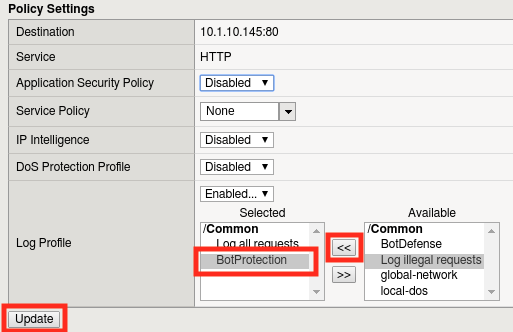
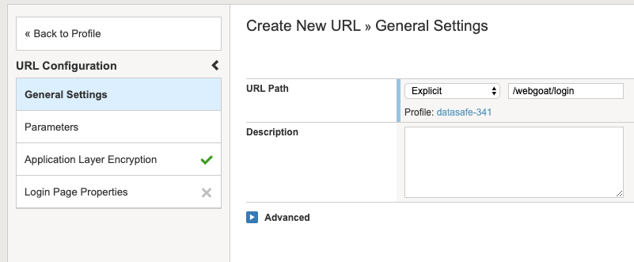
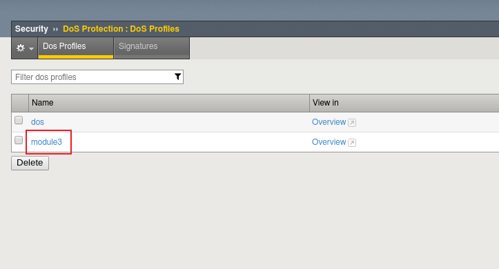
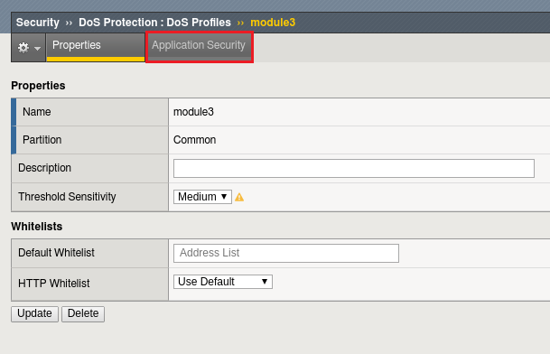
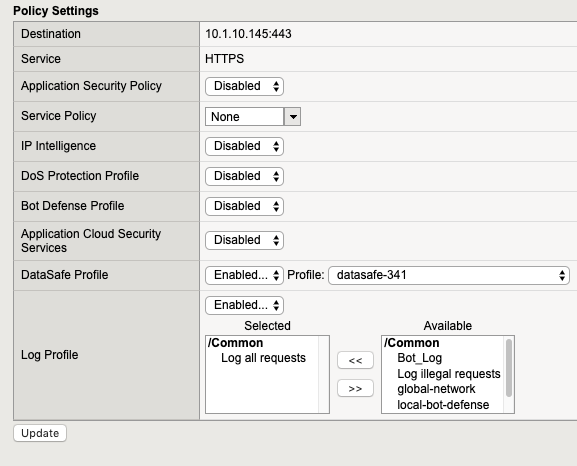
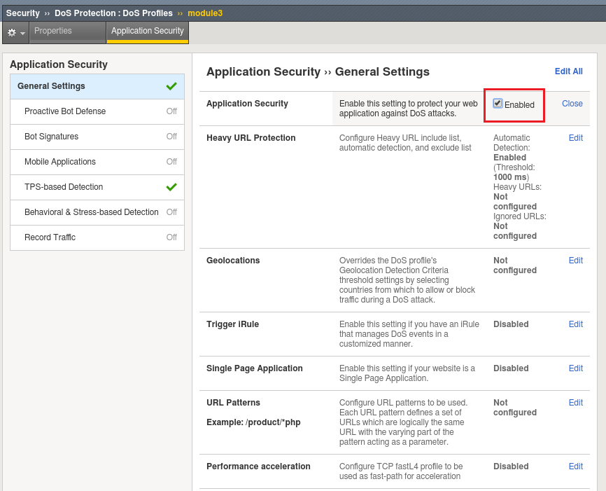
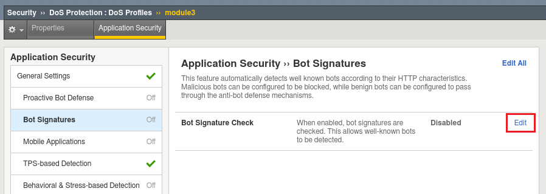
.. |lab3-8| image:: images/lab3-8.png
        :width: 800px
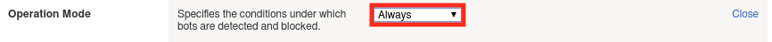
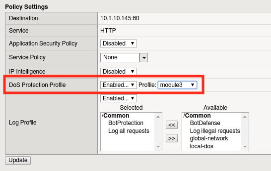
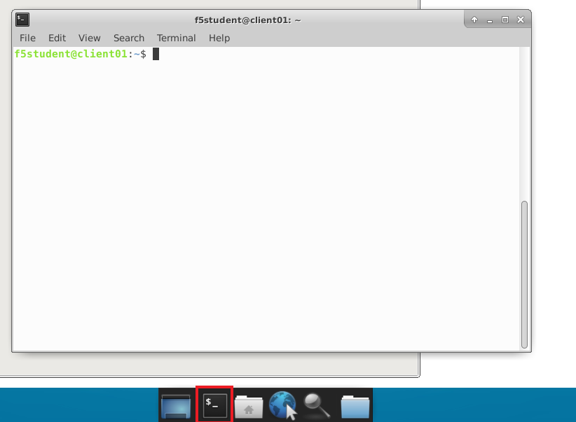
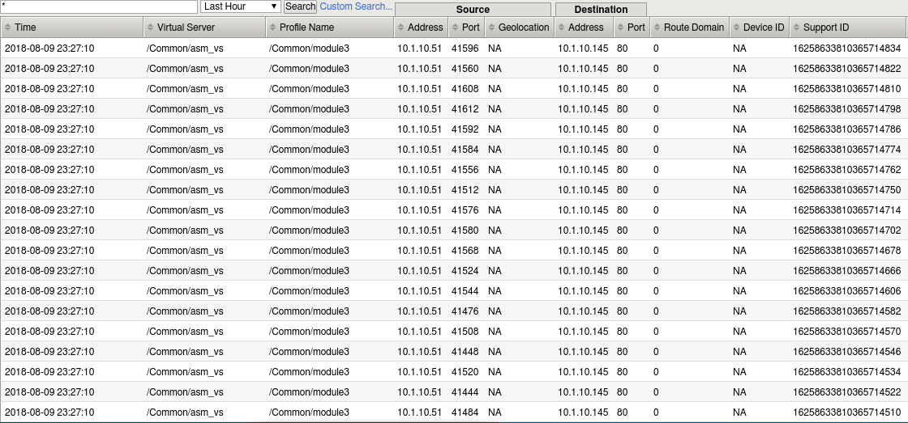
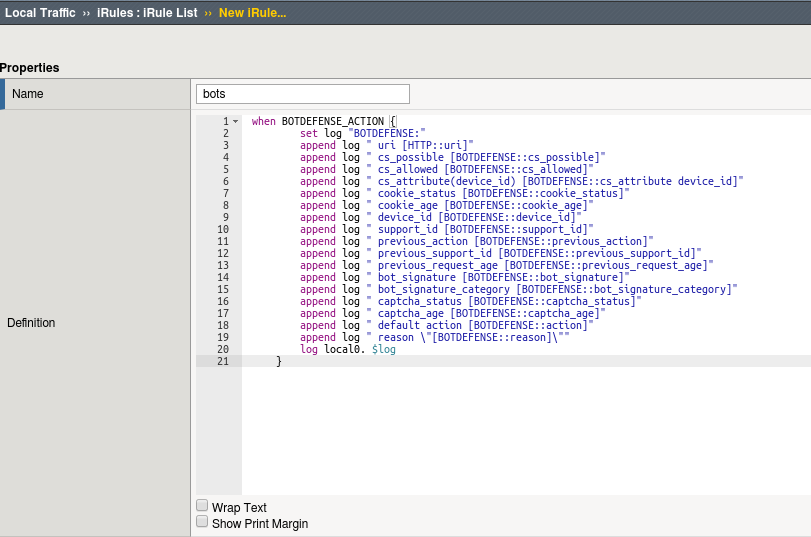
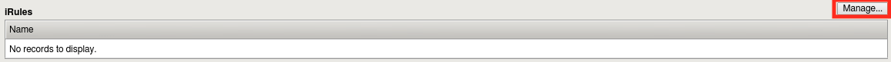
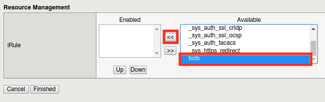
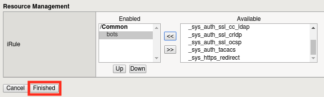
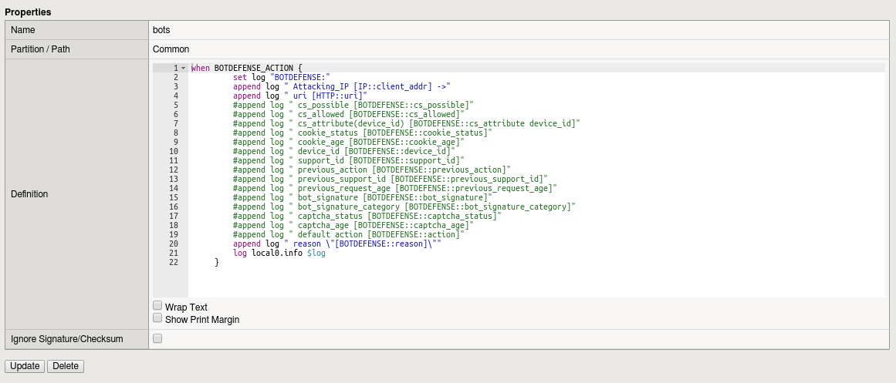
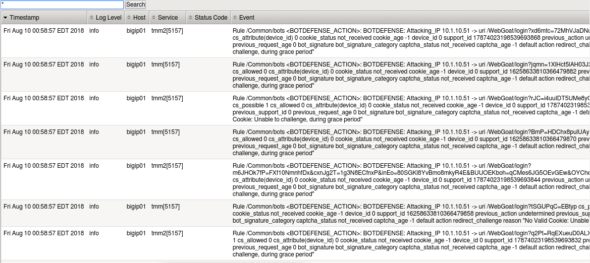
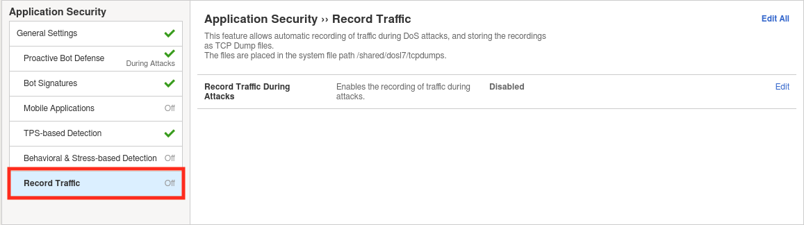
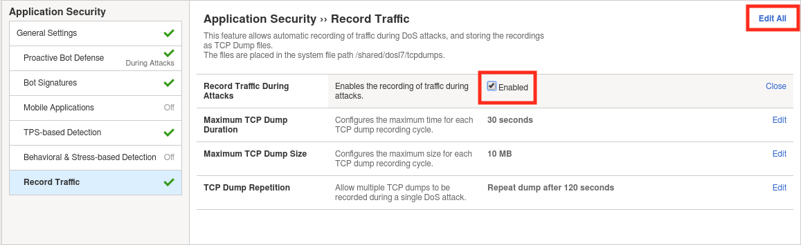
.. |lab3-21| image:: images/lab3-21.png
        :width: 800px
.. |lab3-22| image:: images/lab3-22.png
        :width: 800px
.. |lab3-23| image:: images/lab3-23.png
        :width: 800px
.. |lab3-24| image:: images/lab3-24.png
        :width: 800px
.. |lab3-25| image:: images/lab3-25.png
        :width: 800px

Task 1 - Configuring Bot Defense
~~~~~~~~~~~~~~~~~~~~~~~~~~~~~~~~

#. Browse to the BIGIP management console.

#. Create a new Logging profile for Bot defense by navigating to **Security -> Event Logs -> Logging Profiles** and clicking **Create**.

#. Configure as below and click **Finished**:

   |lab3-1a| 

#. Navigate to **Local Traffic -> Virtual Servers -> asm_vs**

#. Click the **Security Tab** then click **Policies**

#. Find the **BotProtection Log Profile** that we just created and assign it to the virtual server by clicking the "<<" button, then clicking **Update**.

   |lab3-2a|

#. Create a DoS profile by by navigating to **Security -> DoS Protection -> Dos Profiles** then clicking the **Create** button.

   |lab3-2|

#. Name the profile "module3" and click **Finished**.

   |lab3-1|

#. Click the **profile** you just created to configure it.

   |lab3-3|

#. Select the **Application Security** tab.

   |lab3-4|

#. Click **Edit**, followed by the **Enabled** checkbox to turn on Bot Detection.
	
   |lab3-5|

	
   |lab3-6|

#. Let's configure the types of bot protection that offer the best bang for the buck, starting with Signatures. Click the **Bot Signatures** tab and click **edit**.
	
   |lab3-7|

#. Now click the **Enabled** checkbox.  You'll see we can group bots by category or can select them uniquely. 
	
   |lab3-8|

#. Click **Edit** to explore the settings further. Try to resist the urge to modify any settings until the end of the lab, the defaults will serve us well.

#. For complete protection, let's go ahead and enable Proactive Bot Defense as well.  Click on the **Proactive Bot Defense** tab, click **Edit**.
   
#. Change the dropdown to **Always**.

	|lab3-9|

#. Click **Update** to save changes.

#. Now let's bind this DoS policy to a Virtual Server.  Navigate to **Local Traffic -> Virtual Servers -> Virtual Server List** and select 'asm_vs'.

#. Click on the **Security** tab and select **Policies**.

#. Enable the **module3** DoS Protection profile.

   |lab3-10|

#. Click **Update**.

   .. Note:: Proactive Bot Defense and other anti-bot capabilities found in the DoS profile do not actually require an ASM policy to implement.  While they are technically part of ASM, layer 7 DoS profiles are much lighter weight and execute before a security policy would.

Task 2 - Simulating Bot Traffic
~~~~~~~~~~~~~~~~~~~~~~~~~~~~~~~

#. Now that we have a DoS profile in place, lets test it!  

#. Open a command prompt on your jumpbox.

   |lab3-11|

#. Execute the following command a few times: 

   .. code-block:: bash 

      python /opt/goldeneye.py http://10.1.10.145/WebGoat/login -d -w 50 -s 200
   
   .. Note:: You'll get errors from GoldenEye as Proactive Bot Defense takes action against it.  This is expected behavior.

     

#. Wait a few minutes for traffic generation and logging.

#. In the BIG-IP WebUI, Navigate to **Security -> Event Logs -> Bot Defense -> Requests** .

#. Review the attacks detected by ASM (hint: you'll have to scroll all the way down to scroll right or left if you have lower resolution display).  
   
   |

   Can you tell what action was taken and why? (hint: scroll right)

   |lab3-12|

Task 3 - Custom logging with iRules
~~~~~~~~~~~~~~~~~~~~~~~~~~~~~~~~~~~

Lets say for a minute you wanted to customize your Bot Defense logging.  iRules make this easy.

#. Navigate to **Local Traffic -> iRules -> iRule List** then click **Create**.

#. Paste the following code block into the new iRule and call it **bots**.

    .. code-block:: tcl
      
        when BOTDEFENSE_ACTION {
          set log "BOTDEFENSE:"
          append log " uri [HTTP::uri]"
          append log " cs_possible [BOTDEFENSE::cs_possible]"
          append log " cs_allowed [BOTDEFENSE::cs_allowed]"
          append log " cs_attribute(device_id) [BOTDEFENSE::cs_attribute device_id]"
          append log " cookie_status [BOTDEFENSE::cookie_status]"
          append log " cookie_age [BOTDEFENSE::cookie_age]"
          append log " device_id [BOTDEFENSE::device_id]"
          append log " support_id [BOTDEFENSE::support_id]"
          append log " previous_action [BOTDEFENSE::previous_action]"
          append log " previous_support_id [BOTDEFENSE::previous_support_id]"
          append log " previous_request_age [BOTDEFENSE::previous_request_age]"
          append log " bot_signature [BOTDEFENSE::bot_signature]"
          append log " bot_signature_category [BOTDEFENSE::bot_signature_category]"
          append log " captcha_status [BOTDEFENSE::captcha_status]"
          append log " captcha_age [BOTDEFENSE::captcha_age]"
          append log " default action [BOTDEFENSE::action]"
          append log " reason \"[BOTDEFENSE::reason]\""
          log local0.info $log
       }

    |lab3-13|

#. Navigate to **Local Traffic -> Virtual Servers -> asm_vs** and click the **Resources Tab**.

#. Click the **Manage** button next to iRules.

    |lab3-14|

#. Add the iRule to the virtual server by selecting it and clicking the << button, then clicking **Finished**.

    |lab3-15|

    |lab3-16|

#. Launch Goldeneye again with the following command (run it a few times in a row):

    .. code-block:: bash 

      python /opt/goldeneye.py http://10.1.10.145/WebGoat/login -d -w 50 -s 200

#. View the Local Traffic log under **System -> Logs -> Local Traffic**:

    |lab3-18|

#. Now lets say we only wanted to see the attacking IP address and the reason.  Modify the iRule so it looks like the one below by commenting out the lines you're not interested in (you could also remove them):

    .. code-block:: tcl

        when BOTDEFENSE_ACTION {
         set log "BOTDEFENSE:"
         append log " Attacking_IP [IP::client_addr] ->"
         #append log " uri [HTTP::uri]"
         #append log " cs_possible [BOTDEFENSE::cs_possible]"
         #append log " cs_allowed [BOTDEFENSE::cs_allowed]"
         #append log " cs_attribute(device_id) [BOTDEFENSE::cs_attribute device_id]"
         #append log " cookie_status [BOTDEFENSE::cookie_status]"
         #append log " cookie_age [BOTDEFENSE::cookie_age]"
         #append log " device_id [BOTDEFENSE::device_id]"
         #append log " support_id [BOTDEFENSE::support_id]"
         #append log " previous_action [BOTDEFENSE::previous_action]"
         #append log " previous_support_id [BOTDEFENSE::previous_support_id]"
         #append log " previous_request_age [BOTDEFENSE::previous_request_age]"
         #append log " bot_signature [BOTDEFENSE::bot_signature]"
         #append log " bot_signature_category [BOTDEFENSE::bot_signature_category]"
         #append log " captcha_status [BOTDEFENSE::captcha_status]"
         #append log " captcha_age [BOTDEFENSE::captcha_age]"
         #append log " default action [BOTDEFENSE::action]"
         append log " reason \"[BOTDEFENSE::reason]\""
         log local0.info $log
     }

    |lab3-17|

#. Run the attack again, then refresh the logs to see the difference.

    .. Note:: These iRules could generate a lot of noise and may not be appropriate for production use without some filtering or rate limiting.

    .. Note:: In this lab we used iRules to customize Bot Defense logging, but it can also be used to modify Bot Defense behavior.  For more information see ``https://devcentral.f5.com/wiki/iRules.BOTDEFENSE__action.ashx``.

#. Remove the iRule and DoS Profile from the Virtual Server before you continue.

|

This concludes module 3.

      
