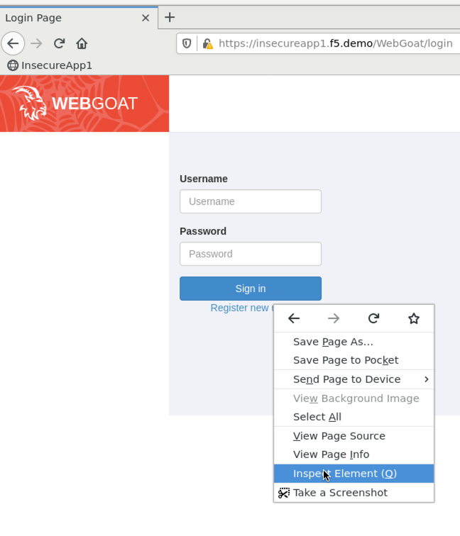

Lab 3.1: DataSafe
-----------------------

F5 Advanced WAF includes DataSafe which can protect your web applications from credential theft by MITB malware. In this exercise you will configure DataSafe to protect the Webgoat login page from credential theft.

.. |lab3-01| image:: images/lab3-01.png
        :width: 800px

.. |lab3-02| image:: images/lab3-02.png
        :width: 800px
.. |lab3-03| image:: images/lab3-03.png
        :width: 1000px
.. |lab3-1| image:: images/lab3-1.png
        :width: 800px
.. |lab3-2| image:: images/lab3-2.png
        :width: 800px
.. |lab3-3| image:: images/lab3-3.png
        :width: 800px
.. |lab3-4| image:: images/lab3-4.png
        :width: 800px
.. |lab3-5| image:: images/lab3-5.png
        :width: 800px
.. |Lab3-06| image:: images/lab3-06.png
        :width: 800px
.. |Lab3-07| image:: images/lab3-07.png
        :width: 800px
.. |Lab3-08| image:: images/lab3-08.png
        :width: 800px

Task 1 - Login Observation
~~~~~~~~~~~~~~~~~~~~~~~~~~~

#. Open a new Firefox Private Browsing window and go to the to WebGoat login page at ``https://insecureapp1.f5.demo/WebGoat/login``

#. Right click in the username field and choose 'inspect element' (or use CTRL + SHIFT + N). Notice the form field is visible and is named 'username'

    |Lab3-00|

    |Lab3-01|

#. Right click in the password field and choose 'inspect element'. Notice the form field is visbile and is named 'password'

    |Lab3-02|

#. Click in the **Network** tab in the Firefox Inspector and click **Persist logs**

#. Login to the WebGoat application as f5student:password

#. In the Firefox Inspector Network tab find the POST request to /login. Notice the password is in clear text in the request.

    |Lab3-03|

Task 2 - Configuring DataSafe
~~~~~~~~~~~~~~~~~~~~~~~~~~~~~~~~

#. Browse to the BIGIP GUI.

#. Navigate to **Security -> Data Protection -> BIG-IP Data Safe** and click + to create a new profile.

#. Name the new Data Safe profile **datasafe-341-profile** .

    |Lab3-1|

#. Add a url with settings seen below (notice case on url must be all lowercase)

    |Lab3-2|

#. Add parameters **username and password** as seen below.

    |Lab3-3|

    |Lab3-4|

#. Apply Data Safe Profile to Virtual Server

    |Lab3-5|

Task 3 - Test Data Safe Configuration
~~~~~~~~~~~~~~~~~~~~~~~~~~~~~~~~~~~~~~~

#. Open a new Firefox Private Browsing window and go to the to WebGoat login page at ``https://insecureapp1.f5.demo/WebGoat/login``

#. Right click in the username field and choose 'inspect element'. Notice the field name is obfuscated and rotates every few seconds.

    |Lab3-06|

#. Right click in the passeord field and choose 'inspect element'. Notice the field name is obfuscated and rotates every few seconds.

    |Lab3-07|

#. Login to the WebGoat application as f5student:password

#. In the Firefox Inspector Network tab find the POST request to /login. Notice the username and password fields are no longer in clear text.

    |Lab3-08|

This concludes Lab 3.
