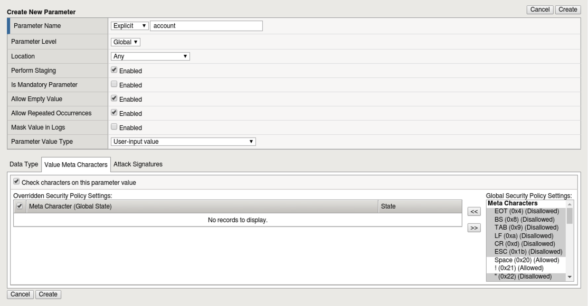
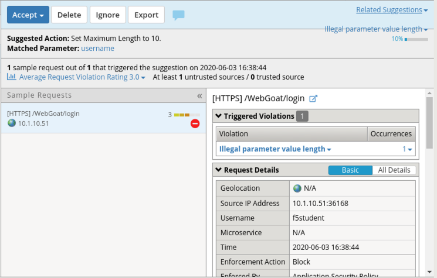
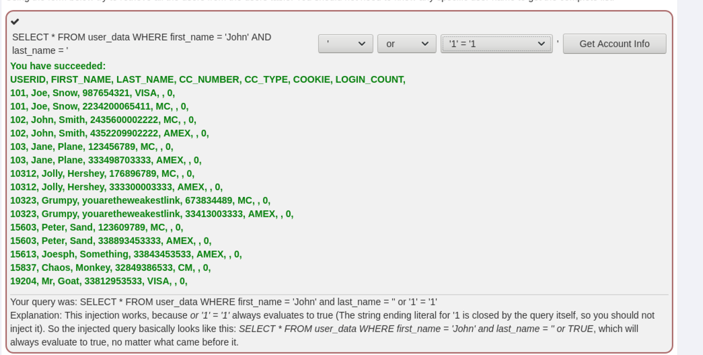
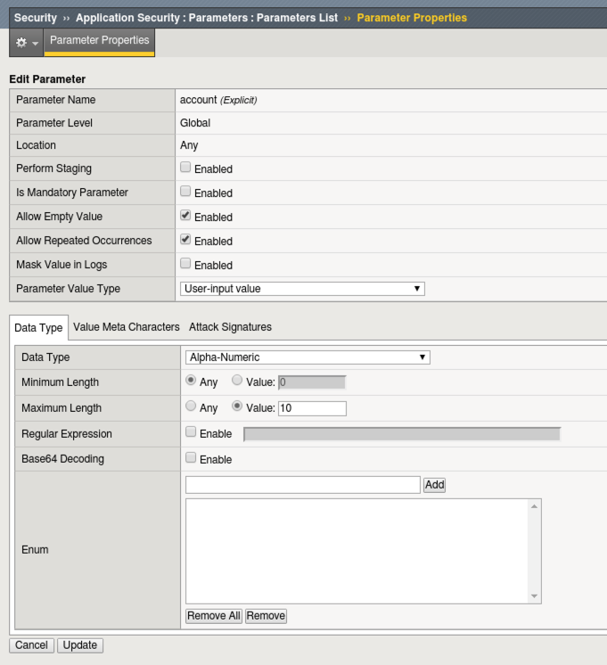
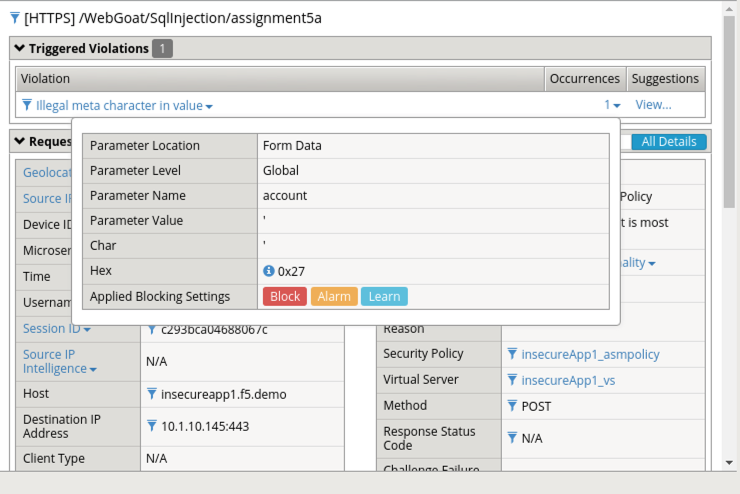

Lab 3.2: Protection from Parameter Exploits
-------------------------------------------

In this lab we will look at the parameter protection capability in F5 WAF.  F5 WAF can leverage automatic parameter learning using the automatic policy policy feature however in the interest of time, this lab we will be configuring parameters manually.
For more information on Automatic Policy Builder: `https://support.f5.com/csp/article/K75376155`

.. |lab3-01| image:: images/lab3-01.png
        :width: 800px

.. |lab3-03| image:: images/lab3-03.png
        :width: 800px
.. |lab3-04| image:: images/lab3-04.png
        :width: 800px

.. |lab3-06| image:: images/lab3-06.png
        :width: 800px
.. |lab3-07| image:: images/lab3-07.png
        :width: 800px

Task 1 - Create Parameters
~~~~~~~~~~~~~~~~~~~~~~~~~~~
#. Browse to the BIGIP GUI.

#. Navigate to **Security -> Application Security -> Parameters List** and click **create**. Create the username and account parameters as seen below and click **create**.

  **'username' parameter**

  |lab3-01|

  **'account' parameter**

  |lab3-02|

Task 2 - Modify Learning and Blocking
~~~~~~~~~~~~~~~~~~~~~~~~~~~~~~~~~~~~~~

Navigate to **Security -> Application Security -> Policy Building -> Learning and Blocking Settings** and enable the **Parameters** settings for 'illegal parameter value length' and 'illegal meta character in value' as seen below in the **Policy Building Settings** section.

    |lab3-03|

Task 3 - Test Configuration
~~~~~~~~~~~~~~~~~~~~~~~~~~~~~~~~~~~~~~~

#. Open a new Firefox Private Browsing window and go to the WebGoat login page at ``https://insecureapp1.f5.demo/WebGoat/login`` and login as **f5student**.

#. Your login attempt should be blocked.

#. Examine the recent event logs under **Security -> Event Logs -> Application -> Requests** for the /WebGoat/login events.

   |lab3-04|

#. Navigate to **Security -> Application Security -> Policy Building -> Traffic Learning**

#. Review the entry for **illegal parameter value length**.

   |lab3-05|

#. Click **Accept Suggestion** and then click **Apply Policy**

#. Open a new Firefox Private Browsing window and go to the to WebGoat login page at ``https://insecureapp1.f5.demo/WebGoat/login``

#. login as f5student

#. Your login should be allowed.

#. Return to **Security -> Application Security -> Parameters List**
   Notice that accepting the suggestion for the username parameter has adjusted the maximum-length value to 10.

   |lab3-06|

#. Open a new Firefox Private Browsing window and go to the to WebGoat login page at ``https://insecureapp1.f5.demo/WebGoat/login``

#. login as f5student

#. Choose Injection Flaws -> SQL Injection (intro) from the menu on the left then chose page 9 from the top.

   |lab3-07|

#. Adjust settings as seen and click **get account info**. The attack succeeds and you should see a list of accounts.

   |lab3-08|

#. Navigate to **Security -> Application Security -> Parameters List** and remove the **account** parameter from staging by unchecking the Enabled checkbox next to Perform Staging. Click Update then **Apply policy**.

   |lab3-09|

#. Open a new Firefox Private Browsing window and go to the to WebGoat login page at ``https://insecureapp1.f5.demo/WebGoat/login``

#. login as f5student

#. Choose Injection Flaws -> SQL Injection (intro) from the menu on the left then chose page 9 from the top.

#. Adjust settings as used in an earlier step and click 'get account info'.

#. The attack should fail since you are enforcing meta characters on your parameter. In this case the ' character is not allowed.

#. Review the event logs under **Security -> Event Logs -> Application -> Requests**. In this case the ' character is not allowed.

  |lab3-10|

This concludes Lab 3.2
