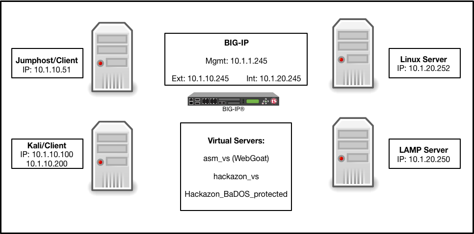

Lab Environment & Tools
~~~~~~~~~~~~~~~~~~~~~~~~~~~

.. WARNING:: All work for this lab will be performed exclusively from the Linux
   Jumphost/Client (client01). The client is accessed via RDP (Windows Remote Desktop) or ssh. No installation or interaction with your local system is
   required.

All pre-built environments implement the Lab Topology shown below.  Please
review the topology first, then find the section matching the lab environment
you are using for connection instructions.

Components and Tools
~~~~~~~~~~~~~~~~~~~~

Linux Client (Client01):

* Web Attack Tools:

 * `Burp Suite Community Edition <https://portswigger.net/burp>`_ - HTTP Request Manipulation
 * `iMacros <https://imacros.net/>`_ - Web Scraping
 * `ab (Apache Bench) <https://httpd.apache.org/docs/2.4/programs/ab.html>`_ - HTTP Load Testing

Kali Client (Kali-BaDOS):

 * `ab (Apache Bench) <https://httpd.apache.org/docs/2.4/programs/ab.html>`_ - HTTP Load Testing

Linux Server (Server01):

 * `WebGoat 8 <https://github.com/WebGoat/WebGoat/wiki>`_ - deliberately insecure application

LAMP Server (LAMPv4):

 * `Hackazon <https://github.com/rapid7/hackazon>`_ - deliberately insecure application

BIG-IP (bigip01):

 * Local Traffic Manager
 * Application Security Manager / Advanced WAF

Lab Topology
~~~~~~~~~~~~

#####Need topology description#####

The following table lists VLANS, IP Addresses and Credentials for all
components:

.. list-table::
   :widths: 15 15 15 15 20 
   :header-rows: 1
   :stub-columns: 1

   * - **Component**
     - **mgmtnet IP**
     - **clientnet IP**
     - **servernet IP**
     - **Credentials**
   * - Linux Client (client01)
     - 10.1.1.51
     - 10.1.10.51
     - N/A
     - https-``f5student:password``
   * - Bigip (bigip01)
     - 10.1.1.245
     - 10.1.10.245
     - 10.1.20.245
     - https - ``admin:password`` ssh - ``f5student:password``
   * - Linux Server (server01)
     - 10.1.1.252
     - N/A
     - 10.1.20.252
     - ssh - ``f5student:password``
   * - Kali (Kali-BaDOS)
     - 10.1.1.245
     - 10.1.10.100 / 10.1.10.200
     - N/A
     - ssh - ``f5student:password``
   * - Linux Server (LAMPv4)
     - 10.1.1.250
     - N/A
     - 10.1.20.250
     - N/A

A graphical representation of the lab:

|

.. note:: 
        
        External links are not required reading for the lab, rather supplemental if you you would like to get a different take or additional info.

