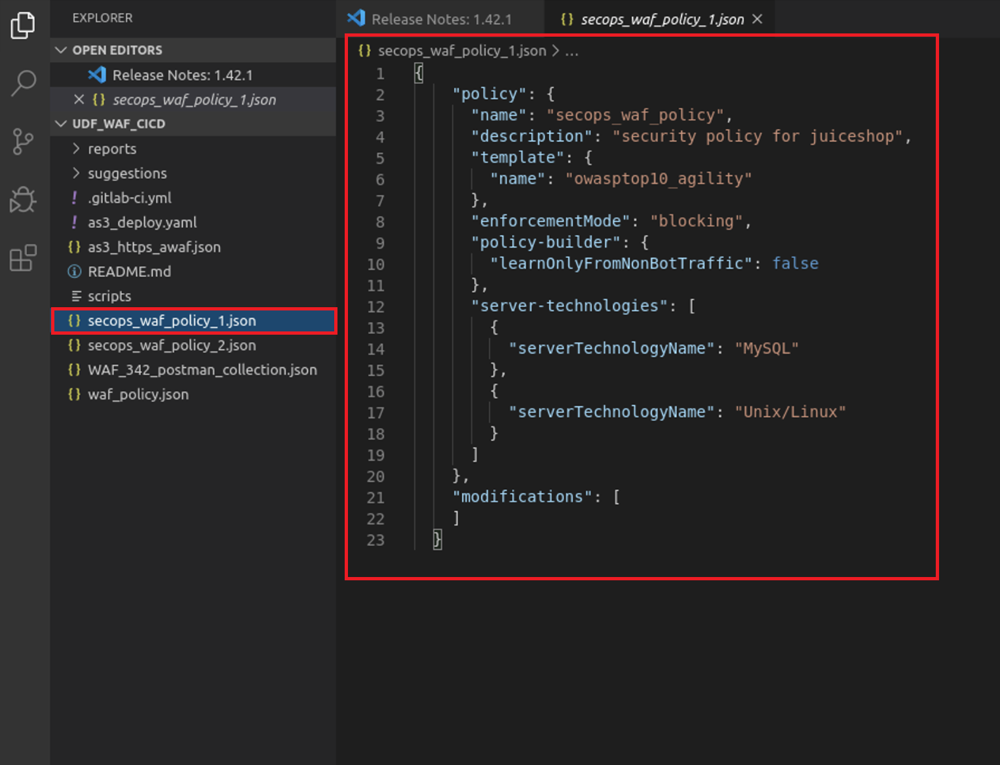
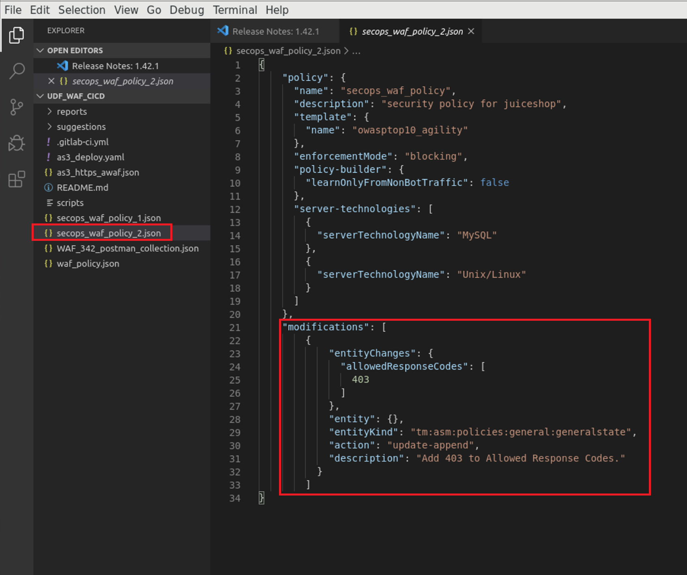

Lab 1.3: Creation of ASM Policies via Importing JSON Files
==========================================================

**1.3.1** Open Visual Studio Code by clicking on the icon shown below:
~~~~~~~~~~~~~~~~~~~~~~~~~~~~~~~~~~~~~~~~~~~~~~~~~~~~~~~~~~~~~~~~~~~~~~

.. image:: images/Lab2-1.png

**1.3.2** Once Visual Studio Code is open, you'll see a collection on the left titled 'UDF_WAF_CICD' with several items underneath:

.. image:: images/Lab2-2.png

**1.3.4** Click on 'secops_waf_policy_1.json' and review the configuration of the file. 

**1.**  Import into the BIG-IP.

**2.**  Navigate to 'Security  ››  Application Security : Security Policies : Policies List'

**a.**  click on the '...' next to 'Create' and select 'Import Policy':

.. image:: images/Lab2-4.png

**b.**  Navigate to the Desktop and select the 'waf342' folder

.. image:: images/Lab2-5.png
        
**c.**  Select the 'udf_waf_cicd' folder:

.. image:: images/Lab2-6.png

**d.**  Select the 'secops_waf_polic_1.json' file and select 'Open' in the BIG-Ip:

.. image:: images/Lab2-7.png
        
**e.** Select 'Import'

.. image:: images/Lab2-8.png
        
**f.** You'll now see a policy imported called 'secops_waf_policy'.

**1.3.5** Return to Visual Studio Code and select the 'secops_waf_policy_2.json'

**a.** Review the declaration:

**b.** Notice that the declaration is identical to the 'secops_waf_policy_1.json' file with some modifications.  In this declaration, you'll notice that the change is to allow the '403' response code in the ASM policy at the bottom.

**c.** Import into the BIG-IP following the same steps previously used in step 1.3.4 above.

**1.3.6** You'll now see two polices called:

'secops_waf_policy'

and

'secops_waf_policy_2'

.. image:: images/Lab2-10.png

1.3.7 Check the policies on the BIGIP and verify that secops_waf_policy_2 has ‘403’ in the allowed response types.