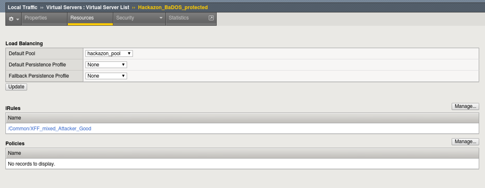
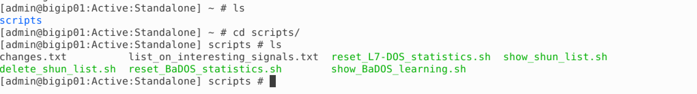
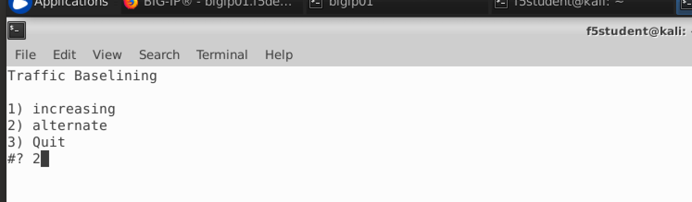
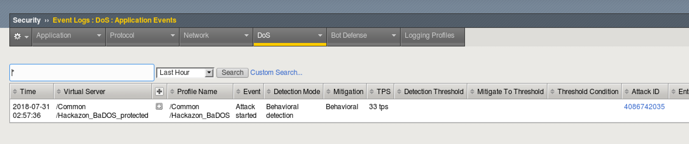

Lab 2: Behavioral DOS Protection
----------------------------------------

In this lab you will run baseline tests as well as attacks against a Virtual Server to trigger Behavioral DoS Protection

Connect to the Lab Environment
~~~~~~~~~~~~~~~~~~~~~~~~~~~~~~~~~~

1. On the jumphost, use a browser to reach the BIG-IP and login as admin/password

2. On the jumphost, open three terminals, one to the BIG-IP and two to the Kali Linux Client, using the password provided by the instructor.

|

.. code-block:: bash

        ssh admin@10.1.1.245 (bigip01)
        ssh f5student@10.1.1.10 (Kali)

|

.. note::

The kali client will be used as the attacker machine for this lab. You may want to open multiple terminal windows to go through the steps in the lab.

Examine the DoS Profile
~~~~~~~~~~~~~~~~~~~~~~~

1. In TMUI, go to Local traffic > Virtual Servers > Virtual Server List > Hackazon_BaDOS_protected

2. Select the Security tab and then Policies.  Make sure that DoS Profile and Log Profile are set up as below.

|   

.. image:: images/hackazonprof.png
        :width: 800px

|

3. Select the resources tab above. Note the iRule that is applied.

|
 

|

*This is not a real world scenario. Attacks would typically come from a wide range of IP addresses.*
*In this demo environment, we do not have dozens of good and bad source IPs available for clients and attackers.* 
*We simulate them by adding an iRule to the VS, which adds a randomized X-Forwarded-For header to each request.*

4. Go back to the Properties tab and notice that the http profile is also customized. It is configured to accept XFF for the iRule to function correctly.

5. Go to Security > DoS Protection > DoS Profiles > hackazon_BaDOS and select the Application Security tab.

|

.. image:: images/dosprof.png
        :width: 800px

|

6. Select Bot Signatures and select Edit and uncheck enabled. Then click Update.

.. Note:: You do not have to Apply the Policy when editing a DoS Profile unlike typical changes under Application Security.

7. Select Behavioral and Stress-based Detection and click Edit under Behavioral Detection and Mitigation.

|

.. image:: images/behave.png
        :width: 600px

|

8. Notice that "Use approved signatures only" is unchecked. If checked, we would need to approve each dynamic signature. No need to edit, click close.

9. The Behavioral DoS profile is already applied and ready to go. Move on to the next section to begin analyzing traffic.

Create Baseline traffic for the BIG-IP
~~~~~~~~~~~~~~~~~~~~~~~~~~~~~~~~~~~~~~

1. In your BIG-IP terminal session, change to the scripts directory and take a look at bash scripts that have been created.

|   

|

2. Most of these scripts are used to setup the lab environment or reset it for further tests.  Run the "show_BaDOS_learning.sh" script, the output should look similar to the below.

|

.. code-block:: bash

        ./show_BaDOS_learning.sh

|

.. image:: images/percentzero.png
        :width: 600px

|

3. In one of your Kali Linux terminal windows, examine your home directory and run the "base_menu.sh" script.

|

.. code-block:: bash

        ./baseline_menu.sh

|

4. Select either option 1 or option 2, but notice that option 3 quits the script.  You will use this later.

|

|

5. In a second Kali terminal window, run the script again, but select the other option.

*It does not matter which order is used here, and the results of baseline testing are not an exact science*

6. Go back to your BIG-IP terminal window and take a look at the results of your earlier script.

The "show_BaDOS_learning.sh" uses the admd daemon for stress-based DoS detection and mitigation. An example of the admd command is below and does not need to tbe executed.

|

.. code-block:: bash

        admd -s vs./Common/Hackazon_BaDOS_protected+/Common/Hackazon_BaDOS.info.learning

|

*Given the parameters of the Virtual Server and the corresponding DOS profile, admd returns stats on traffic learning.*
*We want to wait until the first number in the brackets is 90 or above.  This represents the percentage confidence the system has in baseline traffic.*
*Below is output that has reached 88% then 92%.*

|

.. image:: images/percent90.png
        :width: 600px

|

7. Once you have reached 90% confidence, you may move on to the next task.  This may take a few minutes or more.

Launch the Attack
~~~~~~~~~~~~~~~~~

1. Open another terminal window to Kali Linux and login as f5student.

2. In your home directory, you will find another script named "AB_DOS.sh".  Run this script.

|

.. code-block:: bash

        ./AB_DOS.sh

|

.. image:: images/attackmenu.png
        :width: 600px

|

3. Select 1 for "Attack start - similarity" and hit enter.  Notice that entering 4 ends the script.  You will use this later to end the attack.

Examine the Mitigation
~~~~~~~~~~~~~~~~~~~~~~

1. On TMUI, go to Security > DoS Protection > Signatures and click on the bar for Dynamic. You should see an entry similar to the below (this may not show up right away, revisit the page until an entry appears).

|

.. image:: images/dynamic.png
        :width: 600px

|

2. Notice that the "Deployement State" is Mitigate. This is because the signature was enforced immediately, since we did not select to approve signatures in the Behavioral DOS policy.

3. Go to Security > Event Logs > DoS > Application Events

|

|

4. Notice that the attack Mitigation was Behavioral. This means a dynamic signature was created and enforced to mitigate the attack.

5. How does this differ from Bot Detection? Why should you use both mitigations usually?

6. In each of your terminal windows type Ctrl+C to terminate the scripts. The AB_DOS.sh script will require you to enter 4 to quit after pressing Ctrl+C..

.. note::

       *Do not move on without ending these attack and baseline scripts, as they may have an effect on the rest of the labs* 
