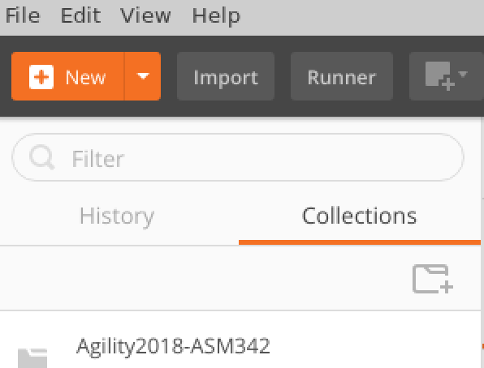
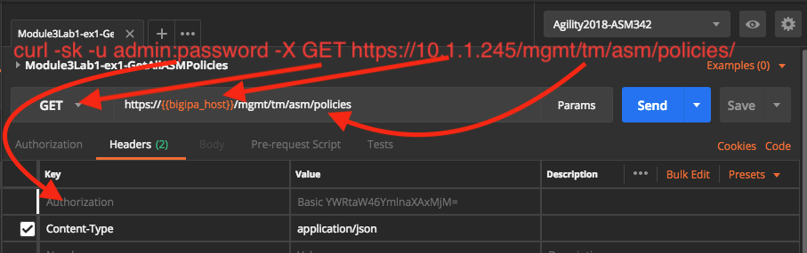
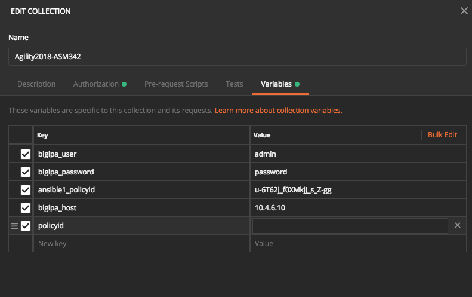
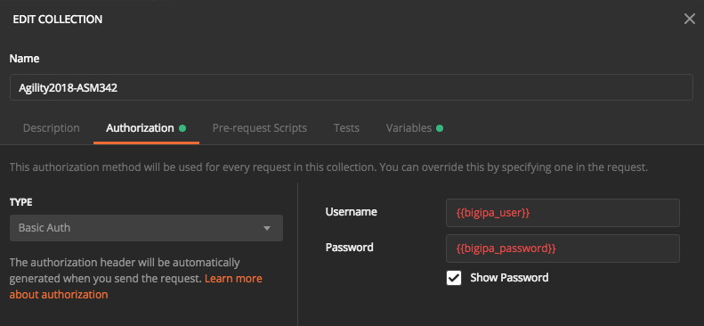
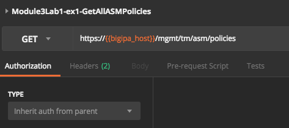
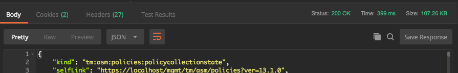

Lab 3.1: Using Postman to interact with the ASM Rest API
-----------------------------------------------------------

Task 1 - Intro to Postman
~~~~~~~~~~~~~~~~~~~~~~~~~~~~~~~~~~~~~~~~~~~~~~~~~~~~~

Start Postman by double-clicking or right-click and execute the "Postman" icon on the Desktop

Decline any requests to update Postman.

Once Postman has finished starting (this may take a minute) you will see a collection namedi "Agility2018-ASM342" like

|
|

Select the Agility2018-ASM342 folder which will open this collection and the collection's requests will be displayed.

.. note:: No action needed. For future use, this collection can be found here

        `Asm 342 Postman repository <https://github.com/below-average-f5-admin/agility2018-asm342-postman>`_

        The raw/json version of the file that can be imported into Postman using the import (import link) feature is here

        `Asm 342 Postman json <https://raw.githubusercontent.com/below-average-f5-admin/agility2018-asm342-postman/master/Agility2018-ASM342.postman_collection.json>`_

|

Click on the first request: Module3Lab1-ex1-GetAllASMPolicies.
When the a request is selected it displays in a tab on the right-hand side, popuplating the request URL, headers fields and other depending on the the type of request

Recall the first curl request from Lab 2.1

.. code-block:: bash

        curl -sk -u admin:password -X GET https://<bigip>/mgmt/tm/asm/policies/

Here is how that command maps to this request in Postman, they both get all ASM policies

|

If you click on the request/method type (GET) you will see a list of all the possible HTTP methods, this is obviously how you would devise a request that would create an object using a POST versus simply retrieving data (GET). The username and password are sent as a header. Curl does this for you automatically when you specify the -u option. You won't see this Authorization header in your request until you have clicked SEND, this is because it is generated dynamically. The Content-Type header is also specified here, however its not really needed for a GET request. It will be needed for POST requests to inform the webserver the type of the incoming data. Lastly the url field specifies the url of the host and resource. Notice the {{bigipa_host}} in the url, this is a variable that is dynamically filled from the collection's environment, more on this later. Environments can be global or per collection, here we are using a collection specific environment. Environments allow for sharing variables, in this lab they are used to be able quickly modify values across many requests and to share variables among requests.

Now take a look at the enviroment, right-click on collection Agility2018-ASM342 and select edit from the menu and select the Variables column.

|

Each entry in the "Key" column is a variable, with the value specified in the "Value" column. Variables are used by enclosing them in double curly braces  e.g. {{variable}}

|

Now take a look at the Authorization tab to see how authentication works.

|

|

Postman uses this setting for the entire collection, assuming each request's Authorization type is set to "inherit from parent"

|

|

Run the request

|

.. code-block:: rest

        Module3Lab1-ex1-GetAllASMPolicies

|

If the request was succesful the Status will be 200 OK. Take a look at the response, this is shown in the "Body" (response body) section

|

|

Notice the body can be displayed in "Pretty" format or "Raw", much like curl with or without jq. Scroll down through the output. Just as in Lab 2.1, it helps to filter on a policy name to get the id. Lab 2 of module 3 will show a couple of ways to filter.

