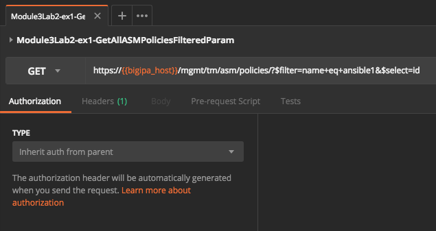
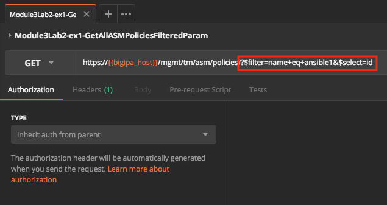
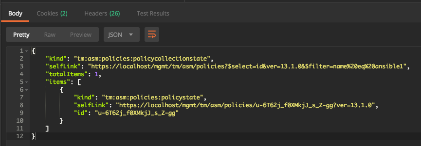
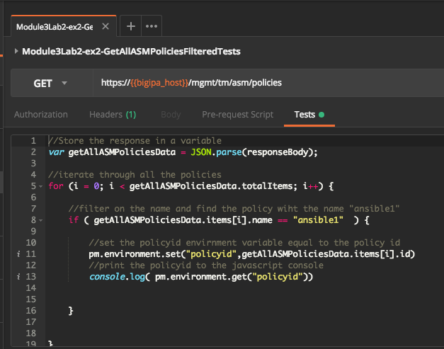
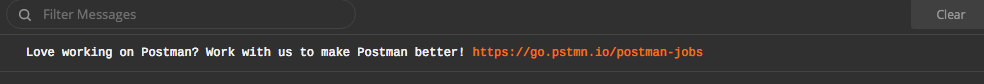
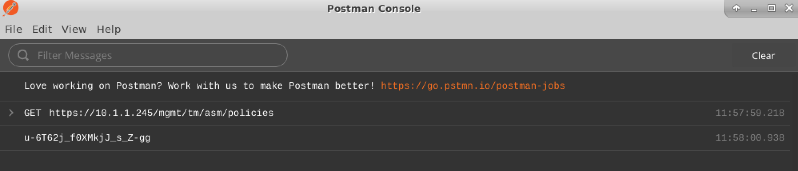

Lab 3.2: Filtering JSON data in Postman
----------------------------------------

This lab builds off of the concepts in Module 2 dealing with filtering Json data and demonstrates how to filter json data in Postman.

Two methods exist to filter on data:

- Parameters
- Postman Tests (javascript based), more background on this in Task 2

Task 1 - Filtering JSON data in Postman using parameters 
~~~~~~~~~~~~~~~~~~~~~~~~~~~~~~~~~~~~~~~~~~~~~~~~~~~~~~~~~~

This task demonstrates how to filter on the policy named ansible1 and display only the id value.

Just like any Rest client, Postman can send parameters to the server so that the output is a customized response or a subset of the JSON data.
This task is much like the Module 2 Lab 3  task, Server-side JSON filtering using uri parameters.

Click on the request: 

|

.. code-block:: rest

        Module3Lab2-ex1-GetAllASMPoliciesFilteredParam

|

|

Notice the parameters passed to the url https://{bigipa_host}}/mgmt/tm/asm/policies/. They tell the rest server to only display the the "id" field for the "ansible1" policy.

|

|

How does this compare to the url parameters used in Module 2 Lab 3?

Notice the special characters $, & are not escaped, in the curl requests they had to be. 

Click "Send" to run the request.

|

Take a look at the response shown in the “Body” (response body) section. The response should look similar to the below, only showing the "id" field.

|

|

Task 2 - Filtering JSON data in Postman using Tests
~~~~~~~~~~~~~~~~~~~~~~~~~~~~~~~~~~~~~~~~~~~~~~~~~~~~~~

Postman offers the ability to programmatically ingest responses and make decisions on the data retrieved. Tests are written in JavaScript, which is a very common language, rather than some proprietary or obsucre language. Even if you are not familiar with js, there are many examples written for Postman and many examples of JavaScript in general. 

See also: `Writing Postman tests <https://www.getpostman.com/docs/v6/postman/scripts/test_scripts>`_ /
`Tests examples <https://www.getpostman.com/docs/v6/postman/scripts/test_examples>`_

.. note::

        Note that iRules LX (iLX) and iApps LX foundations are based on javascript.

|

Tests are executed post request, which means the Test has access to the response data. In addition, a test is on a per-request basis, meaning they only apply to the request to which they are assigned. Tests can influence the flow of the next request and can be used to provide orchestration to a collection. More on this later.

.. note:: 

       Postman also suports Pre-Request Scripts, which are executed before the Request is sent. Use cases are a dynamically generated timestamp or dynamically gnereated Post data.

       `Pre-request scripts <https://www.getpostman.com/docs/v6/postman/scripts/pre_request_scripts>`_

|

Click on the request:

|

.. code-block:: rest

        Module3Lab2-ex2-GetAllASMPoliciesFilteredTests
        
|

Notice this request is exactly the same as Module3Lab1-ex1-GetAllASMPolicies with the exception that there is a Test assigned.

The test, examine the comments to understand how it works.

|

|

The console.log statement logs to the javascript console, to open it click View->Show Postman Console

|

Execute the request by clicking "Send", then view the Postman console (it must be open before running the request to display the data).

.. code-block:: rest

        Module3Lab2-ex2-GetAllASMPoliciesFilteredTests

|

The policy id should be displayed in the Postman Console.

|

