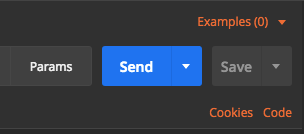
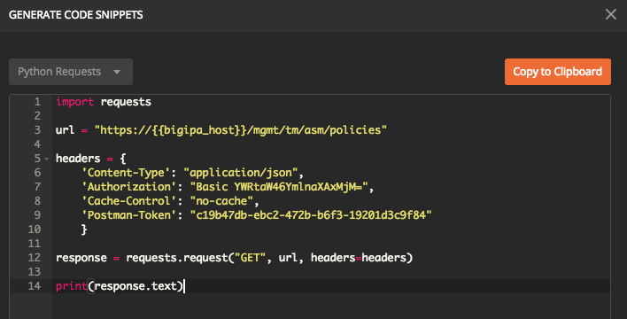

Lab 3.3: Using Postman to generate code
------------------------------------------

One of the most useful features of Postman is its ability to show a code snippet of each request. This makes Postman a great learning tool when trying to develop more complex scripts written in your favorite language. In addition this ia great segway to Module 4 Using Python Program Advanced WAF. It is being introduced now so that you can view each request in this module and get a feel for what the request would look like in Python Requests.

These are languages that Postman supports:

.. list-table::
  :widths: 15 15 
  :header-rows: 1
  :stub-columns: 1

  * - **Language**     
    - **Framework**
  * - HTTP            
    - None (Raw HTTP request)
  * - C               
    - LibCurl
  * - cURL
    - None (Raw cURL command)
  * - C#
    - RestSharp
  * - Go
    - Built-in http package
  * - Java
    - OkHttp
  * - Java
    - Unirest
  * - JavaScript      
    - jQuery AJAX
  * - JavaScript      
    - Built-in XHR
  * - NodeJS          
    - Built-in http module
  * - NodeJS          
    - Request
  * - NodeJS          
    - Unirest
  * - Objective-C     
    - Built-in NSURLSession
  * - OCaml           
    - Cohttp
  * - PHP 
    - HttpRequest
  * - PHP             
    - pecl_http
  * - PHP             
    - Built-in curl
  * - Python          
    - Built-in http.client (Python 3)
  * - Python          
    - Requests
  * - Ruby            
    - Built-in NET::Http
  * - Shell           
    - wget
  * - Shell           
    - HTTPie
  * - Shell           
    - cURL
  * - Swift           
    - Built-in NSURLSession

Task 1 - Generating Python Requests Code
~~~~~~~~~~~~~~~~~~~~~~~~~~~~~~~~~~~~~~~~~~~~~~~~~~~~~

Select the Module3Lab1-ex3-GetAllASMPoliciesFilteredTests request and click on the "code" option on the right hand side.

|

Then select "Python -> Requests" from the code drop down to show the request in Python Requests

|
|

