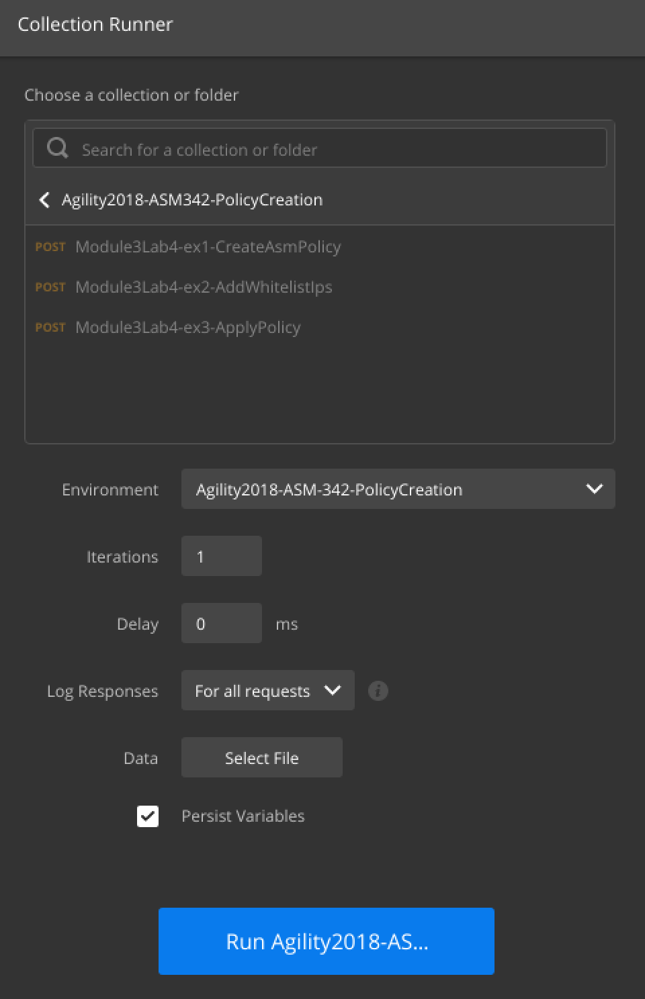

Lab 3.4: Using Postman for workflows 
------------------------------------------

As mentioned previously, Postman offers a feature called collections. Collections are denoted by the folder icon and contain requests. Collections are useful for creating workflows or automating common tasks. 

Task 1 - Using Postman workflows to push out standardized policies 
~~~~~~~~~~~~~~~~~~~~~~~~~~~~~~~~~~~~~~~~~~~~~~~~~~~~~~~~~~~~~~~~~~~~~~~~~~

In this task the student will execute a collection/workflow that will create a policy and add a whitelist ip to the policy.

First take a look at the workflow's environment, by right clicking and selecting edit on the "Agility2018-ASM342-PolicyCreation"
Then navigate to "Variables".

This environment looks very similar to the previous "Agility2018-ASM342" environment. Notice the two empty variables "policyid" "policyIdUrl". They are intentionally left blank because they are used to store variables temporarily during the collection run. Recall that this environment is per collection, therefore its variables are unique to the "Agility2018-ASM342-PolicyCreation" collection. When the "Module3Lab4-ex1-CreateAsmPolicy" request is run, a test grabs the randomly generated policy id and stores it in the "policyid" environment variable. The test also stores the policy url with the externally accessible ip in the  "policyIdUrl" variable. Recall that when a policy is created, its data is output in Json format. This data is then used by the test to populate the two variables. The two subsequent scripts then use these variables to add to the policy and then apply it.

Close the enviroment window.

Inspect each request in the collection, looking at the HTTP Method, URL, Body and its Tests (only the CreateAsmPolicy for the test).

Lets run the collection

Click on "Runner".

Open the Postman Console by clicking on View->Postman Console. If a previous console is open, ensure you clear previous output using the "Clear" button.

Select the "Agility2018-ASM342-PolicyCreation" collection, the "Agility2018-ASM342-PolicyCreation" Environment and check "Persist Variables", as shown below.

|

|

Click "Run Agility2018-ASM342-PolicyCreation", watch the Postman Console. This will create an ASM policy named "postman1" and add an ip address to the whitelist. Once the Collection has finished (this may take a couple of minutes), go to the BIG-IP GUI to verify the policy and whitelist ip address were created. Also ensure the policy was applied, this make take a few minutes, refresh this page if the policy has not been applied.

|

For Reference, Policies are in:

Security->Application Security->Security Policies->Policies List

|

Addresses are in:

Security->Application Security->IP Addresses->IP Address Exceptions

