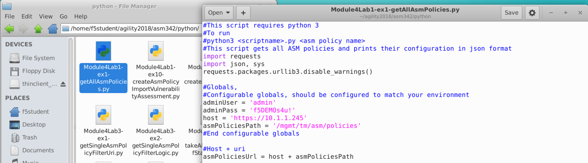

Lab 4.1: Python Intro - Getting the data 
-------------------------------------------

Task 1 - Using Python to display an ASM Policy in json format
~~~~~~~~~~~~~~~~~~~~~~~~~~~~~~~~~~~~~~~~~~~~~~~~~~~~~~~~~~~~~~~~~~~

All scripts in this module are run from the cli (Terminal Emulator icon on the desktop).

Run the following command to display all ASM policy data in JSON format:

.. code-block:: bash
        
        python3 /home/f5student/agility2018/asm342/python/Module4Lab1-ex1-getAllAsmPolicies.py 

|

You should see similar output to what was seen running curl (lab 2.1) and Postman (Lab 3.1) to retrieve the policy configuration.

|

.. note:: If the output from the python script is all JSON, as in the case of the Module4Lab1-ex1-getAllAsmPolicies.py script, jq can be used to get syntax highlighting and other formatting features. To test run:
      **python3 /home/f5student/agility2018/asm342/python/Module4Lab1-ex1-getAllAsmPolicies.py | jq**

|

Now double-click on the "Home" folder icon on your desktop and navigate to /home/f5student/Agility2018/asm342/python and double click on the script Module4Lab1-ex1-getAllAsmPolicies.py

|

|

Notice the script is commented throughout to give the student a walk-through of what is occuring. Also note that the script has a curl command that can be used to simulate what is occuring. These commands are also useful for debugging. The student may run the curl commands, but must fill in the missing data such as policy id.

|

The instructor will talk through the script after all students have completed this task. Feel free to open the script to analyze it and run any of the curl commands to guide you through the flow.
