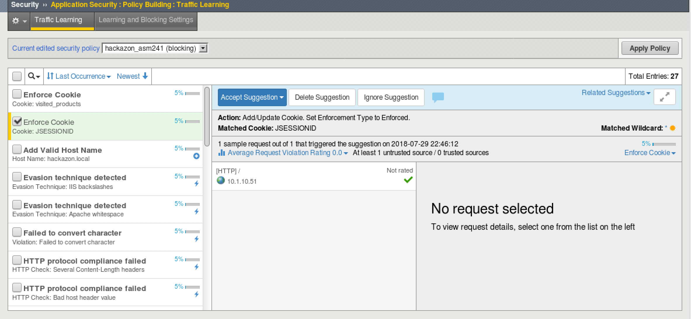
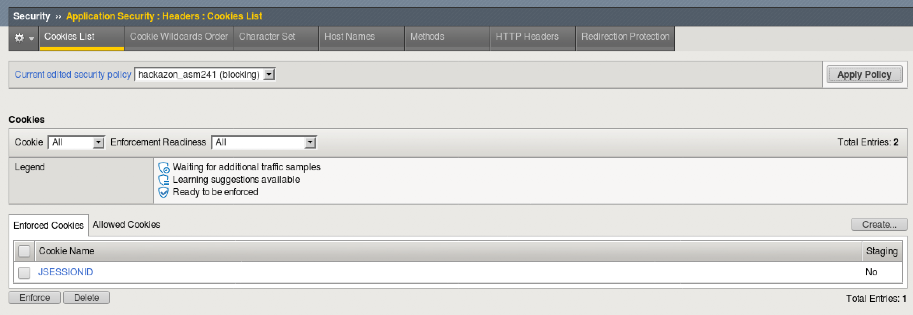
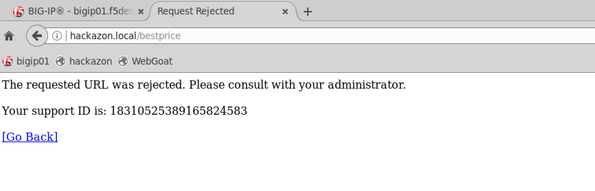
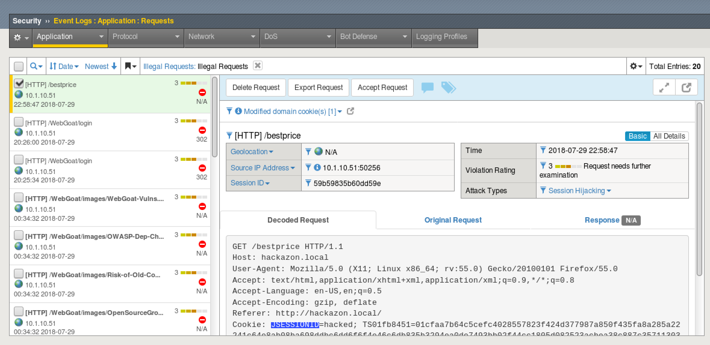

Lab 6: Cookie Tampering Protection
----------------------------------------

In this lab you will learn how ASM can learn about your application's cookies and prevent cookie tampering

Connect to the Lab Environment
~~~~~~~~~~~~~~~~~~~~~~~~~~~~~~

1. From the jumphost, launch Chrome or Firefox and login to the BIG-IP TMUI as f5student/password

2. Open the hackazon application in firefox.

	*Note you must use firefox for the hackazon application because only it is proxied to Burp*

3. In firefox go to the right hand side icon and select "Preferences". 

|

.. image:: images/settings.png
        :width: 600px

|

4. Then select Advanced > Network,  under "Connection" click "Settings".

|

.. image:: images/ffAdvanced.png
        :width: 600px

|

5. Set your proxy settings to manual as shown in the screenshot below, click "Ok".

|

.. image:: images/proxy.png
        :width: 600px

|

5. From the jumphost desktop, launch Burp Suite using the icon on the desktop. If you are prompted to update Burp, ignore this pop-up by clicking "Close". 

  - Select Temporary Projects and click Next.
  - Leave Defaults checked and click "Start Burp"
  - Select the "Proxy" tab and then turn intercept off.

|

.. image:: images/proxyoff.png
        :width: 600px

|

Examine the cookies
~~~~~~~~~~~~~~~~~~~

1. Turn intercept to on in Burp and in your hackazon tab, click on one or various links like "Get the Best Price".

2. In Burp, examine the request. Notice the cookie names and their values before forwarding, click Forward to send the request to the Hackazon app, then view the Hackazon app in the firefox tab to view the response.

|

.. image:: images/cookiesample.png
        :width: 600px

|

3. With intercept still set to on, click on the same link, but this time select the cookie value and edit it.

|

.. image:: images/cookiechange.png
        :width: 600px

|

4. Notice the there is no change resulting response, but should we allow cookies to be manipulated?

5. Turn intercept off.

Configure BIG-IP to learn and enforce cookies
~~~~~~~~~~~~~~~~~~~~~~~~~~~~~~~~~~~~~~~~~~~~~

1. In BIG-IP TMUI, go to Security > Application Security > Policy Building > Learning and Blocking Settings.

2. Make sure the Current edited security policy is "hackazon_asm241" and select Advanced on the right side.

3. Scroll down to Cookies and expand.

|

.. image:: images/cookiesettings.png
        :width: 600px

|

4. Check the boxes for "Learn and enforce new unmodified cookies" as well as Learn, Alarm, and Block for "Modified domain cookies"

5. Click Save and Apply the Policy

	*Your policy is now configured to learn the cookies that are in use so that they may be enforced.*

Traffic Learning
~~~~~~~~~~~~~~~~

1. Now that our policy is set up to learn about our application's cookies, we need to replicate the traffic from earlier for ASM.

2. Open your firefox tab with hackzon and click on the link for "Get the Best Price". You may want to click on a few other links to have ASM learn other cookies.

3. Go back to BIG-IP and go to Security > Application Security > Policy Building > Traffic Learning

4. Make sure that the Current edited policy is "hackazon_asm241" and search for "Enforce Cookie"

5. Select the entry for JSESSIONID and Accept the Suggection

|   

|

	*Note you may accept the suggestion, but place the cookie in staging.  For this lab go ahead and enforce the suggestion*

|

6. Go to Security > Application Security > Headers > Cookie List and examine the new entries for Enforced Cookies

|

|

Trigger the Cookie Modification Protection
~~~~~~~~~~~~~~~~~~~~~~~~~~~~~~~~~~~~~~~~~~

1. Turn intercept to on in Burp and in your hackazon tab, click on one or various links like "Get the Best Price"

2. In Burp, examine the request. Notice the JSESSIONID cookie and edit the value. Then Click Forward

3. You should receive a block page from ASM

|

|

5. Turn intercept off and go back to BIG-IP tab

6. Go to Security > Event Logs > Application > Requests and examine the illegal request

|

|

7. Close Burp Suite. Then return to your firefox settings and change the proxy settings back to "No Proxy"
