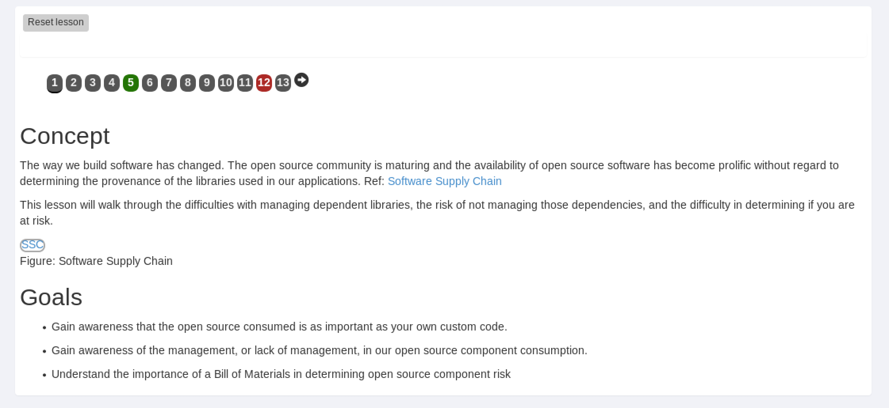

Lab 7: Disallowed File Types
----------------------------------------

In this lab you will configure a a security policy in ASM to block vulnerable components based on a file type.

Connect to the lab environment
~~~~~~~~~~~~~~~~~~~~~~~~~~~~~

#. From the jumphost, launch Chrome, click the BIG-IP bookmark and login to TMUI using admin/password.

#. Open a second tab in Chrome for use with the WebGoat App.

Take a look at the WebGoat object
~~~~~~~~~~~~~~~~~~~~~~~~~~~~~~~~~

#. Browse to http://10.1.10.145/WebGoat/login and login as “f5student”.

#. On the left menu click Vulnerable Components – A9, then click Vulnerable Components.

#. Note the Software Supply Chain .png graphic in the middle of the page.

|

.. image:: images/png.png
        :width: 600px

|

.. note:: 
	This is a .png file we are going to block using the BIG-IP ASM policy control “Disallowed File Types”.

|

Edit the Security Policy
~~~~~~~~~~~~~~~~~~~~~~~~

#. On the BIG-IP TMUI, go to Local traffic > Virtual Servers > asm_vs.

#. Click the Security tab and make sure "Application Security Policy" is set to "ASM241".

#. Make sure the Log Profile is set to "Log Illegal Requests". The resulting config should look like the below. Click "Update" if any changes were made.

|

.. image:: images/ltmsettings.png
        :width: 600px

|

1. Go to Security > Application Security > File Types > Disallowed File Types. Ensure the "ASM241" policy is the "Current edited security policy"

2. Click the Create button on the right side.

3. Type “png” in the File Type (Explicit only) box and click Create.

|

.. note::
        Disallowed file types are case sensitive. png and PNG would both need to be entered to cover upper-case and lower-case.
 

|

.. image:: images/disallow.png 
        :width: 600px

|

4. Click Apply Policy in the top right, then click OK.

|

Test File Type Protection
~~~~~~~~~~~~~~~~~~~~~~~~~

1. Launch firefox (to avoid any webcaching done by Chrome) and Browse to http://10.1.10.145/WebGoat/login and login as “f5student” or use the bookmark.

2. On the left menu click Vulnerable Components – A9, then click Vulnerable Components.

3. The Software Supply Chain .png graphic does not load, because it is blocked by the ASM Disallowed File Types setting blocking .png files.

|

|

4. Go to Security > Event Logs > Application > Requests and examine the logs, you should see an illegal request similar to the below.

|

.. image:: images/disallowedFileType.png
        :width: 600px

|

5. What other applications are there for this type of policy?
