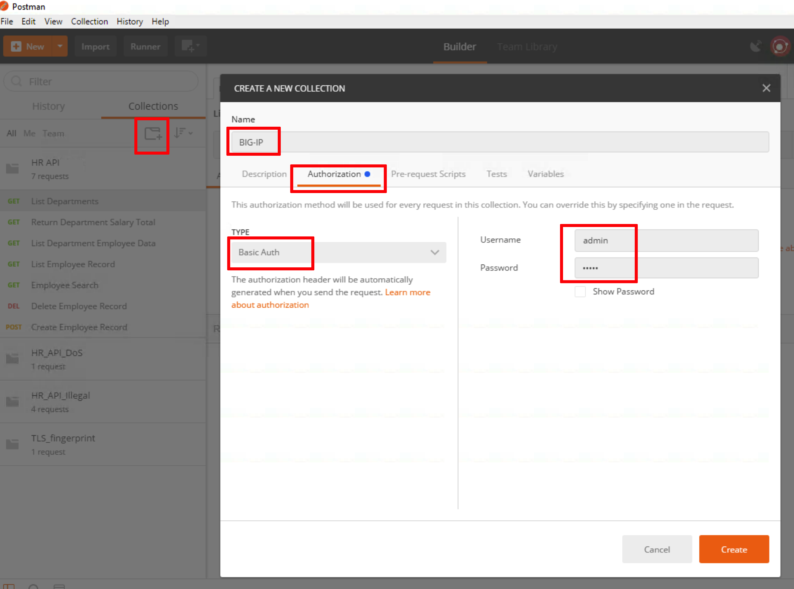
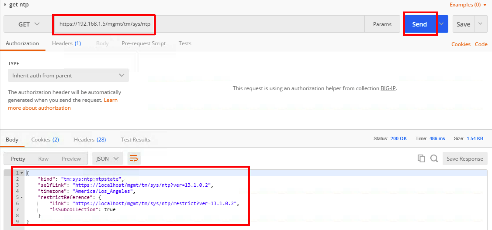

Making API requests with POSTMAN
=========================================

.. toctree::
   :maxdepth: 1
   :glob:

Using Postman to make API requests
----------------------------------

In this module you will learn how to make API requests with the Postman
client to simulate calls that might be made as part of an application,
for instance, a mobile app, native client app, client side webapp, or
server to server API request.

Connect to Client Jumphost and launch Postman
---------------------------------------------

1. RDP to the client jumphost

2. Launch the Postman application. The icon looks like this:

 .. image:: images/image1.png

Tap **Remind me later** just in case it will suggest you to upgrade

API server environment
---------------------------------------------------------

In this task you will learn how to use the preconfigured set of requests
in the HR API collection.

1. Click Collections

2. Click HR API

3. Click List Departments

4. Click Send

5. Notice the returned list of departments

 .. image:: images/image2.png

Learn how to change environment variables
-----------------------------------------

In this task you will learn how to change the environment variables that
are configured to alter which department you are querying data for. In
this case the variables are used in the URI, but there are other
variables used in some queries in the body as well.

Determine Police Department Salary Total
~~~~~~~~~~~~~~~~~~~~~~~~~~~~~~~~~~~~~~~~

1. Click on the **Return Department Salary Total** request in the collection

2. Click **Send**

3. Notice the total returned is **1106915639.7999947**

Change environment variable for department
~~~~~~~~~~~~~~~~~~~~~~~~~~~~~~~~~~~~~~~~~~

1. Notice the GET request URI has a variable in its name **{{department}}**

 .. image:: images/image3.png

2. Notice in the top right we have an environment set named **API
   Protection Lab**

3. Click the gear in the top right, then click **Manage Environments**

 .. image:: images/image4.png

4. Click **API Protection Lab**

 .. image:: images/image5.png

5. Change the value for department from **police** to **fire** then click
   **Update**

 .. image:: images/image6.png

6. Click the X in the top right to close the manage environments window

 .. image:: images/image7.png

Determine Fire Department Salary Total
~~~~~~~~~~~~~~~~~~~~~~~~~~~~~~~~~~~~~~

1. Click **Send**

2. Notice the total returned is now **457971613.68**

3. Return the Environment variables to default

4. Change the department variable back to **police**

Optional - Build your own API calls with Postman
------------------------------------------------

You can practice with building your own API calls with Postman.

.. NOTE::
   This section is optional and can be skipped

The goal of this exercise is to gain practical experience with API calls and to research existing BIG-IP configuration. For this purpose you are going to utilize BIG-IP iControl.

1. In Postman create new collection, define a name **BIG-IP**

2. Proceed to **Authorization** tab, select type **Basic Authentication** and provide username and password for accessing BIG-IP (admin : admin)

3. Tap **Create**

4. Click on just created collection, hit **add requests**, define a name **get NTP** and associate with just created **BIG-IP** collection

5. Click on just created request, define the URL **https://192.168.1.5/mgmt/tm/sys/ntp** and click **Send**  - you should receive response showing NTP data

6. Create another request and try to query **https://192.168.1.5/mgmt/tm/sys/dns** - this should provide you with DNS settings on BIG-IP

.. NOTE::
   You can use API reference document for BIG-IP and practice various API calls https://devcentral.f5.com/wiki/iControlREST.APIRef.ashx

7. Examine BIG-IP virtual servers configuration with running **https://192.168.1.5/mgmt/tm/ltm/virtual**
