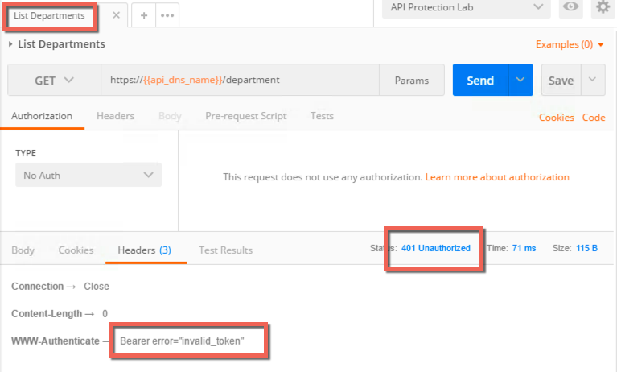
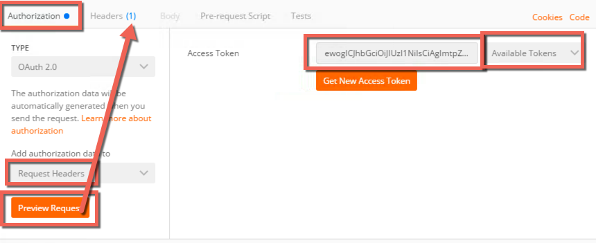

Implement Coarse-Grain Authorization
==============================================

.. toctree::
   :maxdepth: 1
   :glob:

In this module you will implement authorization requirements. You will
require a valid JWT (JSON Web Token) before a client can access the API.
You will then gather a valid JWT and leverage it to make an API request.

If you want to skip this configuration section and use prebuilt objects proceed to `policy binding. <#binding>`__  Keep in mind, you will have to use objects with **prebuilt** suffix.

Create a JWK (JSON Web Key)
--------------------------------------

In this task you will create a JWK to use for validating the JWT sent.
In this lab you will use Octet and a shared secret, but options include
solutions like public/private key pair as well.

1.	In the BIG-IP GUI go to Access -> Federation -> JSON Web Token -> Key Configuration -> click **Create**

+--------------------------+-----------------------+
| Field                    | Value                 |
+==========================+=======================+
| Name		           | api-jwk	           |
+--------------------------+-----------------------+
| ID		           | lab		   |
+--------------------------+-----------------------+
| Type		           | Octet		   |
+--------------------------+-----------------------+
| Signing Algorithm        | HS256		   |
+--------------------------+-----------------------+
| Shared Secret	           | secret		   |
+--------------------------+-----------------------+

Create an OAuth provider
--------------------------------------

In this task you will create an OAuth provider so that you can validate
a JWT created by it.

1. Go to Access -> Federation -> OAuth Client/Resource Server -> Provider -> click **Create**

+------------------------------+--------------------------------------------------------------------------+
| Field                        | Value                                                                    |
+==============================+==========================================================================+
| Name		               | as-provider                                                              |
+------------------------------+--------------------------------------------------------------------------+
| Type		               | F5				                                          |
+------------------------------+--------------------------------------------------------------------------+
| OpenID URI	               | https://as.vlab.f5demo.com/f5-oauth2/v1/.well-known/openid-configuration |
+------------------------------+--------------------------------------------------------------------------+
| Authentication URI           | https://as.vlab.f5demo.com/f5-oauth2/v1/authorize                        |
+------------------------------+--------------------------------------------------------------------------+
| Token URI		       | https://as.vlab.f5demo.com/f5-oauth2/v1/token                            |
+------------------------------+--------------------------------------------------------------------------+
| Token Validation Scope URI   | https://as.vlab.f5demo.com/f5-oauth2/v1/introspect                       |
+------------------------------+--------------------------------------------------------------------------+

2. Click **Discover** next to the OpenID URI field.

3. Click **Save**.

Setup the Token Configuration
--------------------------------------

In this task you will adjust some of the values retrieved automatically
via OIDC discover tool. This is necessary because the OIDC AS cannot
provide you with the values specific to your audience.

1.	Go to Access -> Federation -> JSON Web Token -> Token Configuration -> Click on **auto_jwt_as-provider**

2.	Type **https://api.vlab.f5demo.com** into **audience** and click **Add**

3.	Under **Additional Key** add the **api-jwk** you just created as allowed

4. Click **Save**.

Create a JWT Provider
---------------------

In this task you will create a JWT provider that can be selected in
a per request or per session policy for JWT validation.

1.	Go to Access -> Federation -> JSON Web Token -> Provider List -> Click **Create**

2.	Define a name **as-jwt-provider**

3.	Provider: Select **/Common/as-provider** and click **Add**

4.	Click **Save**.

Create a per session policy
---------------------------

In this task you will create a new per session policy to validate the
JWT token and collect the claims data from parameters inside the JWT.

1.	Go to Access -> Profiles/Policies -> Access Profiles (Per-Session Policies) -> click **Create**

+---------------------------------+-----------------------------------------------------+
| Field                           | Value                                               |
+=================================+=====================================================+
| Name		                  | api-psp	                                        |
+---------------------------------+-----------------------------------------------------+
| Profile Type                    | OAuth-Resource Server                               |
+---------------------------------+-----------------------------------------------------+
| Profile Scope	                  | Profile					        |
+---------------------------------+-----------------------------------------------------+
| Languages		          | English					        |
+---------------------------------+-----------------------------------------------------+

*Also note that the User Identification Method is set to OAuth Token*

3.	Click **Finished**

4.	Click **Edit** on the line with the new api-psp policy you just created, a new tab will open

.. image:: images/image48.png

5.	Click the **+** between Start and Deny

6.	Select **OAuth Scope** from the **Authentication** tab and click **Add Item**

+----------------------------------+-----------------------------------------------------+
| Field                            | Value                                               |
+==================================+=====================================================+
| Token Validation Mode            | Internal	                                         |
+----------------------------------+-----------------------------------------------------+
| JWT Provider List                | /Common/as-jwt-provider                             |
+----------------------------------+-----------------------------------------------------+

7.	Click **Save**

8.	On the successful branch click the **Deny** ending and change it to **Allow**, then **Save**

9.	Apply the policy, the final should look like this:

10.	Close the new tab

Create a per request policy
---------------------------

In this task you will create a per request policy to validate authorization on
each request by checking for the presence and validity of a JWT.

1.	Go to Access -> Profiles/Policies -> Per-Request Policies -> click **Create**

2.	Define a name **api-prp**

3.	Click **Finished**

4.	Click **Edit** on the policy, another tab will appear

5.	Your policy should look like this:

------------------------------------

It is not necessary to “Apply Policy” after work on a per request policy
because it instantly applies to the next request,  unlike a per session policy,
which will only apply to new requests after applying.

------------------------------------

6.	Close the new tab

Policy Binding
--------------------------------------

In this task you will add the policies you created to the virtual
server.

1. In the BIG-IP GUI go to Local Traffic -> Virtual Servers

2. Click **api.vlab.f5demo.com**

3. Change Access Profile from none to **api-psp**

4. Change Per Request Policy from none to **api-prp**

5. Click **Update**

Test access to the API
----------------------

In this task you will test your access to the API and find it is blocked
because you do not present a valid JWT.

1. Open Postman on the jumphost client

2. Select List Departments from the HR API collection and send the
   request

3. Review the response, note the 401 unauthorized and the header
   indicating you did not present a valid token

Get a JWT from the Authorization Server
---------------------------------------

1. Click the **type** drop down under the **authorization** tab

2. Select **OAuth 2.0**

3. Click **Get New Access Token**

Postman provides a mechanism to handle the OAuth client workflow
automatically. This means it will handle getting the authorization code
and then exchange it for an access token, which you will use. Without
this you would make two separate requests, one to get an authorization
code and another to exchange that for an access token.

1. Fields should be prefilled, but verify they match the below:

+------------------------+-----------------------------------------------------+
| Field                  | Value                                               |
+========================+=====================================================+
| Token name             | employeeuser                                        |
+------------------------+-----------------------------------------------------+
| Grant Type             | Authorization Code                                  |
+------------------------+-----------------------------------------------------+
| Callback URL           | https://www.getpostman.com/oauth2/callback          |
+------------------------+-----------------------------------------------------+
| Auth URL               | https://as.vlab.f5demo.com/f5-oauth2/v1/authorize   |
+------------------------+-----------------------------------------------------+
| Access Token URL       | https://as.vlab.f5demo.com/f5-oauth2/v1/token       |
+------------------------+-----------------------------------------------------+
| Client ID              | 9f1d39a8255e066b89a51f56b27506d39442c4f608c2f859    |
+------------------------+-----------------------------------------------------+
| Client Authenticatin   | Send as Basic Auth header                           |
+------------------------+-----------------------------------------------------+

Most of this data is provided by the authorization server. The callback
URL specified here is a special callback URL that the Postman client
intercepts and handles rather than calling out to the getpostman.com
website.

.. image:: images/image22.png

1. Click **Request Token**

2. Select **employeeuser** in the authentication window that pops up and
   click **Logon**

3. Click the **X** to close this window

4. Make sure **employeeuser** is selected under Available Tokens drop
   down

5. Select **Request Headers** from the Add Authorization Data To drop
   down

6. Click **Preview Request**, the result should be this:

7. Go to the **Headers** tab and review the inserted **Bearer** token
   header:

.. image:: images/image24.png

Send the request with JWT and review response
---------------------------------------------

1. Click **Send** and review the response.

2. Note that now it is a **200 OK** instead of 401 Unauthorized and that you
   have response data in the body.

.. image:: images/image25.png

You have now implemented coarse grained authorization and are requiring
clients to request a JWT from a trusted authorization server before
allowing access to the API.
